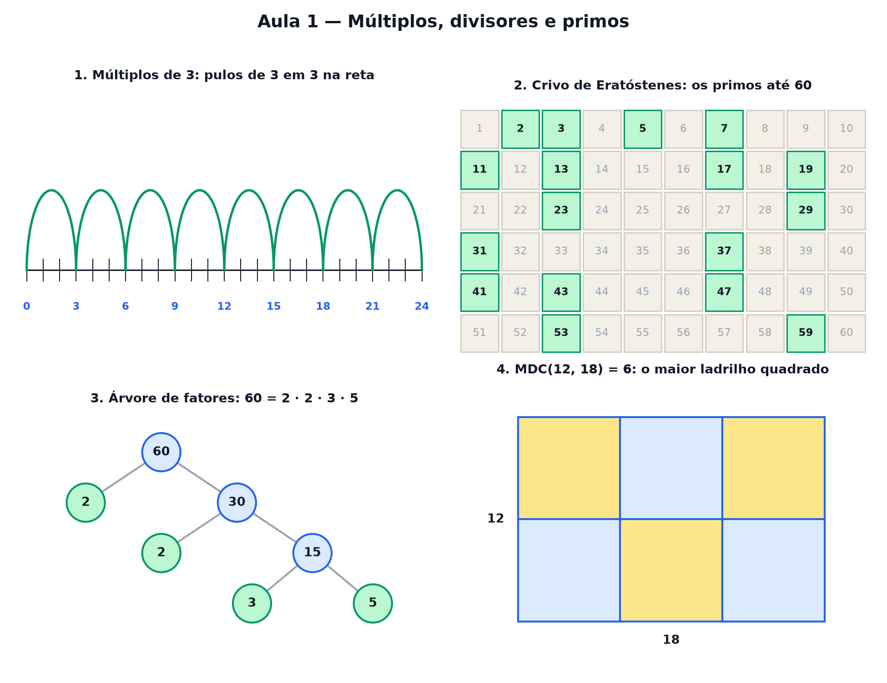

# Aula 1 — Múltiplos, divisores e primos

> Estas são as notas em texto da aula. A versão interativa, com os laboratórios e os exercícios
> que se corrigem sozinhos, está em [`index.html`](index.html).

*Quem cabe dentro de quem: pulos na reta, retângulos de bombons, o crivo dos primos, engrenagens e
ladrilhos.*

**Você já sabe:** somar, subtrair, multiplicar e dividir. É tudo o que esta aula pede — ela é o
primeiro degrau do curso.

Doze bombons cabem numa caixa de 3 por 4, de 2 por 6 ou de 1 por 12. Treze bombons só cabem
enfileirados. Essa diferença boba entre 12 e 13 esconde uma das ideias mais antigas da matemática —
e ela vai reaparecer quando você somar frações, simplificar contas e até proteger senhas na
internet.

> **🧠 Poder do cérebro**
>
> Dois ônibus saem juntos da rodoviária: um volta a cada 4 horas, o outro a cada 6. Daqui a quanto
> tempo eles saem juntos de novo? Pense antes de olhar a resposta — dá para descobrir só contando.
>
> **Resposta:** Em 12 horas. O primeiro sai às 4, 8, **12**...; o segundo às 6, **12**... O 12 é o
> primeiro número que aparece nas duas listas. Na seção 5 isso ganha nome: MMC.

---

## Múltiplos: pulando na reta

Comece no zero e dê pulos de 3 em 3: você cai em 3, 6, 9, 12, 15... Esses são os **múltiplos de 3**
— os números que aparecem na tabuada do 3. Um número é múltiplo de 3 quando dá para chegar nele só
com pulos de 3, sem sobrar nem faltar.

> 🔧 **Laboratório — pulos na reta.** Escolha o tamanho do pulo e um alvo. Os pulos caem no alvo?
> *(interativo, na versão em HTML)*

---

## Divisores: de quantos jeitos cabe numa caixa?

Olhe pelo outro lado: 3 é **divisor** de 12 porque 12 ÷ 3 dá conta exata (4), sem sobra. Um jeito
visual de achar todos os divisores de um número: arrume essa quantidade de bombons em caixas
retangulares completas. Cada caixa possível mostra dois divisores — as medidas dos lados.

> 🔧 **Laboratório — caixas de bombons.** Escolha quantos bombons. O laboratório mostra todas as
> caixas retangulares completas. *(interativo, na versão em HTML)*

---

## Primos: os números que só enfileiram

Alguns números só cabem numa fila: 2, 3, 5, 7, 11, 13... Eles têm exatamente **dois divisores**, o 1
e eles mesmos. São os **números primos**. Há 2.200 anos, Eratóstenes inventou um jeito de achar
todos eles: escreva os números e vá riscando os múltiplos de cada primo. O que nunca é riscado, é
primo.

> 🔧 **Laboratório — o crivo de Eratóstenes.** A cada clique, o próximo primo é escolhido e todos os
> múltiplos dele são riscados. *(interativo, na versão em HTML)*

### Não existe pergunta idiota

**P:** O 1 é primo?

**R:** Não. Primo tem **exatamente dois** divisores diferentes; o 1 só tem um (ele mesmo). Parece
frescura, mas é o que faz a "receita" da seção 4 ser única: se o 1 fosse primo, dava para enfiar
quantos 1 você quisesse na receita.

**P:** Os primos acabam em algum momento?

**R:** Nunca. Euclides mostrou isso há mais de 2.000 anos, com um argumento de duas linhas que você
vai ver na Aula 30. Mesmo assim, ninguém descobriu uma fórmula que gere todos eles — e isso é usado
para proteger senhas.

---

## A receita de um número

Todo número maior que 1 que não é primo pode ser quebrado em primos multiplicados: `60 = 2 × 2 × 3 ×
5`. E essa receita é **única** — não importa por onde você comece a quebrar, os primos que aparecem
são sempre os mesmos. Os primos são os "tijolos" da multiplicação.

> 🔧 **Laboratório — a árvore de fatores.** Escolha um número. Ele vai sendo dividido pelo menor
> primo possível até sobrar só primo. *(interativo, na versão em HTML)*

> 🧘 **O Guru:** Os primos são os tijolos dos números: tudo o que se multiplica é feito deles, de um
> jeito só. Quando uma conta com frações ou divisões parecer bagunçada, quebre os números em tijolos
> — a bagunça quase sempre some.

---

## MMC: quando os ciclos se encontram

De volta aos ônibus do começo. Os horários do primeiro são os múltiplos de 4; os do segundo, os
múltiplos de 6. Eles saem juntos nos múltiplos **comuns** (12, 24, 36...), e a primeira vez é no
menor deles: o **MMC**, mínimo múltiplo comum. `MMC(4, 6) = 12`.

> 🔧 **Laboratório — engrenagens (MMC).** Duas engrenagens encostadas. Cada uma tem um dente marcado
> de vermelho. Depois de quantos dentes as duas marcas voltam ao ponto de partida juntas?
> *(interativo, na versão em HTML)*

> **⚠️ Cuidado — MMC não é só multiplicar**
>
> 4 × 6 = 24 é múltiplo comum dos dois, sim — mas não é o **menor**. O 12 chega antes. Multiplicar
> só dá o MMC quando os dois números não têm nenhum divisor em comum além do 1 (como 4 e 5: MMC =
> 20). Na dúvida, liste os múltiplos e procure o primeiro repetido.

---

## MDC: o maior ladrilho

Agora o contrário: um piso de 12 por 18 precisa ser coberto com ladrilhos quadrados iguais, sem
cortar nenhum. Qual o maior ladrilho possível? O lado dele tem que dividir 12 **e** 18 — é um
divisor comum. O maior de todos é o **MDC**, máximo divisor comum: `MDC(12, 18) = 6`.

> 🔧 **Laboratório — ladrilhos (MDC).** Mude o tamanho do piso e o tamanho do ladrilho. Só vale se
> cobrir tudo sem cortar. *(interativo, na versão em HTML)*

---

## Pontos importantes

- **Múltiplos** de 3: 3, 6, 9, 12... (a tabuada). **Divisores** de 12: 1, 2, 3, 4, 6, 12 (dividem
  sem sobra).
- Cada caixa retangular de n bombons mostra dois divisores de n.
- **Primo**: tem exatamente dois divisores, 1 e ele mesmo. O 1 não é primo.
- Todo número é um produto de primos, de um jeito só: `60 = 2 × 2 × 3 × 5`.
- **MMC**: o primeiro múltiplo em comum — quando os ciclos se encontram. `MMC(4, 6) = 12`.
- **MDC**: o maior divisor em comum — o maior ladrilho. `MDC(12, 18) = 6`.

---

## ✏️ Afie o lápis

1. Qual é o primeiro múltiplo de 7 depois do 35? → **42**
2. Quais são **todos** os divisores de 12? → **1, 2, 3, 4, 6 e 12**
3. Qual destes números é primo? → **29**
4. Uma luz pisca a cada 4 segundos e outra a cada 6. Elas acabaram de piscar juntas. Daqui a
   quantos segundos piscam juntas de novo? → **12**
5. *(o desafio)* Você tem 18 figurinhas de futebol e 24 de desenho. Quer montar pacotes
   **iguais**, cada um com o mesmo número de figurinhas de cada tipo, sem sobrar nenhuma. Qual é o
   **maior** número de pacotes possível? → **6**
6. *(quem faz o quê?)* Ligue cada palavra ao que ela faz. → **MMC → diz quando dois ciclos se
   encontram de novo; MDC → é o maior pedaço que divide os dois números; número primo → tem só dois
   divisores; múltiplo de 3 → aparece pulando de 3 em 3**
