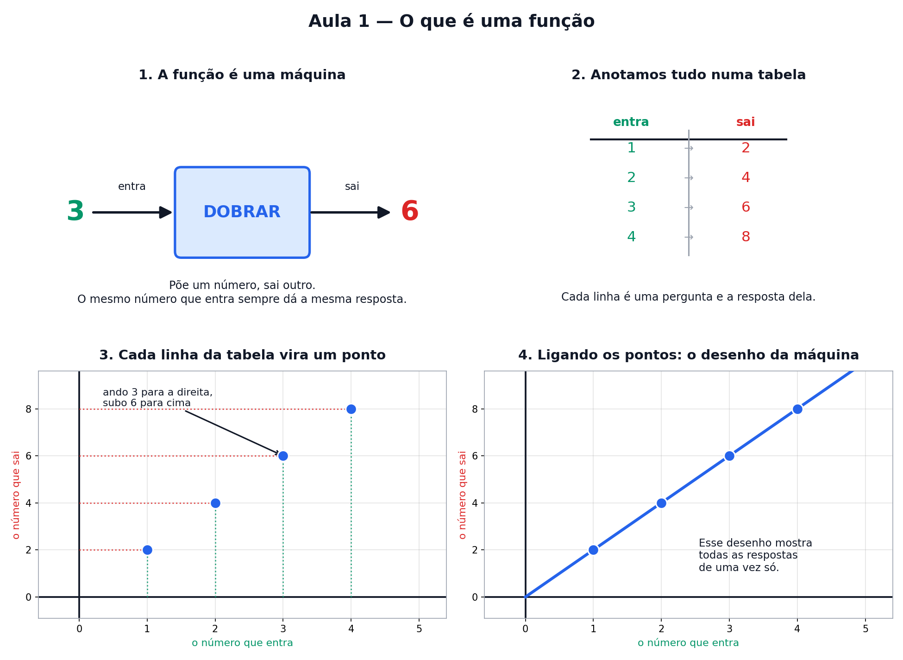

# Aula 1 — O que é uma função

> Estas são as notas em texto da aula. A versão interativa, com os laboratórios e os exercícios
> que se corrigem sozinhos, está em [`index.html`](index.html).



---

## Uma função é uma máquina de números

Imagine uma máquina com um buraco na frente e outro atrás. Você joga um número lá dentro. Ela faz
uma continha. Sai outro número do outro lado.

É só isso. Uma função é uma máquina de transformar número em número.

Vamos chamar essa máquina de **DOBRAR**. Ela pega o número e multiplica por 2.

- Ponho o 3 → sai o 6
- Ponho o 5 → sai o 10
- Ponho o 10 → sai o 20

Você já sabe fazer essa conta desde criança. A única novidade é dar um **nome** para a máquina.

---

## Como escrevemos isso

Matemático é preguiçoso e não vai escrever *"joguei o 3 na máquina dobrar e saiu o 6"* toda vez.
Ele escreve assim:

```
f(3) = 6
```

Lê-se: **"éfe de três é igual a seis"**.

- O **f** é só o nome da máquina. Podia ser qualquer letra. É como chamar um cachorro de Rex.
- O número **entre parênteses** é o que você jogou dentro.
- O que vem **depois do igual** é o que saiu.

Então `f(5) = 10` quer dizer: joguei o 5, saiu o 10.

> ⚠️ **Cuidado — a armadilha número 1.** Aqui os parênteses **não são multiplicação**. `f(3)` não é
> "f vezes 3". É "a máquina f recebeu o 3". Praticamente todo mundo tropeça nisso uma vez.

---

## O x é só um espaço em branco

E se eu quiser descrever a máquina inteira, de uma vez, para **qualquer** número?

Aí uso uma letra no lugar do número. Quase sempre o **x**. E ele significa exatamente isto:

> **x = "um número qualquer, o que você quiser"**
> É um espaço em branco esperando ser preenchido. Nada mais.

A receita completa da máquina DOBRAR é:

```
f(x) = 2 · x
```

Ou seja: *"pego o número que você me der e multiplico por 2"*.

Quando você escolhe o número, é só trocar:

- x = 3 → f(3) = 2 · 3 = **6**
- x = 7 → f(7) = 2 · 7 = **14**

---

## Máquinas com dois passos

Uma máquina pode fazer duas contas seguidas:

```
f(x) = 2 · x + 1        →  "dobro e depois somo 1"
```

Com o 3: primeiro dobro (2 · 3 = 6), depois somo 1 → **7**.

A ordem importa muito:

| jeito | conta | resultado |
|---|---|---|
| ✔ certo | 2 · 3 = 6, depois 6 + 1 | **7** |
| ✘ errado | 3 + 1 = 4, depois 2 · 4 | 8 |

**Multiplicação e divisão vêm antes de soma e subtração.** Quando você quiser furar essa fila, use
parênteses — eles mandam mais que todo mundo.

---

## A regra de ouro

Nem toda máquina merece o nome de função. Existe uma exigência, uma só:

> **O mesmo número que entra tem que dar sempre a mesma resposta.**

Se hoje eu jogo o 3 e sai 6, amanhã tem que sair 6 de novo. Uma máquina que responde 6 numa vez e 7
na outra, para o mesmo 3, está quebrada — **não é função**.

---

## O gráfico

Cada teste que você faz na máquina vira **um pontinho no papel**:

**Entrou 3, saiu 6** → ando 3 para a direita e subo 6 para cima. Marco o pontinho ali.

Fazendo isso com todos os números, os pontos ficam perfeitamente alinhados e formam uma reta. Esse
desenho tem nome: **gráfico**. Ele é a máquina inteira desenhada — todas as respostas possíveis de
uma vez só.

---

## Pontos importantes

- Uma **função** é uma máquina: entra um número, sai outro.
- `f(3) = 6` significa "joguei o 3, saiu o 6". Os parênteses **não** são multiplicação.
- O **x** é só um espaço em branco: "um número qualquer".
- `f(x) = 2 · x` é a receita da máquina escrita de uma vez para todos os números.
- Multiplicação e divisão vêm **antes** de soma e subtração.
- Regra de ouro: mesma entrada → **sempre** a mesma saída. Senão, não é função.
- Cada teste vira um ponto no papel; todos juntos formam o **gráfico**.

---

## Exercícios

**1.** A máquina é **SOMAR 5**. Complete: 1 → ? · 4 → ? · 10 → ?

**2.** A máquina é `f(x) = 3 · x + 2`. Quanto sai quando entra o **4**? E quando entra o **0**?

**3.** Uma máquina recebeu o 2 e devolveu 7. Mais tarde recebeu o 2 de novo e devolveu 9.
Ela é uma função?

**4.** Olhando o gráfico da máquina DOBRAR: se entrar o **5**, quanto sai?

**5.** Uma máquina misteriosa fez isto: 1 → 4, 2 → 7, 3 → 10. Qual é a receita dela?

<details>
<summary>Respostas</summary>

1. 6, 9, 15
2. Entra 4 → sai **14** (3 · 4 = 12, depois 12 + 2). Entra 0 → sai **2** (3 · 0 = 0, depois 0 + 2 = 2 — o zero engana).
3. **Não.** O mesmo número que entrou deu duas respostas diferentes, o que quebra a regra de ouro.
4. Sai **10**.
5. `f(x) = 3 · x + 1`. A saída pula de 3 em 3 (4 → 7 → 10), então multiplica por 3. E 3 · 1 = 3, falta 1 para chegar no 4 — daí o + 1.

</details>

---

**Próxima aula:** [Desenhar números no papel](../02-desenhar-numeros-no-papel/) — as duas réguas,
os negativos e o passo da escada.
