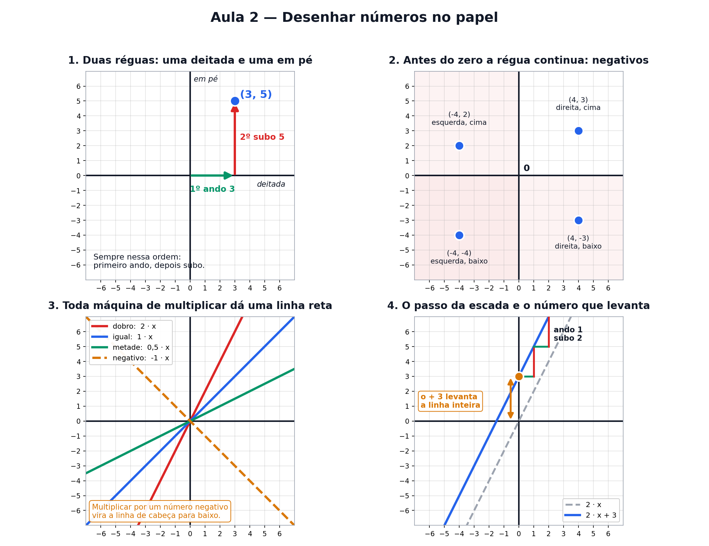

# Aula 2 — Desenhar números no papel

> Estas são as notas em texto da aula. A versão interativa, com os laboratórios e os exercícios
> que se corrigem sozinhos, está em [`index.html`](index.html).

**Na aula passada:** função é uma máquina — entra um número, sai outro. `f(3) = 6` quer dizer
"joguei o 3, saiu o 6". E cada teste vira um pontinho no papel.



---

## Duas réguas, um endereço

Pegue uma folha quadriculada. Deite uma régua na horizontal. Encoste outra na vertical. As duas se
cruzam no **zero**.

Pronto: agora todo ponto do papel tem um **endereço feito de dois números**.

```
(3, 5)      →  ando 3 para a direita, depois subo 5
```

Sempre nessa ordem — **primeiro ando, depois subo**. É como achar uma sala num prédio: primeiro
você acha o corredor, depois pega o elevador.

> ⚠️ **A ordem muda tudo.** `(3, 5)` e `(5, 3)` são lugares diferentes. Trocar a ordem aqui é como
> trocar o número do prédio pelo número do apartamento.

---

## Antes do zero a régua continua

Esta é a única coisa realmente nova da aula: os **números negativos**.

A régua não acaba no zero. Ela continua para o outro lado: −1, −2, −3, e assim por diante.

Pense num prédio com subsolo. O zero é a **rua**. Os andares de cima são 1, 2, 3. As garagens
embaixo são −1, −2, −3. O sinal de menos não quer dizer "número ruim" — quer dizer **"para o outro
lado do zero"**.

No papel funciona igualzinho:

| posição | positivo | negativo |
|---|---|---|
| 1º número | ando para a **direita** | ando para a **esquerda** |
| 2º número | **subo** | **desço** |

Então `(−4, 2)` é: ando 4 para a esquerda, subo 2.

---

## Toda máquina de multiplicar dá uma reta

Quando marcamos todos os pontos da máquina DOBRAR, eles ficaram perfeitamente alinhados.

E não é sorte da DOBRAR. **Qualquer** máquina do tipo "multiplico por um número" dá uma linha reta.
O que muda é a inclinação dela:

| receita | o que acontece |
|---|---|
| `2 · x` | sobe rápido |
| `1 · x` | sobe no meio-termo |
| `0,5 · x` | sobe devagar |
| `−1 · x` | **desce** |

Guarde: **número negativo na multiplicação vira a linha de cabeça para baixo.**

---

## O passo da escada

Este é o coração da aula. Pegue qualquer ponto da reta e faça o seguinte:

> **Ando 1 para a direita. Quanto eu subi?**
> Esse tanto é o *passo da escada*. E ele é sempre igual, não importa onde você comece.

E aqui vem a parte bonita: **o passo da escada é exatamente o número que multiplica**. Se a máquina
é `f(x) = 2 · x`, você anda 1 e sobe 2. Se é `f(x) = 5 · x`, você anda 1 e sobe 5.

Os matemáticos chamam esse passo de **inclinação**. Mas "passo da escada" descreve melhor.

---

## O número solto no fim

Na receita `f(x) = 2 · x + 3`, o **+3** não mexe no tamanho do passo. Os degraus continuam iguais.
Ele só **levanta a linha inteira** 3 casas para cima.

E tem um truque para achar onde a linha cruza a régua em pé: **é exatamente esse número solto.**
Nem precisa contar.

Por quê? Porque cruzar a régua em pé é o mesmo que perguntar quanto vale a máquina quando você
ainda não andou nada, ou seja, quando `x = 0`:

```
f(0) = 2 · 0 + 3 = 3
```

O 2 sumiu porque foi multiplicado por zero, e sobrou só o 3.

---

## A receita de qualquer reta

```
f(x) = (passo da escada) · x + (altura de partida)
```

**Dois números descrevem qualquer linha reta do mundo.** Um diz o quanto ela sobe a cada passo, o
outro diz de onde ela partiu. Mais nada.

Dois casos especiais que vale conhecer:

- **passo negativo** → a linha desce
- **passo zero** → a linha fica deitada; a máquina devolve sempre o mesmo número

---

## Pontos importantes

- Todo ponto tem endereço de **dois números**: `(quanto ando, quanto subo)` — nessa ordem.
- `(3, 5) ≠ (5, 3)`. Trocar a ordem muda o lugar.
- Negativo no 1º número → ando para a **esquerda**. Negativo no 2º → **desço**.
- Máquina de multiplicar sempre dá uma **linha reta**.
- O número que **multiplica** é o **passo da escada**: ando 1 → subo aquele tanto.
- Passo negativo → a linha **desce**. Passo zero → a linha fica **deitada**.
- O número **solto** levanta a linha inteira, e é onde ela **cruza a régua em pé**.
- Receita geral: `f(x) = passo · x + altura de partida`.

---

## Exercícios

**1.** Onde fica o ponto `(−3, 1)`?

**2.** Na máquina `f(x) = 3 · x`: se eu ando 1 para a direita, quanto eu subo?

**3.** Na máquina `f(x) = 2 · x + 5`: em que número a linha cruza a régua em pé?

**4.** A máquina `f(x) = −4 · x` faz a linha subir ou descer?

**5.** Uma linha cruza a régua em pé no **1** e, a cada 1 que você anda para a direita, ela sobe
**3**. Qual é a receita dela?

**6.** Uma reta cruza a régua em pé no **2** e sobe **1** a cada passo. Qual é a receita?

<details>
<summary>Respostas</summary>

1. Ando **3 para a esquerda** e **subo 1**. O −3 manda para a esquerda; o +1 manda subir.
2. Subo **3** — o número que multiplica é o próprio passo da escada.
3. No **5**. É o número solto da receita. Conferindo: `f(0) = 2 · 0 + 5 = 5`.
4. **Desce.** Passo negativo derruba a linha: ela cai 4 a cada passo.
5. `f(x) = 3 · x + 1`. Quem sobe é o passo (multiplica); quem cruza é a altura de partida (soma).
6. `f(x) = 1 · x + 2`.

</details>

---

**Aula anterior:** [O que é uma função](../01-o-que-e-uma-funcao/)
**Próxima aula:** ângulos e o círculo — o que é girar, e por que a volta inteira tem 360.
