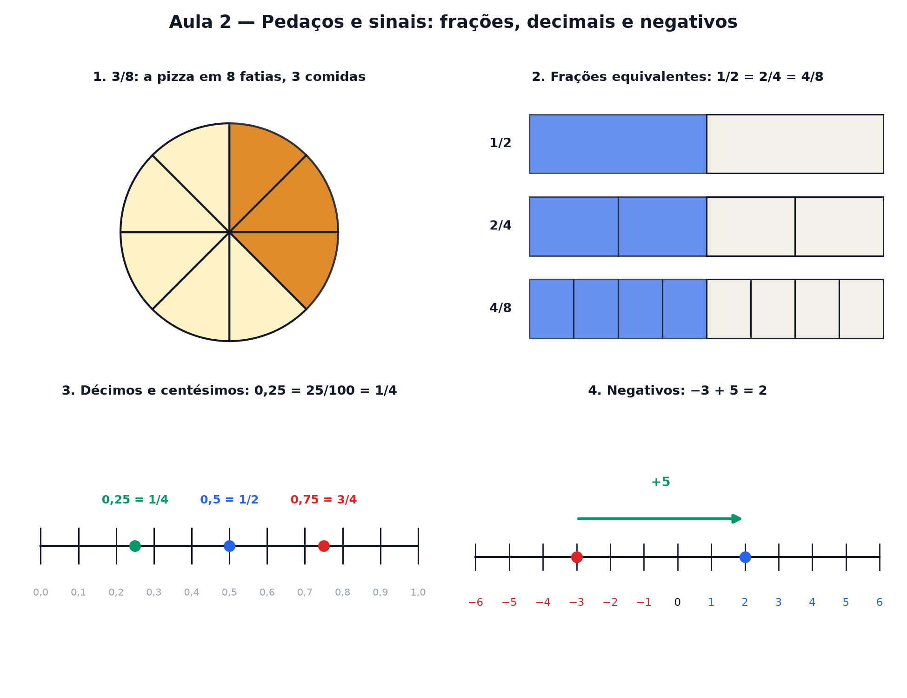

# Aula 2 — Pedaços e sinais: frações, decimais e negativos

> Estas são as notas em texto da aula. A versão interativa, com os laboratórios e os exercícios
> que se corrigem sozinhos, está em [`index.html`](index.html).

*Meio, terço, 0,25 e −3 °C parecem ter regras diferentes. Todos moram na mesma reta — e obedecem às
mesmas quatro operações.*

**Você já sabe:** as quatro operações e, da Aula 1, múltiplos, divisores, MMC e MDC. Hoje o MMC
ganha um emprego: somar pedaços.

Até aqui os números eram inteiros: 1, 2, 3... Mas o mundo vem em pedaços (meia pizza, 0,75 litro) e
abaixo do zero (−3 °C, saldo negativo no banco). Esta aula põe todos esses números na **mesma
reta**, e mostra que as contas com eles são as de sempre — com dois cuidados.

> **🧠 Poder do cérebro**
>
> O que é mais pizza: **3 pedaços de uma pizza cortada em 8** ou **2 pedaços de uma pizza cortada em
> 5**? Chute antes de continuar.
>
> **Resposta:** 2 de 5, por pouco: 3/8 = 0,375 e 2/5 = 0,4. Comparar frações de "cortes" diferentes
> é difícil de cabeça — por isso vamos aprender a deixar os pedaços do mesmo tamanho (seção 3) e a
> escrever tudo em decimal (seção 4).

---

## Fração é pedaço

A fração `3/8` (lê-se "três oitavos") diz: **corte em 8 partes iguais e pegue 3**. O número de baixo
(o *denominador*) é em quantas partes você cortou; o de cima (o *numerador*), quantas pegou. E
fração também é uma divisão: `3/8 = 3 ÷ 8`.

> 🔧 **Laboratório — a pizza fatiada.** Escolha em quantas fatias cortar e quantas pegar. Dá para
> pegar mais que uma pizza inteira. *(interativo, na versão em HTML)*

---

## O mesmo pedaço, cortado mais fino

Metade de uma barra de chocolate é o mesmo tanto que 2 quartos, ou 4 oitavos. Multiplicar o de cima
e o de baixo pelo mesmo número só corta os pedaços mais finos — a quantidade não muda. São **frações
equivalentes**. O caminho de volta, dividir os dois pelo MDC da Aula 1, é **simplificar**: `6/8 =
3/4`.

> 🔧 **Laboratório — frações equivalentes.** A barra de cima é a fração original. A de baixo corta
> cada pedaço em mais partes. *(interativo, na versão em HTML)*

---

## Somar pedaços: primeiro, do mesmo tamanho

Meio chocolate mais um terço de chocolate: quanto dá? Não dá para somar "meios" com "terços" direto
— são pedaços de tamanhos diferentes. Corte os dois em pedaços iguais: o tamanho comum vem do
**MMC** dos de baixo (Aula 1). `MMC(2, 3) = 6`, então: `1/2 = 3/6` e `1/3 = 2/6`, e aí sim `3/6 +
2/6 = 5/6`.

> 🔧 **Laboratório — soma de pedaços.** Monte as duas frações e veja os pedaços virarem do mesmo
> tamanho antes de somar. *(interativo, na versão em HTML)*

> **⚠️ Cuidado — não se somam os de baixo**
>
> `1/2 + 1/3` **não** é `2/5`. Somar os de baixo é como dizer que meia pizza mais um terço de pizza
> dá menos que meia pizza (2/5 = 0,4 < 0,5)! O de baixo diz o *tamanho* do pedaço, não uma
> quantidade. Primeiro iguale os tamanhos; depois some só os de cima.

---

## Decimais: frações de 10, 100, 1000

A vírgula é só um jeito curto de escrever frações com 10, 100, 1000 embaixo: `0,3 = 3/10` (três
décimos), `0,37 = 37/100` (trinta e sete centésimos). Numa régua, cada centímetro tem 10 milímetros:
é exatamente isso.

> 🔧 **Laboratório — a régua dos decimais.** Mova o ponto. A lupa mostra os centésimos entre dois
> décimos. *(interativo, na versão em HTML)*

> 🧘 **O Guru:** Fração, decimal e número negativo não são três assuntos: são três jeitos de falar de
> lugares na mesma reta. Quando uma conta com eles parecer estranha, desenhe a reta — ou a pizza. O
> desenho nunca mente.

---

## Abaixo do zero: os números negativos

O termômetro marca 3 °C e esfria 5 graus: fica `−2` °C, dois abaixo do zero. Os **números
negativos** ficam à esquerda do zero na reta. Somar é andar para a direita; subtrair é andar para a
esquerda — e agora dá para passar do zero. Quanto mais à esquerda, **menor**: `−5 < −2`, porque −5 é
mais frio.

> 🔧 **Laboratório — o termômetro.** Escolha a temperatura de partida e quanto ela muda (negativo =
> esfria). *(interativo, na versão em HTML)*

---

## Multiplicar com sinais: o saldo que entra e sai

Pense em dinheiro. Uma dívida de R$ 5 é `−5`. Receber 3 dívidas dessas: `3 × (−5) = −15`, você ficou
mais pobre. Agora o truque: se alguém **perdoa** 3 dessas dívidas, isso é tirar três vezes o −5:
`(−3) × (−5) = +15` — você ficou mais rico. **Menos vezes menos dá mais.**

`+ × + = +` `+ × − = −` `− × + = −` `− × − = +`
Sinais iguais dão mais; sinais diferentes dão menos. Na divisão, a mesma regra.

> 🔧 **Laboratório — o saldo que entra e sai.** O valor de cada conta (positivo = dinheiro, negativo
> = dívida) e quantas vezes ela entra (positivo) ou sai (negativo). *(interativo, na versão em
> HTML)*

### Não existe pergunta idiota

**P:** 0,5 e 0,50 são o mesmo número?

**R:** São. `0,50 = 50/100`, que simplifica para `5/10 = 1/2`. Zero no fim, depois da vírgula, não
muda nada — é como cortar os pedaços mais finos (seção 2).

**P:** Toda fração vira um decimal que acaba?

**R:** Não. `1/3 = 0,333...` com o 3 repetindo para sempre. Isso acontece quando o de baixo tem
algum primo diferente de 2 e 5 (os primos do 10) — a Aula 1 de novo.

---

## Pontos importantes

- `3/8`: cortar em 8 e pegar 3. Fração também é divisão: `3 ÷ 8 = 0,375`.
- Multiplicar ou dividir em cima e embaixo pelo mesmo número não muda a fração (equivalentes,
  simplificar pelo MDC).
- Para somar, iguale os pedaços pelo **MMC** dos de baixo e some só os de cima.
- Decimal é fração de 10, 100, 1000: `0,37 = 37/100`.
- Negativos ficam à esquerda do zero; somar anda para a direita, subtrair para a esquerda.
- Sinais iguais multiplicados dão **+**; diferentes dão **−**.

---

## ✏️ Afie o lápis

1. Qual destas frações é igual a `6/8`? → **3/4**
2. `1/2 + 1/3 = ?/6`. Qual é o número de cima? → **5**
3. Quanto é `−3 + 8`? → **5**
4. Quanto é `(−4) × (−5)`? → **20**
5. *(o desafio)* De manhã fazia `−2` °C. À tarde esquentou 9 graus e, à noite, esfriou 12. Qual a
   temperatura à noite? → **−5**
6. *(quem faz o quê?)* Ligue cada número ao que ele quer dizer. → **3/4 → três de quatro pedaços
   iguais; 0,5 → a metade, escrita com vírgula; −3 → três graus abaixo do zero; 6/8 → o mesmo que
   3/4, cortado mais fino**
