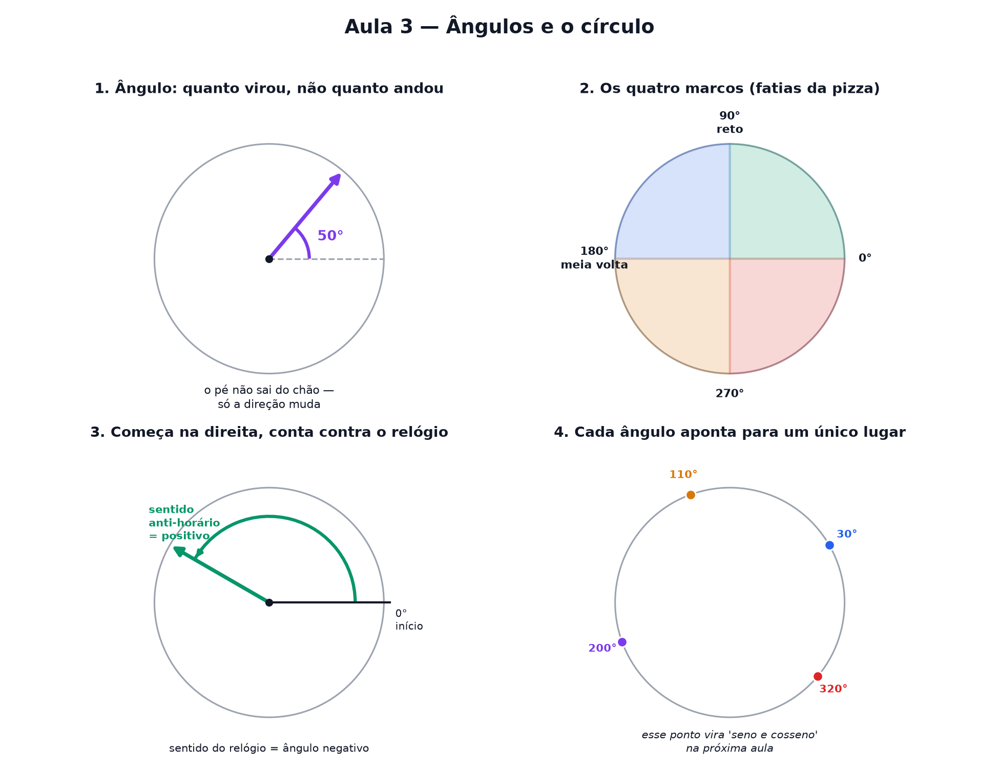

# Aula 3 — Ângulos e o círculo

> Estas são as notas em texto da aula. A versão interativa, com os laboratórios e os exercícios
> que se corrigem sozinhos, está em [`index.html`](index.html).

**Na aula passada:** todo ponto do papel tem um endereço de dois números, e qualquer linha reta
cabe na receita `f(x) = passo · x + altura de partida`.

---

## Girar não é andar

Ande 3 passos para a direita e você mediu uma **distância**. Agora gire no próprio lugar, como um
pião — o seu pé não saiu do chão, mas você **virou** um tanto.

**Ângulo é isso: quanto alguma coisa virou.** Não é distância, é giro. E giro se mede em **graus**.

---

## A volta completa vale 360

Gire até voltar exatamente para onde começou: esse giro vale **360 graus** (`360°`).

Não tem motivo profundo para ser 360 — é um número herdado da matemática babilônica antiga, que
pegou porque é fácil de dividir: por 2, 3, 4, 5, 6, 8, 9, 10, 12... poucos números quebram em tantos
pedaços exatos assim.

> ⚠️ **O tamanho do círculo não importa.** Um ponteiro pequeno e um ponteiro gigante, girando a
> mesma quantidade de giro, têm o **mesmo ângulo** — mesmo que a ponta do ponteiro grande percorra
> uma distância bem maior. Ângulo não mede o raio nem a distância na borda. Mede só o giro.

---

## Os quatro marcos

Pense numa pizza cortada ao meio, e depois ao meio de novo:

| giro | fração da volta | graus | apelido |
|---|---|---|---|
| nenhum | 0 | 0° | ponto de partida |
| um quarto | 1/4 | 90° | **ângulo reto** |
| metade | 1/2 | 180° | **meia volta** |
| três quartos | 3/4 | 270° | três quartos de volta |
| tudo | 4/4 | 360° | **volta completa** |

O **ângulo reto** (90°) é o mais importante de todos — é o giro de um canto de folha de papel, de
uma esquina bem quadrada, do encontro das duas réguas da Aula 2.

---

## De onde começa e para que lado conta

Para o número do ângulo significar sempre a mesma coisa, existe uma combinação padrão:

- **Começa apontando para a direita** — a mesma direção do 1º número da Aula 2.
- **Conta girando no sentido anti-horário** — o contrário do ponteiro do relógio.

Girar no sentido do relógio dá um **ângulo negativo**: `−90°` é o mesmo giro que 90° no sentido
contrário. E dá para girar mais que 360° — `450°` é uma volta inteira (360°) mais 90°, então o
ponteiro para no mesmo lugar que o 90° sozinho, só que deu uma volta a mais.

---

## Onde o ponto para

Para **cada** ângulo, o ponto na borda do círculo para sempre no **mesmo lugar** — nunca muda
sozinho. Isso quer dizer que um ângulo não é só um giro solto: ele também é um **endereço na borda
do círculo**, do mesmo jeito que `(3, 5)` era um endereço no papel quadriculado.

Esse ponto parado tem uma posição — o quanto ele "andou para o lado" e o quanto ele "subiu" — e são
exatamente esses dois números que ganham nome próprio na próxima aula: **cosseno** e **seno**.

---

## Pontos importantes

- **Ângulo é quanto algo virou** — não é uma distância, é um giro.
- Giro se mede em **graus**. Uma volta completa vale **360°**.
- Quatro marcos: `90° (ângulo reto)`, `180° (meia volta)`, `270°` e `360° (volta completa)`.
- O tamanho do círculo **não** muda o ângulo — só a distância que a ponta percorre.
- Combinação padrão: **começa apontando para a direita** e **conta girando contra o relógio**.
- Sentido do relógio dá ângulo **negativo**. Passar de 360° dá voltas extras, mas cai no mesmo lugar.
- Cada ângulo aponta para **um único lugar** na borda do círculo.

---

## Exercícios

**1.** O que um ângulo realmente mede?

**2.** Quantos graus tem uma volta completa?

**3.** Um ângulo reto vale quantos graus?

**4.** Se eu começo apontando para a direita e giro 90° no sentido anti-horário, para onde o
ponteiro aponta?

**5.** Um ponteiro deu três quartos de uma volta completa. Quantos graus ele girou?

**6.** Um ponteiro que começou apontando para a direita está agora apontando reto para cima.
Quantos graus ele girou?

Respostas

1. **O quanto virou** — não é distância nem tamanho de raio.
2. **360°**.
3. **90°** — um quarto da volta completa.
4. **Para cima.**
5. **270°** — três fatias de uma pizza cortada em quatro.
6. **90°** — o marco do ângulo reto.

---

**Aula anterior:** [Desenhar números no papel](../02-desenhar-numeros-no-papel/)
**Próxima aula:** seno e cosseno — a altura e a sombra de um ponto girando.
