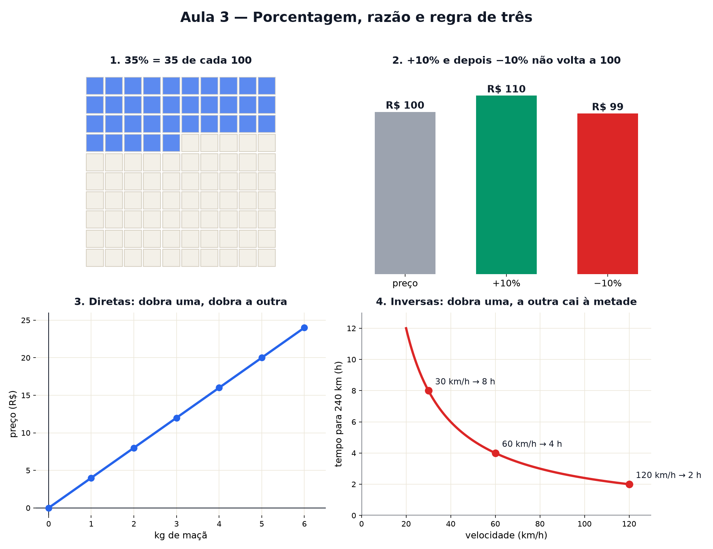

# Aula 3 — Porcentagem, razão e regra de três

> Estas são as notas em texto da aula. A versão interativa, com os laboratórios e os exercícios
> que se corrigem sozinhos, está em [`index.html`](index.html).

*Desconto na loja, receita de bolo, escala do mapa e juros no banco são a mesma conta: comparar por
divisão.*

**Você já sabe:** frações e decimais (Aula 2) — fração é divisão, e decimal é fração de 10, 100,
1000. Hoje a fração de 100 ganha um nome famoso.

"Leve 3, pague 2." "Até 40% de desconto." "Rende 1% ao mês." "Escala 1:50.000." A vida adulta está
cheia de números que não dizem *quanto*, e sim **quanto em relação a outra coisa**. Esta aula mostra
que tudo isso é uma ideia só: a **razão**.

> **🧠 Poder do cérebro**
>
> Numa turma, 12 de 30 alunos usam óculos. Em outra, 10 de 20. Em qual turma usar óculos é **mais
> comum**? A primeira tem mais gente de óculos... isso responde?
>
> **Resposta:** Não responde. Compare a **fração**: 12/30 = 0,4 (40%) e 10/20 = 0,5 (50%). Na
> segunda turma, metade usa óculos. Comparar quantidades de grupos de tamanhos diferentes pede uma
> razão — é o assunto desta aula.

---

## Razão e proporção: a receita que dobra

Uma receita pede **2 xícaras de farinha para 1 de açúcar**. Essa comparação é uma **razão**: 2 para
1, ou `2/1`. Para fazer o dobro do bolo, dobra tudo: 4 para 2 — outra razão, mas **a mesma**, porque
`4/2 = 2/1`. Duas razões iguais formam uma **proporção** (são as frações equivalentes da Aula 2).

> 🔧 **Laboratório — a receita que dobra.** A receita original serve 4 pessoas. Mude o número de
> pessoas e veja os ingredientes crescerem juntos. *(interativo, na versão em HTML)*

---

## Porcentagem: "por cem"

**Porcentagem** é só uma fração com 100 embaixo: `35% = 35/100 = 0,35`. Para achar 35% de alguma
coisa, multiplique por 0,35 — ou pense em 100 quadradinhos e pegue 35 deles.

> 🔧 **Laboratório — a barra de porcentagem.** Escolha a porcentagem e o total. Cada quadradinho vale
> 1% do total. *(interativo, na versão em HTML)*

---

## Aumento e desconto: multiplicar por um número só

Aumentar 10% é ficar com 100% + 10% = 110% do valor: **multiplicar por 1,1**. Descontar 10% é ficar
com 90%: **multiplicar por 0,9**. Esse truque (trocar "mais tantos por cento" por "vezes um número")
vai virar os juros compostos da Aula 14.

> 🔧 **Laboratório — desconto × aumento.** Um produto de R$ 100 sobe e depois desce. Ele volta ao
> preço original? *(interativo, na versão em HTML)*

> **⚠️ Cuidado — porcentagem de quê?**
>
> Subir 10% e depois descer 10% **não volta** ao preço: R$ 100 vira R$ 110 e depois R$ 99. O
> desconto de 10% foi calculado sobre R$ 110, não sobre R$ 100. Toda porcentagem é "de alguma coisa"
> — sempre pergunte **de quê**.

---

## Escala: o mapa é uma razão

Num mapa com escala `1:50.000`, cada 1 cm no papel vale 50.000 cm de verdade (500 m). É uma razão
entre o desenho e o mundo. Plantas de casa, maquetes e miniaturas usam a mesma ideia.

> 🔧 **Laboratório — a escala do mapa.** Escolha a escala e meça no mapa. *(interativo, na versão em
> HTML)*

> 🧘 **O Guru:** Um número sozinho quase nunca diz muita coisa. '12 alunos de óculos' não é muito nem
> pouco até você perguntar 'de quantos?'. A razão é essa pergunta. Faça-a sempre — é o que separa
> quem entende um desconto de quem é enganado por ele.

---

## Regra de três: a proporção que falta um pedaço

"3 kg de arroz custam R$ 12. Quanto custam 5 kg?" Você conhece três números e quer o quarto. Como
preço e peso andam juntos, a razão é a mesma: `12/3 = ?/5`. O jeito mais seguro é passar pelo **1**:
1 kg custa 12 ÷ 3 = R$ 4, então 5 kg custam 5 × 4 = R$ 20. Isso é a **regra de três**.

> 🔧 **Laboratório — regra de três ao vivo.** Mude os números conhecidos e o pedido. O laboratório
> passa pelo 1 — e faz a mesma conta nas duas colunas. *(interativo, na versão em HTML)*

---

## Direta ou inversa?

Nem toda relação anda junto. Mais quilos → mais caro: grandezas **diretamente** proporcionais (dobra
uma, dobra a outra). Mais pedreiros → *menos* dias de obra: grandezas **inversamente** proporcionais
(dobra uma, a outra cai pela metade). Na inversa, o que fica igual é o **produto**: 2 pedreiros × 12
dias = 24 "pedreiro-dias" de trabalho, com qualquer número de pedreiros.

Quando entram três ou mais grandezas (máquinas, horas e peças), é a **regra de três composta**:
resolva uma grandeza de cada vez, sempre perguntando "direta ou inversa?".

> 🔧 **Laboratório — direta ou inversa?** Troque de situação e mova o slider. Repare no formato do
> gráfico. *(interativo, na versão em HTML)*

### Não existe pergunta idiota

**P:** Pode existir mais de 100%?

**R:** Pode, quando se compara com um valor de referência: um preço que foi de R$ 50 para R$ 150
subiu 200% (aumentou 2 vezes o valor inicial). O que não passa de 100% é a **parte de um todo**: não
dá para 120% dos alunos usarem óculos.

**P:** Por que "por cento"?

**R:** Do latim *per centum*, "por cem". O símbolo % é um "1/00" desenhado às pressas — um 1 sobre
dois zeros.

---

## Pontos importantes

- **Razão** compara por divisão (2 para 1). Razões iguais formam uma **proporção**.
- **Porcentagem** é fração de 100: `35% = 0,35`; 35% de 200 = 0,35 × 200 = 70.
- Aumentar 10% = × 1,1; descontar 10% = × 0,9. Um depois do outro: × 0,99.
- Escala é a razão entre o desenho e o real.
- **Regra de três**: passe pelo 1 (quanto vale uma unidade) e multiplique.
- Direta: dobra e dobra (o quociente fica igual). Inversa: dobra e cai pela metade (o produto fica
  igual).

---

## ✏️ Afie o lápis

1. Quanto é 20% de 150? → **30**
2. Uma receita para 4 pessoas usa 3 ovos. Quantos ovos para 12 pessoas? → **9**
3. Um produto de R$ 100 subiu 10% e depois teve 10% de desconto. Quanto custa agora? → **R$ 99**
4. 5 cadernos custam R$ 30. Quanto custam 8 cadernos (em reais)? → **48**
5. *(o desafio)* 2 máquinas iguais fazem 100 peças em 5 horas. Quantas peças 4 dessas máquinas
   fazem em 3 horas? → **120**
6. *(quem faz o quê?)* Ligue cada expressão ao que ela quer dizer. → **25% → um quarto do total;
   escala 1:100 → 1 cm no papel é 1 m de verdade; grandezas inversas → uma dobra e a outra cai pela
   metade; razão 2 para 1 → um é o dobro do outro**
