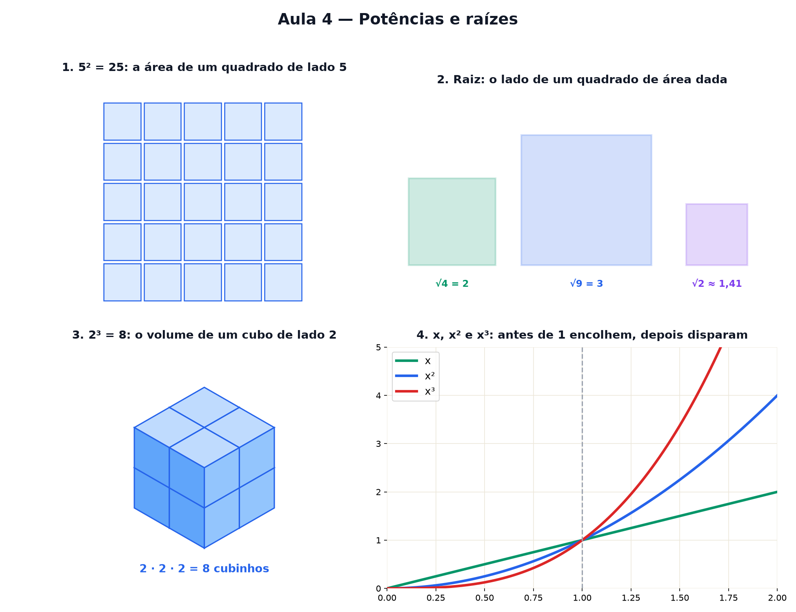

# Aula 4 — Potências e raízes

> Estas são as notas em texto da aula. A versão interativa, com os laboratórios e os exercícios
> que se corrigem sozinhos, está em [`index.html`](index.html).

*"Ao quadrado" é um quadrado de verdade, "ao cubo" é um cubo, e a raiz é o lado deles. De brinde:
escrever números gigantes sem se perder nos zeros.*

**Você já sabe:** multiplicar, os números negativos e a regra de sinais (Aula 2), e decimais (Aula
2). Hoje a multiplicação repetida ganha um atalho.

Um tabuleiro de xadrez tem 8 por 8 casas: 64. Um cubo mágico tem 3 por 3 por 3 cubinhos: 27. A
distância da Terra ao Sol é de uns 150.000.000 km. As três coisas pedem a mesma ferramenta:
**multiplicar um número por ele mesmo, várias vezes**.

> **🧠 Poder do cérebro**
>
> Um quadrado tem área 49. Quanto mede o lado dele? E se a área fosse 50?
>
> **Resposta:** Área 49: lado 7, porque 7 · 7 = 49. Área 50: um pouquinho mais que 7 — cerca de
> 7,07. Nenhum número inteiro serve, e tudo bem: a seção 2 mostra como pensar nesse "lado que não é
> inteiro".

---

## Ao quadrado é, literalmente, um quadrado

`5²` (lê-se "cinco ao quadrado") é só `5 · 5 = 25`. O nome não é à toa: é a **área de um quadrado de
lado 5** — 25 quadradinhos. O número pequeno lá em cima diz quantas vezes repetir a multiplicação.
Isso se chama **potência**.

> 🔧 **Laboratório — o quadrado cresce.** Mude o lado e conte os quadradinhos. *(interativo, na
> versão em HTML)*

---

## A raiz: o caminho de volta

E se eu disser só a área? "Um quadrado tem 36 quadradinhos — quanto mede o lado?" Resposta: 6,
porque `6 · 6 = 36`. Isso é a **raiz quadrada**: `√36 = 6`. É a máquina do quadrado rodando ao
contrário.

> 🔧 **Laboratório — ache o lado.** Escolha a área. O laboratório desenha o quadrado e mede o lado.
> *(interativo, na versão em HTML)*

> **⚠️ Cuidado — nem toda raiz é inteira, e 2³ não é 2 · 3**
>
> `√2` não é 1 (1 · 1 = 1, pouco) nem 2 (2 · 2 = 4, muito). Fica no meio: ≈ 1,41, com vírgula que
> nunca termina. E não confunda potência com multiplicação comum: `2³ = 2 · 2 · 2 = 8`, mas `2 · 3 =
> 6`.

---

## Ao cubo é, literalmente, um cubo

Suba uma dimensão: empilhe camadas de quadrados até virar um cubo. Um cubo de aresta 3 tem `3 · 3 ·
3 = 27` cubinhos. Por isso `3³` se lê "três **ao cubo**" — é o **volume** do cubo.

> 🔧 **Laboratório — o cubo cresce.** Mude a aresta e conte os cubinhos, camada por camada.
> *(interativo, na versão em HTML)*

---

## A raiz cúbica: a aresta de um volume

O caminho de volta do cubo: "um cubo tem 64 cubinhos — quanto mede a aresta?" 4, porque `4 · 4 · 4 =
64`. Essa é a **raiz cúbica**: `∛64 = 4`. O numerozinho no "telhado" da raiz diz quantas vezes o
número foi multiplicado.

> 🔧 **Laboratório — ache a aresta.** Escolha o volume. O laboratório procura a aresta. *(interativo,
> na versão em HTML)*

> 🧘 **O Guru:** Ao quadrado não é uma regra de conta: é um quadrado de verdade, e a raiz é o lado
> dele. Sempre que um símbolo parecer abstrato, pergunte que desenho ele esconde. Quase sempre é um
> desenho simples.

---

## Quadrado nunca é negativo

`(−3)² = (−3) · (−3) = 9`. Menos vezes menos dá mais (Aula 2) — o sinal some. Por isso **todo número
ao quadrado é zero ou positivo**. Esse detalhe vai ser a peça-chave do desvio padrão (Aula 5) e dos
mínimos quadrados (Aula 23): diferenças elevadas ao quadrado não se cancelam. Já no cubo o sinal
fica: `(−2)³ = −8`.

> 🔧 **Laboratório — quadrado nunca é negativo.** Arraste x para os negativos e repare na barra do
> quadrado (e na do cubo). *(interativo, na versão em HTML)*

---

## Potências de 10: números gigantes sem se perder

`10² = 100`, `10³ = 1.000`, `10⁶ = 1.000.000`: o expoente de 10 é **quantos zeros** vêm depois do 1.
Isso permite escrever números enormes de um jeito curto, a **notação científica**: a distância até o
Sol, 150.000.000 km, vira `1,5 × 10⁸` km. (Números minúsculos, com expoente negativo, chegam na Aula
14.)

> 🔧 **Laboratório — a régua das potências de 10.** Monte um número em notação científica: um número
> de 1 a 9,9 vezes uma potência de 10. *(interativo, na versão em HTML)*

### Não existe pergunta idiota

**P:** √36 não poderia ser −6? Afinal, (−6) · (−6) = 36.

**R:** Boa! As duas dão 36 ao quadrado. Mas o símbolo `√` foi combinado para devolver a **positiva**
— é o lado do quadrado, e lado não tem tamanho negativo. A negativa não some: ela volta na Aula 13,
quando a parábola cruza o zero dos dois lados.

**P:** E a raiz de um número negativo?

**R:** Depende da raiz. `∛−8 = −2` existe, porque `(−2)³ = −8` (no cubo o sinal fica). Já `√−4` não
existe com os números que você conhece: nenhum quadrado é negativo (seção 5). Guarde essa pergunta —
a Aula 18 inventa um número novo só para respondê-la.

---

## Pontos importantes

- **Potência:** `5² = 5 · 5` (área do quadrado), `3³ = 3 · 3 · 3` (volume do cubo).
- **Raiz quadrada:** o lado do quadrado — `√36 = 6`. **Raiz cúbica:** a aresta do cubo — `∛64 = 4`.
- Nem toda raiz é inteira: `√2 ≈ 1,41`.
- Quadrado nunca é negativo; cubo guarda o sinal.
- Potência de 10 = quantos zeros: `1,5 × 10⁸ = 150.000.000`.

---

## ✏️ Afie o lápis

1. Quanto vale `4²`? → **16**
2. Quanto vale `√49`? → **7**
3. Escreva por extenso: `3 × 10⁴` = ? → **30000**
4. Quanto vale `(−3)²`? → **9**
5. *(o desafio)* Uma caixa cúbica comporta exatamente 125 cubinhos de 1 cm. Quanto mede a aresta
   da caixa (em cm)? → **5**
6. O que dá para dizer sobre `√2`? → **Não é inteira: fica entre 1 e 2, perto de 1,41.**
