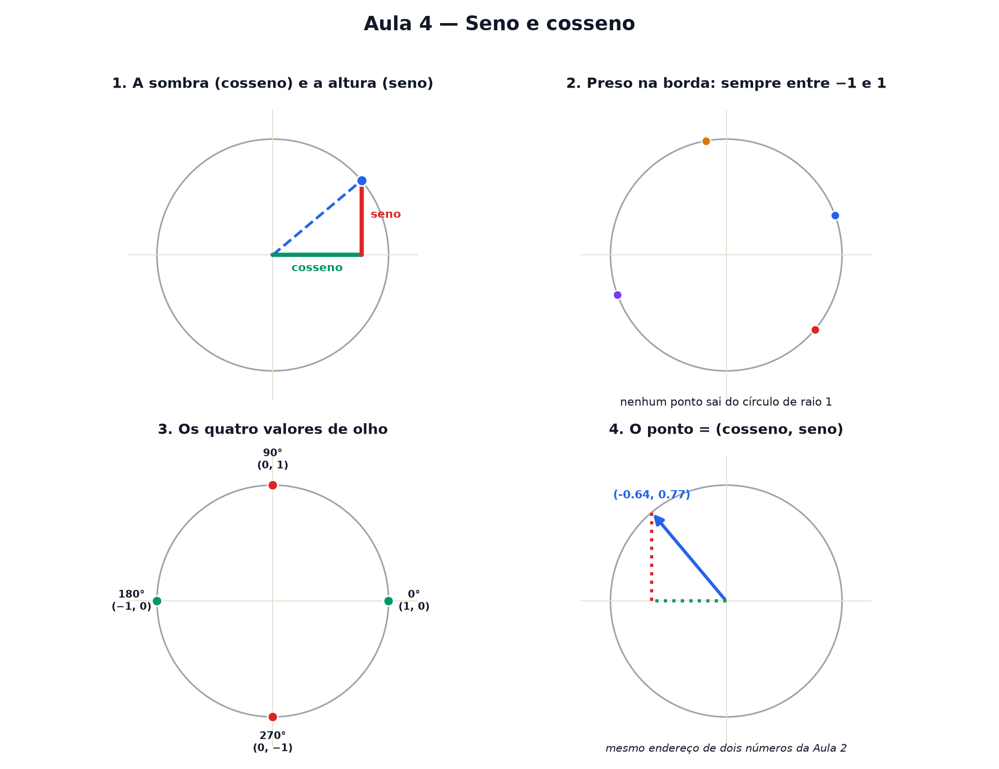

# Aula 4 — Seno e cosseno

> Estas são as notas em texto da aula. A versão interativa, com os laboratórios e os exercícios
> que se corrigem sozinhos, está em [`index.html`](index.html).

**Na aula passada:** ângulo é quanto algo virou. Uma volta completa vale 360°, e cada ângulo aponta
para um único lugar na borda do círculo.



---

## A sombra e a altura

Imagine um sol bem no alto, iluminando de cima para baixo, e outro sol do lado, iluminando de lado.
O ponto que gira na borda do círculo projeta **duas sombras**: uma na régua deitada, outra na régua
em pé.

- A sombra na régua **deitada** — o quanto o ponto andou para o lado — chama-se **cosseno**.
- A sombra na régua **em pé** — o quanto o ponto subiu — chama-se **seno**.

**Cosseno é a sombra horizontal, seno é a altura vertical** de um ponto que gira num círculo de
raio 1.

---

## Por que sempre entre −1 e 1

O círculo tem **raio 1**. O ponto nunca sai da borda dele — então a sombra dele, para qualquer
lado, nunca pode ser maior que o próprio raio.

> Seno e cosseno **nunca** passam de 1 nem ficam abaixo de −1. O ponto está preso na borda de um
> círculo de raio 1 — a sombra dele não tem como ser maior que isso.

> ⚠️ **Sombra pode ser negativa.** Depois de 90°, o ponto entra do lado esquerdo do círculo, e a
> sombra horizontal (cosseno) fica negativa. Depois de 180°, é a sombra vertical (seno) que fica
> negativa. Sinal de menos aqui quer dizer o mesmo de sempre: "do outro lado do zero".

---

## Os valores que valem a pena reconhecer de olho

| ângulo | cosseno (sombra) | seno (altura) |
|---|---|---|
| 0° | 1 | 0 |
| 90° | 0 | 1 |
| 180° | −1 | 0 |
| 270° | 0 | −1 |

Em 0° o ponto está todo "deitado" (só sombra horizontal, nenhuma altura). Em 90° ele está todo "em
pé" (só altura, nenhuma sombra). Eles vão se revezando.

Valores como 30°, 45° e 60° não são números redondos, mas também não têm mistério: cos(60°) = 0,50,
cos(45°) ≈ 0,71, cos(30°) ≈ 0,87. Nada de decorar fórmula — é só olhar o valor calculado.

---

## Os dois números num único desenho

Seno e cosseno são as **duas coordenadas do mesmo ponto**, do mesmo jeito que a Aula 2 usava dois
números para dar o endereço de um ponto no papel:

```
ponto = (cosseno do ângulo, seno do ângulo)
```

O primeiro número é a sombra (quanto andou para o lado). O segundo é a altura (quanto subiu).
Exatamente a mesma ordem da Aula 2 — "primeiro ando, depois subo".

---

## Pontos importantes

- Um ponto gira na borda de um círculo de **raio 1**.
- **Cosseno** = a sombra horizontal do ponto.
- **Seno** = a altura vertical do ponto.
- Os dois vivem sempre entre **−1 e 1**.
- `cos 0°=1, sen 0°=0` · `cos 90°=0, sen 90°=1` · `cos 180°=−1, sen 180°=0` · `cos 270°=0, sen 270°=−1`.
- O ponto é o endereço `(cosseno, seno)` do ângulo.

---

## Exercícios

**1.** O que o cosseno de um ângulo representa?

**2.** Quanto vale cosseno de 0°?

**3.** Quanto vale seno de 90°?

**4.** Por que seno e cosseno nunca passam de 1?

**5.** Quanto vale cosseno de 180°?

**6.** Um ponto girou até parar reto para baixo (270°). Quais são a sombra e a altura dele?

<details>
<summary>Respostas</summary>

1. **A sombra horizontal** do ponto que gira.
2. **1** — em 0° a sombra é máxima, vale o raio inteiro.
3. **1** — em 90° a altura é máxima.
4. Porque **o ponto está preso na borda de um círculo de raio 1** — a sombra não pode passar disso.
5. **−1** — em 180° o ponto está do lado esquerdo, do outro lado do zero.
6. Sombra (cosseno) = **0**, altura (seno) = **−1**.

</details>

---

**Aula anterior:** [Ângulos e o círculo](../03-angulos-e-o-circulo/)
**Próxima aula:** ondas — o giro visto de lado.
