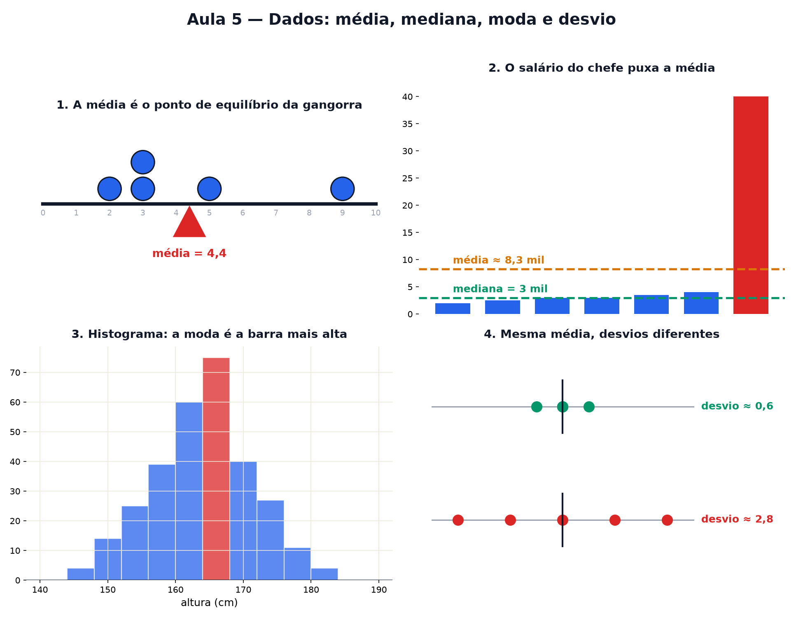

# Aula 5 — Dados: média, mediana, moda e desvio

> Estas são as notas em texto da aula. A versão interativa, com os laboratórios e os exercícios
> que se corrigem sozinhos, está em [`index.html`](index.html).

*Uma lista de números não diz nada até ser resumida — e cada resumo esconde alguma coisa. Hoje você
aprende a escolher o resumo certo.*

**Você já sabe:** frações, decimais e negativos (Aula 2), porcentagem (Aula 3), e quadrado e raiz
(Aula 4). O desvio padrão usa os três.

Notas de uma turma, preços de um produto, salários de uma empresa, alturas de um time: listas de
números estão por toda parte. Ninguém lê 500 números. A gente resume em um ou dois — e quem escolhe
o resumo pode contar histórias bem diferentes com os mesmos dados.

> **🧠 Poder do cérebro**
>
> Numa empresa, o salário **médio** é R$ 10.000. Isso quer dizer que a maioria dos funcionários
> ganha perto de R$ 10.000?
>
> **Resposta:** Não necessariamente. Se 9 pessoas ganham R$ 2.000 e o dono ganha R$ 82.000, a média
> é exatamente R$ 10.000 — e ninguém ganha perto disso. A seção 3 mostra o resumo que não se deixa
> enganar pelo dono.

---

## Média: o ponto de equilíbrio

A **média** é a conta mais famosa: some tudo e divida pela quantidade. As notas (6, 8, 7, 9, 5)
somam 35; divididas por 5 dão 7. Mas a média tem um desenho: ponha cada número como um peso numa
régua — a média é o ponto onde a régua **equilibra**, como uma gangorra.

> 🔧 **Laboratório — a gangorra da média.** Cinco notas estão em cima da régua. Mova o apoio até a
> gangorra ficar reta. Depois mude a nota do Pedro. *(interativo, na versão em HTML)*

---

## Mediana: o do meio

Ponha a lista em ordem e pegue o número do **meio**: essa é a **mediana**. Em (5, 6, 7, 8, 9) a
mediana é 7. Se a lista tem uma quantidade par, a mediana é a média dos dois do meio. A mediana não
liga para o tamanho dos extremos, só para a ordem.

> 🔧 **Laboratório — o do meio.** Sete valores em ordem. Estique o maior deles e observe quem se
> mexe: a média ou a mediana? *(interativo, na versão em HTML)*

---

## Quando a média engana

Um valor muito diferente dos outros (um **extremo**) puxa a média para o lado dele — a gangorra
precisa de um apoio bem deslocado para equilibrar um peso lá longe. A mediana não se mexe. Por isso
notícias sobre salário e preço de imóvel costumam usar a mediana.

> 🔧 **Laboratório — o salário do chefe.** Nove funcionários ganham entre R$ 1.800 e R$ 2.600. Mude o
> salário do chefe. *(interativo, na versão em HTML)*

### 🔥 Conversa ao pé da lareira

Esta noite: **Média** e **Mediana** discutem quem resume melhor uma lista.

**Média:** Eu uso *todos* os números. Cada um conta. Você só olha para quem está no meio da fila —
que desperdício!

**Mediana:** E por usar todos, qualquer exagerado te arrasta. Um bilionário entra na sala e, de
repente, todo mundo é "rico em média".

**Média:** Mas sou eu que funciono nas contas. Quer saber o total de salários? Me multiplique pelo
número de pessoas. Tente isso com você.

**Mediana:** Justo. Para o total, é você. Para o "típico", sou eu — metade ganha menos que eu,
metade ganha mais.

**Média:** Quando a lista é bem comportada, sem exagerados, a gente até fica pertinho uma da outra.

**Mediana:** E quando a gente se afasta, é um aviso: tem alguém muito longe dos outros. Olhe as
duas.

---

## Moda e histograma: o que mais aparece

A **moda** é o valor que mais se repete (o número de sapato mais vendido, a nota mais comum). Para
enxergar isso em listas grandes, agrupe os valores em faixas e desenhe uma barra para cada faixa: é
o **histograma**. A barra mais alta mostra a moda.

> 🔧 **Laboratório — monte o histograma.** Meça a altura de alunos, 10 de cada vez, e veja o desenho
> aparecer. *(interativo, na versão em HTML)*

> 🧘 **O Guru:** Todo resumo joga informação fora — é para isso que ele serve. A pergunta nunca é
> 'qual resumo está certo?', e sim 'o que este resumo está escondendo?'. Olhe a média, olhe a
> mediana, olhe o espalhamento. Se eles contam histórias diferentes, a verdade está na diferença.

---

## Desvio: o quanto a lista se espalha

As listas (7, 7, 7, 7, 7) e (3, 11, 5, 9, 7) têm a mesma média, 7 — mas uma é toda igual e a outra é
espalhada. O **desvio padrão** mede esse espalhamento, em três passos:

1. **Centralize:** subtraia a média de cada número. (6, 8, 7, 9, 5) vira (−1, 1, 0, 2, −2).
2. **Eleve ao quadrado** (Aula 4), para os negativos não cancelarem os positivos: 1, 1, 0, 4, 4.
3. **Tire a média e depois a raiz:** √((1 + 1 + 0 + 4 + 4) ÷ 5) = √2 ≈ 1,41.

> 🔧 **Laboratório — centralize a lista.** Cada número é uma barra. A linha tracejada é a média.
> Centralize e veja cada um virar "o quanto está acima ou abaixo da média". *(interativo, na versão
> em HTML)*

> **⚠️ Cuidado — desvio não é "maior menos menor"**
>
> A diferença entre o maior e o menor valor se chama **amplitude** e só olha para dois números. O
> desvio padrão olha para **todos**: é o tamanho típico da distância até a média. Em (3, 11, 5, 9,
> 7) a amplitude é 8, mas o desvio padrão é ≈ 2,83.

---

## Espalhado ou apertado?

Duas turmas com média 7: numa, quase todos tiraram entre 6 e 8; na outra, as notas vão de 2 a 10. O
desvio padrão separa as duas com um número só: pequeno quando a lista é apertada, grande quando é
espalhada.

> 🔧 **Laboratório — espalhado ou apertado?** Estique as notas para longe da média (ela continua 7) e
> acompanhe o desvio padrão. *(interativo, na versão em HTML)*

### Não existe pergunta idiota

**P:** E se a lista tiver um número par de valores? Qual é o do meio?

**R:** Não tem um só: tem dois. A mediana é a média desses dois. Em (2, 4, 6, 10) os do meio são 4 e
6, e a mediana é 5.

**P:** Por que o desvio eleva ao quadrado e depois tira a raiz? Não era mais fácil ignorar o sinal?

**R:** Dava para ignorar o sinal (isso existe, chama "desvio médio"). Mas o quadrado tem duas
vantagens que vão aparecer muito mais tarde: pesa mais os afastamentos grandes e combina
perfeitamente com Pitágoras e com a geometria (Aulas 22 e 23). A raiz no fim só devolve a medida
para a mesma unidade dos dados.

---

## Pontos importantes

- **Média**: soma ÷ quantidade — o ponto de equilíbrio da gangorra.
- **Mediana**: o do meio da lista ordenada (par: média dos dois do meio). Não se deixa puxar por
  extremos.
- **Moda**: o que mais aparece — a barra mais alta do histograma.
- Média e mediana muito diferentes = algum valor muito longe dos outros.
- **Desvio padrão**: centralize, eleve ao quadrado, tire a média e a raiz. Mede o espalhamento.

---

## ✏️ Afie o lápis

1. Qual é a média de (4, 6, 8, 10, 12)? → **8**
2. Qual é a mediana de (3, 9, 1, 7, 5)? → **5**
3. Qual é a moda de (2, 3, 3, 5, 7, 3, 5)? → **3**
4. Num bairro, 99 casas valem cerca de R$ 300 mil e uma mansão vale R$ 50 milhões. Que número
   representa melhor o preço de uma casa típica? → **A mediana, porque a mansão não a puxa.**
5. *(o desafio)* A média das suas 4 primeiras provas é 7. Quanto você precisa tirar na 5ª prova
   para a média das 5 ficar 7,4? → **9**
6. *(quem faz o quê?)* Ligue cada resumo ao que ele mede. → **média → o ponto de equilíbrio da
   gangorra; mediana → o do meio da fila ordenada; moda → o valor que mais aparece; desvio padrão →
   o tamanho típico do espalhamento**
