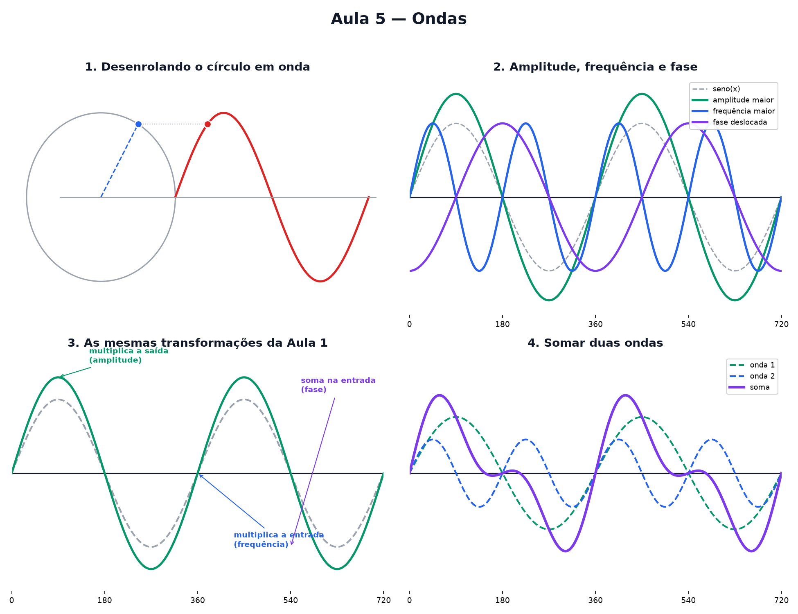

# Aula 5 — Ondas

> Estas são as notas em texto da aula. A versão interativa, com os laboratórios e os exercícios
> que se corrigem sozinhos, está em [`index.html`](index.html).

**Na aula passada:** um ponto gira num círculo de raio 1. Cosseno é a sombra horizontal dele, seno
é a altura vertical — e os dois vivem entre −1 e 1.

---

## Desenrolando o círculo

Pega o ponto girando da Aula 4 e desenrola o círculo numa linha reta, marcando só a **altura** dele
a cada instante — como um rolo de papel sendo puxado. O resultado é a **onda**.

---

## Três jeitos de mudar a onda

A onda mais simples é `y = seno(x)`. Ela tem três controles:

- **Altura da onda (amplitude).** Multiplicar a onda inteira estica ela para cima e para baixo,
  igual multiplicar `x` esticava a reta na Aula 2.
- **Largura da onda (frequência).** Multiplicar o ângulo (o que entra no seno) faz o ponto girar
  mais rápido — cabem mais voltas completas no mesmo espaço, e a onda fica mais apertada.
- **Adiantar ou atrasar (fase).** Somar um número ao ângulo empurra a onda inteira para o lado.

---

## Reencontro com a Aula 1

São as **mesmas quatro transformações** da máquina da Aula 1, aplicadas ao seno em vez de a `x`:

| ação | efeito |
|---|---|
| multiplicar a **saída** da onda | estica para cima/baixo (amplitude) |
| multiplicar a **entrada** (ângulo) | aperta ou alarga (frequência) |
| somar algo na **entrada** | desloca para o lado (fase) |

---

## Somar duas ondas

Se duas ondas acontecem no mesmo lugar, elas se somam ponto a ponto. Onde as duas sobem juntas, o
resultado sobe mais (reforço). Onde uma sobe e a outra desce, elas se cancelam um pouco — ou até
completamente, se estiverem perfeitamente opostas.

---

## Pontos importantes

- A onda é o giro do círculo **desenrolado** — a altura (seno) marcada ao longo do tempo.
- **Amplitude**: multiplica a onda inteira, estica para cima/baixo.
- **Frequência**: multiplica o ângulo, aperta ou alarga a onda.
- **Fase**: soma no ângulo, desloca a onda para o lado.
- São as mesmas transformações da Aula 1, aplicadas ao seno.
- Somar duas ondas soma as alturas **ponto a ponto**.

---

## Exercícios

**1.** O que gera o formato de onda que vimos hoje?

**2.** Qual dos três controles faz a onda ficar mais alta?

**3.** Qual dos três controles faz a onda ficar mais apertada?

**4.** Qual dos três controles desloca a onda para o lado, sem mudar altura nem largura?

**5.** Se duas ondas estão exatamente sincronizadas, o que acontece quando elas se somam?

**6.** Para deixar a onda mais baixinha mantendo a mesma largura, qual número devo diminuir?

Respostas

1. **A altura de um ponto girando num círculo**, desenrolada ao longo do tempo.
2. **A amplitude.**
3. **A frequência.**
4. **A fase.**
5. **A onda resultante fica mais alta** — elas se reforçam.
6. **A amplitude.**

---

**Aula anterior:** [Seno e cosseno](../04-seno-e-cosseno/)
**Próxima aula:** setas e tabelas de números — vetores e matrizes desmistificados.
