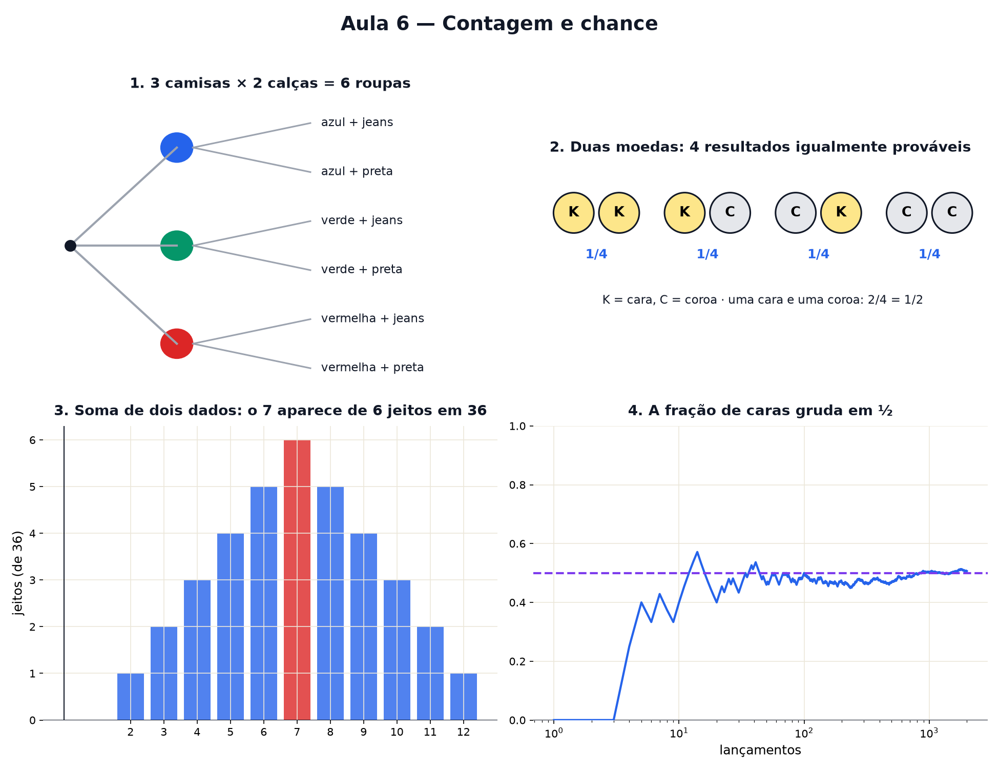

# Aula 6 — Contagem e chance

> Estas são as notas em texto da aula. A versão interativa, com os laboratórios e os exercícios
> que se corrigem sozinhos, está em [`index.html`](index.html).

*Contar possibilidades sem listar uma por uma — e descobrir que o acaso, de longe, tem régua.*

**Você já sabe:** multiplicar, frações (Aula 2), porcentagem (Aula 3) e média (Aula 5). A chance de
algo acontecer é uma fração; a longo prazo, uma média.

De quantos jeitos dá para se vestir com 3 camisetas e 2 calças? Quantas senhas de 4 dígitos existem?
Qual a chance de acertar? Perguntas assim parecem pedir paciência para listar tudo. Não pedem: pedem
uma **árvore** e uma **multiplicação**.

> **🧠 Poder do cérebro**
>
> Você joga duas moedas. Os resultados possíveis parecem ser três: duas caras, duas coroas, ou uma
> de cada. Então a chance de "uma de cada" é 1/3... certo?
>
> **Resposta:** Errado — e o laboratório da seção 3 prova. "Uma de cada" acontece de **dois** jeitos
> (cara-coroa e coroa-cara), enquanto "duas caras" só de um. São 4 casos igualmente prováveis, e
> "uma de cada" ganha 2 deles: chance 2/4 = 1/2.

---

## Contar com uma árvore

3 camisetas e 2 calças: para cada camiseta, você tem 2 escolhas de calça. São `3 × 2 = 6` roupas
diferentes. Desenhe como uma árvore: cada escolha abre galhos. Esse é o **princípio
multiplicativo**: escolhas feitas uma depois da outra se **multiplicam**.

> 🔧 **Laboratório — a árvore de roupas.** Mude quantas peças de cada tipo você tem e conte as folhas
> da árvore. *(interativo, na versão em HTML)*

---

## Filas e senhas: permutações e arranjos

De quantos jeitos 4 amigos podem formar uma fila? O primeiro lugar tem 4 candidatos; o segundo, os 3
que sobraram; depois 2; depois 1: `4 × 3 × 2 × 1 = 24`. Essa conta "de n até 1" é tão comum que
ganhou nome e símbolo: **fatorial**, `4! = 24`. Ordenar todos é uma **permutação**; escolher só
alguns lugares, em ordem (pódio de 3 entre 8 corredores: `8 × 7 × 6`), é um **arranjo**.

> 🔧 **Laboratório — ordenar a fila.** Quantas pessoas, e quantos lugares na fila? O laboratório
> conta e mostra algumas filas. *(interativo, na versão em HTML)*

---

## Probabilidade é uma fração

Quando todos os resultados têm a mesma chance, a **probabilidade** de um acontecimento é só uma
contagem:

`probabilidade = casos que servem ÷ casos possíveis`

Tirar par num dado: servem 2, 4 e 6 → `3 ÷ 6 = ½`. Tirar 5: `1 ÷ 6`. Sempre um número entre 0
(impossível) e 1 (certo) — ou, em porcentagem (Aula 3), entre 0% e 100%. O truque é contar os casos
**de um jeito em que todos sejam igualmente prováveis**, e a árvore da seção 1 faz isso por você.

> 🔧 **Laboratório — duas moedas, quatro casos.** A árvore mostra os 4 casos. Jogue as duas moedas
> muitas vezes e compare com as contas. *(interativo, na versão em HTML)*

---

## Repetir muitas vezes: a frequência gruda na probabilidade

A probabilidade diz o que acontece **no longo prazo**. Numa jogada, qualquer coisa pode sair. Em
mil, a fração de vezes que o acontecimento aparece vai grudando na probabilidade.

> 🔧 **Laboratório — a moeda repetida.** Jogue a moeda. O gráfico mostra a fração de caras até ali.
> *(interativo, na versão em HTML)*

> **⚠️ Cuidado — a moeda não tem memória**
>
> Saíram 5 caras seguidas? A próxima continua com chance ½. A frequência se aproxima de ½ porque
> **as jogadas futuras são muitas** e diluem a sequência — não porque a moeda "compensa". Achar que
> "agora tem que dar coroa" é a falácia do apostador, e já quebrou muita gente.

> 🧘 **O Guru:** O acaso não tem memória nem vontade — por isso ele é imprevisível no varejo e
> previsível no atacado. Quem aposta na próxima jogada está chutando. Quem conta os casos sabe o
> tamanho do risco antes de jogar.

---

## O dado viciado?

Com poucas jogadas, o acaso faz barulho: um dado honesto pode dar três 6 seguidos. Com muitas, as
frações se aproximam de `1/6` cada — e um dado viciado se entrega.

> 🔧 **Laboratório — o dado viciado?** Jogue o dado honesto e depois o viciado. Quantas jogadas até
> dar para desconfiar? *(interativo, na versão em HTML)*

---

## O valor esperado: a média de longo prazo

Qual é o "resultado típico" de um dado? Faça a média da Aula 5 com cada face pesada pela sua chance:
`(1 + 2 + 3 + 4 + 5 + 6) ÷ 6 = 3,5`. Isso é o **valor esperado**. Nenhuma jogada dá 3,5 — mas a
média de muitas jogadas gruda nele. É assim que cassinos e seguradoras ganham dinheiro: jogada por
jogada é sorte; somadas, é conta.

> 🔧 **Laboratório — a média que gruda.** Jogue o dado muitas vezes e acompanhe a média de todas as
> jogadas. *(interativo, na versão em HTML)*

### Não existe pergunta idiota

**P:** Por que "uma cara e uma coroa" tem chance ½ e não ⅓?

**R:** Porque "uma de cada" é na verdade dois casos: cara na primeira e coroa na segunda, ou o
contrário. Pinte uma moeda de azul e a outra de vermelho e fica óbvio. Os três "resultados" não são
igualmente prováveis; os quatro casos da árvore são.

**P:** Probabilidade 1/6 quer dizer que em 6 jogadas o 5 sai exatamente uma vez?

**R:** Não. Em 6 jogadas o 5 pode sair zero, uma, duas vezes... A probabilidade só promete a fração
de **longo prazo**: em 6.000 jogadas, perto de 1.000 cincos.

---

## Pontos importantes

- **Princípio multiplicativo**: escolhas em sequência se multiplicam (3 camisetas × 2 calças = 6).
- **Fatorial**: `4! = 4 × 3 × 2 × 1 = 24` filas. Arranjo: só alguns lugares, em ordem (`8 × 7 × 6`).
- **Probabilidade** = casos que servem ÷ casos possíveis (todos igualmente prováveis); fica entre 0
  e 1.
- Repetindo muito, a frequência se aproxima da probabilidade — sem "compensar" nada.
- **Valor esperado**: a média de longo prazo (dado: 3,5).

---

## ✏️ Afie o lápis

1. Com 3 camisetas e 2 calças, quantas combinações de roupa dá para montar? → **6**
2. De quantos jeitos 4 pessoas podem formar uma fila? → **24**
3. Qual é a probabilidade de tirar **5** num dado comum? → **1/6**
4. Você vai jogar uma moeda honesta 100 vezes. Quantas caras você **espera**? → **50**
5. *(o desafio)* Uma senha tem 3 dígitos (de 0 a 9), **todos diferentes**. Quantas senhas assim
   existem? → **720**
6. Uma moeda honesta deu cara 5 vezes seguidas. Qual é a chance de dar cara na próxima? →
   **Continua ½: a moeda não lembra o que saiu antes.**
