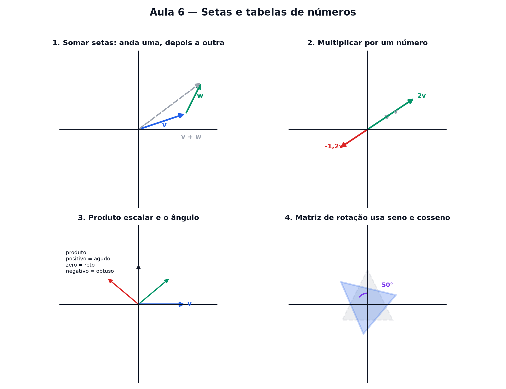

# Aula 6 — Setas e tabelas de números

> Estas são as notas em texto da aula. A versão interativa, com os laboratórios e os exercícios
> que se corrigem sozinhos, está em [`index.html`](index.html).

**Na aula passada:** a onda é o giro do círculo desenrolado — amplitude estica, frequência aperta,
fase desloca.



---

## Um vetor é uma seta

Na Aula 2, um ponto era um endereço: `(3, 5)`. Agora, em vez de só marcar o ponto, desenhamos uma
**seta** saindo do zero até ele. Essa seta tem **tamanho** e **direção**. É um vetor.

---

## Somar setas é andar um caminho e depois o outro

Para somar duas setas: anda a primeira, e a partir de onde ela terminou, anda a segunda. A soma é a
seta que vai direto do começo até o fim desse caminho.

Nos números é ainda mais simples: soma cada coordenada separadamente.

```
(2, 1) + (2, 1) = (4, 2)
```

---

## Multiplicar uma seta por um número

Multiplicar um vetor por um número estica ou encolhe a seta, mantendo a direção — igual multiplicar
`x` esticava a reta na Aula 2.

> ⚠️ **Número negativo inverte a seta.** Multiplicar por um número negativo não só encolhe ou
> estica: também vira a seta para o lado oposto.

---

## Produto escalar: o que o ângulo entre duas setas conta

Existe uma conta que combina duas setas e devolve **um único número**: o produto escalar.

```
v · w = (v₁ · w₁) + (v₂ · w₂)
```

| produto escalar | ângulo entre as setas |
|---|---|
| positivo | agudo |
| zero | reto (perpendiculares) |
| negativo | obtuso |

---

## Matriz: uma tabela que move setas

Uma matriz é uma **tabelinha de números** — 2 linhas, 2 colunas — que transforma qualquer seta:
girar, esticar ou espelhar. A matriz de rotação usa exatamente o seno e o cosseno da Aula 4.

É a mesma matriz que os jogos usam para girar personagens na tela, que uma câmera usa para corrigir
perspectiva, e que está por trás de qualquer efeito visual que gira, estica ou espelha uma imagem.

---

## Pontos importantes

- Um **vetor** é uma seta: tem tamanho e direção.
- Somar setas: anda uma, depois anda a outra a partir de onde a primeira parou.
- Multiplicar por um número estica/encolhe; número negativo **inverte** a direção.
- **Produto escalar** `v · w = v₁w₁ + v₂w₂` devolve um número. Positivo = agudo, zero = reto,
  negativo = obtuso.
- Uma **matriz** é uma tabela de números que transforma setas: gira, estica, espelha.
- A matriz de rotação usa **seno e cosseno**.

---

## Exercícios

**1.** O que é um vetor?

**2.** Quanto vale `(1, 4) + (3, −2)` na primeira coordenada?

**3.** Multiplicar um vetor por −2 faz o quê com a seta?

**4.** Se o produto escalar entre duas setas é zero, o que isso diz sobre o ângulo entre elas?

**5.** Calcule o produto escalar `(2, 3) · (4, −1)`.

**6.** Uma matriz é melhor descrita como o quê?

<details>
<summary>Respostas</summary>

1. **Uma seta**: tem tamanho e direção.
2. **4** — soma cada coordenada separadamente: 1 + 3.
3. **Estica ao dobro do tamanho e inverte a direção.**
4. É um **ângulo reto** — as setas são perpendiculares.
5. **5** — (2·4) + (3·−1) = 8 − 3.
6. **Uma tabela de números que transforma setas** — gira, estica ou espelha.

</details>

---

**Aula anterior:** [Ondas](../05-ondas/)

Fim do curso principal! Veja o [roteiro completo](../../PLANO.md) para os assuntos que ficam ao
alcance a partir daqui.
