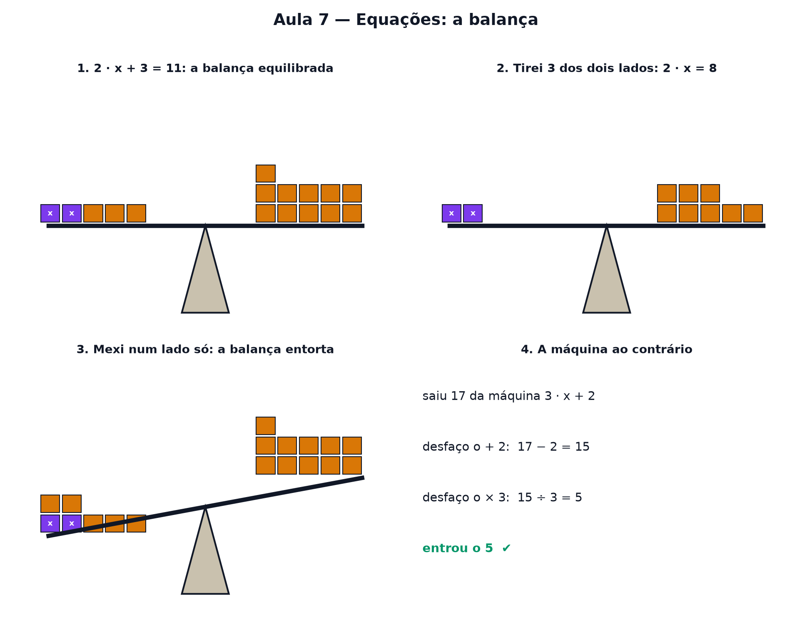

# Aula 7 — Equações: a balança

> Estas são as notas em texto da aula. A versão interativa, com os laboratórios e os exercícios
> que se corrigem sozinhos, está em [`index.html`](index.html).

**No nível 1:** você jogava um número na máquina e via o que saía (Aula 1). Hoje é o contrário:
você sabe o que saiu e quer descobrir o que entrou.



---

## Uma equação é uma balança

`2 · x + 3 = 11`: o sinal de igual diz que os dois lados **pesam a mesma coisa**. No prato
esquerdo, duas caixas misteriosas (cada uma pesa `x`) e 3 pesinhos; no direito, 11 pesinhos.
Resolver é descobrir quanto pesa cada caixa — tirando coisas da balança sem deixar ela entortar.

---

## A regra de ouro da balança

> **O que você fizer de um lado, faça do outro.**

```
2 · x + 3 = 11
2 · x     = 8      (tirei 3 dos dois lados)
    x     = 4      (dividi os dois lados por 2)
```

> ⚠️ Não decore "passa para o outro lado trocando o sinal". O que acontece de verdade é que você
> tirou o mesmo tanto dos dois lados.

---

## A máquina ao contrário

A máquina `3 · x + 2` primeiro multiplica, depois soma. Para desfazer, a **ordem é inversa**:
primeiro desfaz a soma, depois a multiplicação. Saiu 17? `17 − 2 = 15`, `15 ÷ 3 = 5`. Entrou o 5.

---

## Quando o x aparece dos dois lados

```
5 · x − 4 = 2 · x + 8
3 · x − 4 = 8          (tirei 2 · x dos dois lados)
3 · x     = 12         (somei 4 dos dois lados)
      x   = 4          (dividi por 3)
```

---

## Conferir é de graça

Substitua o x na equação original: `5 · 4 − 4 = 16` e `2 · 4 + 8 = 16`. Empatou, está certo.

---

## Pontos importantes

- Uma **equação** é uma balança equilibrada.
- Resolver é descobrir o **x** que mantém a balança equilibrada.
- Regra de ouro: **o que fizer de um lado, faça do outro**.
- Desfaça as contas na **ordem inversa**.
- x dos dois lados? Junte todas as caixas num lado só primeiro.
- Sempre dá para **conferir** substituindo o x.

---

## Exercícios

**1.** Qual é a regra de ouro para resolver uma equação?

**2.** Resolva `x + 7 = 12`.

**3.** Resolva `3 · x = 21`.

**4.** Resolva `2 · x + 3 = 11`.

**5.** Resolva `5 · x − 4 = 2 · x + 8`.

**6.** Para desfazer a máquina `3 · x + 2`, qual é a ordem certa?

<details>
<summary>Respostas</summary>

1. **O que fizer de um lado, faça do outro.**
2. **5**
3. **7**
4. **4** — tire 3 dos dois lados (2x = 8), depois divida por 2.
5. **4** — tire 2x dos dois lados (3x − 4 = 8), some 4 (3x = 12), divida por 3.
6. **Subtrair 2, depois dividir por 3.**

</details>

---

**Aula anterior:** [Setas e tabelas de números](../06-setas-e-tabelas-de-numeros/)
**Próxima aula:** [Sistemas de equações](../08-sistemas-de-equacoes/)
