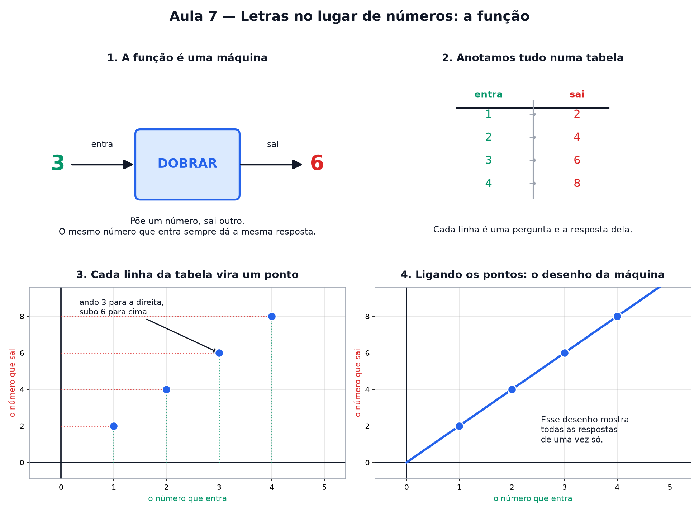

# Aula 7 — Letras no lugar de números: a função

> Estas são as notas em texto da aula. A versão interativa, com os laboratórios e os exercícios
> que se corrigem sozinhos, está em [`index.html`](index.html).

*Também conhecida como: a máquina de números, aquela coisa do *f(x)* que assustou você na escola, e
o alicerce de absolutamente tudo que vem depois.*

**Você já sabe:** fazer conta com qualquer tipo de número — frações, decimais e negativos (Aula 2),
porcentagem (Aula 3) e potências (Aula 4). Até aqui, toda conta vinha com os números prontos. Hoje
entra a letra.

**Você vai ficar surpreso.** A palavra "função" tem fama de difícil, mas a ideia por trás dela é tão
simples que dá até raiva. Se você sabe fazer `3 × 2 = 6`, você já entende funções — só não sabia que
o negócio tinha nome.

Nesta aula você vai: brincar com uma máquina de números de verdade, aprender a ler aquele `f(x)` sem
suar frio, descobrir por que o **x** não é um monstro, e desenhar sua primeira função no papel.

> **🧠 Poder do cérebro**
>
> Um aplicativo de corrida cobra **R$ 5 para começar e R$ 2 por quilômetro**. Quanto custa uma
> corrida de 3 km? E de 10 km? Agora tente escrever *uma frase só* que sirva para qualquer
> distância.
>
> **Resposta:** 3 km: 5 + 2 · 3 = R$ 11. 10 km: 5 + 2 · 10 = R$ 25. A frase para qualquer distância
> é "5 mais 2 vezes os quilômetros" — e, com uma letra no lugar dos quilômetros, `5 + 2 · x`. Você
> acabou de escrever uma função.

Regra da casa: **não decore nada.** Se você entendeu, a fórmula vem de graça depois. Se você decorou
sem entender, esquece em uma semana. 🙂

---

## A função é uma máquina

Imagine uma máquina com um buraco na frente e outro atrás. Você joga um número lá dentro. Ela faz
uma continha. Sai outro número do outro lado.

É **só isso**. Sério. Uma função é uma máquina de transformar número em número.

> 🔧 **Laboratório — mexa na máquina.** Escolha o que a máquina faz, digite um número e jogue lá
> dentro. *(interativo, na versão em HTML)*

> 🧘 **O Guru:** Não tente entender a máquina por dentro. Ninguém liga para os parafusos. O que
> importa é: **o que entrou** e **o que saiu**. Quem entende isso já entendeu metade da matemática.

---

## Como isso vira aquele f(x) horroroso

Matemático é preguiçoso. Ele não vai escrever *"joguei o número 3 na máquina dobrar e saiu o 6"*
toda vez. Ele escreve assim:

> 🔧 **Laboratório — a fórmula clicável.** Clique em cada pedacinho da fórmula para descobrir o que
> ele significa. *(interativo, na versão em HTML)*

> **⚠️ Cuidado — a armadilha número 1**
>
> Aqui os parênteses **NÃO são multiplicação**. `f(3)` não é "f vezes 3". É "a máquina f recebeu o
> 3". Praticamente todo mundo tropeça nisso uma vez. Agora você não vai.

### Não existe pergunta idiota

**P:** Por que logo a letra *f*? Tenho que usar essa?

**R:** Não. O *f* vem de "função", mas é só um apelido. Pode ser *g*, *h*, *maria*. Se você tem duas
máquinas na mesma conversa, dá nomes diferentes para elas — igual a dois cachorros na mesma casa.

**P:** E se eu jogar o mesmo número duas vezes?

**R:** Sai a mesma resposta. Sempre. Isso não é detalhe — é a regra que define uma função, e a gente
chega nela na seção 5.

**P:** Uma máquina pode receber número quebrado ou negativo?

**R:** Pode. `f(2,5) = 5` e `f(−3) = −6` funcionam direitinho na máquina DOBRAR. Só existem casos em
que a máquina "engasga" — dividir por zero, por exemplo — mas isso é papo de outra aula.

---

## O x é só um espaço em branco

Até agora a gente falou de um número por vez. Mas e se eu quiser descrever a máquina inteira, de uma
vez, para **qualquer** número?

Aí eu uso uma letra no lugar do número. Quase sempre o **x**. E ele significa exatamente isto:

**x = "um número qualquer, o que você quiser"**
É um espaço em branco esperando ser preenchido. Nada mais.

A receita completa da máquina DOBRAR é:

`f(x) = 2 · x`

> 🔧 **Laboratório — troque o x por um número.** Arraste e veja o espaço em branco sendo preenchido.
> *(interativo, na versão em HTML)*

### Expressões: receitas escritas com letras

Uma conta com letras dentro, como `3 · x + 2`, se chama **expressão algébrica**. Ela ainda não é um
número: vira um quando você troca o x (com x = 4, dá 14). E dá para arrumar expressões sem saber o
x, porque a letra se comporta como uma **caixa fechada**: 3 caixas mais 2 caixas são 5 caixas.

`3x + 2x = 5x · 4x + 3 − x = 3x + 3`

Só junta o que é igual: `x` com `x`, número com número. `x` e `x²` são caixas de tamanhos diferentes
(Aula 4) — não se juntam.

---

## Máquinas com dois passos

Uma máquina pode fazer duas contas seguidas. Por exemplo:

`f(x) = 2 · x + 1`

A ordem **importa muito**. Veja o que acontece com o número 3 nos dois caminhos:

> 🔧 **Laboratório — a ordem das contas.** A máquina recebe um número. Faça as contas **na ordem
> certa**, um passo de cada vez: o laboratório confere cada passo. *(interativo, na versão em HTML)*

> 🧘 **O Guru:** Multiplicação e divisão têm mais pressa que soma e subtração. Elas passam na frente
> da fila. Quando você quiser furar essa fila, use parênteses — eles mandam mais que todo mundo.

---

## A regra de ouro

Nem toda máquina merece o nome de função. Existe uma exigência, uma só:

> **A ÚNICA REGRA**
>
> O mesmo número que entra
> tem que dar sempre a mesma resposta.

Se hoje eu jogo o 3 e sai 6, amanhã tem que sair 6 de novo. E depois de amanhã também. Uma máquina
que responde 6 numa vez e 7 na outra, para o mesmo 3, está quebrada — **não é função**.

> 🔧 **Laboratório — confiável ou quebrada?** Aperte o botão várias vezes em cada máquina, sempre
> jogando o número **3**. *(interativo, na versão em HTML)*

---

## Desenhando a máquina: o gráfico

Agora o pulo do gato. Cada teste que você faz na máquina vira **um pontinho no papel**:

**Entrou 3, saiu 6** → ando 3 para a direita e subo 6 para cima. Marco o pontinho ali.

> 🔧 **Laboratório — veja o gráfico nascer.** *(interativo, na versão em HTML)*

Esse desenho tem nome: **gráfico**. Ele é a máquina inteira desenhada. Todas as respostas possíveis,
de uma vez só, num retrato.

### 🔥 Conversa ao pé da lareira

Esta noite: **Equação** e **Função**, duas figuras que vivem sendo confundidas.

**Equação:** Eu sou uma pergunta. `2x + 1 = 7`: "qual número faz os dois lados ficarem iguais?" Eu
tenho uma resposta certa, e quem acha ganha.

**Função:** Eu sou uma máquina. `f(x) = 2x + 1`: jogue qualquer número e eu devolvo outro. Não
escondo nada — respondo para todo mundo.

**Equação:** Mas no fundo eu sou uma pergunta *sobre você*: "para qual entrada a máquina f devolve
7?"

**Função:** Verdade. Você é a minha máquina rodando ao contrário. E no meu gráfico você aparece: é
onde eu cruzo a altura 7.

**Equação:** Então na próxima aula, a da balança, sou eu quem manda.

**Função:** E a partir da Aula 9, com o gráfico, a gente vai trabalhar juntas o tempo todo.

---

## Pontos importantes

- Uma **função** é uma máquina: entra um número, sai outro.
- `f(3) = 6` significa "joguei o 3, saiu o 6". Os parênteses **não** são multiplicação.
- O **x** é só um espaço em branco: "um número qualquer".
- `f(x) = 2 · x` é a receita da máquina escrita de uma vez para todos os números.
- **Expressão algébrica**: conta com letras. Junta só o que é igual: `3x + 2x = 5x`.
- **Equação** é uma pergunta ("qual x dá 7?"); **função** é uma máquina que responde para todo x.
- Multiplicação e divisão vêm **antes** de soma e subtração.
- Regra de ouro: mesma entrada → **sempre** a mesma saída. Senão, não é função.
- Cada teste vira um ponto no papel: ando (entrada) e subo (saída). Todos os pontos juntos formam o
  **gráfico**.

---

## ✏️ Afie o lápis

1. A máquina é **SOMAR 5**. Complete a tabela: (entra → sai; 1 → ?; 4 → ?; 10 → ?) → **6 · 9 ·
   15**
2. A máquina é `f(x) = 3 · x + 2`. Quanto sai quando entra… o **4**? o **0**? → **14 · 2**
3. *(quem faz o quê?)* Ligue cada peça da notação de função ao seu papel. → **f → o nome da
   máquina (a regra); x → o número que entra; f(x) → o número que sai; o gráfico → o desenho de
   todos os pares (entrada, saída)**
4. Olhando o gráfico da máquina **DOBRAR** lá em cima: se entrar o **5**, quanto sai? → **10**
5. *(o desafio)* Uma máquina misteriosa fez isto: (entra → sai; 1 → 4; 2 → 7; 3 → 10) Qual é a
   receita dela? → **f(x) = 3 · x + 1**
6. *(a armadilha número 1)* O que quer dizer `g(5) = 12`? → **Joguei o 5 na máquina g e saiu o
   12.**
