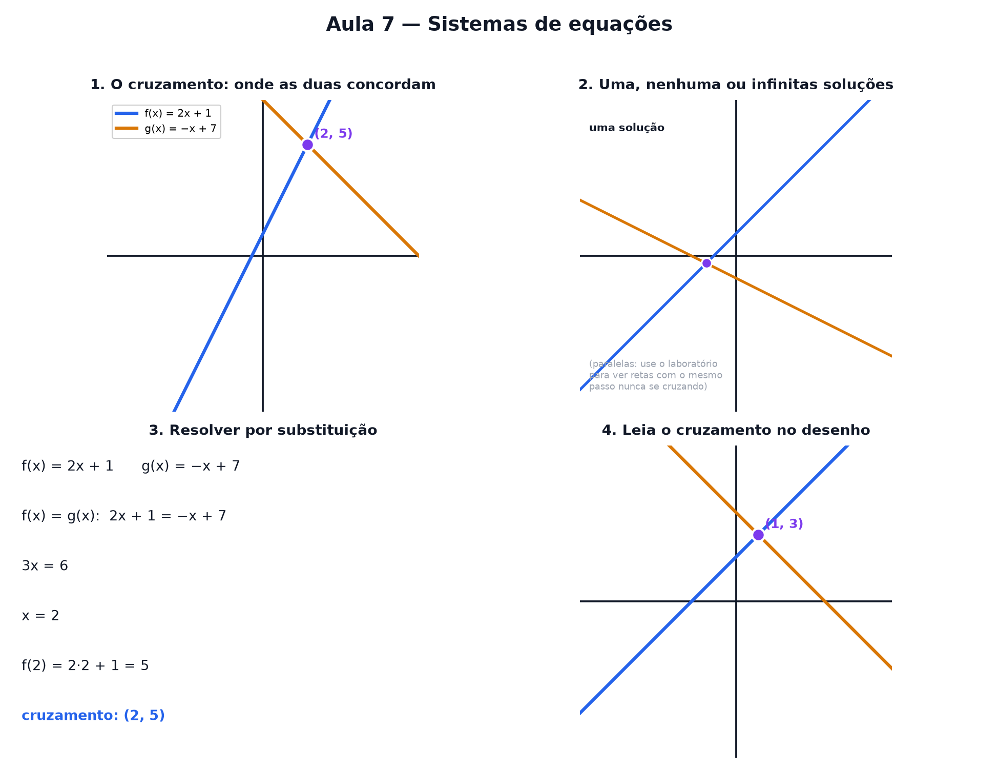

# Aula 7 — Sistemas de equações

> Estas são as notas em texto da aula. A versão interativa, com os laboratórios e os exercícios
> que se corrigem sozinhos, está em [`index.html`](index.html).

**No nível 1:** toda reta cabe na receita `f(x) = passo · x + altura de partida` (Aula 2) — é tudo
o que você precisa para esta aula.



---

## Duas retas, um papel só

Pegue duas receitas de reta, por exemplo `f(x) = 2 · x + 1` e `g(x) = −1 · x + 7`. Desenhe as duas
no mesmo papel quadriculado.

Na maioria dos lugares elas discordam. Mas existe (quase sempre) **um ponto** onde as duas retas se
cruzam — e ali, as duas receitas dão exatamente a mesma resposta.

---

## O que significa "resolver"

"Resolver o sistema" quer dizer só uma coisa: **achar o único ponto (x, y) que serve para as duas
receitas ao mesmo tempo.** É o cruzamento das retas.

---

## Nem sempre existe um só cruzamento

- **Uma solução:** as retas têm passos diferentes — cruzam num único ponto.
- **Nenhuma solução:** mesmo passo, alturas diferentes — são paralelas, nunca se tocam.
- **Infinitas soluções:** as duas retas são, na real, a mesma reta.

> ⚠️ **Mesmo passo não é sempre "sem solução".** Se o passo é igual **e** a altura também é igual,
> não são paralelas — são a mesma reta. Aí qualquer ponto dela serve.

---

## Resolver por substituição

O cruzamento é o ponto onde `f(x) = g(x)`. A substituição junta as duas receitas numa só equação,
resolve para `x`, e depois usa qualquer uma das receitas para achar `y`.

```
f(x) = 2x + 1        g(x) = −x + 7
2x + 1 = −x + 7       →  3x = 6  →  x = 2
f(2) = 2 · 2 + 1 = 5
Cruzamento: (2, 5)
```

---

## Pontos importantes

- Resolver um sistema = achar o **único ponto** que serve para as duas retas ao mesmo tempo.
- **Passos diferentes** → uma solução.
- **Mesmo passo, alturas diferentes** → nenhuma solução (paralelas).
- **Mesmo passo e mesma altura** → infinitas soluções (é a mesma reta).
- **Substituição:** junta as duas receitas, resolve para x, depois acha y.
- O mesmo raciocínio se estende para mais retas (ou planos, com três variáveis).

---

## Exercícios

**1.** "Resolver um sistema de duas retas" significa o quê?

**2.** Duas retas têm o mesmo passo e alturas diferentes. Quantas soluções tem o sistema?

**3.** Resolva `f(x) = x + 1` e `g(x) = 3x − 3` — em que x elas se cruzam?

**4.** Duas retas são exatamente a mesma reta. Quantas soluções tem o sistema?

**5.** Resolva `f(x) = 2x` e `g(x) = x + 4` — qual o valor de y no cruzamento?

**6.** Duas retas se cruzam em `(1, 3)`. Leia esse ponto no gráfico.

<details>
<summary>Respostas</summary>

1. **Achar o único ponto** que serve para as duas receitas ao mesmo tempo.
2. **Nenhuma** — são paralelas.
3. **x = 2** — junte as receitas: x + 1 = 3x − 3 → 4 = 2x.
4. **Infinitas** — qualquer ponto da reta serve.
5. **y = 8** — x = 4, f(4) = 2 · 4 = 8.
6. **(1, 3)**.

</details>

---

**Aula anterior:** [Setas e tabelas de números](../06-setas-e-tabelas-de-numeros/)
**Próxima aula:** decomposição de sinais em ondas — desmontando uma onda complicada de volta em
ondas simples.
