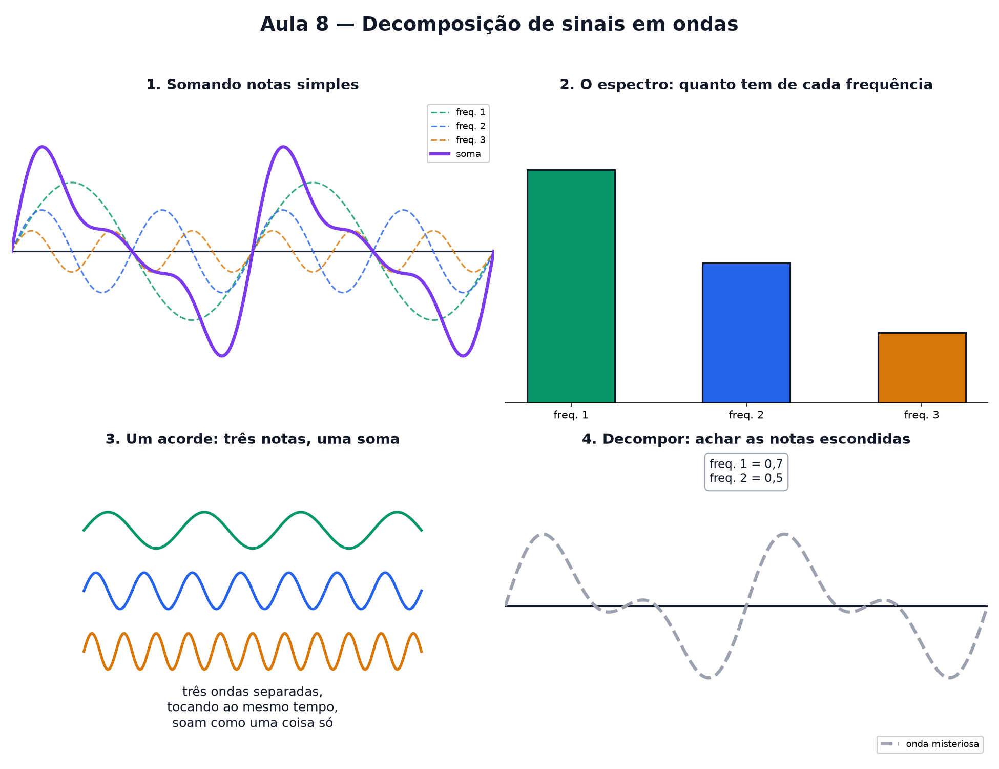

# Aula 8 — Decomposição de sinais em ondas

> Estas são as notas em texto da aula. A versão interativa, com os laboratórios e os exercícios
> que se corrigem sozinhos, está em [`index.html`](index.html).

**No nível 1:** na Aula 5 você somou ondas simples e viu o resultado ficar complicado. Hoje a
pergunta é ao contrário.

---

## A pergunta ao contrário

Na Aula 5, somar `seno(x)` com `seno(2x)` dava um resultado mais "cheio". Hoje: dado um sinal
complicado, **quais ondas simples, somadas, dão exatamente ele?**

Essa é a ideia por trás da **Transformada de Fourier** — um nome grande para uma pergunta simples:
"de que ondas isso é feito?"

---

## Cada "nota" tem sua altura e sua largura

Cada onda simples tem uma **frequência fixa** (quantas voltas cabem no mesmo espaço) e uma
**altura ajustável** (amplitude). A onda complicada é essas "notas" tocando ao mesmo tempo — como
um acorde de piano.

---

## O espectro: quanto tem de cada frequência

O **espectro** é um gráfico de barras: uma barra para cada frequência, do tamanho da amplitude
daquela onda no sinal.

---

## Desmontando de volta

Dada só a onda complicada, decompor é descobrir quais alturas, para quais frequências, reproduzem
o sinal. A ideia visual já é metade do caminho: toda onda "cheia" esconde ondas simples dentro dela.

---

## Pontos importantes

- Toda onda complicada pode ser vista como **várias ondas simples somadas**.
- Cada onda simples tem sua **frequência** (fixa) e **altura/amplitude** (a "quantidade" da nota).
- O **espectro** é um gráfico de barras: uma barra por frequência, do tamanho da amplitude.
- Decompor é achar quais alturas, para quais frequências, reproduzem a onda dada.
- Isso é a ideia por trás da **Transformada de Fourier**, usada em áudio, imagem e compressão.

---

## Exercícios

**1.** Decompor um sinal em ondas significa o quê?

**2.** No espectro, o que a altura de cada barra representa?

**3.** Se um espectro tem barras nas frequências 1 e 3, quantas ondas simples formam o sinal?

**4.** Um MP3 aproveita a decomposição em ondas para quê?

**5.** Onda = seno(x) com amplitude 1 mais seno(2x) com amplitude 0,5. Qual barra é mais alta?

**6.** Com uma única onda simples (sem soma), quantas barras tem o espectro?

Respostas

1. **Descobrir quais ondas simples, somadas, formam o sinal.**
2. **A amplitude** daquela frequência no sinal.
3. **2** ondas simples diferentes.
4. **Descarta com cuidado frequências pouco percebidas pelo ouvido**, economizando espaço.
5. A barra da **frequência 1** — amplitude 1 é maior que 0,5.
6. **1** barra só.

---

**Aula anterior:** [Sistemas de equações](../07-sistemas-de-equacoes/)
**Próxima aula:** estatística com vetores — correlação como ângulo entre duas listas de números.
