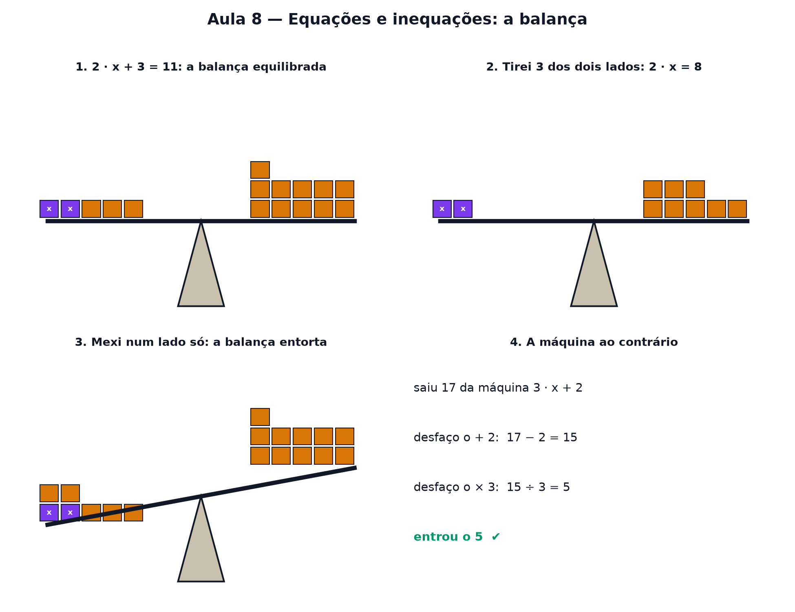

# Aula 8 — Equações e inequações: a balança

> Estas são as notas em texto da aula. A versão interativa, com os laboratórios e os exercícios
> que se corrigem sozinhos, está em [`index.html`](index.html).

*Onde você aprende a descobrir um número escondido — sem chute, só mantendo a balança equilibrada. E
o que muda quando a balança pende para um lado.*

**Você já sabe:** jogar um número na máquina e ver o que sai (Aula 7), e os negativos na reta
numerada (Aula 2). Hoje é o contrário: você sabe o que saiu e quer descobrir o que entrou.

Na Aula 7, a pergunta era: "joguei o 4 na máquina `2 · x + 3`, o que sai?". Hoje a pergunta vira do
avesso: "saiu 11 — **qual número entrou?**". Isso é uma **equação**.

> **🧠 Poder do cérebro**
>
> Numa balança em equilíbrio há, de um lado, 3 caixas iguais e um peso de 2 kg; do outro, 11 kg. Sem
> abrir as caixas, como descobrir quanto pesa cada uma?
>
> **Resposta:** Tire 2 kg dos dois pratos (fica 3 caixas = 9 kg) e divida os dois lados por 3: cada
> caixa pesa 3 kg. Fazer a mesma coisa dos dois lados nunca desequilibra a balança — essa é a aula
> inteira.

---

## Uma equação é uma balança

Escreva `2 · x + 3 = 11`. O sinal de igual diz que os dois lados **pesam a mesma coisa**. Pense numa
balança de dois pratos: no esquerdo, duas caixas misteriosas (cada uma pesa `x`) e 3 pesinhos; no
direito, 11 pesinhos. A balança está equilibrada.

Resolver a equação é descobrir quanto pesa cada caixa — tirando coisas da balança **sem deixar ela
entortar**.

> 🔧 **Laboratório — a balança em equilíbrio.** Use os botões para esvaziar a balança até sobrar uma
> caixa sozinha de um lado. Cada botão mexe **nos dois pratos ao mesmo tempo**. *(interativo, na
> versão em HTML)*

---

## A regra de ouro da balança

Existe uma regra só, e ela é tudo:

**O que você fizer de um lado, faça do outro.**
Tirou 3 da esquerda? Tire 3 da direita. Dividiu a esquerda por 2? Divida a direita por 2. Assim a
balança nunca entorta — e a igualdade continua verdadeira.

> **⚠️ Cuidado — mexer de um lado só**
>
> O erro mais comum é "passar o número para o outro lado" trocando o sinal sem entender por quê. Não
> decore isso: o que acontece de verdade é que você **tirou o mesmo tanto dos dois lados**. Se
> lembrar da balança, nunca vai errar o sinal.

---

## A máquina ao contrário

Lembra da ordem das contas da Aula 7? A máquina `3 · x + 2` primeiro multiplica, depois soma. Para
descobrir o que entrou, você **desfaz na ordem inversa**: primeiro desfaz a soma, depois desfaz a
multiplicação — como tirar a meia depois do sapato.

> 🔧 **Laboratório — a máquina ao contrário.** A máquina devolveu um número. Descubra o que entrou,
> **desfazendo as contas de trás para a frente**. *(interativo, na versão em HTML)*

> 🧘 **O Guru:** Equação não é um bicho diferente de função. É a mesma máquina da Aula 7, só que a
> pergunta anda de trás para frente: você conhece a saída e quer a entrada. Quem sabe montar a
> máquina sabe desmontar — é só fazer os passos na ordem contrária.

---

## Quando o x aparece dos dois lados

Às vezes há caixas nos dois pratos: `5 · x − 4 = 2 · x + 8`. A regra é a mesma. Primeiro tire **2
caixas de cada lado** — assim todas as caixas ficam de um lado só. Depois é o que você já sabe
fazer.

> 🔧 **Laboratório — x dos dois lados, passo a passo.** Uma balança com x nos dois pratos. Faça cada
> passo — sempre **o mesmo dos dois lados** — e o laboratório confere. *(interativo, na versão em
> HTML)*

### Não existe pergunta idiota

**P:** E se a resposta não for um número inteiro?

**R:** Sem problema: `2 · x = 7` dá `x = 3,5`. A balança não liga para vírgula — a regra continua a
mesma.

**P:** Como eu sei que acertei?

**R:** Coloque o número de volta na equação e faça a conta dos dois lados. Se der igual, acertou. É
o laboratório logo abaixo — e é um hábito que vale para a vida inteira.

**P:** Por que isso vem antes de sistemas de equações?

**R:** Porque resolver um sistema (Aula 10) termina sempre numa equação como estas. Sem a balança, a
Aula 10 viraria mágica.

---

## Conferir é de graça

Achou o x? Substitua na equação original. Se os dois lados derem o mesmo número, está certo — sem
precisar de gabarito.

---

## Abrir parênteses: cada pedaço vezes cada pedaço

Às vezes a equação vem com parênteses: `3 · (x + 2) = 21`. Dá para desfazer como na seção 3 (dividir
por 3 primeiro), mas vale conhecer o outro jeito: **abrir os parênteses**. O desenho é uma área de
retângulo: um retângulo de altura 3 e largura `x + 2` se divide em dois pedaços, `3 · x` e `3 · 2`.

`3 · (x + 2) = 3x + 6`

Com dois parênteses, a regra é a mesma: **cada pedaço de um vezes cada pedaço do outro**, e soma
tudo. Com sinais de menos, vale a regra de sinais da Aula 2.

> 🔧 **Laboratório — abra os parênteses.** Monte `(x + a) · (x + b)` e veja o retângulo se dividir em
> quatro pedaços. *(interativo, na versão em HTML)*

---

## Inequações: a balança que pende

E quando os pratos **não** são iguais? "O dobro do número mais 1 é **maior** que 7": `2x + 1 > 7`.
Isso é uma **inequação**, e a resposta não é um número só — é um **pedaço da reta**. A balança pende
para o lado do x a partir do ponto em que ela ficaria equilibrada: resolva `2x + 1 = 7` (x = 3) e
descubra para que lado ela pende.

> 🔧 **Laboratório — a balança que pende.** Mova o x e veja a balança de `2x + 1` contra 7. A faixa
> verde da reta são os x que deixam o lado esquerdo mais pesado. *(interativo, na versão em HTML)*

---

## O sinal que vira

Nas inequações vale quase tudo da balança: somar ou tirar o mesmo dos dois lados, multiplicar ou
dividir pelo mesmo número positivo. Com uma exceção: **multiplicar ou dividir por um número negativo
vira o sinal**. `2 < 5`, mas `−2 > −5`.

> 🔧 **Laboratório — o sinal que vira.** Os pontos azul (2) e vermelho (5) são multiplicados pelo
> mesmo número. Quem fica à esquerda? *(interativo, na versão em HTML)*

**✅ Por que é verdade?**

Multiplicar por −1 é espelhar a reta em volta do zero (Aula 2): quem estava à direita vai para a
esquerda, e vice-versa. Como `5` estava à direita de `2`, depois do espelho `−5` fica à esquerda de
`−2`. A ordem inverteu — por isso o sinal da desigualdade vira. Multiplicar por um positivo só
estica a reta, e a ordem não muda.

---

## Pontos importantes

- Uma **equação** é uma balança equilibrada: os dois lados valem a mesma coisa.
- Resolver é descobrir o **x** que mantém a balança equilibrada.
- Regra de ouro: **o que fizer de um lado, faça do outro**.
- Desfaça as contas na **ordem inversa**: primeiro a soma/subtração, depois a multiplicação/divisão.
- x dos dois lados? Junte todas as caixas num lado só primeiro.
- Sempre dá para **conferir**: substitua o x e veja se os dois lados empatam.
- Abrir parênteses: cada pedaço vezes cada pedaço — `(x + 2)(x + 3) = x² + 5x + 6`.
- **Inequação**: a balança que pende; a resposta é um pedaço da reta.
- Multiplicar ou dividir uma inequação por negativo **vira o sinal**.

---

## ✏️ Afie o lápis

1. *(quem faz o quê?)* Ligue cada ideia da balança ao seu papel. → **equação → balança em
   equilíbrio (=); inequação → balança que pende (<, >); fazer o mesmo dos dois lados → a regra de
   ouro: não desequilibra; multiplicar por um negativo → vira o sinal da desigualdade**
2. Resolva `x + 7 = 12`. x = → **5**
3. Resolva `3 · x = 21`. x = → **7**
4. Resolva `2 · x + 3 = 11`. x = → **4**
5. *(o desafio)* Resolva `5 · x − 4 = 2 · x + 8`. x = → **4**
6. A máquina `3 · x + 2` primeiro multiplica por 3 e depois soma 2. Para desfazer, qual é a ordem
   certa? → **Subtrair 2, depois dividir por 3.**
