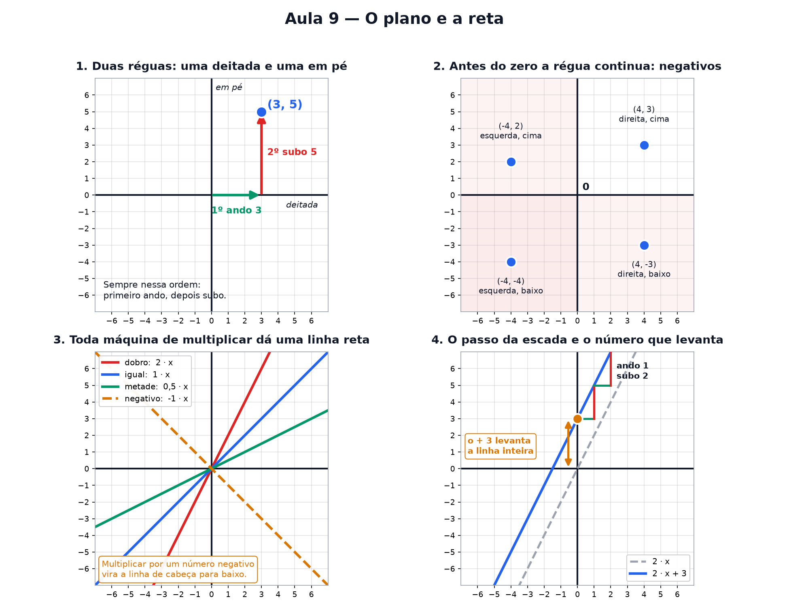

# Aula 9 — O plano e a reta

> Estas são as notas em texto da aula. A versão interativa, com os laboratórios e os exercícios
> que se corrigem sozinhos, está em [`index.html`](index.html).

*Onde você descobre que todo ponto tem endereço, que existe número antes do zero, e que qualquer
linha reta do mundo cabe em dois numerozinhos.*

**Você já sabe:** função é uma máquina — entra um número, sai outro (Aula 7) — e os negativos moram
à esquerda do zero na reta numerada (Aula 2). Hoje a reta ganha uma companheira em pé.

Na Aula 7 a gente marcou uns pontinhos meio no chute. Hoje você vai entender **exatamente** onde
eles ficam — e, de quebra, vai sair sabendo ler qualquer linha reta como quem lê uma placa de rua.

> **🧠 Poder do cérebro**
>
> No xadrez, "e4" diz exatamente onde está uma casa do tabuleiro. Como você diria a alguém, pelo
> telefone, onde marcar um ponto numa folha em branco, para ele desenhar no mesmo lugar?
>
> **Resposta:** Combinando um ponto de partida e dando dois números: quanto andar para a direita e
> quanto andar para cima. Todo ponto da folha vira um par (x, y). Isso é o plano cartesiano.

---

## Duas réguas, um endereço

Pegue uma folha quadriculada. Deite uma régua na horizontal. Encoste outra na vertical. As duas se
cruzam no **zero**.

Pronto: agora todo ponto do papel tem um **endereço feito de dois números**.

`(3, 5)`

Sempre nessa ordem — **primeiro ando, depois subo**. É como achar uma sala num prédio: primeiro você
acha o corredor, depois pega o elevador.

> 🔧 **Laboratório — encontre o ponto.** Escolha o endereço e clique em *Andar até lá* para ver o
> caminho. *(interativo, na versão em HTML)*

> **⚠️ Cuidado — a ordem muda tudo**
>
> **(3, 5) e (5, 3) são lugares diferentes.** Aperte o botão "Trocar a ordem" ali em cima e veja os
> dois pontos aparecerem em cantos distintos. Trocar a ordem aqui é como trocar o número do prédio
> pelo número do apartamento.

> 🔧 **Laboratório — leia o ponto.** Agora ao contrário: clique em qualquer lugar do papel e leia o
> endereço dele. *(interativo, na versão em HTML)*

---

## Antes do zero a régua continua

Aqui está a única coisa realmente nova de hoje: os **números negativos**.

A régua não acaba no zero. Ela continua para o outro lado: −1, −2, −3, e assim por diante.

Pense num prédio com subsolo. O zero é a **rua**. Os andares de cima são 1, 2, 3. As garagens
embaixo são −1, −2, −3.

> 🔧 **Laboratório — o elevador.** *(interativo, na versão em HTML)*

No papel funciona igualzinho:

- 1º número **positivo** → ando para a **direita**. Negativo → ando para a **esquerda**.
- 2º número **positivo** → **subo**. Negativo → **desço**.

Então **(−4, 2)** é: ando 4 para a esquerda, subo 2. Volte no laboratório do ponto e arraste os
controles para os números negativos — dá para ver os quatro cantos do papel.

> 🧘 **O Guru:** O zero não é o começo do mundo. É só o lugar onde alguém resolveu parar de contar
> para um lado e começar a contar para o outro. Um termômetro no inverno entende isso melhor que
> muito aluno.

---

## Toda máquina de multiplicar dá uma reta

Lembra da máquina DOBRAR da Aula 7? Quando marcamos todos os pontos dela, eles ficaram
**perfeitamente alinhados**.

E não é sorte da DOBRAR. **Qualquer** máquina do tipo "multiplico por um número" dá uma linha reta.
O que muda é a **inclinação** dela.

> 🔧 **Laboratório — sobe, desce ou fica deitada?** Antes de revelar, adivinhe o que a máquina faz
> com a reta. *(interativo, na versão em HTML)*

---

## O passo da escada

Este é o coração da aula. Pegue qualquer ponto da reta e faça o seguinte:

**Ando 1 para a direita. Quanto eu subi?**
Esse tanto é o passo da escada. E ele é sempre igual, não importa onde você comece.

Agora vem a parte bonita: **o passo da escada é exatamente o número que multiplica.** Se a máquina é
`f(x) = 2 · x`, você anda 1 e sobe 2. Se é `f(x) = 5 · x`, você anda 1 e sobe 5.

Os matemáticos chamam esse passo de **inclinação**. Mas "passo da escada" descreve melhor.

> 🔧 **Laboratório — compare duas retas.** Ajuste o passo das duas retas e veja qual sobe mais
> rápido. *(interativo, na versão em HTML)*

---

## E o número solto no fim?

Na receita `f(x) = 2 · x + 3`, o **+3** não mexe no tamanho do passo. Os degraus continuam iguais.
Ele só **levanta a linha inteira** 3 casas para cima.

E tem um truque para achar onde a linha cruza a régua em pé: **é exatamente esse número solto**. Nem
precisa contar.

> 🔧 **Laboratório — a fábrica de retas.** Dois controles. Só isso constrói qualquer reta que existe.
> *(interativo, na versão em HTML)*

### Não existe pergunta idiota

**P:** E se o passo da escada for negativo?

**R:** A linha desce em vez de subir. "Ando 1 para a direita e subo −3" é a mesma coisa que "desço
3". Teste no laboratório: arraste o primeiro controle para a esquerda do zero.

**P:** E se o passo for zero?

**R:** A linha fica deitada, reta como uma mesa. Faz sentido: ando 1 para a direita e não subo nada.
A máquina devolve sempre o mesmo número, aconteça o que acontecer.

**P:** Por que "altura de partida"?

**R:** Porque é onde a linha está quando você ainda não andou nada — ou seja, quando x vale 0. Faça
a conta: `f(0) = 2 · 0 + 3 = 3`. O 2 sumiu porque foi multiplicado por zero, e sobrou só o 3.

**P:** Toda reta pode ser escrita assim?

**R:** Quase todas — só falha numa reta em pé, totalmente vertical, porque ali você não anda nada e
sobe infinito. É a única exceção, e ela quase nunca aparece na prática.

### De degrau em degrau: a sequência de passo fixo

Olhe só as alturas da reta `f(x) = 3 · x + 2` nos pontos x = 0, 1, 2, 3...: `2, 5, 8, 11, 14...`.
Cada número é o anterior **mais 3** — o passo da escada. Uma lista assim, que cresce somando sempre
o mesmo, se chama **progressão aritmética** (PA). Ela é a reta vista só nos degraus inteiros; na
Aula 14 ela vai disputar uma corrida com a sua prima que multiplica.

---

## A receita de qualquer reta

Juntando tudo:

`f(x) = (passo da escada) · x + (altura de partida)`

**Dois números descrevem qualquer linha reta do mundo.** Um diz o quanto ela sobe a cada passo, o
outro diz de onde ela partiu. Mais nada.

---

## Pontos importantes

- Todo ponto tem endereço de **dois números**: `(quanto ando, quanto subo)` — nessa ordem.
- **(3, 5) ≠ (5, 3)**. Trocar a ordem muda o lugar.
- Negativo no 1º número → ando para a **esquerda**. Negativo no 2º → **desço**.
- Máquina de multiplicar sempre dá uma **linha reta**.
- O número que **multiplica** é o **passo da escada**: ando 1 → subo aquele tanto.
- Passo negativo → a linha **desce**. Passo zero → a linha fica **deitada**.
- O número **solto** levanta a linha inteira, e é onde ela **cruza a régua em pé**.
- As alturas nos degraus inteiros formam uma **PA**: cada uma é a anterior mais o passo.
- Receita geral: `f(x) = passo · x + altura de partida`.

---

## ✏️ Afie o lápis

1. Onde fica o ponto **(−3, 1)**? → **Ando 3 para a esquerda e subo 1.**
2. Na máquina `f(x) = 3 · x`: se eu ando 1 para a direita, quanto eu subo? → **3**
3. Na máquina `f(x) = 2 · x + 5`: em que número a linha cruza a **régua em pé**? → **5**
4. *(quem faz o quê?)* Ligue cada peça do plano ao seu papel. → **(x, y) → o endereço de um ponto
   no plano; o passo da reta → quanto a reta sobe a cada 1 para a direita; a altura de partida →
   onde a reta cruza a régua em pé; passo negativo → a reta desce da esquerda para a direita**
5. *(o desafio)* Uma linha cruza a régua em pé no **1** e, a cada 1 que você anda para a direita,
   ela sobe **3**. Qual é a receita dela? → **f(x) = 3 · x + 1**
6. *(leia o desenho)* Olhe a reta abaixo e descubra os dois números dela. Passo da escada: Altura
   de partida: → **1 · 2**
