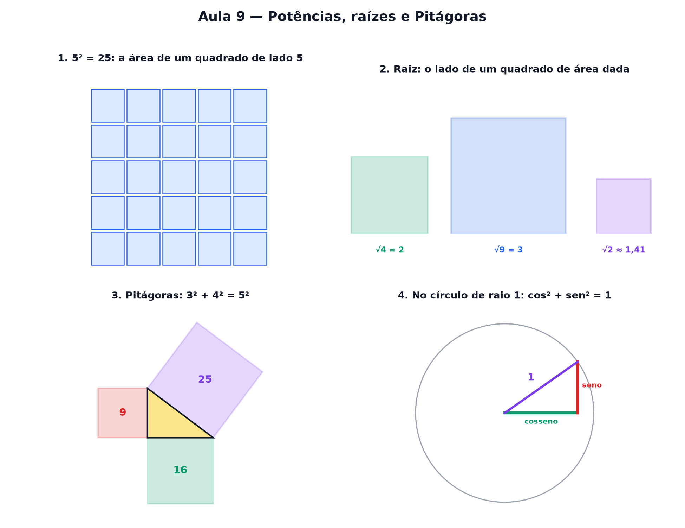

# Aula 9 — Potências, raízes e Pitágoras

> Estas são as notas em texto da aula. A versão interativa, com os laboratórios e os exercícios
> que se corrigem sozinhos, está em [`index.html`](index.html).

**Você já sabe:** multiplicar, o tamanho de uma seta (Aula 6) e a sombra e a altura de um ponto no
círculo (Aula 4). Hoje tudo isso ganha uma conta só.



---

## Ao quadrado é, literalmente, um quadrado

`5² = 5 · 5 = 25` — a área de um quadrado de lado 5. O número pequeno diz quantas vezes repetir a
multiplicação: `2³ = 2 · 2 · 2 = 8`. Isso é uma **potência**.

---

## A raiz: o caminho de volta

"Um quadrado tem área 36 — quanto mede o lado?" `√36 = 6`, porque `6 · 6 = 36`.

> ⚠️ Nem toda raiz é inteira: `√2` fica entre 1 e 2, perto de 1,41.

---

## Pitágoras: três quadrados num triângulo

Num triângulo com ângulo reto, desenhe um quadrado em cada lado:

> **A área do quadrado grande é a soma das áreas dos dois pequenos.**
> `3² + 4² = 9 + 16 = 25 = 5²`

---

## O tamanho de qualquer seta

A seta `(x, y)` é a hipotenusa de um triângulo retângulo:

```
tamanho = √(x² + y²)          (3, 4) → √25 = 5
```

---

## Reencontro com o círculo

No círculo de raio 1 da Aula 4, sombra e altura formam um triângulo retângulo de hipotenusa 1:

```
cosseno² + seno² = 1          (para qualquer ângulo)
```

---

## Quadrado nunca é negativo

`(−3)² = (−3) · (−3) = 9`. Por isso desvio padrão (Aula 10) e mínimos quadrados (Aula 11) elevam
diferenças ao quadrado: os negativos não cancelam os positivos.

---

## Pontos importantes

- **Potência:** `5² = 5 · 5`, `2³ = 2 · 2 · 2`.
- **Raiz quadrada:** `√36 = 6` — o lado do quadrado de área 36.
- Nem toda raiz é inteira: `√2 ≈ 1,41`.
- **Pitágoras:** `a² + b² = c²` no triângulo retângulo.
- Tamanho da seta `(x, y)` = `√(x² + y²)`.
- `cosseno² + seno² = 1`.
- Quadrado nunca é negativo.

---

## Exercícios

**1.** Quanto vale `4²`?

**2.** Quanto vale `√49`?

**3.** Lados do ângulo reto 6 e 8. Quanto mede a hipotenusa?

**4.** Quanto vale `(−3)²`?

**5.** Qual é o tamanho da seta `(5, 12)`?

**6.** O que dá para dizer sobre `√2`?

<details>
<summary>Respostas</summary>

1. **16**
2. **7**
3. **10** — √(36 + 64) = √100.
4. **9**
5. **13** — √(25 + 144) = √169.
6. **Não é inteira:** fica entre 1 e 2, perto de 1,41.

</details>

---

**Aula anterior:** [Sistemas de equações](../08-sistemas-de-equacoes/)
**Próxima aula:** [Estatística com vetores](../10-estatistica-com-vetores/)
