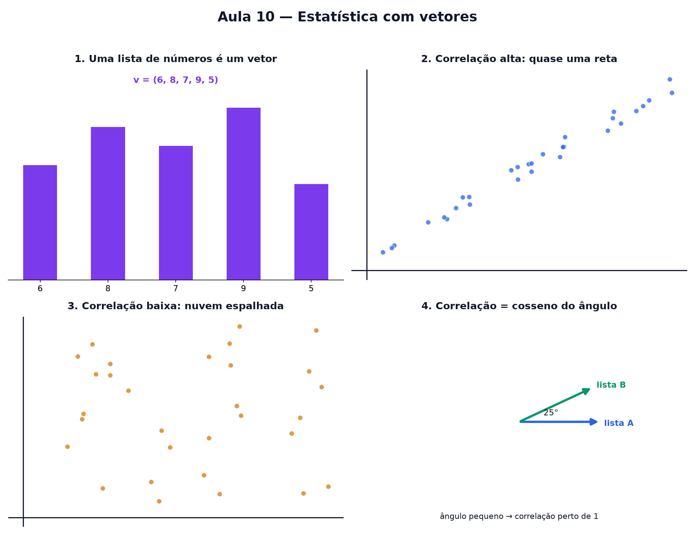

# Aula 10 — Estatística com vetores

> Estas são as notas em texto da aula. A versão interativa, com os laboratórios e os exercícios
> que se corrigem sozinhos, está em [`index.html`](index.html).

**Você já sabe:** vetor é uma seta e o produto escalar conta uma história sobre o ângulo entre
duas setas (Aula 6); quadrado e raiz quadrada vieram na Aula 9.



---

## Uma lista de números é um vetor

Uma lista de números pareados — por exemplo, a nota de 5 provas — pode ser vista como um vetor de
5 coordenadas. Não dá mais para desenhar a seta no papel, mas a ideia continua a mesma.

### A média e o desvio padrão

- **Média:** some tudo e divida pela quantidade. `(6, 8, 7, 9, 5)` → 35 ÷ 5 = **7**.
- **Centralizar:** subtrair a média de cada número. `(6, 8, 7, 9, 5)` → `(−1, 1, 0, 2, −2)`.
- **Desvio padrão:** eleve cada diferença ao quadrado, tire a média e depois a raiz:
  √((1 + 1 + 0 + 4 + 4) ÷ 5) = √2 ≈ 1,41. Lista espalhada → desvio grande.

---

> ⚠️ A média sozinha engana: `(7, 7, 7, 7, 7)` e `(3, 11, 5, 9, 7)` têm média 7, mas desvios 0 e
> ≈ 2,83. Sempre pergunte também pelo desvio.

---

## Duas listas, dois vetores, um ângulo

Se eu tenho duas listas relacionadas, cada lista vira um vetor. O **ângulo entre esses dois
vetores** conta o quanto elas "andam juntas".

> Vetores apontando quase para o mesmo lado → as listas sobem e descem juntas. Vetores apontando
> para lados opostos → quando uma sobe, a outra desce.

---

## Reencontro com o produto escalar

A correlação usa a mesma conta da Aula 6: primeiro cada lista é **centralizada** (subtrai-se a
média dela mesma), depois calcula-se o produto escalar entre elas, dividido pelos tamanhos das
duas setas.

```
correlação = cosseno do ângulo entre os vetores (depois de centralizar)
```

Por isso a correlação sempre vive entre **−1 e 1** — ela é, literalmente, um cosseno (Aula 4).

---

## Lendo o valor da correlação

- **perto de 1:** forte e positiva — quando uma sobe, a outra sobe junto.
- **perto de 0:** praticamente nenhuma relação linear.
- **perto de −1:** forte e negativa — quando uma sobe, a outra desce.

Correlação alta **não** prova que uma coisa causa a outra — só mostra que andam juntas.

---

## Pontos importantes

- Uma lista de números pareados vira um **vetor**.
- **Média** = soma ÷ quantidade. **Centralizar** = subtrair a média. **Desvio padrão** = tamanho
  típico das diferenças para a média.
- Duas listas relacionadas → dois vetores; o **ângulo** entre eles conta a história.
- **Correlação = cosseno do ângulo** entre os vetores centralizados.
- Vive sempre entre **−1 e 1** — porque é literalmente um cosseno.
- Perto de 1: andam juntas. Perto de 0: sem relação linear. Perto de −1: andam opostas.
- Correlação não é prova de causa — só mede o "andam juntas".

---

## Exercícios

**1.** A correlação entre duas listas é, na essência, o quê?

**2.** Qual é a média da lista `(4, 6, 8, 10, 12)`?

**3.** Duas listas têm correlação −1. Que ângulo isso representa entre os vetores?

**4.** Duas variáveis têm correlação alta. Isso prova que uma causa a outra?

**5.** O ângulo entre dois vetores de dados é 0°. Qual é a correlação?

**6.** Uma nuvem de pontos parece completamente espalhada. A correlação está perto de quê?

<details>
<summary>Respostas</summary>

1. **O cosseno do ângulo** entre os dois vetores (depois de centralizar).
2. **8** — (4 + 6 + 8 + 10 + 12) ÷ 5 = 40 ÷ 5.
3. **180°**.
4. **Não** — só mostra que andam juntas, não o motivo.
5. **1**.
6. Perto de **0**.

</details>

---

**Aula anterior:** [Potências, raízes e Pitágoras](../09-potencias-raizes-e-pitagoras/)
**Próxima aula:** [Projeção e mínimos quadrados](../11-projecao-e-minimos-quadrados/)
