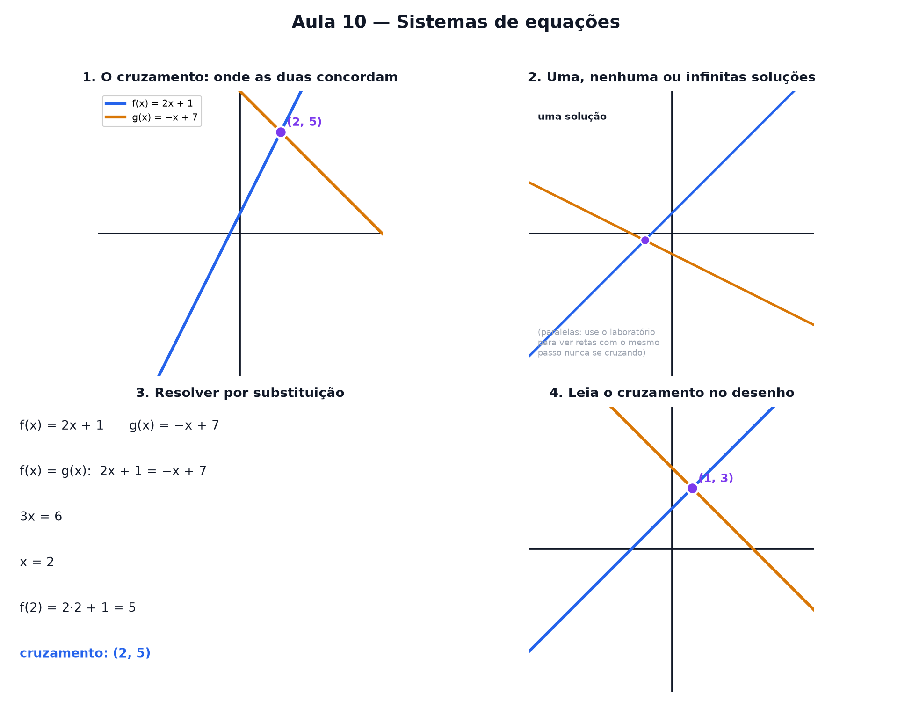

# Aula 10 — Sistemas de equações

> Estas são as notas em texto da aula. A versão interativa, com os laboratórios e os exercícios
> que se corrigem sozinhos, está em [`index.html`](index.html).

*Onde "resolver duas equações ao mesmo tempo" vira só achar onde duas retas se cruzam no papel.*

**Você já sabe:** toda reta cabe na receita `f(x) = passo · x + altura de partida` (Aula 9), e na
Aula 8 aprendeu a descobrir o x equilibrando a balança. É tudo o que esta aula precisa.

Você já sabe desenhar uma reta. Hoje a pergunta muda: e se tiver **duas** retas no mesmo papel?
Existe um lugar — às vezes — onde as duas concordam ao mesmo tempo.

> **🧠 Poder do cérebro**
>
> Um plano de celular cobra R$ 20 fixos mais R$ 1 por GB; outro cobra R$ 5 fixos mais R$ 2 por GB.
> Qual é mais barato?
>
> **Resposta:** Depende de quanto você usa: até 15 GB, o segundo; acima disso, o primeiro. Em 15 GB
> os dois custam R$ 35. Esse ponto de empate é onde as duas retas se cruzam — a solução do sistema.

---

## Duas retas, um papel só

Pegue duas receitas de reta, por exemplo `f(x) = 2 · x + 1` e `g(x) = −1 · x + 7`. Desenhe as duas
no mesmo papel quadriculado.

Na maioria dos lugares elas discordam: uma diz um valor, a outra diz outro. Mas existe (quase
sempre) **um ponto** onde as duas retas se cruzam — e ali, as duas receitas dão exatamente a mesma
resposta.

> 🔧 **Laboratório — duas retas buscando o cruzamento.** Ajuste as duas retas e observe o ponto onde
> elas se encontram. *(interativo, na versão em HTML)*

---

## O que significa "resolver"

"Resolver o sistema" quer dizer só uma coisa: **achar o único ponto (x, y) que serve para as duas
receitas ao mesmo tempo**. Nada mais místico que isso — é o cruzamento que você acabou de ver no
laboratório.

Resolver um sistema = achar onde as retas se encontram. Um sistema de duas equações, duas
incógnitas.

---

## Nem sempre existe um só cruzamento

Três coisas podem acontecer quando você desenha duas retas juntas:

- **Uma solução:** as retas têm passos diferentes — elas se cruzam num único ponto.
- **Nenhuma solução:** as retas têm o **mesmo passo** mas alturas diferentes — são paralelas, nunca
  se tocam.
- **Infinitas soluções:** as duas retas são, na real, **a mesma reta** — coincidem em todo lugar.

> **⚠️ Cuidado — mesmo passo não é sempre "sem solução"**
>
> Se o passo é igual **e** a altura também é igual, as retas não são paralelas — são a **mesma
> reta**, desenhada duas vezes. Aí qualquer ponto dela serve, e existem infinitas soluções.

> 🔧 **Laboratório — retas paralelas nunca se tocam.** As duas retas têm o mesmo passo (fixo em 2).
> Mexa só na altura da reta B e repare: por mais que você arraste, elas nunca se cruzam.
> *(interativo, na versão em HTML)*

> 🔧 **Laboratório — classifique o sistema.** Antes de revelar, adivinhe: única solução, nenhuma ou
> infinitas? *(interativo, na versão em HTML)*

> 🧘 **O Guru:** Um sistema não são duas contas separadas: é uma pergunta só — onde as duas regras
> concordam? Desenhe as duas retas antes de fazer qualquer conta. O desenho já avisa se a resposta é
> um ponto, nenhum ou infinitos; a conta só confirma.

---

## Resolver por substituição

Já sabemos que o cruzamento é o ponto onde `f(x) = g(x)`. A ideia da substituição é **juntar as duas
receitas numa só equação**, resolver para `x` com a balança da Aula 8, e depois usar qualquer uma
das receitas para achar `y`.

> 🔧 **Laboratório — resolva o sistema, passo a passo.** Duas retas se cruzam. Ache o ponto de
> cruzamento fazendo cada passo — o laboratório confere e desenha. *(interativo, na versão em HTML)*

### Não existe pergunta idiota

**P:** E se eu tiver três retas ao mesmo tempo?

**R:** O mesmo truque funciona: você resolve duas de cada vez. Com três variáveis em vez de duas, o
"papel" vira um espaço tridimensional, e cada equação passa a ser um plano em vez de uma reta — mas
a pergunta continua sendo a mesma: onde todos concordam ao mesmo tempo?

**P:** Por que "sistema"?

**R:** Porque as equações precisam ser resolvidas **juntas**, como um conjunto — a resposta de uma
depende da outra. Resolver cada equação sozinha, sem olhar a outra, não resolve o sistema.

---

## Leia o cruzamento no desenho

Com o desenho pronto, achar a solução às vezes é só **olhar** — sem fazer conta nenhuma.

> 🔧 **Laboratório — ache o cruzamento no desenho.** Duas retas fixas aparecem no papel. Leia onde
> elas se cruzam. *(interativo, na versão em HTML)*

---

## Monte o sistema para um alvo

Agora ao contrário: um ponto-alvo aparece no papel. Ajuste a reta A para que ela passe exatamente
por ele (a reta B já passa lá).

> 🔧 **Laboratório — monte o sistema para um alvo.** *(interativo, na versão em HTML)*

---

## Pontos importantes

- Resolver um sistema = achar o **único ponto** que serve para as duas retas ao mesmo tempo.
- **Passos diferentes** → uma solução (um cruzamento).
- **Mesmo passo, alturas diferentes** → nenhuma solução (retas paralelas).
- **Mesmo passo e mesma altura** → infinitas soluções (é a mesma reta).
- **Substituição:** junta as duas receitas numa só equação, resolve para x, depois acha y.
- O mesmo raciocínio se estende para mais retas (ou planos, com três variáveis).

---

## ✏️ Afie o lápis

1. "Resolver um sistema de duas retas" significa: → **Achar o único ponto que serve para as duas
   receitas ao mesmo tempo.**
2. Duas retas têm o **mesmo passo** e alturas **diferentes**. Quantas soluções tem o sistema? →
   **0**
3. Resolva o sistema `f(x) = x + 1` e `g(x) = 3 · x − 3` — em que `x` elas se cruzam? → **2**
4. *(quem faz o quê?)* Ligue cada situação de duas retas ao que ela diz sobre o sistema. →
   **retas que se cruzam → exatamente uma solução; retas paralelas → nenhuma solução; a mesma reta
   duas vezes → infinitas soluções; resolver o sistema → achar o ponto que está nas duas retas**
5. *(o desafio)* Resolva o sistema `f(x) = 2 · x` e `g(x) = x + 4` — qual é o valor de `y` no
   cruzamento? → **8**
6. *(leia o desenho)* Olhe as duas retas abaixo e leia onde elas se cruzam. x = y = → **1 · 3**
