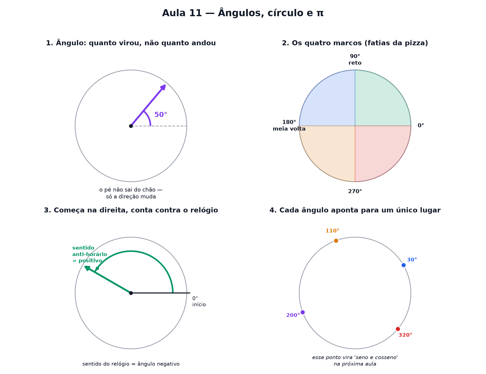

# Aula 11 — Ângulos, círculo e π

> Estas são as notas em texto da aula. A versão interativa, com os laboratórios e os exercícios
> que se corrigem sozinhos, está em [`index.html`](index.html).

*Onde você descobre que girar não é a mesma coisa que andar, que a volta inteira vale 360, e onde um
ponto para depois de girar tanto.*

**Você já sabe:** todo ponto do plano tem um endereço de dois números, e a reta numerada tem
negativos (Aulas 2 e 9). Hoje, em vez de andar, a gente gira.

Até aqui você só andou em linha reta: para os lados, para cima, para baixo. Hoje entra um jeito novo
de se mover — **girar** — e ele precisa de uma unidade toda própria.

> **🧠 Poder do cérebro**
>
> Uma pizza tem 30 cm de diâmetro. Quantos centímetros de borda ela tem, mais ou menos? Chute antes
> de continuar.
>
> **Resposta:** Um pouco mais de 3 diâmetros: cerca de 94 cm. Todo círculo, de qualquer tamanho, tem
> a volta medindo π ≈ 3,14 diâmetros. É um dos números mais famosos da matemática, e você vai
> medi-lo hoje.

---

## Girar não é andar

Ande 3 passos para a direita e você mediu uma **distância**: 3 metros, 3 quadradinhos, 3
alguma-coisa.

Agora gire no próprio lugar, como um pião. Você não andou nenhum metro — o seu pé nem saiu do chão.
O que aconteceu foi diferente: você **virou** um tanto.

**Ângulo é isso: quanto alguma coisa virou.** Não é distância, é giro. E giro se mede em **graus**.

> 🔧 **Laboratório — o ponteiro que gira.** Arraste o controle e observe o ponteiro girar em torno do
> centro. O número mostra **quanto ele virou**, não o quanto ele andou. *(interativo, na versão em
> HTML)*

> 🧘 **O Guru:** Pense numa porta abrindo. O que importa não é quantos centímetros a maçaneta andou —
> uma porta grande e uma porta pequena podem abrir "a mesma quantidade". O que importa é o quanto
> ela girou no gonzo. Ângulo é exatamente essa ideia.

---

## A volta completa vale 360

Gire até voltar exatamente para onde começou — uma volta inteira, o pião completando um giro
completo. Esse giro tem um tamanho combinado há milhares de anos: **360 graus**, escrito `360°`.

Por que 360 e não 100, ou 10? Não tem nenhum motivo profundo — é só um número que sobrou da
matemática babilônica antiga, e que pegou porque é **fácil de dividir**: por 2, por 3, por 4, por 5,
por 6, por 8, por 9, por 10, por 12... Poucos números quebram em tantos pedaços exatos assim.

> **⚠️ Cuidado — o tamanho do círculo não importa**
>
> Um ponteiro de relógio pequeno e um ponteiro de guindaste gigante, girando a mesma "quantidade de
> giro", têm o **mesmo ângulo** — mesmo que a ponta do ponteiro grande tenha percorrido uma
> distância enorme a mais. Ângulo não mede o tamanho do raio nem a distância percorrida na borda.
> Mede só o giro.

> 🔧 **Laboratório — o relógio de ângulos.** Um relógio também gira — só que no sentido contrário do
> que combinamos. Clique numa hora e veja a que ângulo ela corresponde. *(interativo, na versão em
> HTML)*

---

## Os quatro marcos

Antes de qualquer conta, vale guardar de olho quatro giros que aparecem toda hora. Pense numa pizza
redonda cortada ao meio, depois ao meio de novo:

| giro | fração da volta | graus | apelido |
|---|---|---|---|
| nenhum | 0 | 0° | ponto de partida |
| um quarto | 1/4 | 90° | **ângulo reto** |
| metade | 1/2 | 180° | **meia volta** |
| três quartos | 3/4 | 270° | três quartos de volta |
| tudo | 4/4 | 360° | **volta completa** |

O **ângulo reto** (90°) é o giro mais importante de todos — é o giro de um canto de folha de papel,
de uma esquina bem quadrada, do encontro das duas réguas da Aula 9.

Use os botões do laboratório lá em cima para pular direto para cada um desses marcos e sentir o
giro.

---

## De onde começa e para que lado conta

Para o número do ângulo significar sempre a mesma coisa, todo mundo combina duas regras:

- **Começa apontando para a direita** — a mesma direção do "1º número" da Aula 9, o eixo horizontal.
- **Conta girando no sentido anti-horário** — o contrário do ponteiro do relógio.

É exatamente o que o laboratório do ponteiro faz lá em cima: 0° aponta para a direita, e o ângulo
cresce girando para cima e para a esquerda, contra o relógio.

### Não existe pergunta idiota

**P:** E se eu girar para o outro lado, no sentido do relógio?

**R:** Isso também tem nome: **ângulo negativo**. Girar 90° no sentido do relógio é o mesmo que
dizer `−90°`. Você já viu essa ideia de "sinal de menos = outro sentido" na reta numerada da Aula 9
— aqui é igualzinho, só que girando em vez de andando.

**P:** Dá pra girar mais que 360°?

**R:** Dá sim — é só continuar girando depois de completar a volta. `450°` é uma volta inteira
(360°) mais 90°, então o ponteiro para exatamente no mesmo lugar que o 90° sozinho. Ele deu uma
volta a mais, só isso.

**P:** Por que começar da direita e não de cima?

**R:** É só uma combinação — poderia ser outra. Mas começar da direita e girar contra o relógio é o
padrão que praticamente todo livro e toda calculadora usa, então vale a pena se acostumar com ele
desde já.

> 🔧 **Laboratório — ângulos negativos e voltas extras.** Arraste além de 360° ou abaixo de 0° e veja
> o ponteiro cair sempre no mesmo lugar de um ângulo "normal". *(interativo, na versão em HTML)*

> 🔧 **Laboratório — o transferidor interativo.** Arraste o ponto azul pela borda do círculo (ou
> clique em qualquer lugar dele) para escolher um ângulo à mão livre. As marcas mostram de 15 em 15
> graus. *(interativo, na versão em HTML)*

---

## Onde o ponto para

Repare em algo importante nos dois laboratórios: para **cada** ângulo, o ponto na borda do círculo
para **sempre no mesmo lugar** — nunca muda de posição sozinho. 45° é sempre aquele ponto
específico, nem mais para lá nem para cá.

Isso quer dizer que um ângulo não é só "um giro solto" — ele também é um **endereço na borda do
círculo**, do mesmíssimo jeito que `(3, 5)` era um endereço no papel quadriculado.

Essa é a ponte para a trigonometria (Aula 15): aquele ponto parado tem uma posição — o quanto ele
"andou para o lado" e o quanto ele "subiu" — e são exatamente esses dois números que ganham nome
próprio na Aula 15: **cosseno** e **seno**.

---

## O comprimento da volta: nasce o π

Quanto mede a borda de um círculo? Enrole um barbante em volta de uma lata, desenrole e compare com
o **diâmetro** (a largura da lata, que é 2 raios). Dá sempre um pouco mais de 3 diâmetros — em
qualquer lata, roda ou planeta. Esse "um pouco mais de 3" é o número **π** (pi):

`comprimento da volta = π · diâmetro = 2 · π · raio (π ≈ 3,14159...)`

> 🔧 **Laboratório — desenrole o círculo.** Escolha o raio e desenrole a borda sobre uma régua medida
> em diâmetros. *(interativo, na versão em HTML)*

---

## A área do círculo: gomos que viram retângulo

Corte o círculo em muitos gomos, como uma pizza, e arrume os gomos alternando ponta para cima e
ponta para baixo. Quanto mais gomos, mais o desenho parece um **retângulo**: altura = raio, base =
meia volta = `π · raio`.

`área do círculo = π · raio · raio = π · raio²`

> 🔧 **Laboratório — os gomos viram retângulo.** Aumente o número de gomos e veja o quase-retângulo
> endireitar. *(interativo, na versão em HTML)*

**✅ Por que é verdade?**

1. Os gomos não perdem nem ganham área ao serem rearrumados.
2. Metade dos gomos fica com a ponta para cima e metade para baixo; a borda de cima e a de baixo
   somam a volta inteira, `2 · π · raio`. Então cada uma mede `π · raio`.
3. A altura de cada gomo é o raio.
4. Com gomos cada vez mais finos, a figura vira um retângulo de verdade: base `π · raio`, altura
   `raio`. Área: `π · raio²`.

---

## Pontos importantes

- **Ângulo é quanto algo virou** — não é uma distância, é um giro.
- Giro se mede em **graus**. Uma volta completa vale **360°**.
- Quatro marcos para guardar: `90° (ângulo reto)`, `180° (meia volta)`, `270°` e `360° (volta
  completa)`.
- O tamanho do círculo **não** muda o ângulo — só a distância que a ponta percorre.
- Combinação padrão: **começa apontando para a direita** e **conta girando contra o relógio**
  (anti-horário).
- Girar no sentido do relógio dá um ângulo **negativo**. Passar de 360° dá voltas extras, mas o
  ponto cai no mesmo lugar.
- Cada ângulo aponta para **um único lugar** na borda do círculo — a base da trigonometria (Aula
  15).
- Comprimento da volta: `2 · π · raio`, com **π ≈ 3,14**. Área do círculo: `π · raio²`.

---

## ✏️ Afie o lápis

1. O que um ângulo realmente mede? → **O quanto alguma coisa virou.**
2. Quantos graus tem uma volta completa? → **360**
3. Um ângulo reto — o giro de uma esquina bem quadrada — vale quantos graus? → **90**
4. *(quem faz o quê?)* Ligue cada peça ao que ela mede. → **1 grau → 1/360 de uma volta; ângulo
   reto → um quarto de volta: 90°; π → quantas vezes o diâmetro cabe na volta do círculo; área do
   círculo → π · raio²**
5. *(o desafio)* Um ponteiro deu três quartos de uma volta completa. Quantos graus ele girou? →
   **270**
6. *(leia o desenho)* O ponteiro abaixo começou apontando para a direita e girou até aqui.
   Quantos graus ele girou? → **90**
