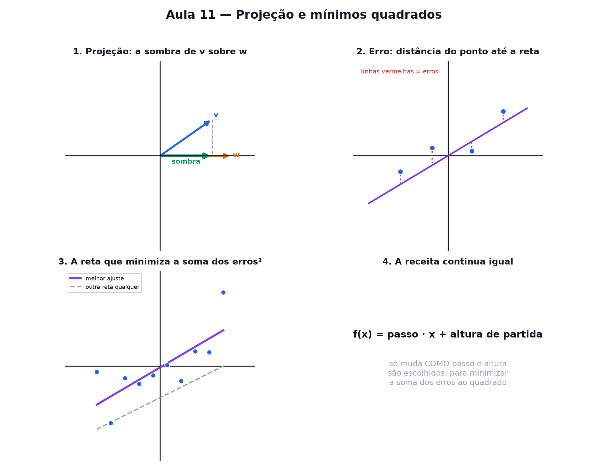

# Aula 11 — Projeção e mínimos quadrados

> Estas são as notas em texto da aula. A versão interativa, com os laboratórios e os exercícios
> que se corrigem sozinhos, está em [`index.html`](index.html).

**No nível 1:** projetar é jogar sombra (Aula 4) — o cosseno já era essa ideia, aplicada a um
círculo.

---

## Projetar é jogar sombra

Cosseno e seno eram a sombra de um ponto girando (Aula 4). **Projetar** é a mesma ideia aplicada a
um vetor sobre outro: o pedacinho de uma seta que "cabe" na direção da outra.

---

## Nem tudo cabe numa reta perfeita

Pontos de dados reais raramente caem exatamente sobre uma reta. Sempre sobra um pouco de **erro**:
a distância entre o ponto real e a reta.

> ⚠️ **Erro não é o mesmo que "reta errada".** Nenhuma reta passa exatamente por todos os pontos, a
> menos que já estejam alinhados. O objetivo não é zerar o erro — é minimizá-lo.

---

## Mínimos quadrados

Para cada ponto, mede-se o erro (distância vertical até a reta), eleva-se ao quadrado, e soma-se
tudo. A "melhor" reta é a que deixa essa soma a menor possível.

> Elevar ao quadrado evita que erros positivos e negativos se cancelem — e pesa mais os erros
> grandes, então a reta tenta evitá-los.

---

## A receita continua a mesma

A reta de regressão ainda cabe em `f(x) = passo · x + altura de partida` (Aula 2). O que muda é
**como** passo e altura são escolhidos: para minimizar o erro total, não à mão.

---

## Pontos importantes

- **Projetar** é jogar sombra de um vetor sobre outro — a mesma ideia do cosseno (Aula 4).
- Pontos de dados raramente caem numa reta perfeita — sempre sobra um **erro**.
- **Mínimos quadrados:** a reta que deixa a soma dos erros ao quadrado a menor possível.
- Elevar ao quadrado evita que erros positivos e negativos se cancelem.
- A reta de regressão ainda é `f(x) = passo · x + altura de partida` — só escolhida para minimizar
  o erro.

---

## Exercícios

**1.** Projetar um vetor sobre outro é a mesma ideia de qual laboratório da Aula 4?

**2.** Por que quase nenhum conjunto real de pontos cai perfeitamente numa reta?

**3.** Mínimos quadrados escolhe a reta que minimiza o quê?

**4.** Por que elevar os erros ao quadrado, em vez de simplesmente somá-los?

**5.** A reta de regressão tem passo 2 e altura de partida 3. Quanto vale f(4)?

**6.** Um ponto está exatamente sobre a reta de regressão. Qual é o erro dele?

Respostas

1. O da **sombra e altura** (cosseno e seno).
2. Porque **dados reais têm variação** — sempre sobra um erro.
3. **A soma dos erros ao quadrado.**
4. **Para que erros positivos e negativos não se cancelem.**
5. **f(4) = 11** — 2 · 4 + 3.
6. **0** — sem distância, sem erro.

---

**Aula anterior:** [Estatística com vetores](../10-estatistica-com-vetores/)

**Próxima aula:** [Decomposição de sinais em ondas](../12-decomposicao-de-sinais-em-ondas/)
