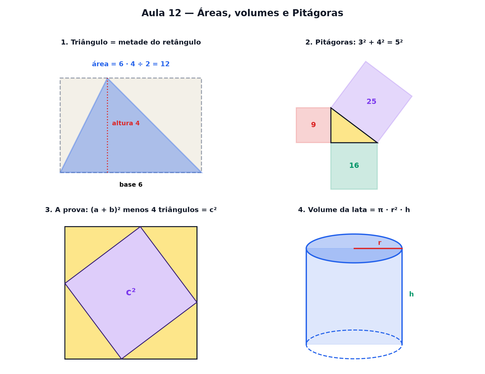

# Aula 12 — Áreas, volumes e Pitágoras

> Estas são as notas em texto da aula. A versão interativa, com os laboratórios e os exercícios
> que se corrigem sozinhos, está em [`index.html`](index.html).

*Toda figura é um retângulo arrumado, todo prisma é uma pilha de bases — e três quadrados guardam o
segredo do triângulo retângulo.*

**Você já sabe:** área do quadrado e volume do cubo (Aula 4), o ângulo reto de 90° e a área do
círculo (Aula 11), e abrir parênteses (Aula 8). Hoje as fórmulas de figura param de ser decoreba.

Na escola, cada figura vem com sua fórmula: triângulo, trapézio, paralelogramo, cilindro... Parece
uma lista para decorar. Não é. Quase todas saem de uma ideia só: **área de retângulo é base vezes
altura**. O resto é cortar e arrumar.

> **🧠 Poder do cérebro**
>
> Um triângulo tem base 6 e altura 4. Sem fórmula nenhuma: desenhe um retângulo 6 × 4 em volta dele.
> Que fração do retângulo o triângulo ocupa?
>
> **Resposta:** Exatamente metade. A altura corta o retângulo em dois retângulos menores, e o
> triângulo pega metade de cada um. Área: 6 × 4 ÷ 2 = 12. Veja no primeiro laboratório.

---

## O triângulo é meio retângulo

Ponha um triângulo dentro do retângulo de mesma base e altura. A linha da altura corta o retângulo
em dois pedaços, e o triângulo ocupa **metade de cada pedaço**. Não importa onde fica o bico de
cima:

`área do triângulo = base · altura ÷ 2`

> 🔧 **Laboratório — o triângulo é meio retângulo.** Mude a base, a altura e a posição do bico de
> cima. A área não muda com o bico. *(interativo, na versão em HTML)*

---

## Paralelogramo e trapézio: cortar e arrumar

O **paralelogramo** (um retângulo "tombado") vira retângulo cortando um triângulo de um lado e
colando do outro: área = base · altura. O **trapézio** é a média de duas bases: dois trapézios
iguais, um de cabeça para baixo, formam um paralelogramo — então a área é `(base maior + base menor)
· altura ÷ 2`.

> 🔧 **Laboratório — o paralelogramo que vira retângulo.** Deslize o corte: o triângulo da esquerda
> viaja para a direita e a figura vira retângulo. *(interativo, na versão em HTML)*

> **⚠️ Cuidado — perímetro não é área (e cm não é cm²)**
>
> Um retângulo 1 × 11 e um quadrado 6 × 6 usam a mesma cerca (perímetro 24), mas um tem área 11 e o
> outro 36. Perímetro mede a **volta** (em cm); área mede o **que cabe dentro** (em cm²,
> quadradinhos); volume mede o que cabe num sólido (em cm³, cubinhos). Misturar as três é o erro
> mais comum de geometria.

---

## Pitágoras: três quadrados num triângulo

Pegue um triângulo com um **ângulo reto** (Aula 11). Os dois lados que formam o canto reto se chamam
**catetos**; o lado oposto, o maior, é a **hipotenusa**. Desenhe um quadrado em cada lado. Agora o
fato que atravessou 2.500 anos:

**A área do quadrado grande é a soma das áreas dos dois pequenos.**
Com catetos 3 e 4: 9 + 16 = 25 = 5². A hipotenusa mede √25 = 5 (Aula 4).

> 🔧 **Laboratório — Pitágoras com quadrados.** Mude os dois catetos e confira a soma das áreas.
> *(interativo, na versão em HTML)*

---

## Por que Pitágoras é verdade

Contar quadradinhos convence, mas não prova — e se um dia desse errado? Existe uma demonstração que
cabe num desenho: quatro cópias do mesmo triângulo dentro de um quadrado de lado `a + b`.

> 🔧 **Laboratório — a prova dos quatro triângulos.** Arraste o slider: os mesmos quatro triângulos
> mudam de lugar dentro do mesmo quadrado. Olhe para o espaço vazio. *(interativo, na versão em
> HTML)*

**✅ Por que é verdade?**

1. O quadrado grande tem lado `a + b` nos dois arranjos: a área total é a mesma.
2. Os quatro triângulos também são os mesmos: ocupam a mesma área nos dois arranjos.
3. Então o espaço vazio tem a mesma área nos dois arranjos.
4. No primeiro, o vazio é um quadrado inclinado de lado c: área `c²`. No segundo, são dois
   quadrados, de lados a e b: área `a² + b²`.
5. Logo, `a² + b² = c²` — para **qualquer** triângulo retângulo, sem contar um quadradinho sequer.

> 🧘 **O Guru:** Pitágoras não inventou uma fórmula — ele notou um fato sobre quadrados em volta de
> um canto reto, e alguém depois mostrou por que ele sempre vale. Contar convence você; demonstrar
> convence qualquer um. As duas coisas têm seu lugar.

---

## Volume: empilhar a base

Um **prisma** (caixa, barra de chocolate, prédio) é a mesma figura empilhada em camadas. Então o
volume é a área de uma camada vezes quantas camadas: **volume = área da base · altura**. Para uma
caixa, `comprimento · largura · altura` — o cubo da Aula 4 é o caso em que as três medidas são
iguais.

> 🔧 **Laboratório — empilhe a base.** Monte a base e empilhe camadas. Conte os cubinhos.
> *(interativo, na versão em HTML)*

---

## A lata de refrigerante: o cilindro

O **cilindro** também é uma pilha: moedas empilhadas. A base é um círculo, de área `π · raio²` (Aula
11). Então:

`volume do cilindro = π · raio² · altura`

E um detalhe muito útil: **1 cm³ = 1 mL**, então 1.000 cm³ = 1 litro.

> 🔧 **Laboratório — a lata de refrigerante.** Mude o raio e a altura da lata. Quanto refrigerante
> cabe? *(interativo, na versão em HTML)*

### Não existe pergunta idiota

**P:** Pitágoras vale para qualquer triângulo?

**R:** Só para os que têm um **ângulo reto**. Na prova dos quatro triângulos, o canto reto é o que
faz o buraco do meio ser um quadrado. Num triângulo "torto", os dois quadrados menores não somam o
grande.

**P:** E a esfera? Não é uma pilha de nada.

**R:** É uma pilha de círculos de tamanhos diferentes — e somar essas fatias é trabalho para a
integral (Aula 20). O resultado, que Arquimedes achou sem cálculo, é `4/3 · π · raio³`.

---

## Pontos importantes

- Triângulo = metade do retângulo: `base · altura ÷ 2`.
- Paralelogramo vira retângulo (`base · altura`); trapézio: `(B + b) · h ÷ 2`.
- **Pitágoras**: no triângulo retângulo, `a² + b² = c²` — provado pelos quatro triângulos.
- Volume de prisma = área da base · altura; cilindro = `π · raio² · altura`.
- Perímetro (cm), área (cm²) e volume (cm³) medem coisas diferentes. 1 cm³ = 1 mL.

---

## ✏️ Afie o lápis

1. Qual é a área de um triângulo de base 6 e altura 4? → **12**
2. Um triângulo retângulo tem catetos 6 e 8. Quanto mede a hipotenusa? → **10**
3. Qual é o volume (em cm³) de uma caixa de 2 cm × 3 cm × 4 cm? → **24**
4. Qual é, aproximadamente, a área de um círculo de raio 3? → **≈ 28,3 (π · 3²)**
5. *(o desafio)* Uma escada de 5 m está encostada numa parede, com o pé a 3 m da parede. A que
   altura (em m) ela toca a parede? → **4**
6. *(quem faz o quê?)* Ligue cada figura à conta da sua medida. → **área do triângulo → base ·
   altura ÷ 2; área do círculo → π · raio²; volume do cilindro → área da base · altura; triângulo
   retângulo → a² + b² = c²**
