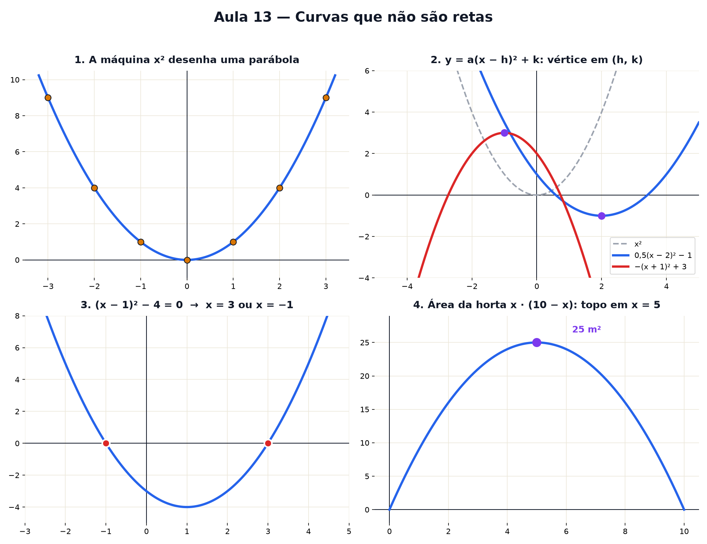

# Aula 13 — Curvas que não são retas

> Estas são as notas em texto da aula. A versão interativa, com os laboratórios e os exercícios
> que se corrigem sozinhos, está em [`index.html`](index.html).

*Parábolas e polinômios: a máquina da Aula 7 com um quadrado dentro — e, de repente, o gráfico
dobra.*

**Você já sabe:** máquinas e gráficos (Aula 7), a balança e abrir parênteses (Aula 8), a receita da
reta e o passo da escada (Aula 9), a média (Aula 5) e o quadrado que nunca é negativo (Aula 4). Hoje
tudo isso se junta numa curva.

Até aqui, toda máquina que você desenhou virou uma **reta**. Não é coincidência: as receitas só
somavam e multiplicavam por números fixos. Basta a máquina multiplicar o `x` **por ele mesmo** para
o desenho dobrar. Essa dobra é o começo de tudo o que vem no Nível 3.

> **🧠 Poder do cérebro**
>
> Você chuta uma bola para o alto. Imagine o caminho dela no ar. É uma reta? O que acontece no ponto
> mais alto?
>
> **Resposta:** É uma curva que sobe, faz a volta e desce: uma parábola. No ponto mais alto, o
> vértice, a bola para de subir e começa a cair. Achar esse ponto é achar o "melhor valor".

---

## A máquina que dobra

A máquina `f(x) = x²` recebe um número e devolve o quadrado dele (Aula 4). Teste alguns: `f(1) = 1`,
`f(2) = 4`, `f(3) = 9`. A saída não sobe no mesmo passo — cada passo é maior que o anterior. E do
lado negativo, `f(−2) = 4` também: o sinal some.

Marque todos esses pontos no papel (Aula 7) e aparece uma curva em forma de **U**, simétrica: a
**parábola**.

> 🔧 **Laboratório — a máquina que dobra.** Mova o x. Cada teste deixa um ponto marcado; o botão
> mostra a curva inteira. *(interativo, na versão em HTML)*

---

## As mesmas transformações de sempre

Na Aula 9, o número que multiplica deixava a reta mais inclinada e o número solto a levantava. A
parábola tem esses botões e ganha um terceiro — deslocar para o lado:

`y = a · (x − h)² + k`

- **a** estica (e, se for negativo, vira de cabeça para baixo);
- **h** desloca para o lado — atenção ao sinal: `(x − 2)` anda para a *direita* (o mesmo "atraso"
  vai aparecer nas ondas da Aula 16);
- **k** levanta ou abaixa — o "somar na saída" das Aulas 7 e 9.

O ponto da dobra fica em `(h, k)`. Ele se chama **vértice**.

> 🔧 **Laboratório — três sliders da parábola.** Mexa em cada botão sozinho e repare no que acontece
> com o vértice (o ponto roxo). *(interativo, na versão em HTML)*

> **⚠️ Cuidado — x² não é 2x**
>
> `x²` é `x · x`; `2x` é `x + x`. Com x = 3: `3² = 9`, mas `2 · 3 = 6`. Um desenha curva, o outro
> desenha reta. Eles só coincidem em x = 0 e x = 2.

---

## Onde a parábola cruza o zero

Os pontos onde a curva encosta no eixo deitado são os x que fazem `y = 0`. Descobrir esses x é
resolver uma **equação do 2º grau** — e a balança da Aula 8 resolve, com um detalhe novo no final:

`(x − 1)² − 4 = 0`
some 4 dos dois lados: `(x − 1)² = 4`
que número ao quadrado dá 4? **2 ou −2!**
`x − 1 = 2` → x = 3 · `x − 1 = −2` → x = −1

O detalhe é esse: a raiz tem **dois lados**. Como `(−2)² = 4` também (Aula 4), a volta do quadrado
aceita o positivo e o negativo — por isso a parábola costuma cruzar o zero em dois lugares.

> 🔧 **Laboratório — ache onde ela cruza o zero.** A parábola é `y = (x − h)² − c`. Mude h e c e
> acompanhe a balança resolvendo. *(interativo, na versão em HTML)*

Para arrumar uma equação dessas vale abrir parênteses (Aula 8): `(x − 1)² = (x − 1) · (x − 1) = x² −
2x + 1` — cada pedaço vezes cada pedaço, e menos vezes menos dá mais (Aula 2).

### Não existe pergunta idiota

**P:** E quando a equação não vem arrumada, tipo x² − 2x − 3 = 0?

**R:** Dá para arrumar sempre: `x² − 2x − 3` é o mesmo que `(x − 1)² − 4` (abra os parênteses como
na Aula 8: `(x − 1)² = x² − 2x + 1`, e `x² − 2x + 1 − 4 = x² − 2x − 3`). Existe uma receita pronta
que faz essa arrumação por você — a famosa fórmula de Bhaskara — mas ela é só esse "arrumar e passar
para o outro lado da balança", feito uma vez para todos os casos.

**P:** Uma parábola pode não cruzar o zero nenhuma vez?

**R:** Pode. `(x − 1)² + 2` nunca vale zero: o quadrado é no mínimo 0, então a soma é no mínimo 2.
Na balança aparece `(x − 1)² = −2` — e nenhum número ao quadrado dá negativo. Guarde esse "nenhum":
a Aula 18 vai inventar um número que dá.

---

## O ponto mais alto: o vértice como "melhor valor"

Você tem **20 metros de cerca** para cercar uma horta retangular. Se um lado mede x, o outro mede
`10 − x` (a volta toda é 20). A área é:

`área = x · (10 − x) = 10x − x²`

Isso é uma parábola de cabeça para baixo: cruza o zero em x = 0 e x = 10 (horta sem largura) e tem
um **topo** exatamente no meio dos dois — na média, como na Aula 5. O topo é o melhor valor
possível.

> 🔧 **Laboratório — caça ao vértice.** Mude o lado x e tente bater o recorde de área. *(interativo,
> na versão em HTML)*

> 🧘 **O Guru:** Uma curva não é um assunto novo — é a mesma máquina de sempre, só que agora ela
> multiplica o x por ele mesmo. Tudo o que você sabia sobre retas continua valendo: esticar,
> deslocar, resolver na balança. A dobra só pede um cuidado a mais: a raiz tem dois lados.

---

## Polinômios: somar potências

E se a máquina somar várias potências de x, cada uma com seu peso? Isso é um **polinômio**:

`y = d + c·x + b·x² + a·x³`

A maior potência que aparece se chama **grau**. Grau 1 é a reta da Aula 9. Grau 2 é a parábola, com
uma dobra. Grau 3 pode ter até duas dobras — e assim por diante: **cada grau a mais permite uma
dobra a mais**.

> 🔧 **Laboratório — somador de potências.** Ligue e desligue cada potência. Conte as dobras.
> *(interativo, na versão em HTML)*

---

## Reta ou curva? O teste das diferenças

Dá para saber se uma tabela de números vem de uma reta sem desenhar nada. Na Aula 9, a reta tinha
**o mesmo passo da escada** sempre: as diferenças entre saídas vizinhas são iguais. Na parábola, as
diferenças mudam — mas as **diferenças das diferenças** ficam iguais.

> 🔧 **Laboratório — reta ou curva?** Troque de máquina e olhe as duas linhas de diferenças.
> *(interativo, na versão em HTML)*

---

## Pontos importantes

- `x²` dentro da máquina faz o gráfico dobrar: a **parábola**.
- `y = a(x − h)² + k`: a estica/vira, h desloca, k levanta. O **vértice** fica em `(h, k)`.
- Cruzar o zero = resolver a equação na balança; a raiz tem dois lados: `(x − 1)² = 4` dá x = 3
  **ou** x = −1.
- Se sobrar "quadrado = negativo", a parábola não cruza o zero.
- O vértice é o **melhor valor** (maior área, menor custo) e fica no meio dos dois zeros.
- Abrir parênteses: cada pedaço vezes cada pedaço — `(x + 2)(x + 3) = x² + 5x + 6`.
- **Polinômio** = soma de potências; cada grau a mais permite uma dobra a mais.
- Reta: diferenças iguais. Parábola: diferenças das diferenças iguais.

---

## ✏️ Afie o lápis

1. A máquina é `f(x) = x² − 1`. Quanto vale `f(3)`? → **8**
2. Onde fica o vértice de `y = (x − 2)² + 1`? → **(2, 1)**
3. Resolva `(x − 1)² = 9`. Qual é a **maior** das duas soluções? → **4**
4. *(quem faz o quê?)* Ligue cada receita ao que ela faz com a parábola y = x². → **o vértice → o
   ponto de virada da parábola; y = (x − 2)² → anda 2 para a direita; y = x² + 3 → sobe 3; y = −x² →
   vira de boca para baixo**
5. *(o desafio)* Com **12 metros de cerca**, qual é a **maior área** retangular possível (em m²)?
   → **9**
6. Uma máquina deu esta tabela: x = 0, 1, 2, 3 → y = 1, 2, 5, 10. Que desenho ela faz? → **Uma
   parábola.**
