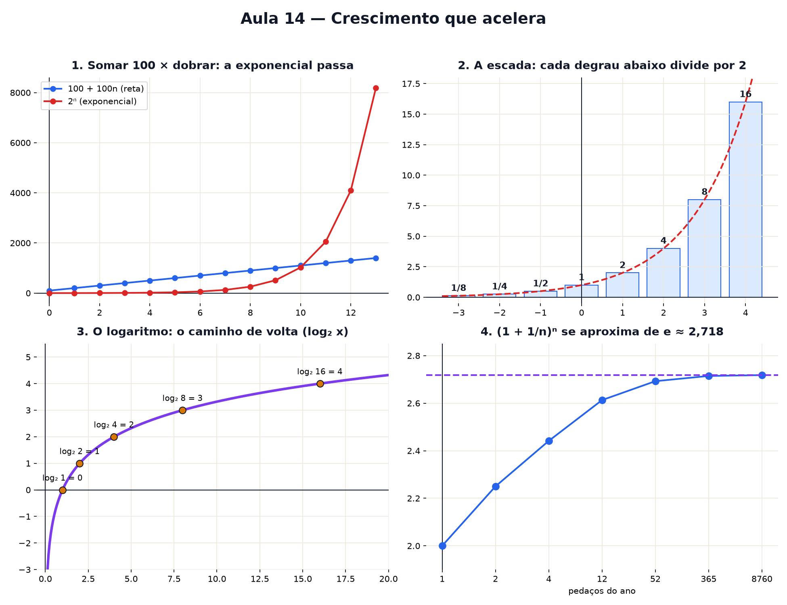

# Aula 14 — Crescimento que acelera

> Estas são as notas em texto da aula. A versão interativa, com os laboratórios e os exercícios
> que se corrigem sozinhos, está em [`index.html`](index.html).

*Exponenciais e logaritmos: somar sempre o mesmo contra multiplicar sempre pelo mesmo — e a pergunta
de volta, "quantas vezes eu multipliquei?".*

**Você já sabe:** a reta e o passo da escada (Aula 9), potências e raízes (Aula 4) e a raiz como
caminho de volta do quadrado. Hoje a potência ganha o x lá em cima.

Duas propostas de mesada: **R$ 100 a mais por semana**, ou **R$ 1 na primeira semana e o dobro a
cada semana**. A primeira parece imbatível. Na 12ª semana a segunda já passou — e depois disso a
primeira nunca mais chega perto. Esta aula é sobre por quê.

> **🧠 Poder do cérebro**
>
> Você prefere ganhar R$ 1.000 por dia durante 30 dias, ou 1 centavo no 1º dia, 2 no 2º, 4 no 3º,
> sempre dobrando, até o dia 30?
>
> **Resposta:** A segunda, de longe: só no dia 30 você recebe 2²⁹ centavos, mais de R$ 5 milhões; no
> total, mais de R$ 10 milhões contra R$ 30 mil. Somar sempre o mesmo perde para multiplicar sempre
> pelo mesmo.

---

## Somar sempre o mesmo × multiplicar sempre pelo mesmo

Somar sempre o mesmo valor é a reta da Aula 9: o passo da escada é fixo. Multiplicar sempre pelo
mesmo fator é outra coisa: o passo **cresce junto com o valor**. Isso se chama crescimento
**exponencial**, porque a conta é uma potência com o tempo no expoente:

`valor = início · fatorⁿ`

As listas de números que crescem assim têm nome. Somando sempre o mesmo (2, 5, 8, 11, ...):
**progressão aritmética**, a PA da Aula 9. Multiplicando sempre pelo mesmo (1, 2, 4, 8, ...):
**progressão geométrica**, a PG. No dinheiro, isso vira **juros simples** (rende sempre sobre o
valor inicial: uma PA) e **juros compostos** (rende sobre o que já rendeu: multiplicar por 1,1 a
cada ano, uma PG — o "aumento de 10%" da Aula 3, repetido).

> 🔧 **Laboratório — corrida soma × multiplicação.** A reta começa em 100 e soma; a exponencial
> começa em 1 e multiplica. Ajuste e ande no tempo. *(interativo, na versão em HTML)*

### A soma de Gauss: somar uma PA sem somar

Conta a lenda que um professor mandou a turma somar 1 + 2 + 3 + ... + 100, para ganhar sossego. O
menino Gauss respondeu em segundos: **5.050**.

**✅ Por que é verdade?**

1. Escreva a soma duas vezes, uma de trás para frente: 1 + 2 + ... + 100 e 100 + 99 + ... + 1.
2. Some as duas fileiras coluna por coluna: 1 + 100 = 101, 2 + 99 = 101, ... — são 100 colunas,
   todas valendo 101.
3. As duas fileiras juntas dão 100 · 101 = 10.100. Uma fileira só é metade: **5.050**.
4. Vale para qualquer PA: soma = (primeiro + último) · quantidade ÷ 2 — a média do primeiro e do
   último, vezes quantos são.

---

## A dobra do papel: 2ⁿ

Uma folha de papel tem uns 0,1 mm. Dobrou uma vez, 0,2 mm. Duas, 0,4 mm. Cada dobra multiplica por
2, então depois de n dobras a espessura é `0,1 · 2ⁿ` mm. Parece pouca coisa... até você mexer no
slider.

> 🔧 **Laboratório — a dobra do papel.** Quantas dobras até passar da altura de um prédio? E de uma
> montanha? E até a Lua? *(interativo, na versão em HTML)*

> **⚠️ Cuidado — 2ⁿ não é 2 · n**
>
> `2 · 10 = 20`, mas `2¹⁰ = 1.024`. O primeiro soma o 2 dez vezes; o segundo **multiplica** o 2 dez
> vezes. É a mesma confusão de `x²` com `2x` da Aula 13, só que agora explode muito mais rápido.

---

## A escada das potências: zero, negativos e metades

Na Aula 4 o expoente dizia "quantas vezes multiplicar". Mas o que seria `2⁰`? Ou `2⁻¹`? Desça a
escada: cada degrau para baixo **divide por 2**.

`2³ = 8 → 2² = 4 → 2¹ = 2 → 2⁰ = 1 → 2⁻¹ = ½ → 2⁻² = ¼`
Expoente zero dá 1. Expoente negativo quer dizer "divida" em vez de "multiplique".

Um detalhe de escrita: quando o expoente é comprido demais para caber pequeno lá em cima, ele vem
depois de um chapeuzinho. `2^0,5` lê-se "2 elevado a 0,5" — é exatamente o mesmo que escrever o 0,5
pequenininho no alto do 2. Você vai ver esse `^` de novo no sino da Aula 21 e no giro da Aula 18.

E o meio-degrau? Somar expoentes é multiplicar (`2² · 2³ = 2⁵`, conte os 2). Então `2^0,5 · 2^0,5 =
2¹ = 2` — ou seja, `2^0,5` é o número que vezes ele mesmo dá 2: é `√2 ≈ 1,41`, a raiz da Aula 4.

> 🔧 **Laboratório — a escada das potências.** Mova o expoente, inclusive para os negativos e os
> meios-degraus. *(interativo, na versão em HTML)*

---

## O logaritmo: a pergunta de volta

A raiz era a pergunta de volta do quadrado: "qual lado dá esta área?". O **logaritmo** é a pergunta
de volta da exponencial: **"quantas vezes eu preciso multiplicar?"**

`log₂ 8 = 3 porque 2³ = 8`

O número pequeno embaixo (a **base**) diz o que está sendo multiplicado. Com base 10: `log₁₀ 1.000 =
3` — é só contar os zeros.

> 🔧 **Laboratório — quantas dobras? (o logaritmo).** Escolha aonde quer chegar. O laboratório conta
> quantas vezes é preciso dobrar a partir de 1. *(interativo, na versão em HTML)*

### Não existe pergunta idiota

**P:** Por que alguém inventou isso?

**R:** Porque logaritmo transforma multiplicação em soma: `log(a · b) = log a + log b` (multiplicar
é somar os expoentes — seção 3). Antes das calculadoras, engenheiros multiplicavam números enormes
somando logaritmos numa tabela. Hoje ele continua em toda parte onde algo cresce multiplicando:
juros, bactérias, decibéis, terremotos.

**P:** Existe logaritmo de zero ou de número negativo?

**R:** Não. Multiplicando 2 por ele mesmo você nunca chega em zero nem vira negativo — a escada da
seção 3 só tem degraus positivos. Então não existe "quantas vezes" que responda.

---

## A régua logarítmica

Numa régua comum, cada tracinho **soma** o mesmo. Numa régua **logarítmica**, cada tracinho
**multiplica** pelo mesmo: 1, 10, 100, 1.000... Nela, uma exponencial vira uma **reta** — e dá para
ver o começo e o fim do crescimento no mesmo desenho. Por isso gráficos de preço de longo prazo e de
epidemias usam essa régua.

> 🔧 **Laboratório — a régua logarítmica.** A mesma curva `2ⁿ`, de n = 0 a 20, desenhada nas duas
> réguas. *(interativo, na versão em HTML)*

> 🧘 **O Guru:** Somar é andar; multiplicar é ganhar velocidade enquanto anda. No começo quem soma
> parece estar na frente — é por isso que tanta gente subestima juros, epidemias e dívidas. O
> logaritmo é o óculos para enxergar isso: ele troca o 'quanto' pelo 'quantas vezes'.

---

## O número e: o crescimento contínuo

Um banco generoso paga **100% de juros ao ano**: R$ 1 vira R$ 2. E se ele pagar 50% a cada meio ano?
Aí são duas multiplicações: `1,5 · 1,5 = 2,25`. Em 12 pedaços de 1/12: `(1 + 1/12)¹² ≈ 2,61`.
Dividindo cada vez mais fino, o total **não explode** — ele se aproxima de um número fixo:

`e ≈ 2,71828...`

O **e** é o resultado de crescer 100% "o tempo todo, sem parar". Ele vai reaparecer na derivada
(Aula 19), no sino do acaso (Aula 21) e no giro dos números complexos (Aula 18).

> 🔧 **Laboratório — de onde vem o e.** Divida o ano em cada vez mais pedaços e veja para onde vai o
> total. *(interativo, na versão em HTML)*

---

## Pontos importantes

- Somar sempre o mesmo → **reta** (PA, juros simples). Multiplicar sempre pelo mesmo →
  **exponencial** (PG, juros compostos): `início · fatorⁿ`.
- Soma de uma PA (Gauss): `(primeiro + último) · quantidade ÷ 2`.
- Toda exponencial com fator maior que 1 acaba passando qualquer reta.
- `2⁰ = 1`, `2⁻¹ = ½`, `2^0,5 = √2`: expoente negativo divide, meio expoente é raiz.
- Somar expoentes = multiplicar: `2² · 2³ = 2⁵`.
- **Logaritmo** = "quantas vezes multiplicar": `log₂ 8 = 3`, `log₁₀ 1.000 = 3`.
- Na régua logarítmica, exponencial vira reta.
- `(1 + 1/n)ⁿ` se aproxima de **e ≈ 2,718**: o crescimento contínuo.

---

## ✏️ Afie o lápis

1. Quanto vale `2⁵`? → **32**
2. *(quem faz o quê?)* Ligue cada ideia ao seu papel. → **PA → somar sempre o mesmo; PG →
   multiplicar sempre pelo mesmo; logaritmo → o expoente que falta: quantas vezes multiplicar; o
   número e → a base do crescimento contínuo, ≈ 2,718**
3. Quanto vale `log₂ 64`? → **6**
4. R$ 1.000 rendem 10% ao ano, com juros sobre juros. Quanto há depois de **2 anos** (em reais)?
   → **1210**
5. *(o desafio)* Uma colônia começa com 1 bactéria e dobra a cada hora. Depois de quantas horas
   ela passa de **1.000** bactérias pela primeira vez? → **10**
6. A longo prazo, qual cresce mais: `1.000 · n` ou `2ⁿ`? → **2ⁿ: a partir de algum n ela passa e
   nunca mais é alcançada.**
