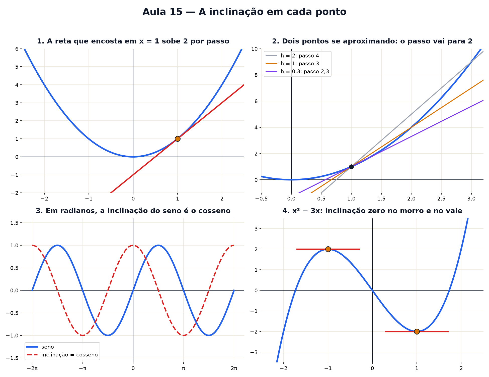

# Aula 15 — A inclinação em cada ponto

> Estas são as notas em texto da aula. A versão interativa, com os laboratórios e os exercícios
> que se corrigem sozinhos, está em [`index.html`](index.html).

**Você já sabe:** o passo da escada (Aula 2), graus (Aula 3), seno e cosseno (Aula 4), o vértice
(Aula 13) e o número e (Aula 14).

---

## A lupa que endireita a curva

Com zoom suficiente, toda curva lisa parece uma reta. Essa reta é a **tangente**, e o passo da
escada dela é a **inclinação da curva** naquele ponto.

---

## Chegar cada vez mais perto

Com dois pontos, x e x + h, o passo é `(f(x + h) − f(x)) ÷ h`. Para `f(x) = x²` em x = 1:

| h | 1 | 0,1 | 0,01 | 0,001 |
|---|---|---|---|---|
| passo | 3 | 2,1 | 2,01 | 2,001 |

O passo se aproxima de 2 — esse valor-limite é a **derivada**. Não dá para usar h = 0 (vira 0 ÷ 0);
olha-se para onde o passo **vai**. Num bico (fundo de um V), não existe derivada.

---

## A derivada como máquina

`f′(x)`: entra x, sai a inclinação.

- `x² → 2x`, `x³ → 3x²`, `eˣ → eˣ` (a inclinação é a própria altura);
- soma: deriva cada pedaço; número multiplicando fica; número sozinho some;
- exemplo: `−x² + 6x + 1 → −2x + 6`.

---

## Radianos e π

Medida natural de ângulo: **quantos raios de comprimento tem o arco**. A volta inteira mede
`2π ≈ 6,283` raios, com **π ≈ 3,14159**.

- 360° = 2π · 180° = π · 90° = π/2 ≈ 1,57 · 1 rad ≈ 57,3°

> ⚠️ Em graus, o seno sobe só 0,01745 (= π/180) por grau perto do zero. Em radianos sobe
> exatamente 1, e a derivada do seno é o cosseno.

---

## Onde a inclinação é zero

Topo e fundo de uma curva lisa: `f′(x) = 0`. Horta da Aula 13: `10x − x²` → `10 − 2x = 0` →
x = 5. Em `x³ − 3x`: `3x² − 3 = 0` → morro em x = −1 e vale em x = 1.

---

## Pontos importantes

- Tangente: a reta que a lupa enxerga; inclinação = passo dela.
- Derivada = limite de `(f(x + h) − f(x)) ÷ h`.
- `x² → 2x`, `x³ → 3x²`, `eˣ → eˣ`, `sen → cos` (radianos).
- `360° = 2π` radianos.
- Melhor valor: onde `f′(x) = 0`.

---

## Afie o lápis

1. Inclinação de `y = 3x + 1` em x = 10? → **3**
2. Inclinação de `x²` em x = 3? → **6**
3. 180° em radianos? → **π**
4. Passo de `x²` entre x = 1 e x = 2? → **3**
5. Topo de `y = −x² + 6x`? → **x = 3**
6. Derivada de `eˣ`? → **eˣ**
