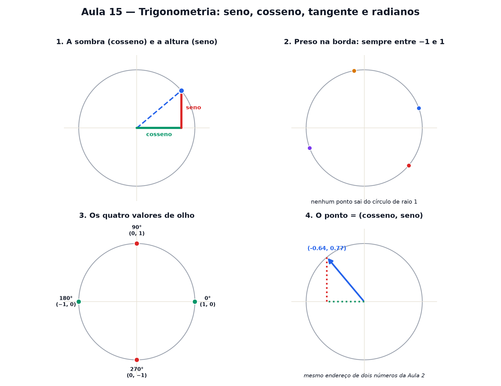

# Aula 15 — Trigonometria: seno, cosseno, tangente e radianos

> Estas são as notas em texto da aula. A versão interativa, com os laboratórios e os exercícios
> que se corrigem sozinhos, está em [`index.html`](index.html).

*As duas palavras que mais assustam na matemática do ensino médio viram só isto: a sombra e a altura
de um ponto girando.*

**Você já sabe:** ângulos, a volta de 360° e o π (Aula 11), Pitágoras (Aula 12) e o passo da escada
de uma reta (Aula 9). Hoje o ponto que gira ganha nome e sobrenome.

Você já sabe girar um ponteiro e ler o ângulo. Hoje a pergunta muda: para **cada** ângulo,
exatamente onde o ponto para? A resposta tem dois números, e eles já têm nome.

> **🧠 Poder do cérebro**
>
> Uma escada de 5 m está encostada numa parede, fazendo 60° com o chão. A que altura ela toca a
> parede? Dá para saber sem subir para medir?
>
> **Resposta:** Dá: a altura é 5 · sen 60° ≈ 4,33 m. Para cada ângulo, a razão altura ÷ escada é
> sempre a mesma, e tem nome: seno. Esta aula constrói essa tabela com um círculo.

---

## A sombra e a altura

Imagine um sol bem no alto, iluminando de cima para baixo, e outro sol do lado, iluminando de lado.
O ponto que gira na borda do círculo projeta **duas sombras**: uma na régua deitada, outra na régua
em pé.

- A sombra na régua **deitada** — o quanto o ponto andou para o lado — chama-se **cosseno**.
- A sombra na régua **em pé** — o quanto o ponto subiu — chama-se **seno**.

Nada mais místico que isso: **cosseno é a sombra horizontal, seno é a altura vertical** de um ponto
que gira num círculo de raio 1.

> 🔧 **Laboratório — o círculo com a sombra e a altura ao vivo.** Gire o ponto e observe as duas
> sombras se mexendo nas réguas. *(interativo, na versão em HTML)*

> 🧘 **O Guru:** "Cosseno de 30 graus" soa complicado. "A sombra de um ponto que girou 30 graus" não
> soa. É a mesma coisa — só trocaram o nome por um mais curto. Toda vez que a palavra assustar,
> troque por "sombra" ou "altura" na sua cabeça.

---

## Por que sempre entre −1 e 1

O círculo do laboratório tem **raio 1**. O ponto nunca sai da borda dele — então a sombra dele, para
qualquer lado, nunca pode ser maior que o próprio raio.

Seno e cosseno **nunca** passam de 1 nem ficam abaixo de −1. O ponto está preso na borda de um
círculo de raio 1 — a sombra dele não tem como ser maior que isso.

Gire o ponto no laboratório até 0° e até 90°: repare que a sombra bate exatamente na borda do
círculo — o máximo que ela consegue.

> **⚠️ Cuidado — sombra pode ser negativa**
>
> Depois de 90°, o ponto entra do lado esquerdo do círculo, e a sombra horizontal (cosseno) fica
> **negativa**. Depois de 180°, é a sombra vertical (seno) que fica negativa. Sinal de menos aqui
> quer dizer exatamente o que já significava na Aula 9: "do outro lado do zero".

---

## Os valores que valem a pena reconhecer de olho

Alguns ângulos dão valores redondos, sem conta nenhuma — vale a pena reconhecê-los de cara:

| ângulo | cosseno (sombra) | seno (altura) |
|---|---|---|
| 0° | 1 | 0 |
| 90° | 0 | 1 |
| 180° | −1 | 0 |
| 270° | 0 | −1 |

Repare no padrão: em 0° o ponto está todo "deitado" (só sombra horizontal, nenhuma altura). Em 90°
ele está todo "em pé" (só altura, nenhuma sombra). Eles vão se revezando.

> 🔧 **Laboratório — a tabela que se preenche sozinha.** Clique em avançar (ou deixe girando sozinho)
> e observe a tabela crescer, linha por linha, acompanhando o ponto. *(interativo, na versão em
> HTML)*

### Não existe pergunta idiota

**P:** Por que os valores de 30°, 45° e 60° não são números redondos?

**R:** Eles são, só que em vírgula: cos(60°) = 0,50, cos(45°) ≈ 0,71, cos(30°) ≈ 0,87. Nada de
decorar fórmula — a tabela do laboratório mostra o valor exato calculado, é só olhar.

**P:** Seno e cosseno de que servem na vida real?

**R:** De qualquer coisa que gira ou oscila: a posição de uma roda-gigante, o som de uma nota
musical, a corrente elétrica alternada, a maré. Na Aula 16 você vai ver o seno "desenrolado" virar
exatamente o desenho de uma onda.

**P:** Cosseno de 0° é 1 e não 0 — por quê?

**R:** Em 0° o ponto ainda não girou nada: ele está parado bem na borda direita do círculo, no lugar
mais afastado possível para o lado. A sombra dele é máxima — vale exatamente o raio, que é 1.

> 🔧 **Laboratório — simetria do círculo.** Gire o ponto azul e observe o ponto laranja, sempre no
> ângulo espelhado (180° − ângulo). Repare no padrão dos sinais. *(interativo, na versão em HTML)*

---

## Os dois números num único desenho

Seno e cosseno não são duas ideias soltas — são as **duas coordenadas do mesmo ponto**, do
mesmíssimo jeito que a Aula 9 usava dois números para dar o endereço de um ponto no papel:

`ponto = (cosseno do ângulo, seno do ângulo)`

O primeiro número é a sombra (quanto andou para o lado). O segundo é a altura (quanto subiu).
Exatamente a mesma ordem da Aula 9 — "primeiro ando, depois subo".

---

## No triângulo retângulo: oposto, adjacente e a tangente

Ligue o centro do círculo ao ponto, e desça uma linha reta do ponto até o eixo: aparece um
**triângulo retângulo** (Aula 12). A hipotenusa é o raio; o cateto em pé é a altura (seno); o cateto
deitado é a sombra (cosseno). Num triângulo retângulo de qualquer tamanho, com um ângulo θ num dos
cantos:

`seno = cateto oposto ÷ hipotenusa`
`cosseno = cateto adjacente ÷ hipotenusa`
`tangente = oposto ÷ adjacente = seno ÷ cosseno`

A **tangente** é "quanto sobe para cada um que anda": é o **passo da escada** da reta que sai do
centro com aquele ângulo (Aula 9). É assim que se mede a altura de um prédio pela sombra, ou a
inclinação de uma rampa.

> 🔧 **Laboratório — o triângulo retângulo.** Mude o ângulo e o tamanho do triângulo. As razões só
> dependem do ângulo. *(interativo, na versão em HTML)*

---

## Pitágoras no círculo: cos² + sen² = 1

Esse triângulo tem hipotenusa 1, então Pitágoras (Aula 12) diz, para **qualquer** ângulo:

`cosseno² + seno² = 1`

> 🔧 **Laboratório — o círculo de raio 1.** Gire o ângulo: as duas barras trocam de tamanho, mas
> juntas enchem sempre a barra inteira. *(interativo, na versão em HTML)*

---

## Radianos: o ângulo medido pelo arco

Os 360° da volta são uma convenção antiga. Existe uma medida mais natural: **quantos raios de
comprimento tem o arco**. A volta inteira mede `2π` raios (Aula 11), então:

**volta inteira = 360° = 2π radianos**
meia volta = 180° = π · um quarto = 90° = π/2 ≈ 1,57
1 radiano ≈ 57,3° (o arco do tamanho do raio)

Por enquanto parece só outra unidade, como metro e centímetro. Na Aula 19 (derivada) você vai ver
por que ela vira a medida preferida: em radianos, as contas do seno e do cosseno ficam sem sobras.

> 🔧 **Laboratório — radianos, o ângulo medido pelo arco.** Gire o ângulo. O arco laranja é
> desenrolado na régua de baixo, medido em raios. *(interativo, na versão em HTML)*

### 🔥 Conversa ao pé da lareira

Esta noite: **Seno** e **Cosseno**, os gêmeos que ninguém consegue diferenciar.

**Seno:** Eu sou a altura. Quando o ponto está lá em cima, a 90°, eu valho 1 e brilho sozinho.

**Cosseno:** Eu sou a sombra no chão. Eu brilho no começo, a 0°, quando você ainda está deitado
valendo zero.

**Seno:** Espera... então eu sou você atrasado 90°?

**Cosseno:** Exatamente. Desenhe nós dois como ondas (Aula 16) e somos a mesma curva, deslocada. Por
isso nos confundem.

**Seno:** Mas a gente nunca some ao mesmo tempo: quando eu cresço, você encolhe, e nossos quadrados
sempre somam 1.

**Cosseno:** E quando alguém divide você por mim, nasce a Tangente — a inclinação. Família grande.

---

## Pontos importantes

- Um ponto gira na borda de um círculo de **raio 1**.
- **Cosseno** = a sombra horizontal do ponto (quanto andou para o lado).
- **Seno** = a altura vertical do ponto (quanto subiu).
- Os dois vivem sempre entre **−1 e 1**, porque o ponto nunca sai da borda do círculo.
- Valores de cor: `cos 0°=1, sen 0°=0` · `cos 90°=0, sen 90°=1` · `cos 180°=−1, sen 180°=0` · `cos
  270°=0, sen 270°=−1`.
- O ponto é o endereço `(cosseno, seno)` do ângulo — dois números, igual na Aula 9.
- No triângulo retângulo: seno = oposto ÷ hipotenusa, cosseno = adjacente ÷ hipotenusa, **tangente**
  = oposto ÷ adjacente (a inclinação).
- Pitágoras no círculo: `cos² + sen² = 1`.
- **Radianos**: ângulo medido em raios de arco. `360° = 2π`, `180° = π`.

---

## ✏️ Afie o lápis

1. O que o **cosseno** de um ângulo representa? → **A sombra horizontal do ponto que gira.**
2. Quanto vale `cosseno de 0°`? → **1**
3. Quanto vale `seno de 90°`? → **1**
4. *(quem faz o quê?)* Ligue cada peça da trigonometria ao seu papel. → **cosseno → a sombra (x)
   do ponto no círculo de raio 1; seno → a altura (y) do ponto no círculo de raio 1; tangente → seno
   ÷ cosseno: a inclinação; radiano → o ângulo medido pelo comprimento do arco**
5. *(o desafio)* Quanto vale `cosseno de 180°`? → **−1**
6. *(leia o desenho)* O ponto abaixo girou até parar reto para baixo (270°). Quais são a sombra e
   a altura dele? Cosseno (sombra): Seno (altura): → **0 · −1**
