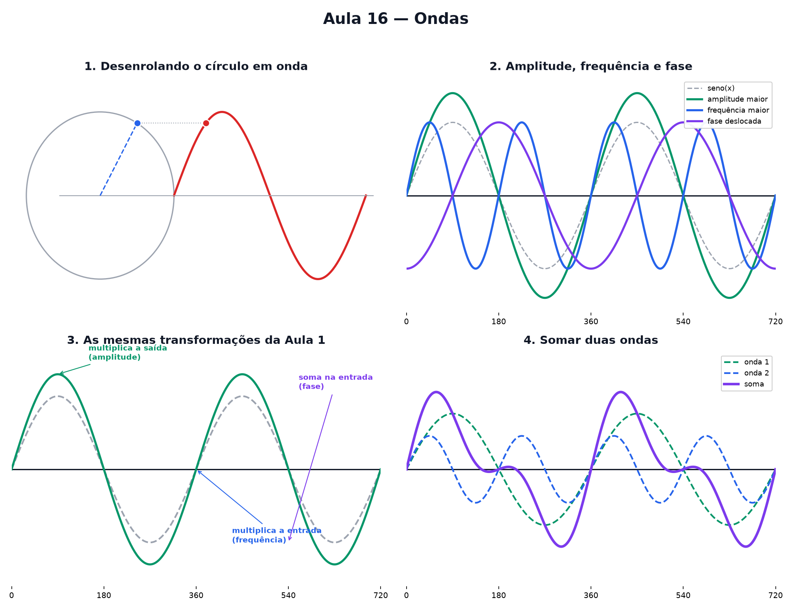

# Aula 16 — Ondas

> Estas são as notas em texto da aula. A versão interativa, com os laboratórios e os exercícios
> que se corrigem sozinhos, está em [`index.html`](index.html).

*Onde você descobre que a onda não é outra coisa — é o giro visto de lado.*

**Na aula passada:** um ponto gira num círculo de raio 1. Cosseno é a sombra horizontal dele, seno é
a altura vertical — e os dois vivem entre −1 e 1.

Pega o ponto girando da Aula 15 e desenrola o círculo numa linha reta, marcando só a **altura** dele
a cada instante. O resultado é a coisa mais parecida com um mar, um som ou uma corda vibrando que a
matemática tem: a **onda**.

> **🧠 Poder do cérebro**
>
> Uma roda-gigante gira devagar e sempre na mesma velocidade. Desenhe a altura de uma cadeira ao
> longo do tempo. Que forma aparece?
>
> **Resposta:** Uma onda: sobe, desce, sobe de novo, sempre igual. A altura da cadeira é o seno do
> ângulo da roda (Aula 15), e o tempo faz o ângulo andar. Toda onda desta aula nasce de um giro.

---

## Desenrolando o círculo

Enquanto o ponto gira no círculo, marque só a altura dele (o seno) num papel que vai desenrolando
para o lado, como um rolo de papel higiênico sendo puxado. O resultado é a **onda**.

> 🔧 **Laboratório — círculo e onda lado a lado, sincronizados.** Clique em girar e observe: a altura
> do ponto no círculo (à esquerda) é exatamente a altura da onda no mesmo instante (à direita).
> *(interativo, na versão em HTML)*

> 🧘 **O Guru:** Uma onda do mar não "sabe" que existe um círculo escondido nela. Mas todo movimento
> que sobe e desce de um jeito suave e repetido — som, corrente elétrica, maré — se comporta
> exatamente como esse desenho. É o giro, só que contado ao longo do tempo em vez de contado ao
> redor de um ponto.

---

## Três jeitos de mudar a onda

A onda mais simples é `y = seno(x)`. Ela tem três controles, e você já conhece as ideias por trás de
todos eles — só que agora aplicadas a uma onda em vez de uma reta.

### Altura da onda (amplitude)

Multiplicar a onda inteira por um número estica ela para cima e para baixo, do mesmo jeito que
multiplicar `x` esticava a reta na Aula 9. Esse número chama-se **amplitude**.

### Largura da onda (frequência)

Multiplicar o **ângulo** (o que entra no seno) faz o ponto girar mais rápido — cabem mais voltas
completas no mesmo espaço, e a onda fica mais "apertada". Esse número chama-se **frequência**.

### Adiantar ou atrasar (fase)

Somar um número ao ângulo empurra a onda inteira para o lado — ela começa mais cedo ou mais tarde.
Esse deslocamento chama-se **fase**.

> 🔧 **Laboratório — três sliders.** Mexa nos três controles e observe a onda mudar de forma.
> *(interativo, na versão em HTML)*

---

## Reencontro com as Aulas 7, 9 e 13

Nada disso é novo de verdade — são as mesmas contas que você já fazia com a máquina da Aula 7, com a
reta da Aula 9 e com a parábola da Aula 13 (lembra do h que deslocava para o lado?). Uma máquina
pode ser mexida de **quatro jeitos**, e todos funcionam igualzinho na onda:

- Multiplicar a **saída** da onda inteira → estica para cima e para baixo (amplitude).
- Multiplicar a **entrada** (o ângulo) → aperta ou alarga (frequência).
- Somar algo na **entrada** → desloca para o lado (fase).
- Somar algo na **saída** → sobe ou desce a onda inteira, como a altura de partida da Aula 9.

### Não existe pergunta idiota

**P:** Por que multiplicar o ângulo deixa a onda mais "apertada" e não mais "esticada"?

**R:** Porque o ponto no círculo precisa girar uma volta inteira (360°) para a onda completar um
"ciclo". Se a frequência é 2, o ângulo cresce duas vezes mais rápido — então em vez de precisar de
`x` ir até 360 para uma volta, basta ir até 180. Cabem duas voltas completas no mesmo espaço, e a
onda fica apertada.

**P:** Fase positiva atrasa ou adianta a onda?

**R:** Depende do sinal usado na conta, mas no laboratório: **subtrair** a fase do ângulo empurra a
onda para a direita (atrasa — ela demora mais para começar a subir). Fase negativa faz o oposto:
adianta.

> 🔧 **Laboratório — quantas ondas cabem?** Mude a frequência e conte quantos ciclos completos cabem
> na mesma largura de tela. *(interativo, na versão em HTML)*

> **⚠️ Cuidado — o sinal da fase engana**
>
> `seno(x − 90°)` empurra a onda para a **direita**: tudo acontece 90° mais tarde, a onda chega
> atrasada. Já `seno(x + 90°)` empurra para a **esquerda**, adiantada. O "menos" dentro do parêntese
> leva a onda para o lado dos números positivos — pense em "atraso", não em "para trás". Confira no
> laboratório dos três sliders.

---

## Somar duas ondas

E se duas ondas acontecerem ao mesmo tempo, no mesmo lugar? Elas se somam, ponto a ponto. Onde as
duas sobem juntas, o resultado sobe mais. Onde uma sobe e a outra desce, elas se cancelam um pouco
(ou até completamente).

> 🔧 **Laboratório — somador de ondas.** A onda verde é fixa (`seno(x)`). Ajuste a onda azul e
> observe a onda roxa — a soma das duas. **Preveja** antes: com a mesma largura e atraso de 180°, o
> que sobra? *(interativo, na versão em HTML)*

> 🔧 **Laboratório — reconheça a onda.** A onda cinza tracejada é um alvo secreto. Ajuste amplitude e
> frequência até a onda azul cobrir a cinza. *(interativo, na versão em HTML)*

> 🔧 **Laboratório — onda ao vivo.** Antes de mexer, **preveja**: a boia laranja vai ser carregada
> para o lado junto com a onda? Depois mude a velocidade e o número de ondas e observe o
> sobe-e-desce da boia. *(interativo, na versão em HTML)*

---

## Pontos importantes

- A onda é o giro do círculo **desenrolado** — a altura (seno) marcada ao longo do tempo.
- **Amplitude**: multiplica a onda inteira, estica para cima/baixo.
- **Frequência**: multiplica o ângulo, aperta ou alarga a onda (mais voltas no mesmo espaço).
- **Fase**: soma no ângulo, desloca a onda para o lado (adianta ou atrasa).
- São os mesmos quatro jeitos de mexer numa máquina (Aulas 7 e 9) — só que aplicados ao seno.
- Somar duas ondas soma as alturas **ponto a ponto**.

---

## ✏️ Afie o lápis

1. O que gera o formato de onda que vimos hoje? → **A altura de um ponto girando num círculo,
   desenrolada ao longo do tempo.**
2. Na receita `y = 3 · seno(2 · x)`, qual é a altura máxima que a onda atinge? → **3**
3. A onda `y = seno(4 · x)` vai de x = 0° até x = 360°. Quantas ondas completas cabem nesse
   trecho? → **4**
4. *(quem faz o quê?)* Ligue cada controle ou situação ao que ele faz com a onda. → **amplitude →
   muda a altura da onda; frequência → muda quantas voltas cabem no mesmo espaço; fase → desloca a
   onda para o lado; duas ondas opostas somadas → se cancelam**
5. *(o desafio)* Duas ondas **sincronizadas**, de amplitudes 2 e 3, são somadas. Qual é a
   amplitude da onda resultante? → **5**
6. No laboratório dos três sliders, a receita é `y = amplitude · seno(frequência · x − fase)`. Se
   eu quero uma onda **bem baixinha** mas mantendo a mesma largura de sempre, qual número eu devo
   diminuir? → **A amplitude.**
