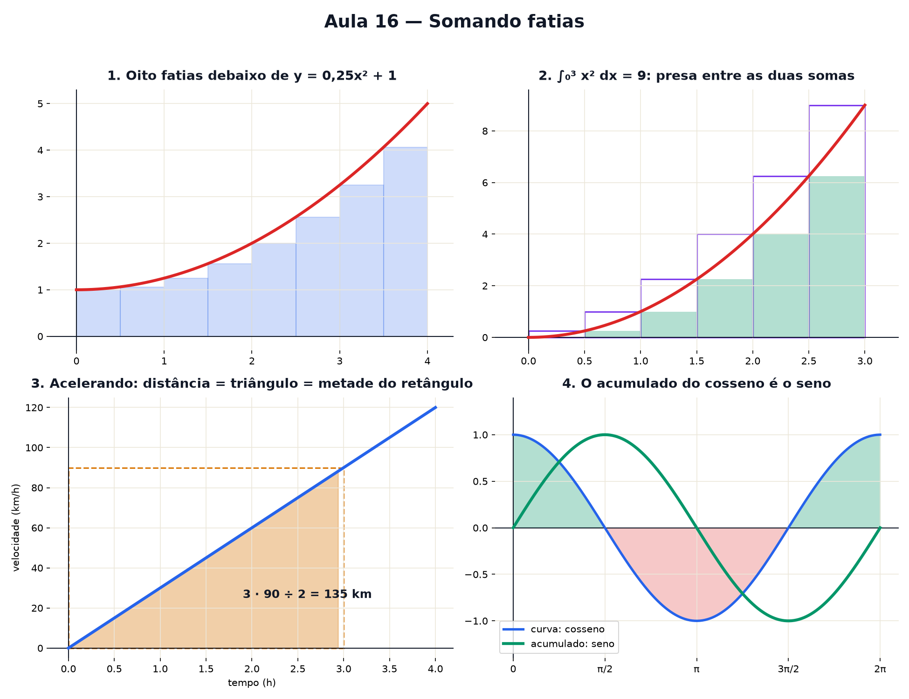

# Aula 16 — Somando fatias

> Estas são as notas em texto da aula. A versão interativa, com os laboratórios e os exercícios
> que se corrigem sozinhos, está em [`index.html`](index.html).

**Você já sabe:** área de retângulo (Aula 9), curvas (Aulas 13 e 14) e a derivada (Aula 15).

---

## Fatie a curva

Corte a área debaixo da curva em fatias de mesma largura; cada fatia vira um retângulo. A soma
dos retângulos estima a área. `y = 0,25x² + 1` de 0 a 4: com 4 fatias dá 7,5; a área exata é
≈ 9,33.

---

## Fatias cada vez mais finas

Numa curva que sobe, a soma pela borda esquerda fica **por baixo** e a pela direita fica **por
cima**. A área verdadeira está presa entre as duas, que se apertam com mais fatias. O valor final
é a **integral**:

`∫₀³ x² dx = 9` — "a soma das fatias de altura x² e largura dx, de 0 até 3".

---

## Velocidade vira distância

A distância é a **área debaixo da velocidade**. 60 km/h por 2 h: retângulo, 120 km. Acelerando
do zero: triângulo — **metade do retângulo** de mesma base e altura (`base · altura ÷ 2`).

Parte da curva abaixo do eixo conta **negativa** (andar de ré desconta).

---

## O acumulado

`A(x)` = área de 0 até x. Para `y = 2`: `A = 2x`. Para `y = x`: `A = x²/2`. Para
`y = cosseno`: `A = seno` (sobe e depois desce, porque o cosseno fica negativo depois de π/2).

---

## O caminho de volta: Teorema Fundamental do Cálculo

Andar um pouquinho h acrescenta uma fatia de largura h e altura ≈ `f(x)`:

`(A(x + h) − A(x)) ÷ h ≈ f(x)`

**A inclinação do acumulado é a própria curva.** Integrar e derivar são ida e volta. Na prática:
como a derivada de `x³/3` é `x²`, a área de `x²` de 0 a 3 é `3³/3 = 9`.

---

## Pontos importantes

- Área ≈ soma de retângulos finos; no limite, a integral `∫ f(x) dx`.
- Triângulo = metade do retângulo.
- Distância = área debaixo da velocidade.
- Abaixo do eixo conta negativo.
- A derivada do acumulado é a curva original.

---

## Afie o lápis

1. Fatia de largura 2 e altura 5? → **10**
2. Triângulo de base 6 e altura 4? → **12**
3. 80 km/h por 3 h? → **240 km**
4. Mais fatias, mais finas? → **a soma se aproxima da área exata**
5. Área debaixo de `y = x` de 0 a 4? → **8**
6. Inclinação do acumulado A em x? → **f(x)**
