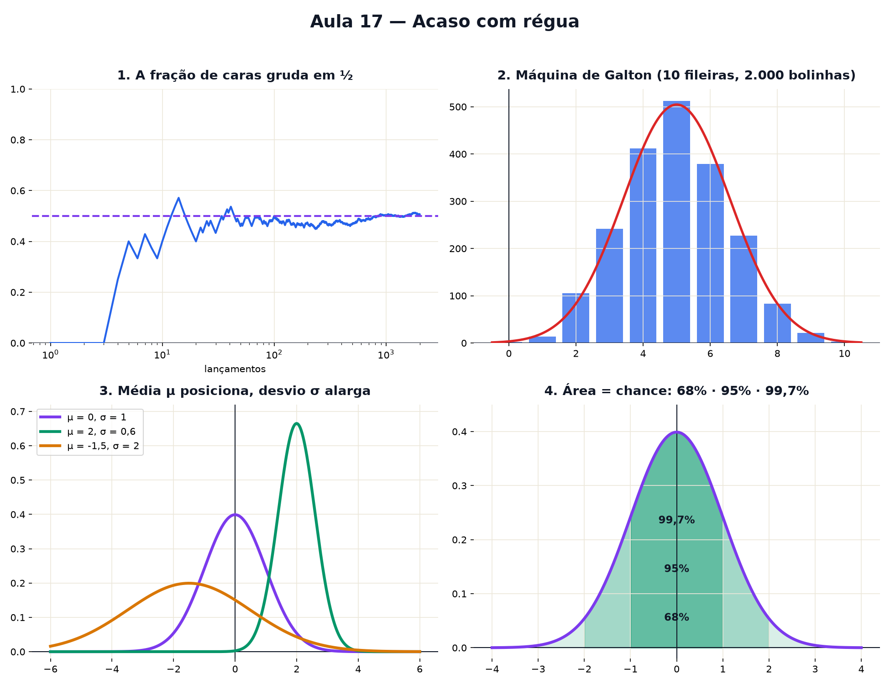

# Aula 17 — Acaso com régua

> Estas são as notas em texto da aula. A versão interativa, com os laboratórios e os exercícios
> que se corrigem sozinhos, está em [`index.html`](index.html).

**Você já sabe:** média e desvio padrão (Aula 10), e e expoente negativo (Aula 14), π (Aula 15) e
área por fatias (Aula 16).

---

## Probabilidade é uma fração

`probabilidade = casos que servem ÷ casos possíveis`, sempre entre 0 e 1. Par num dado: 3/6 = ½.
Um 5: 1/6. Repetindo muitas vezes, a **frequência** se aproxima da probabilidade.

---

## O dado viciado?

Com poucas jogadas, o acaso faz barulho e até um dado honesto parece viciado. Com muitas, cada face
se aproxima de 1/6 — e um dado viciado se entrega.

---

## Valor esperado e dispersão

Dado: `(1 + 2 + 3 + 4 + 5 + 6) ÷ 6 = 3,5` — o **valor esperado**, a média de longo prazo.
O desvio padrão de um dado é ≈ 1,71. Valores esperados se somam: dois dados → 7.

> ⚠️ A moeda não tem memória. Depois de 5 caras, a próxima continua com chance ½. A frequência
> converge porque as jogadas futuras diluem a sequência, não porque a moeda "compensa".

---

## Somar muitos acasos: o sino

Na máquina de Galton, cada bolinha vai para a esquerda ou para a direita em cada fileira. A
posição final é uma soma de pequenos acasos; centenas de bolinhas desenham um **sino**.

---

## A curva normal

`y = e^(−z²/2) ÷ (σ · √(2π))`, com `z = (x − μ) ÷ σ`

- **μ**: a média, onde fica o topo;
- **σ**: o desvio padrão, a largura;
- o expoente negativo faz a curva cair longe da média;
- `σ · √(2π)` faz a área total dar 1.

Aparece onde muitos efeitos pequenos e independentes se **somam**. Não serve para tudo: renda e
movimentos bruscos de preço têm caudas bem mais gordas que o sino.

---

## Área = chance

A área total é 1. A área de um pedaço é a chance de cair ali. Para todo sino:

| distância da média | chance |
|---|---|
| 1 desvio | ≈ 68% |
| 2 desvios | ≈ 95% |
| 3 desvios | ≈ 99,7% |

---

## Afie o lápis

1. Chance de tirar 5 num dado? → **1/6**
2. Caras esperadas em 100 lançamentos? → **50**
3. Valor esperado da soma de dois dados? → **7**
4. Média 170, desvio 10: 95% entre 150 e...? → **190**
5. 1.000 alunos, média 60, desvio 10: entre 50 e 70? → **≈ 680**
6. Depois de 5 caras, chance de cara? → **continua ½**
