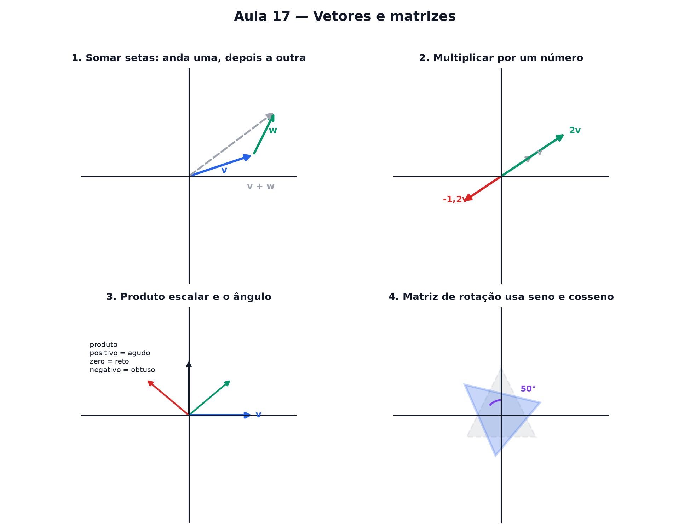

# Aula 17 — Vetores e matrizes

> Estas são as notas em texto da aula. A versão interativa, com os laboratórios e os exercícios
> que se corrigem sozinhos, está em [`index.html`](index.html).

*Onde vetor vira só uma seta, e matriz vira só uma tabela que move setas.*

**Você já sabe:** o endereço de um ponto no plano (Aula 9), sistemas de equações (Aula 10),
Pitágoras (Aula 12) e seno e cosseno (Aula 15). Hoje os pontos viram setas.

Última aula. Álgebra linear tem fama de assustadora, mas as duas peças centrais dela — vetor e
matriz — são simples: uma é uma **seta**, a outra é uma **tabela que move setas**.

> **🧠 Poder do cérebro**
>
> Um barco atravessa um rio apontando reto para a outra margem, mas a correnteza puxa para o lado.
> Para onde ele vai de verdade?
>
> **Resposta:** Na diagonal: o empurrão do motor e o da correnteza se juntam como setas, uma
> encaixada na ponta da outra. Setas que se somam assim são os vetores.

---

## Um vetor é uma seta

Lá na Aula 9, um ponto era um endereço: `(3, 5)`. Hoje, em vez de só marcar o ponto, desenhamos uma
**seta** saindo do zero até ele. Essa seta tem **tamanho** (o quão longa ela é) e **direção** (para
onde ela aponta). É um vetor.

> 🔧 **Laboratório — somador de setas arrastável.** Arraste as duas pontas coloridas. A seta cinza
> tracejada é o **caminho somado**: anda a seta azul, depois anda a seta verde a partir de onde ela
> parou. *(interativo, na versão em HTML)*

---

## Somar setas é andar um caminho e depois o outro

Para somar duas setas: anda a primeira, e a partir de onde ela terminou, anda a segunda. A soma é a
seta que vai direto do começo até o fim desse caminho — a linha cinza tracejada do laboratório.

Nos números, é ainda mais simples: soma cada coordenada separadamente. `(2, 1) + (2, 1) = (4, 2)`.

> 🧘 **O Guru:** Andar 3 quarteirões para o norte e depois 2 para o leste te deixa no mesmo lugar que
> andar os 2 para o leste primeiro e os 3 para o norte depois. A ordem não importa — e é exatamente
> por isso que dá para desenhar a soma de dois jeitos e chegar no mesmo lugar.

Quanto mede uma seta? A seta `(x, y)` anda x para o lado e sobe y: é a hipotenusa de um triângulo
retângulo. Pitágoras (Aula 12) responde: `tamanho = √(x² + y²)`. A mesma conta dá a **distância
entre dois pontos** — é o tamanho da seta que vai de um ao outro. E os pontos que ficam todos à
mesma distância r do centro formam uma **circunferência**: `x² + y² = r²`.

> 🔧 **Laboratório — o tamanho da seta e a distância.** Arraste a ponta. O triângulo tracejado mostra
> os dois catetos; o botão desenha todos os pontos à mesma distância. *(interativo, na versão em
> HTML)*

---

## Multiplicar uma seta por um número

Multiplicar um vetor por um número estica ou encolhe a seta, mantendo a direção — do jeito exato que
multiplicar `x` esticava a reta na Aula 9.

> **⚠️ Cuidado — número negativo inverte a seta**
>
> Multiplicar por um número negativo não só encolhe (ou estica): também **vira a seta para o lado
> oposto**. É a mesma ideia do "passo negativo" da Aula 9, agora aplicada a uma direção inteira.

> 🔧 **Laboratório — multiplicar por um número.** Mexa no controle e veja a seta esticar, encolher ou
> virar para o lado oposto. *(interativo, na versão em HTML)*

---

## Produto escalar: o que o ângulo entre duas setas conta

Existe uma conta que combina duas setas e devolve **um único número** (não outra seta): o **produto
escalar**. A receita: multiplica as primeiras coordenadas, multiplica as segundas, soma os dois
resultados.

`v · w = (v₁ · w₁) + (v₂ · w₂)`

O sinal desse número conta uma história sobre o **ângulo** entre as duas setas:

| produto escalar | ângulo entre as setas |
|---|---|
| positivo | agudo — apontam para o mesmo lado, mais ou menos |
| zero | reto — perpendiculares, 90° |
| negativo | obtuso — apontam mais ou menos para lados opostos |

> 🔧 **Laboratório — produto escalar ao vivo.** Gire a seta verde e observe o produto escalar mudar
> de sinal. *(interativo, na versão em HTML)*

### Não existe pergunta idiota

**P:** Por que o produto escalar dá um número e não outra seta?

**R:** Porque a conta soma dois produtos comuns — não sobra "direção" nenhuma no resultado, só uma
quantidade. É por isso que ele é chamado de "escalar": um número puro, sem seta.

**P:** Onde isso aparece na vida real?

**R:** Trabalho em física (força vezes deslocamento na mesma direção), similaridade entre duas
listas de números (usado em recomendação e busca), e até correlação estatística — que é basicamente
"o ângulo" entre duas séries de dados.

---

## Matriz: uma tabela que move setas

Uma matriz é só uma **tabelinha de números** — 2 linhas, 2 colunas — que sabe transformar qualquer
seta: girar, esticar ou espelhar. Você aplica ela numa seta e recebe outra seta como resposta.

> 🔧 **Laboratório — gire a figura com uma matriz.** A matriz de rotação usa exatamente o seno e o
> cosseno da Aula 15. Gire o ângulo e veja o triângulo virar. *(interativo, na versão em HTML)*

É a mesma matriz que os jogos usam para girar personagens na tela, que uma câmera usa para corrigir
perspectiva, e que aparece por trás de qualquer efeito visual que gira, estica ou espelha uma
imagem.

### Um sistema de equações é uma matriz

O sistema da Aula 10, `2x + y = 5` e `x − y = 1`, pode ser lido de outro jeito: as colunas da tabela
`[[2, 1], [1, −1]]` são duas setas, `(2, 1)` e `(1, −1)`. Resolver o sistema é descobrir **quantas
vezes andar em cada seta** para chegar no ponto `(5, 1)`.

> 🔧 **Laboratório — o sistema como matriz.** Ande x vezes na seta azul e y vezes na seta verde.
> Consegue chegar na estrela? *(interativo, na versão em HTML)*

---

## Pontos importantes

- Um **vetor** é uma seta: tem tamanho e direção.
- Somar setas: anda uma, depois anda a outra a partir de onde a primeira parou.
- Tamanho da seta `(x, y)` = `√(x² + y²)` (Pitágoras) — é também a distância entre dois pontos.
  Circunferência: `x² + y² = r²`.
- Multiplicar uma seta por um número estica/encolhe; número negativo **inverte** a direção.
- **Produto escalar** `v · w = v₁w₁ + v₂w₂` devolve um número, não uma seta. Positivo = ângulo
  agudo, zero = reto, negativo = obtuso.
- Uma **matriz** é uma tabela de números que transforma setas: gira, estica, espelha.
- A matriz de rotação usa **seno e cosseno** — a Aula 15 volta aqui.
- Um sistema de equações é uma matriz: resolver é achar quantas vezes andar em cada coluna.

---

## ✏️ Afie o lápis

1. O que é um vetor? → **Uma seta: tem tamanho e direção.**
2. Qual é o tamanho da seta `(6, 8)`? → **10**
3. Multiplicar um vetor por **−2** faz o quê com a seta? → **Estica ao dobro do tamanho e inverte
   a direção.**
4. Se o produto escalar entre duas setas é **zero**, o que isso diz sobre o ângulo entre elas? →
   **É um ângulo reto — as setas são perpendiculares.**
5. *(o desafio)* Calcule o produto escalar `(2, 3) · (4, −1)`. → **5**
6. *(quem faz o quê?)* Ligue cada peça ao seu papel. → **vetor → uma seta: tamanho e direção;
   somar vetores → encaixar as setas, ponta com cauda; produto escalar zero → as setas são
   perpendiculares; matriz → uma máquina que transforma setas**
