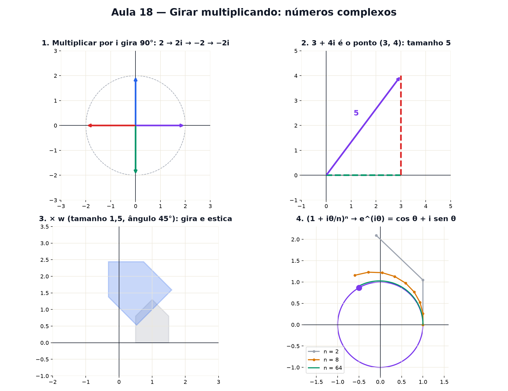

# Aula 18 — Girar multiplicando: números complexos

> Estas são as notas em texto da aula. A versão interativa, com os laboratórios e os exercícios
> que se corrigem sozinhos, está em [`index.html`](index.html).

*Números complexos: "a raiz de −1" parece uma invenção sem sentido, mas é só um jeito de escrever
"gire 90°".*

**Você já sabe:** pontos no plano (Aula 9), ângulos (Aula 11), seno e cosseno (Aula 15), a matriz de
rotação (Aula 17), a parábola que não cruza o zero (Aula 13), o e (Aula 14) e radianos (Aula 15).
Esta aula amarra tudo.

Na Aula 13 ficou uma pendência: `x² = −1` não tem solução, porque nenhum número ao quadrado dá
negativo. Por séculos isso foi tratado como "impossível". Aí alguém teve uma ideia simples: e se o
número que falta não estiver **na reta**, e sim **fora dela**?

> **🧠 Poder do cérebro**
>
> Multiplicar por −1 vira um número para o outro lado da reta: um giro de 180°. Que número, usado
> duas vezes, faria esse giro em dois passos de 90°?
>
> **Resposta:** Um número i com i · i = −1. Nenhum número da reta faz isso — então ele precisa sair
> da reta, para o plano. É o número imaginário, e multiplicar por ele é girar.

---

## Multiplicar por −1 é girar meia volta

Pense nos números como setas saindo do zero. Multiplicar por −1 vira a seta para o outro lado: **um
giro de 180°**. Então a pergunta "que número vezes ele mesmo dá −1?" vira: **que giro, feito duas
vezes, dá meia volta?** Um giro de 90°!

Chame esse giro de **i**. Por definição: `i · i = i² = −1`.
1 → i → −1 → −i → 1: quatro giros de 90° fecham a volta.

> 🔧 **Laboratório — multiplique por i.** A seta começa em 2. Multiplique e veja para onde ela vai.
> *(interativo, na versão em HTML)*

---

## O plano complexo: um número é um ponto

Se i aponta "para cima", um número pode andar `a` para o lado e `b` para cima: `a + bi`. Isso é um
**número complexo** — e é exatamente o ponto `(a, b)` da Aula 9. A régua deitada tem os números de
sempre (parte **real**); a régua em pé tem os múltiplos de i (parte **imaginária** — nome antigo e
injusto: ela é tão real quanto a outra).

Como toda seta, ele tem um **tamanho** (Pitágoras, Aula 12: `√(a² + b²)`) e um **ângulo** (Aula 11).

> 🔧 **Laboratório — o plano complexo.** Monte o número com as duas partes. *(interativo, na versão
> em HTML)*

---

## Multiplicar = girar e esticar

A conta de multiplicar é a de sempre — cada pedaço vezes cada pedaço, como ao abrir os parênteses na
Aula 13 —, lembrando que `i² = −1`:

`(a + bi) · (c + di) = (ac − bd) + (ad + bc)i`

Parece bagunça, mas o desenho é limpo: **os tamanhos se multiplicam e os ângulos se somam**.
Exemplo: `(1 + i) · (1 + i) = 1 + 2i + i² = 2i`. O tamanho √2 vezes √2 deu 2; o ângulo 45° + 45° deu
90°. É a matriz de rotação da Aula 17 escrita como um número só.

> 🔧 **Laboratório — girar e esticar.** A casinha cinza é feita de números complexos. Multiplique
> todos por w e veja a casinha azul. *(interativo, na versão em HTML)*

### Não existe pergunta idiota

**P:** Isso serve para alguma coisa fora da matemática?

**R:** Para quase tudo que gira ou oscila: corrente alternada na engenharia elétrica, processamento
de áudio e imagem, controle de drones, mecânica quântica. Sempre que há rotação, trocar a matriz por
um número complexo deixa as contas muito mais curtas.

**P:** Por que −1 não tem duas raízes, como o 4 (2 e −2)?

**R:** Tem! `(−i)² = (−1)² · i² = −1` também. Girar 90° no sentido do relógio duas vezes também dá
meia volta. As duas raízes de −1 são i e −i.

---

## Potências de um número complexo

Se multiplicar gira e estica, **elevar à potência** repete o giro e o esticão: `wⁿ` tem tamanho `rⁿ`
(a exponencial da Aula 14) e ângulo `n · θ`. Tamanho maior que 1: espiral para fora. Menor: espiral
para dentro. Exatamente 1: dá voltas no círculo para sempre.

> 🔧 **Laboratório — potências de um número complexo.** Ajuste w e o número de potências.
> *(interativo, na versão em HTML)*

> 🧘 **O Guru:** Durante séculos chamaram estes números de 'imaginários' porque ninguém conseguia
> vê-los. Bastou desenhar para o mistério virar um giro. Se tem uma lição que atravessa as 18 aulas,
> é esta: quando a conta parecer impossível, procure o desenho.

---

## A fórmula de Euler: o ponto girando

Na Aula 14, o e apareceu como `(1 + 1/n)ⁿ`: crescer um pouquinho, muitas vezes. Troque o "crescer"
por "girar um pouquinho": `(1 + iθ/n)ⁿ`. Cada fator dá um giro minúsculo de tamanho quase 1; n deles
juntos dão um giro de θ radianos, sem esticar. O resultado é o ponto do círculo da Aula 15:

`e^(iθ) = cos θ + i · sen θ`

Com `θ = π` (meia volta): `e^(iπ) = −1`. Numa linha só: o e, o i, o π, o 1 e o sinal de menos —
cinco peças deste curso inteiro.

> 🔧 **Laboratório — o ponto de Euler.** A linha laranja são os n giros pequenos de `(1 + iθ/n)ⁿ`.
> Aumente n e veja ela colar no círculo. *(interativo, na versão em HTML)*

> **⚠️ Cuidado — θ em radianos**
>
> A fórmula de Euler só fecha com o ângulo em **radianos** (Aula 15). `e^(i·180)` não é −1: dá 180
> radianos, que são quase 29 voltas. Meia volta é `π`.

---

## As raízes que faltavam

De volta à pendência da Aula 13. A parábola `y = (x − 1)² + 4` nunca cruza o zero: na balança sobra
`(x − 1)² = −4`, e nenhum número real ao quadrado dá negativo. Com os complexos, dá: `(2i)² = 4 · i²
= −4`. Então `x − 1 = 2i` ou `x − 1 = −2i`:

`x = 1 + 2i ou x = 1 − 2i`

As duas raízes existem — só não moram na reta dos números reais: estão fora dela, uma acima e outra
abaixo, espelhadas. Com os complexos, **toda** equação de polinômio tem todas as raízes que o grau
promete (2 para o 2º grau, 3 para o 3º...). Esse é o **Teorema Fundamental da Álgebra**.

> 🔧 **Laboratório — as raízes que faltavam.** A parábola é `y = (x − h)² + k`. Suba o k acima de
> zero e veja as raízes saírem da reta e irem para o plano complexo. *(interativo, na versão em
> HTML)*

---

## Pontos importantes

- **i** é o giro de 90°: `i² = −1`. As raízes de −1 são i e −i.
- `a + bi` é o ponto `(a, b)`: tamanho `√(a² + b²)` e um ângulo.
- Multiplicar complexos: **tamanhos multiplicam, ângulos somam** — a rotação da Aula 17 num número
  só.
- `wⁿ`: tamanho `rⁿ`, ângulo `nθ` — espirais e círculos.
- **Euler:** `e^(iθ) = cos θ + i sen θ` (θ em radianos); `e^(iπ) = −1`.
- Com os complexos, a parábola que não cruza o zero ganha suas duas raízes: `(x − 1)² = −4` dá `x =
  1 ± 2i`.

---

## ✏️ Afie o lápis

1. Quanto vale `i²`? → **−1**
2. Qual é o tamanho do número `3 + 4i`? → **5**
3. Quanto dá `(1 + i) · (1 − i)`? (O resultado é um número sem i.) → **2**
4. *(quem faz o quê?)* Ligue cada peça dos complexos ao seu papel. → **i → o número cujo quadrado
   é −1; multiplicar por i → girar 90° no plano; tamanho de a + bi → a distância do ponto até a
   origem; e^(iθ) → o ponto do círculo de raio 1 no ângulo θ**
5. *(o desafio)* Quanto dá `(2i) · (3i)`? → **−6**
6. Quanto vale `e^(iπ)`? → **−1**
