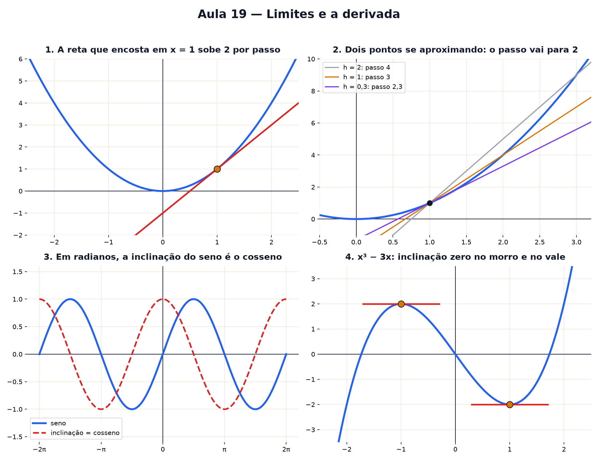

# Aula 19 — Limites e a derivada

> Estas são as notas em texto da aula. A versão interativa, com os laboratórios e os exercícios
> que se corrigem sozinhos, está em [`index.html`](index.html).

*A derivada: a reta tem um passo da escada só; a curva muda de passo a cada ponto — e dá para medir
cada um deles chegando cada vez mais perto.*

**Você já sabe:** o passo da escada de uma reta (Aula 9), graus e o círculo (Aula 11), seno e
cosseno (Aula 15), o vértice da parábola (Aula 13) e o número e (Aula 14). Hoje eles se encontram.

Na Aula 9, a reta `y = 2x + 1` subia **2 a cada passo**, em qualquer lugar. Mas a parábola da Aula
13 sobe devagar perto do fundo e cada vez mais rápido depois. Então quanto ela sobe "por passo"? A
resposta honesta é: **depende de onde você está**. A derivada é a máquina que responde isso ponto a
ponto.

> **🧠 Poder do cérebro**
>
> O velocímetro marca 80 km/h num instante. Mas velocidade é distância ÷ tempo, e num instante o
> tempo é zero. Como o velocímetro sabe?
>
> **Resposta:** Ele mede a distância em intervalos de tempo cada vez menores, e a conta vai chegando
> perto de um valor fixo. Esse valor, de que a conta se aproxima, é um limite — e a velocidade no
> instante é a derivada.

---

## A lupa que endireita a curva

Olhe um pedacinho muito pequeno de qualquer curva lisa com uma lupa bem forte: ela parece uma
**reta**. É como a Terra, que é redonda mas parece plana de onde você está. E reta tem passo da
escada — então cada ponto da curva também tem o seu.

> 🔧 **Laboratório — a lupa que endireita a curva.** A curva azul é `y = x²`; a tracejada vermelha é
> uma reta. Escolha um ponto e aumente o zoom. *(interativo, na versão em HTML)*

---

## A reta que encosta

A reta que a lupa enxerga se chama **reta tangente**: ela encosta na curva naquele ponto, indo
exatamente na mesma direção. A **inclinação da curva** num ponto é o passo da escada dessa reta.

> 🔧 **Laboratório — a reta que encosta.** Deslize o ponto pela parábola e acompanhe a reta que
> encosta nela. *(interativo, na versão em HTML)*

---

## Chegar cada vez mais perto

Como medir o passo de uma reta que só encosta num ponto? Com **dois** pontos a gente sabe (Aula 9):
sobe ÷ anda. Então pegue o ponto `x = 1` e um segundo ponto um pouco à frente, `1 + h`. A reta que
passa pelos dois tem passo:

`(f(1 + h) − f(1)) ÷ h`

Agora encolha o h. O segundo ponto escorrega na direção do primeiro, e o passo se aproxima de um
número fixo. **Esse número é a derivada.**

> 🔧 **Laboratório — dois pontos se aproximando.** Diminua a distância h e veja o passo da reta roxa.
> *(interativo, na versão em HTML)*

### Não existe pergunta idiota

**P:** Por que não usar h = 0 de uma vez?

**R:** Porque aí os dois pontos são o mesmo, a conta vira `0 ÷ 0` e não diz nada — com um ponto só
não se desenha reta. O truque é olhar para onde o passo **vai** quando h fica minúsculo, sem nunca
chegar a zero. Isso tem nome: **limite**.

**P:** Toda curva tem derivada em todo ponto?

**R:** Só onde ela é lisa. Num bico (como o fundo de um V) a lupa nunca endireita: de um lado você
vê uma reta, do outro, outra. Ali não existe uma única reta que encosta.

---

## A derivada como máquina

Faça a conta da seção 3 em cada ponto x, e não só no 1. Para `x²` o passo sempre se aproxima de
`2x`. Então existe uma **máquina nova**: entra o x, sai a inclinação da curva naquele x. Ela se
chama **derivada** e se escreve `f′(x)` (lê-se "f linha de x").

`x² → 2x` · `x³ → 3x²` · `eˣ → eˣ`
Somas: deriva cada pedaço. Número multiplicando: fica. Número sozinho: some (reta deitada tem passo
0).
Exemplo: `−x² + 6x + 1 → −2x + 6`

Repare no `eˣ`: a inclinação dele em cada ponto é **a própria altura**. É o crescimento contínuo da
Aula 14 — quanto mais tem, mais rápido cresce. Essa é a razão de o e ser tão especial.

> 🔧 **Laboratório — o gráfico da inclinação.** Em cima, a curva e a reta que encosta. Embaixo, a
> inclinação medida em cada ponto — a derivada sendo desenhada. No botão do seno o ângulo está em
> **radianos** (Aula 15) — a seção 5 mostra por que isso importa. *(interativo, na versão em HTML)*

---

## Saltos e bicos: onde a lupa falha

A lupa da seção 1 só endireita curvas **lisas**. Duas coisas podem estragar a brincadeira:

- **Um salto**: a curva pula de um valor para outro (como a tarifa do correio, que muda de degrau em
  degrau). Chegando perto do ponto pela esquerda e pela direita, você chega em alturas diferentes —
  o **limite** não existe ali. Uma curva sem saltos se chama **contínua**: dá para desenhá-la sem
  tirar o lápis do papel.
- **Um bico**: a curva é contínua, mas faz uma quina (como o fundo de um V). Com qualquer zoom, a
  quina continua quina: de um lado a lupa vê uma reta, do outro, outra. Ali **não existe derivada**.

> 🔧 **Laboratório — saltos e bicos.** Escolha uma curva e aumente o zoom no ponto x = 0. Qual delas
> a lupa endireita? *(interativo, na versão em HTML)*

E o seno? No laboratório da seção 4, a inclinação do seno deu exatamente o cosseno. Isso só acontece
com o ângulo medido em **radianos** (Aula 15):

> **⚠️ Cuidado — em graus, a conta sai torta**
>
> Medindo em graus, o seno sobe só **0,01745** por grau perto do zero — é `π/180`, um número feio
> que ia aparecer em todas as contas. Em radianos ele sobe **exatamente 1** e a derivada do seno é o
> cosseno, sem sobras. Por isso, daqui para frente, derivada de seno e cosseno é sempre com o ângulo
> em radianos.

> 🧘 **O Guru:** A derivada assusta pelo nome, mas a ideia cabe numa lupa: chegue perto o bastante e
> a curva vira reta. Você já sabia medir reta desde a Aula 9. Tudo o que o cálculo acrescentou foi a
> coragem de chegar perto sem nunca encostar.

---

## Onde a inclinação é zero: topos e fundos

No vértice da parábola (Aula 13), a reta que encosta fica **deitada**: passo zero. Isso vale para
qualquer curva lisa — no alto de um morro e no fundo de um vale a inclinação é zero. Então, para
achar o melhor valor, os **candidatos** são os pontos onde `f′(x) = 0` — e cada candidato ainda
precisa ser conferido (veja o cuidado logo abaixo do laboratório).

Com a horta da Aula 13: área `x · (10 − x) = 10x − x²`, derivada `10 − 2x`, que zera em `x = 5`. O
mesmo 5 que você caçou com o slider — agora sem chutar.

> 🔧 **Laboratório — caça ao topo.** A curva `y = x³ − 3x` tem um morro e um vale. Ache os dois pela
> inclinação. *(interativo, na versão em HTML)*

> **⚠️ Cuidado — inclinação zero não garante topo nem fundo**
>
> Volte ao laboratório do gráfico da inclinação, escolha `x³` e pare em x = 0: a inclinação é `3 ·
> 0² = 0`, a reta que encosta fica deitada... e a curva continua **subindo dos dois lados**. É só um
> patamar, como um degrau de escada rolante. Para ter certeza, olhe o sinal da inclinação um pouco
> antes e um pouco depois: de **+ para −** é topo, de **− para +** é fundo, **sem troca** não é
> nenhum dos dois. No laboratório acima: em x = −1 ela vai de + para − (morro); em x = 1, de − para
> + (vale).

---

## Pontos importantes

- Com zoom suficiente, toda curva lisa parece reta: a **reta tangente**.
- A **inclinação num ponto** é o passo da escada da tangente.
- Ela é o limite de `(f(x + h) − f(x)) ÷ h` quando h encolhe.
- A **derivada** `f′(x)` é a máquina "x → inclinação": `x² → 2x`, `x³ → 3x²`, `eˣ → eˣ`.
- **Contínua**: sem saltos. Num salto não há limite; num bico não há derivada.
- Em radianos, a inclinação do seno é o cosseno.
- Todo topo ou fundo no meio de uma curva lisa tem `f′(x) = 0` — mas nem todo `f′(x) = 0` é topo ou
  fundo: confira se a inclinação troca de sinal.

---

## ✏️ Afie o lápis

1. Qual é a inclinação da reta `y = 3x + 1` no ponto x = 10? → **3**
2. Qual é a inclinação de `y = x²` no ponto x = 3? → **6**
3. *(quem faz o quê?)* Ligue cada ideia ao que ela quer dizer. → **limite → o valor de que a
   conta chega cada vez mais perto; derivada → a inclinação da reta que encosta; f′(x) = 0 →
   candidato a topo, fundo ou patamar; bico → ponto onde a derivada não existe**
4. Na curva `y = x²`, qual é o passo da reta que passa pelos pontos x = 1 e x = 2? → **3**
5. *(o desafio)* A curva `y = −x² + 6x` tem um topo. Em que x ele fica? → **3**
6. Qual é a derivada de `eˣ`? → **eˣ — a inclinação é a própria altura**
