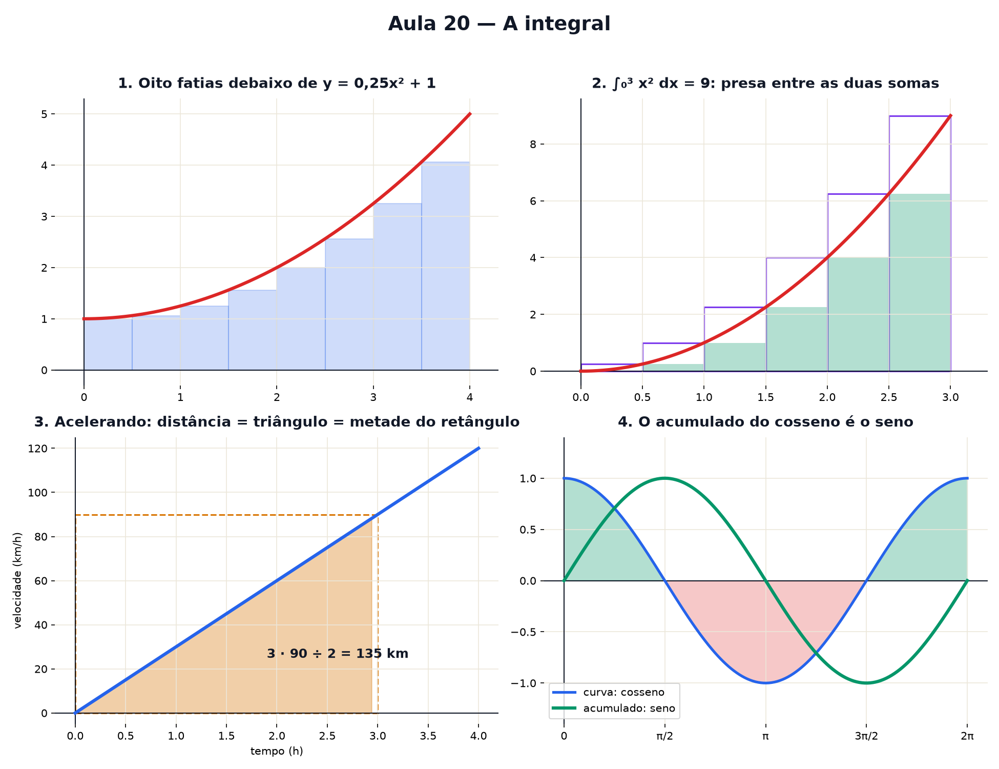

# Aula 20 — A integral: somando fatias

> Estas são as notas em texto da aula. A versão interativa, com os laboratórios e os exercícios
> que se corrigem sozinhos, está em [`index.html`](index.html).

*A integral: a área debaixo de uma curva parece impossível de medir — até você cortá-la em fatias
finas. E, no fim, ela é o caminho de volta da derivada.*

**Você já sabe:** área de retângulo e de quadrado (Aula 12), curvas (Aulas 13 e 14), chegar cada vez
mais perto e a derivada (Aula 19). Hoje o "chegar perto" é usado ao contrário.

Área de retângulo é fácil: base vezes altura. Mas qual é a área debaixo de uma parábola? Não tem
base reta em cima, não tem fórmula da escola que sirva. O truque é o mesmo da Aula 19, só que ao
contrário: em vez de dar zoom num ponto, **corte a área em fatias tão finas** que cada uma vira
praticamente um retângulo.

> **🧠 Poder do cérebro**
>
> Um carro anda com velocidade que muda o tempo todo, e você só tem o gráfico da velocidade. Como
> descobrir a distância que ele percorreu?
>
> **Resposta:** Fatie o tempo em pedaços bem curtos; em cada um, a velocidade quase não muda, e
> distância = velocidade × tempo. Some tudo. Isso é a área debaixo do gráfico: a integral.

---

## Fatie a curva

Divida o trecho em fatias de mesma largura. Cada fatia vira um retângulo com a altura da curva na
borda esquerda. Somando as áreas dos retângulos, sai uma **estimativa** da área. Com poucas fatias
sobra (ou falta) um pedaço; com muitas, quase nada.

> 🔧 **Laboratório — fatie a curva.** A curva é `y = 0,25x² + 1`, de x = 0 até x = 4. Mude o número
> de fatias. *(interativo, na versão em HTML)*

---

## Fatias cada vez mais finas: a área exata

Numa curva que sobe, os retângulos com a altura da borda **esquerda** ficam por baixo (faltam
pedacinhos) e os com a altura da borda **direita** ficam por cima (sobram pedacinhos). A área de
verdade está sempre presa entre as duas somas. Aumente as fatias e as duas se apertam até virar um
número só.

Esse número é a **integral**. Se escreve com um S esticado — de *soma*:

`∫₀³ x² dx = 9`

Lê-se: "a soma das fatias de altura x² e largura minúscula dx, de 0 até 3".

> 🔧 **Laboratório — fatias mais finas.** Curva `y = x²` de 0 até 3. Verde: soma por baixo. Contorno
> roxo: soma por cima. *(interativo, na versão em HTML)*

> **⚠️ Cuidado — área não é altura**
>
> De 0 a 3, a área debaixo de `x²` deu 9 — e a altura da curva no fim, `3² = 9`, também.
> **Coincidência!** De 0 a 6 a área é `6³/3 = 72`, mas a altura final é só `6² = 36`. A altura é
> quanto a curva mede num ponto; a área é o total juntado pelo caminho inteiro. Um é o velocímetro,
> o outro é o hodômetro.

---

## Velocidade vira distância

Um carro anda a 60 km/h durante 2 horas: 120 km. No gráfico de velocidade, isso é a área de um
retângulo — base 2 (horas), altura 60 (km/h). **A distância é a área debaixo da velocidade.**

E se o carro vai acelerando, saindo do zero? A área vira um **triângulo**. Todo triângulo retângulo
é metade do retângulo com a mesma base e altura (corte o retângulo na diagonal):

`área do triângulo = base · altura ÷ 2`

> 🔧 **Laboratório — velocidade vira distância.** Escolha o jeito de andar e o tempo de viagem.
> *(interativo, na versão em HTML)*

### Não existe pergunta idiota

**P:** Área pode ser negativa?

**R:** Na integral, sim: a parte da curva **abaixo** do eixo conta com sinal de menos. Faz sentido
com a velocidade: andar de ré desconta distância. No laboratório do acumulado, com o cosseno, você
vai ver o total subir e depois descer.

**P:** Por que dx, e não só x?

**R:** O dx lembra que cada fatia tem uma largura, minúscula mas não zero — é o h da Aula 19. A
integral é o resultado da soma quando essa largura encolhe sem parar.

---

## O acumulado ao vivo

Em vez de parar num ponto fixo, deixe o fim da área andar. Para cada x, `A(x)` é a área acumulada de
0 até x. Isso é uma máquina nova: entra x, sai o total acumulado até ali. É o hodômetro do carro: a
velocidade diz quão rápido, o acumulado diz quanto já foi.

> 🔧 **Laboratório — o acumulado ao vivo.** Em cima, a curva e a área até x. Embaixo, o acumulado
> `A(x)` sendo desenhado. *(interativo, na versão em HTML)*

> 🧘 **O Guru:** A derivada chega perto de um ponto; a integral junta infinitos pedacinhos. Parecem
> opostas — e são: uma desfaz a outra. Quando duas ideias difíceis viram ida e volta do mesmo
> caminho, você não precisa decorar duas coisas. Precisa entender uma.

---

## O caminho de volta: derivar o acumulado

Agora a surpresa. Quanto o acumulado `A(x)` sobe quando x anda um pouquinho h? Ele ganha **uma
fatia**: largura h, altura quase igual a `f(x)`. Então o passo é

`(A(x + h) − A(x)) ÷ h ≈ (h · f(x)) ÷ h = f(x)`

**A inclinação do acumulado é a própria curva.**
Acumular e depois derivar devolve o que você tinha no começo. Integral e derivada são caminhos de
ida e volta — como o quadrado e a raiz, a exponencial e o logaritmo.

Esse é o **Teorema Fundamental do Cálculo**. Na prática, ele troca "somar infinitas fatias" por
"achar uma máquina cuja derivada é f": como a derivada de `x³/3` é `x²`, a área de `x²` de 0 até 3 é
`3³/3 = 9` — o mesmo 9 das fatias.

> 🔧 **Laboratório — derivar o acumulado.** Curva `y = 0,5x + 1`. A fatia laranja é o que o acumulado
> ganha entre x e x + h. *(interativo, na versão em HTML)*

### 🔥 Conversa ao pé da lareira

Esta noite: **Derivada** e **Integral** discutem quem é a mais importante do Cálculo.

**Derivada:** Eu sou a lupa. Me dê qualquer curva e eu digo, ponto a ponto, quão rápido ela muda.
Velocímetro, inclinação, taxa de juros — tudo sou eu.

**Integral:** E eu sou a paciência. Você olha um instante; eu junto todos. Me dê a velocidade a cada
instante e eu devolvo a distância inteira da viagem.

**Derivada:** Mas as minhas contas são fáceis. As suas, com infinitas fatias, dão um trabalho
enorme.

**Integral:** Davam. Até descobrirem que eu sou o seu caminho de volta: para somar as fatias de f,
basta achar uma máquina cuja derivada é f. Eu uso você para trabalhar.

**Derivada:** Então, se eu derivo o que você acumulou...

**Integral:** ...volta a curva do começo. Ida e volta do mesmo caminho. Nenhuma de nós é mais
importante: o Cálculo é a gente junta.

---

## Volumes por fatias: a pilha de moedas

A mesma ideia mede volumes. Na Aula 12, o cilindro era uma pilha de moedas iguais. Um cone, uma taça
ou uma bola também são pilhas de moedas — só que de **raios diferentes**. Cada moeda fina tem volume
`π · raio² · espessura`; somando todas, com espessura cada vez menor, sai o volume exato. Foi assim
que se confirmou que a esfera tem `4/3 · π · raio³`, o número que a Aula 12 deixou prometido.

> 🔧 **Laboratório — a pilha de moedas.** Escolha o sólido e aumente o número de moedas. A soma se
> aproxima do volume exato. *(interativo, na versão em HTML)*

---

## Pontos importantes

- Área debaixo de uma curva ≈ soma de retângulos finos (fatias).
- Com fatias cada vez mais finas, a soma chega na área exata: a **integral**, `∫ f(x) dx`.
- Triângulo = metade do retângulo: `base · altura ÷ 2`.
- Distância = área debaixo da velocidade. Total = área debaixo de uma taxa.
- Parte abaixo do eixo conta negativa.
- O acumulado `A(x)` tem inclinação `f(x)`: integrar e derivar são caminhos de ida e volta.
- Volume por fatias: some moedas de volume `π · raio² · espessura` (cone, taça, esfera).

---

## ✏️ Afie o lápis

1. Uma fatia tem largura 2 e altura 5. Qual é a área dela? → **10**
2. Um triângulo retângulo tem base 6 e altura 4. Qual é a área? → **12**
3. Um carro anda a 80 km/h, sem variar, durante 3 horas. Quantos km ele percorre? → **240**
4. *(quem faz o quê?)* Ligue cada ideia ao que ela quer dizer. → **integral → a área debaixo da
   curva; retângulos cada vez mais finos → a aproximação que chega à área exata; inclinação do
   acumulado A(x) → f(x): derivar o acumulado devolve a curva; área debaixo do gráfico da velocidade
   → a distância percorrida**
5. *(o desafio)* Qual é a área debaixo da reta `y = x`, de x = 0 até x = 4? → **8**
6. `A(x)` é a área acumulada debaixo de uma curva f, de 0 até x. Qual é a inclinação de A no
   ponto x? → **f(x): a altura da curva naquele ponto.**
