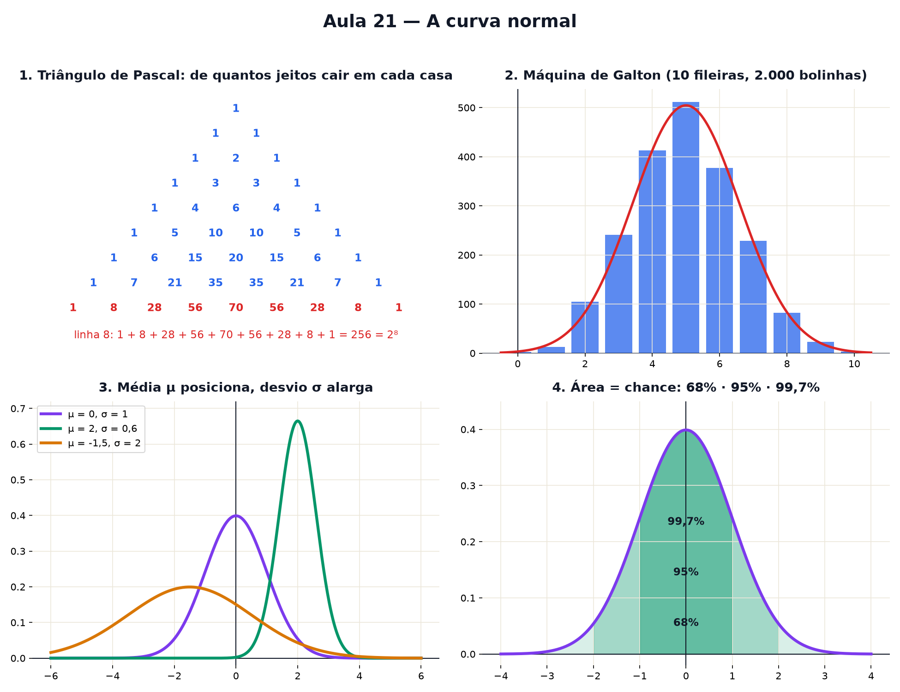

# Aula 21 — A curva normal

> Estas são as notas em texto da aula. A versão interativa, com os laboratórios e os exercícios
> que se corrigem sozinhos, está em [`index.html`](index.html).

*Um acaso sozinho não tem regra, mas milhares de acasos somados desenham sempre o mesmo sino — e a
área debaixo dele mede a chance.*

**Você já sabe:** contar casos e medir a chance (Aula 6), média e desvio padrão (Aula 5), o número e
e o expoente negativo (Aula 14), π (Aula 11) e área como soma de fatias (Aula 20). O sino usa tudo
isso ao mesmo tempo.

Na Aula 6, a moeda sozinha era imprevisível e mil moedas davam perto de 50% de caras. Mas *quão*
perto? 480? 530? E com que chance? A resposta tem uma forma — um **sino** — que aparece nas notas de
uma prova, na altura das pessoas, nos erros de medida e em quase tudo que é soma de muitos pequenos
acasos.

> **🧠 Poder do cérebro**
>
> Você joga 10 moedas. Qual é mais provável: sair **5 caras** ou sair **10 caras**? Quantas vezes
> mais provável?
>
> **Resposta:** 10 caras só acontece de 1 jeito. 5 caras acontece de **252** jeitos (é escolher
> quais 5 das 10 moedas dão cara). Então 5 caras é 252 vezes mais provável. Contar esses "jeitos de
> escolher" é o assunto da seção 1.

---

## Combinações e o triângulo de Pascal

Na Aula 6 você contou **filas** (a ordem importa). Agora conte **grupos**: de quantos jeitos dá para
escolher 2 sabores de sorvete entre 4? A ordem não importa (chocolate-morango é o mesmo que
morango-chocolate), então divida as filas pelas repetições: `4 × 3 ÷ 2 = 6`. Isso é uma
**combinação**.

Existe um jeito lindo de achar todas elas: o **triângulo de Pascal**. Cada número é a soma dos dois
de cima. A linha n guarda de quantos jeitos escolher 0, 1, 2... de n coisas — e, por isso, de
quantos jeitos n moedas dão 0, 1, 2... caras.

> 🔧 **Laboratório — o triângulo de Pascal.** Escolha a linha. As barras embaixo são os números dessa
> linha: já parecem um sino. *(interativo, na versão em HTML)*

---

## Somar muitos acasos pequenos: surge o sino

Solte uma bolinha num tabuleiro de pinos: em cada fileira ela vai para a esquerda ou para a direita,
meio a meio. A posição final é a **soma** de vários pequenos acasos — e a chance de cada pilha é
exatamente o número de Pascal dividido pelo total. Solte centenas e as pilhas desenham um **sino**.

> 🔧 **Laboratório — a máquina de Galton.** Solte bolinhas. Mude o número de fileiras e veja o sino
> ficar mais liso. *(interativo, na versão em HTML)*

> 🧘 **O Guru:** O acaso é imprevisível de perto e previsível de longe. O sino é a régua do 'de
> longe' — mas toda régua tem limite. Quem entende o sino sabe usar; quem entende as caudas sabe
> quando não usar.

---

## A curva normal

Esse sino aparece em toda parte onde muitos pequenos efeitos se somam. Ele tem uma fórmula — e agora
você conhece cada peça dela:

`y = e^(−z²/2) ÷ (σ · √(2π)) com z = (x − μ) ÷ σ`

- **μ** (mi) é a média (Aula 5): onde fica o topo — o h da parábola da Aula 13.
- **σ** (sigma) é o desvio padrão (Aula 5): a largura do sino.
- `e^(−z²/2)`: o expoente negativo da Aula 14 faz a curva cair rápido longe da média.
- `σ · √(2π)`: o π da Aula 11 está aí só para a área total dar exatamente 1.

> 🔧 **Laboratório — o sino ajustável.** Mude a média e o desvio. A curva cinza é o sino padrão (μ =
> 0, σ = 1). *(interativo, na versão em HTML)*

---

## Área = chance: a regra 68–95–99,7

A área total debaixo do sino é 1 (100%). A área de um pedaço é a **chance** de o resultado cair ali
— medida com as fatias da Aula 20. E um fato vale para **todo** sino, de qualquer média e desvio:

a 1 desvio da média: ≈ **68%** dos casos
a 2 desvios: ≈ **95%**
a 3 desvios: ≈ **99,7%**

> 🔧 **Laboratório — área = chance.** Escolha quantos desvios para cada lado da média. O laboratório
> soma as fatias. *(interativo, na versão em HTML)*

---

## Padronizar: o z que compara tudo

Uma nota 80 numa prova com média 60 e desvio 10 é melhor ou pior que uma nota 70 numa prova com
média 65 e desvio 2,5? Traduza as duas para "quantos desvios acima da média": isso é o **z**, `z =
(x − μ) ÷ σ`. A primeira é z = 2; a segunda, z = 2 também — empate! Com o z, todo sino vira o sino
padrão, e uma única tabela serve para todos.

> 🔧 **Laboratório — padronizar (z).** Escolha a nota, a média e o desvio da turma. O laboratório
> traduz para z e diz quantos da turma ficaram abaixo. *(interativo, na versão em HTML)*

---

## Quando o sino mente: caudas gordas

O sino vale quando muitos efeitos pequenos e **independentes** se **somam**. Quando os efeitos se
multiplicam, se contagiam ou vêm de poucas causas grandes (renda, tamanho de cidades, movimentos
bruscos de preço), as pontas da curva — as **caudas** — ficam muito mais gordas: eventos de 5
desvios, que o sino diz acontecerem uma vez em milhões de anos, aparecem de tempos em tempos.

> 🔧 **Laboratório — caudas gordas × sino.** Compare o sino com uma curva de cauda gorda de mesma
> média e mesmo desvio. Olhe para longe do centro. *(interativo, na versão em HTML)*

> **⚠️ Cuidado — usar o sino onde ele não vale**
>
> Muita gente já perdeu dinheiro achando que "5 desvios é impossível". O sino é uma ótima régua para
> alturas, notas e erros de medida; para riscos extremos (quedas de mercado, enchentes, pandemias),
> ele **subestima** a chance do desastre. Antes de usar a regra 68–95–99,7, pergunte: isso é uma
> soma de muitos pequenos acasos independentes?

### Não existe pergunta idiota

**P:** Por que a área total precisa dar 1?

**R:** Porque algum resultado sempre acontece: a chance de "qualquer coisa" é 100%. Se a área desse
2, as chances somariam 200%, o que não faz sentido.

**P:** O triângulo de Pascal e o sino são a mesma coisa?

**R:** Quase: a linha n de Pascal, dividida pelo total, é a chance de cada número de caras em n
moedas. Com n grande, esses pontos colam perfeitamente numa curva normal. É o **Teorema Central do
Limite** — o motivo de o sino aparecer em toda parte.

---

## Pontos importantes

- **Combinação**: escolher sem ordem. `4 × 3 ÷ 2 = 6` grupos de 2 entre 4. Triângulo de Pascal: cada
  número é a soma dos dois de cima.
- Somar muitos acasos pequenos e independentes dá o **sino**: a curva normal.
- μ posiciona o topo, σ dá a largura; a fórmula usa e, π e expoente negativo.
- **Área debaixo do sino = chance**. 1, 2, 3 desvios: 68%, 95%, 99,7%.
- **z = (x − μ) ÷ σ**: quantos desvios da média. Compara sinos diferentes.
- Caudas gordas: fora das somas de pequenos acasos, o sino subestima os extremos.

---

## ✏️ Afie o lápis

1. De quantos jeitos dá para escolher 2 sabores de sorvete entre 4 (a ordem não importa)? → **6**
2. Numa prova com média 60 e desvio 10, você tirou 80. Qual é o seu z (quantos desvios acima da
   média)? → **2**
3. *(quem faz o quê?)* Ligue cada peça do sino ao seu papel. → **média → o centro do sino; desvio
   padrão → a largura do sino; z → quantos desvios um valor está da média; cauda gorda → extremos
   mais frequentes do que o sino promete**
4. A altura de um grupo segue um sino com média 170 cm e desvio 10 cm. Uns 95% das pessoas ficam
   entre 150 cm e quantos cm? → **190**
5. *(o desafio)* 1.000 alunos fizeram uma prova. As notas seguem um sino com média 60 e desvio
   10. Aproximadamente **quantos alunos** tiraram entre 50 e 70? → **680**
6. Em qual destas situações é mais **perigoso** confiar na regra 68–95–99,7? → **Queda diária de
   uma bolsa de valores.**
