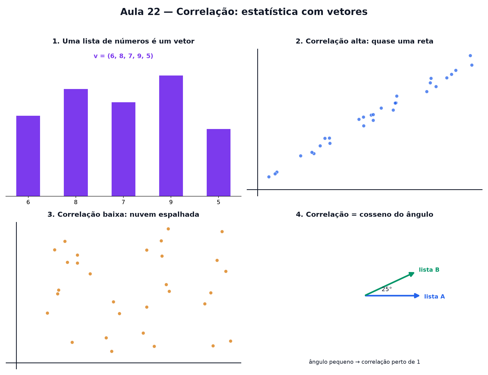

# Aula 22 — Correlação: estatística com vetores

> Estas são as notas em texto da aula. A versão interativa, com os laboratórios e os exercícios
> que se corrigem sozinhos, está em [`index.html`](index.html).

*Onde "correlação" para de soar místico: é só o produto escalar de sempre, disfarçado.*

**Você já sabe:** média e desvio padrão (Aula 5), e que vetor é uma seta cujo produto escalar conta
uma história sobre o ângulo entre duas setas (Aula 17). Hoje as duas coisas viram uma só.

Duas listas de números relacionadas — altura e peso de várias pessoas, horas de estudo e nota da
prova — escondem um vetor dentro de cada uma. E o ângulo entre esses dois vetores já tem nome:
**correlação**.

> **🧠 Poder do cérebro**
>
> Pessoas mais altas costumam calçar números maiores. Como medir, com um número só, o quanto duas
> listas "andam juntas"?
>
> **Resposta:** Tire a média de cada lista e veja se, pessoa a pessoa, os desvios têm o mesmo sinal
> (os dois acima da média, ou os dois abaixo). A correlação transforma isso num número entre −1 e 1
> — e ele é o cosseno de um ângulo.

---

## Uma lista de números é um vetor

Lembra que na Aula 17 um vetor era uma seta com várias coordenadas? Uma **lista de números
pareados** — por exemplo, a nota de 5 provas — também pode ser vista como um vetor de 5 coordenadas.
Não dá mais para desenhar a seta no papel (5 dimensões não cabem numa folha), mas a ideia continua a
mesma.

Da Aula 5 você já traz as ferramentas de uma lista só: a **média** (o ponto de equilíbrio),
**centralizar** (subtrair a média de cada número) e o **desvio padrão** (o tamanho típico do
espalhamento). Hoje a pergunta é outra: como **duas** listas andam juntas?

> 🔧 **Laboratório — nuvem de pontos com correlação ao vivo.** Arraste o controle e observe a nuvem
> de pontos ficar mais alinhada (correlação alta) ou mais espalhada (correlação baixa).
> *(interativo, na versão em HTML)*

---

## Duas listas, dois vetores, um ângulo

Se eu tenho duas listas relacionadas — quanto cada pessoa estudou e a nota que tirou —, cada lista
vira um vetor. O **ângulo entre esses dois vetores** conta o quanto elas "andam juntas".

Vetores apontando quase para o mesmo lado → as listas sobem e descem juntas. Vetores apontando para
lados opostos → quando uma sobe, a outra desce.

> 🔧 **Laboratório — dois vetores, ângulo e correlação.** Gire o vetor B e observe o ângulo — e a
> correlação — mudando juntos. *(interativo, na versão em HTML)*

---

## Reencontro com o produto escalar

A correlação usa exatamente a mesma conta da Aula 17, só que com um ajuste: primeiro, cada lista é
**centralizada** (como no laboratório acima), e depois se calcula o produto escalar entre elas —
dividido pelos tamanhos das duas setas (a raiz da soma dos quadrados, Aula 4).

`correlação = cosseno do ângulo entre os vetores (depois de centralizar)`

### Não existe pergunta idiota

**P:** Por que a correlação sempre vive entre −1 e 1?

**R:** Porque ela é, literalmente, um cosseno — e você já viu na Aula 15 que cosseno nunca passa de
1 nem fica abaixo de −1. Correlação 1 quer dizer ângulo 0° (andam perfeitamente juntas). Correlação
−1 quer dizer ângulo 180° (andam perfeitamente opostas).

**P:** Correlação alta prova que uma coisa causa a outra?

**R:** Não! Duas coisas podem "andar juntas" sem que uma cause a outra — pode haver uma terceira
causa escondida, ou pode ser coincidência. Correlação mede só o "andam juntas", nunca o "por quê".

> 🔧 **Laboratório — a escala não muda a correlação.** Multiplique todos os valores da lista B por um
> número — a nuvem muda de forma, mas a correlação (o cosseno) fica exatamente igual. *(interativo,
> na versão em HTML)*

> 🧘 **O Guru:** Estatística assusta porque chega cheia de fórmulas. Mas olhe de novo: média é o
> ponto de equilíbrio, desvio é o tamanho de uma seta, correlação é um ângulo. Você não aprendeu um
> assunto novo — aprendeu a enxergar uma lista de números como uma seta.

---

## Lendo o valor da correlação

Alguns valores de referência para ler um número de correlação:

- **perto de 1:** forte e positiva — quando uma sobe, a outra sobe junto.
- **perto de 0:** praticamente nenhuma relação linear.
- **perto de −1:** forte e negativa — quando uma sobe, a outra desce.

> 🔧 **Laboratório — positiva, negativa ou nula?** Para cada par de variáveis do dia a dia, adivinhe
> o sinal esperado da correlação. *(interativo, na versão em HTML)*

> 🔧 **Laboratório — adivinhe a correlação.** Olhe a nuvem de pontos e escreva um palpite (entre −1 e
> 1) antes de revelar. *(interativo, na versão em HTML)*

---

## Correlação zero não quer dizer "sem relação"

A correlação é o cosseno entre duas setas — e setas são retas. Por isso ela só enxerga relações em
**linha reta**. Se uma lista depende da outra por uma curva, a correlação pode dar zero mesmo com a
relação sendo perfeita.

> 🔧 **Laboratório — a relação que a correlação não vê.** Os pontos seguem uma parábola perfeita
> (Aula 13). Mova o trecho de x que você observa e acompanhe a correlação. *(interativo, na versão
> em HTML)*

> **⚠️ Cuidado — correlação só mede linha reta**
>
> Correlação perto de zero não prova que duas coisas não têm nada a ver: elas podem estar ligadas
> por uma curva (como o sono e o rendimento, que piora tanto com pouco quanto com sono demais).
> Antes de concluir, **desenhe a nuvem de pontos**. E correlação alta também não prova causa (veja
> acima).

---

## Pontos importantes

- Uma lista de números pareados vira um **vetor**.
- **Média** = soma ÷ quantidade. **Centralizar** = subtrair a média. **Desvio padrão** = o tamanho
  típico das diferenças para a média.
- Duas listas relacionadas → dois vetores; o **ângulo** entre eles conta a história.
- **Correlação = cosseno do ângulo** entre os vetores centralizados.
- Vive sempre entre **−1 e 1** — porque é literalmente um cosseno.
- **Perto de 1:** andam juntas. **Perto de 0:** sem relação linear. **Perto de −1:** andam opostas.
- Correlação não é prova de causa — só mede o "andam juntas".

---

## ✏️ Afie o lápis

1. A correlação entre duas listas é, na essência, o quê? → **O cosseno do ângulo entre os dois
   vetores (depois de centralizar).**
2. A lista `(4, 6, 8, 10, 12)` vai ser **centralizada** (cada número menos a média). Que número
   fica no lugar do 6? → **−2**
3. Duas listas têm correlação **−1**. O que isso quer dizer sobre o ângulo entre os vetores? →
   **180**
4. Duas variáveis têm correlação alta. Isso prova que uma **causa** a outra? → **Não — correlação
   só mostra que andam juntas, não o motivo.**
5. *(o desafio)* O ângulo entre dois vetores de dados centralizados é **60°**. Qual é a
   correlação entre eles? → **0,5**
6. *(quem faz o quê?)* Ligue cada valor ou passo ao que ele diz. → **correlação +1 → pontos numa
   reta que sobe; correlação −1 → pontos numa reta que desce; correlação 0 → nenhuma tendência de
   reta (pode haver curva!); centralizar → tirar a média de cada lista**
