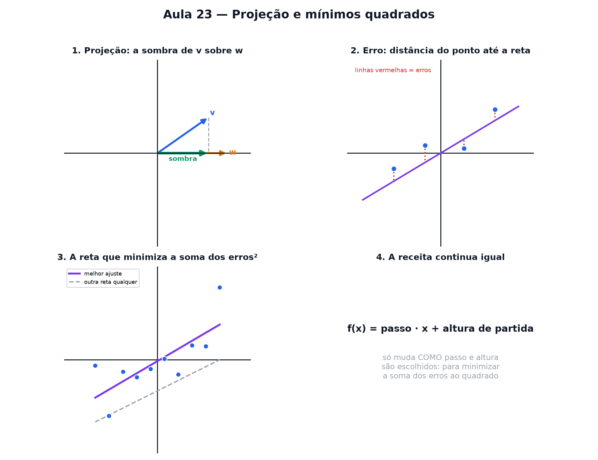

# Aula 23 — Projeção e mínimos quadrados

> Estas são as notas em texto da aula. A versão interativa, com os laboratórios e os exercícios
> que se corrigem sozinhos, está em [`index.html`](index.html).

*"A reta que melhor se ajusta aos pontos" não precisa de cálculo avançado — é geometria de sombra.*

**Você já sabe:** projetar é jogar sombra (Aula 15, o cosseno já era essa ideia) e vetores com
produto escalar (Aula 17); e da Aula 22, a correlação. Hoje a sombra ajusta uma reta aos dados.

Pontos de dados quase nunca ficam perfeitamente alinhados numa reta — e mesmo assim, a gente
consegue achar a "melhor" reta possível para eles. A ideia por trás disso é a mesma sombra da Aula
15.

> **🧠 Poder do cérebro**
>
> Dez pontos estão quase em fila, mas não exatamente. Você só pode desenhar uma reta. Qual é "a
> melhor"? E o que quer dizer "melhor"?
>
> **Resposta:** Primeiro é preciso escolher como medir o erro. A escolha clássica: somar os erros ao
> quadrado e ficar com a reta que deixa essa soma mínima — os mínimos quadrados. E dá para achá-la
> jogando uma sombra.

---

## Projetar é jogar sombra

Lembra da Aula 15? Cosseno e seno eram a sombra de um ponto girando. **Projetar** é a mesma ideia,
só que agora aplicada a um vetor sobre outro: é o pedacinho de uma seta que "cabe" na direção da
outra — a sombra que uma joga sobre a outra.

> 🔧 **Laboratório — projeção de um vetor sobre outro.** Gire o vetor v e observe a sombra dele (em
> verde) caindo sobre a direção de w. *(interativo, na versão em HTML)*

> 🔧 **Laboratório — monte a projeção, passo a passo.** Calcule a sombra de `v` sobre `w` com o
> produto escalar (Aula 17): `sombra = (v · w) / tamanho(w)`. O laboratório confere e desenha.
> *(interativo, na versão em HTML)*

---

## Nem tudo cabe numa reta perfeita

Se eu tenho vários pontos de dados — horas de sono e nota do dia seguinte, por exemplo —
dificilmente eles caem exatamente sobre uma reta. Sempre sobra um pouquinho de **erro**: a distância
entre o ponto real e a reta.

> **⚠️ Cuidado — erro não é o mesmo que "reta errada"**
>
> Nenhuma reta consegue passar exatamente por todos os pontos, a menos que eles já estejam
> perfeitamente alinhados. O objetivo não é zerar o erro — é **minimizá-lo**.

> 🔧 **Laboratório — erro grande ou pequeno?** Compare a distância de cada ponto até a reta e
> adivinhe: o erro dele é grande, pequeno ou zero? *(interativo, na versão em HTML)*

---

## Mínimos quadrados

A receita: para cada ponto, meça o erro (a distância vertical até a reta), eleve ao quadrado (Aula
4), e some tudo. A "melhor" reta é aquela que deixa essa **soma dos erros ao quadrado** a menor
possível.

Por que elevar ao quadrado? Assim, erros positivos e negativos não se cancelam — e erros grandes
pesam desproporcionalmente mais, então a reta tenta evitá-los.

> 🔧 **Laboratório — reta de regressão se ajustando ao vivo.** Arraste qualquer ponto e observe a
> reta de melhor ajuste se atualizar sozinha. *(interativo, na versão em HTML)*

> 🧘 **O Guru:** Nenhuma reta passa por todos os pontos da vida real. A pergunta certa não é "qual
> reta é perfeita?", e sim "qual erra menos?". E a resposta é uma sombra — a mesma projeção que você
> já sabia fazer desde o começo desta aula.

---

## A receita continua a mesma

A reta de regressão ainda é uma reta comum — cabe na mesma receita da Aula 9: `f(x) = passo · x +
altura de partida`. O que muda é **como** passo e altura são escolhidos: não à mão, mas para
minimizar o erro total.

### Não existe pergunta idiota

**P:** Isso tem a ver com projeção mesmo, ou é só coincidência de nome?

**R:** Tem a ver de verdade: a reta de mínimos quadrados pode ser entendida como a "sombra" do vetor
de dados reais sobre o espaço de todas as retas possíveis. É a mesma ideia de projeção da Aula 15,
só que aplicada num espaço bem maior do que um círculo.

**P:** Isso serve para prever o futuro?

**R:** Serve para estimar — dado um novo valor de x, a reta dá um palpite razoável de y, baseado no
padrão dos dados que já existem. Não é garantia, é a melhor aposta linear disponível.

> 🔧 **Laboratório — comparador de erro.** Mova a reta manualmente e veja a soma dos erros ao
> quadrado subir — a reta de mínimos quadrados (em cinza) é sempre a que deixa esse número mais
> baixo. *(interativo, na versão em HTML)*

> 🔧 **Laboratório — estique o vetor, a projeção também estica.** Multiplique v por um número e
> observe: a sombra dele sobre w estica ou encolhe na mesma proporção. *(interativo, na versão em
> HTML)*

---

## Pontos importantes

- **Projetar** é jogar sombra de um vetor sobre outro — a mesma ideia do cosseno (Aula 15).
- Pontos de dados raramente caem numa reta perfeita — sempre sobra um **erro**.
- **Mínimos quadrados:** a reta que deixa a soma dos erros ao quadrado a menor possível.
- Elevar ao quadrado evita que erros positivos e negativos se cancelem.
- A reta de regressão ainda é `f(x) = passo · x + altura de partida` — só escolhida para minimizar o
  erro.

---

## ✏️ Afie o lápis

1. Uma seta de tamanho 10 faz um ângulo de **60°** com uma reta. Qual é o tamanho da sombra (a
   projeção) dela sobre a reta? → **5 — tamanho · cosseno de 60° = 10 · 0,5.**
2. *(quem faz o quê?)* Ligue cada peça ao seu papel. → **projeção → a sombra de um vetor sobre
   outro; erro de um ponto → a distância vertical do ponto até a reta; mínimos quadrados → o
   critério: menor soma dos erros ao quadrado; reta de regressão → a reta que esse critério
   escolhe**
3. Mínimos quadrados escolhe a reta que minimiza o quê? → **A soma dos erros (distância
   ponto-reta) elevados ao quadrado.**
4. Por que elevar os erros ao quadrado, em vez de simplesmente somá-los? → **Para que erros
   positivos e negativos não se cancelem.**
5. *(o desafio)* A reta `f(x) = x` passa perto dos pontos (1, 2), (2, 1) e (3, 3). Qual é a
   **soma dos erros ao quadrado**? → **2**
6. A reta de regressão é `f(x) = 2 · x`. O ponto (3, 9) fica quanto acima dela (o erro)? → **3**
