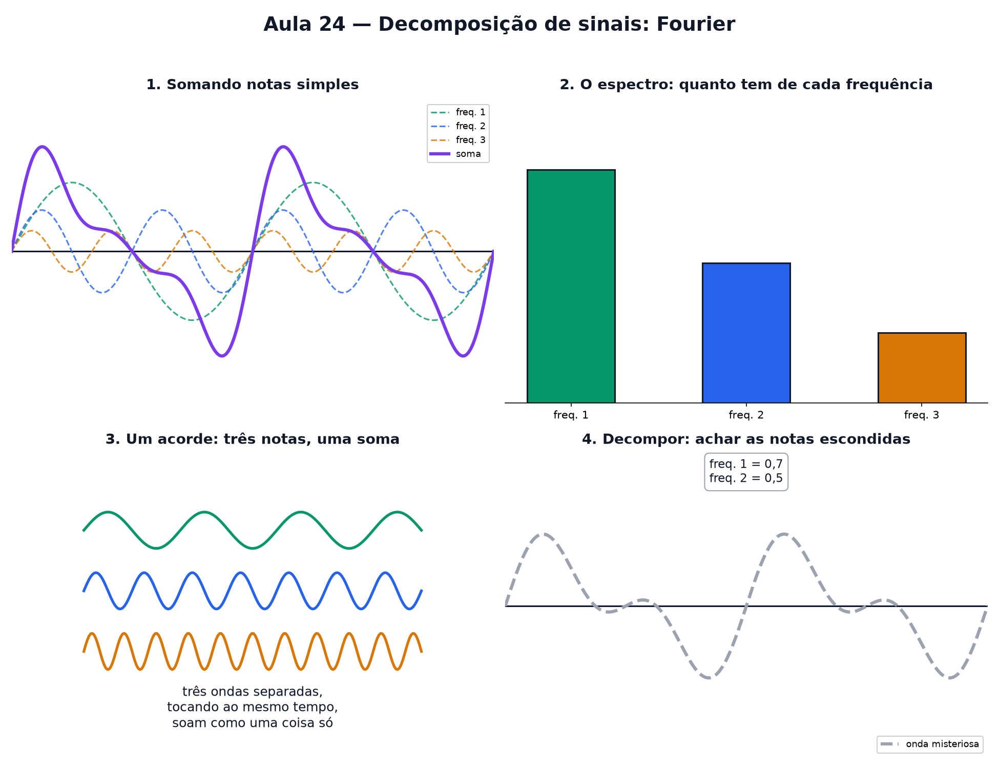

# Aula 24 — Decomposição de sinais: Fourier

> Estas são as notas em texto da aula. A versão interativa, com os laboratórios e os exercícios
> que se corrigem sozinhos, está em [`index.html`](index.html).

*Todo som complicado é só várias ondas simples somadas — e dá para desmontar a soma de volta.*

**Você já sabe:** na Aula 16 você somou ondas simples e viu o resultado ficar complicado; na Aula 23
aprendeu a projetar. Hoje as duas ideias se encontram.

Você já sabe que somar ondas dá uma onda mais complicada. E se alguém te desse a onda complicada
pronta — dá para descobrir quais ondas simples a formaram?

> **🧠 Poder do cérebro**
>
> Num acorde de violão três notas tocam juntas, e o ar só leva uma onda embolada. Mesmo assim seu
> ouvido distingue as três. Como separar uma soma de ondas nas ondas que a formaram?
>
> **Resposta:** Teste cada frequência: multiplique o sinal pela onda de teste e tire a média (o
> produto escalar da Aula 17). Se a nota está lá, sobra alguma coisa; se não está, dá zero. Isso é a
> análise de Fourier.

---

## A pergunta ao contrário

Na Aula 16, você somava `seno(x)` com `seno(2x)` e via o resultado ficar mais "cheio". Hoje a
pergunta se inverte: dado um sinal complicado, **quais ondas simples, somadas, dão exatamente ele?**

Essa é a ideia por trás da **Transformada de Fourier** — um nome grande para uma pergunta simples:
"de que ondas isso é feito?"

> 🔧 **Laboratório — monte uma onda complicada.** Ligue e ajuste até três ondas simples. A onda roxa
> embaixo é a soma de todas — vá vendo ela ficar mais "cheia". *(interativo, na versão em HTML)*

---

## Cada "nota" tem sua altura e sua largura

No laboratório acima, cada onda simples tem uma **frequência fixa** (1, 2 ou 3 — quantas voltas
cabem no mesmo espaço, como na Aula 16) e uma **altura ajustável** (amplitude). A onda complicada
nada mais é que essas três "notas" tocando ao mesmo tempo.

Pense num acorde de piano: três notas tocadas juntas soam como uma coisa só, mas por trás existem
três ondas separadas, cada uma com sua própria altura.

> 🔧 **Laboratório — reconheça a frequência.** Uma onda simples aparece na tela. Antes de revelar,
> adivinhe a frequência dela: 1, 2 ou 3. *(interativo, na versão em HTML)*

---

## O espectro: quanto tem de cada frequência

Um jeito de "ver" as notas escondidas numa onda é desenhar um gráfico à parte: uma barra para cada
frequência, do tamanho da altura (amplitude) daquela onda. Esse gráfico chama-se **espectro**.

> 🔧 **Laboratório — o equalizador.** As barras mostram o espectro da onda que você montou no
> laboratório anterior. **Clique numa barra** (ou nos botões) para desligar ou religar aquela
> frequência — como o equalizador de um aparelho de som — e veja o que sobra da onda. *(interativo,
> na versão em HTML)*

### Não existe pergunta idiota

**P:** Onde isso aparece na vida real?

**R:** Em qualquer coisa que grava ou comprime som e imagem: um MP3 guarda o espectro do áudio em
vez da onda inteira, porque o ouvido humano não percebe certas frequências tão bem — então elas são
descartadas com cuidado. Um JPEG faz algo parecido com padrões de cor numa imagem.

**P:** Toda onda pode ser decomposta assim?

**R:** Praticamente qualquer sinal que se repete pode ser escrito como uma soma de ondas simples —
às vezes precisando de muitas, muitas frequências. A ideia continua a mesma: cada uma com sua
própria altura, todas somadas.

> 🧘 **O Guru:** Uma onda complicada é só várias ondas simples falando ao mesmo tempo. Para ouvir
> cada uma você não precisa de mágica: basta perguntar a cada nota "quanto de você tem aqui dentro?"
> — e a projeção responde, uma de cada vez.

---

## Desmontando de volta

Se alguém te entrega só a onda complicada, sem dizer as alturas usadas, dá para descobrir por
tentativa e ajuste. Mas existe um jeito direto — e você já conhece a ferramenta.

Na Aula 23 você projetou uma seta sobre outra para saber "quanto dela aponta naquela direção". Aqui
é a mesma coisa: trate o sinal e cada onda simples como **vetores** (listas com a altura em cada
instante, como na Aula 22). A **projeção do sinal sobre `seno(2x)`** diz exatamente quanto de
`seno(2x)` existe dentro dele.

O truque que faz funcionar: ondas simples de frequências diferentes são **perpendiculares** entre si
— o produto escalar entre elas dá zero. Então, ao projetar sobre uma, as outras "somem" da conta e
sobra só a altura daquela nota.

> **⚠️ Cuidado — só funciona com voltas completas**
>
> As ondas de frequências diferentes só são perpendiculares se você olhar um trecho em que **todas
> dão voltas inteiras** (aqui, de 0 até 360°). Corte o sinal no meio de uma volta e o produto
> escalar entre elas deixa de ser zero: uma nota "vaza" para dentro da outra e as alturas lidas saem
> erradas. Em áudio de verdade, isso tem até nome — vazamento espectral.

> 🔧 **Laboratório — projete o sinal em cada onda.** O sinal roxo esconde três notas. Clique numa
> frequência para projetar o sinal sobre ela e ler a altura escondida. *(interativo, na versão em
> HTML)*

É isso que a **Transformada de Fourier** faz, só que com milhares de frequências de uma vez: uma
projeção por frequência, e o resultado de cada uma vira uma barra do espectro.

> 🔧 **Laboratório — decomponha a onda misteriosa.** A onda cinza tracejada usa só as frequências 1 e
> 2. Ajuste as duas alturas até a onda roxa cobrir a cinza. *(interativo, na versão em HTML)*

---

## Ondas como giros

Um ponto girando no círculo tem uma **altura** que sobe e desce: a onda seno da Aula 16. Agora junte
setas girando, uma na ponta da outra, cada uma com sua velocidade: a altura da última ponta desenha
a **soma de ondas** do começo desta aula. É assim que a decomposição de Fourier é escrita de
verdade: como uma soma de números complexos `e^(iωt)` girando (Aula 18) — cada nota do espectro é
uma seta, com o tamanho da altura daquela onda.

> 🔧 **Laboratório — ondas como giros.** A seta grande dá 1 volta; a pequena, na ponta dela, gira
> mais rápido. A altura da ponta vira a onda à direita. *(interativo, na versão em HTML)*

---

## Pontos importantes

- Toda onda complicada pode ser vista como **várias ondas simples somadas**.
- Cada onda simples tem sua própria **frequência** (fixa) e **altura/amplitude** (a "quantidade"
  daquela nota).
- O **espectro** é um gráfico de barras: uma barra por frequência, do tamanho da amplitude.
- Decompor é achar quais alturas, para quais frequências, reproduzem a onda dada — e cada altura é a
  **projeção** do sinal sobre aquela onda (Aula 23).
- Isso é a ideia por trás da **Transformada de Fourier**, usada em áudio, imagem e compressão.
- Cada onda é a altura de uma seta girando `e^(iωt)` (Aula 18): somar ondas é somar setas que giram.

---

## ✏️ Afie o lápis

1. Decompor um sinal em ondas significa: → **Descobrir quais ondas simples, somadas, formam
   aquele sinal.**
2. No espectro (gráfico de barras), o que a altura de cada barra representa? → **A amplitude
   daquela frequência no sinal.**
3. O sinal é `3 · seno(x) + seno(3x)`. Qual é a altura da barra na frequência 1 e na frequência
   3? → **freq. 1: 3, freq. 3: 1**
4. *(quem faz o quê?)* Ligue cada peça ao seu papel. → **decompor → escrever o sinal como soma de
   ondas simples; espectro → as barras: quanto há de cada frequência; frequência → quantas voltas a
   onda dá no mesmo espaço; produto escalar com uma onda de teste → mede quanto daquela onda existe
   no sinal**
5. *(o desafio)* O sinal é `2 · seno(x) + 0,5 · seno(2x)`. Qual é a altura da barra mais alta do
   espectro? → **2**
6. Um sinal medido em 4 instantes é `(2, 0, −2, 0)` e a onda de teste é `(1, 0, −1, 0)`. Quanto
   dessa onda existe no sinal? Calcule (sinal · onda) ÷ (onda · onda). → **2**
