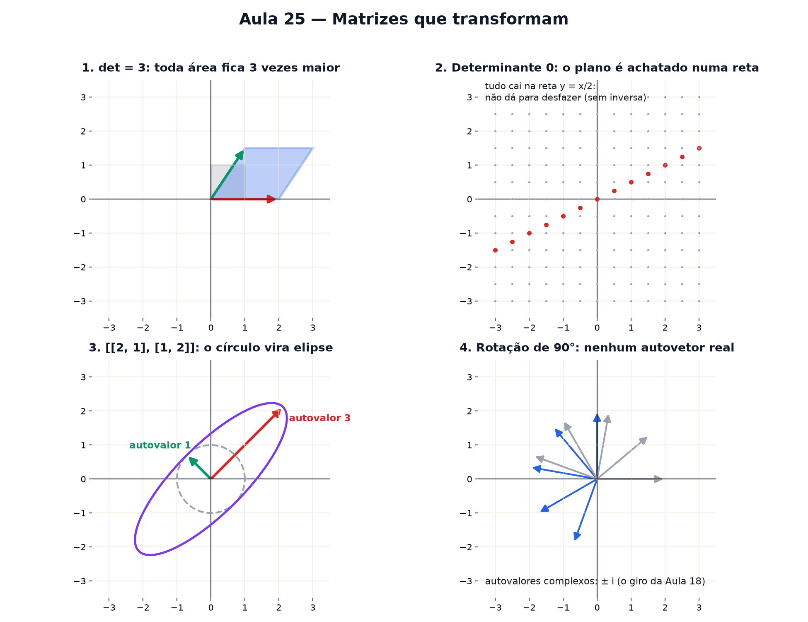

# Aula 25 — Matrizes que transformam

> Estas são as notas em texto da aula. A versão interativa, com os laboratórios e os exercícios
> que se corrigem sozinhos, está em [`index.html`](index.html).

*Determinante, inversa e autovalores costumam ser ensinados como contas. São três perguntas de
desenho: quanto a área estica, como desfazer, e quais setas não giram.*

**Você já sabe:** sistemas de equações (Aula 10), matriz como tabela que move setas e o sistema como
matriz (Aula 17), e números complexos como giros (Aula 18). Hoje a matriz ganha raio-X.

Na Aula 17, uma matriz 2 × 2 pegava cada seta do plano e devolvia outra: girava, esticava,
espelhava. Olhar para cada seta, uma por uma, cansa. Esta aula faz três perguntas que resumem
**tudo** o que uma matriz faz com o plano inteiro.

> **🧠 Poder do cérebro**
>
> A matriz `[[2, 0], [0, 3]]` estica o plano 2 vezes na horizontal e 3 na vertical. Um quadradinho
> de área 1 vira um retângulo de que área? E se fosse `[[2, 0], [0, −3]]`?
>
> **Resposta:** 2 × 3 = 6 nos dois casos — mas no segundo o retângulo também foi **espelhado**
> (virou de cabeça para baixo). O determinante guarda as duas informações: vale 6 no primeiro caso e
> −6 no segundo.

---

## O determinante é área

Aplique a matriz `[[a, b], [c, d]]` no quadradinho de lado 1. As setas `(1, 0)` e `(0, 1)` viram as
colunas `(a, c)` e `(b, d)`, e o quadrado vira um paralelogramo. A área dele é o **determinante**:

`det = a · d − b · c`

O sinal diz se o plano foi **espelhado** (negativo) ou não (positivo). E como toda figura é feita de
quadradinhos, o determinante é quanto a matriz multiplica a área de *qualquer* figura.

> 🔧 **Laboratório — o quadrado que vira paralelogramo.** Mude os quatro números da matriz e
> acompanhe a área do quadrado transformado. *(interativo, na versão em HTML)*

---

## Determinante zero: o plano achatado

Se o determinante é zero, a área de tudo vira zero: a matriz **achata o plano inteiro numa reta**
(ou num ponto). Isso acontece quando as duas colunas apontam na mesma direção. E tem consequência
direta nos sistemas da Aula 10: com determinante zero, o sistema **não tem solução única** — as duas
retas são paralelas (nenhuma solução) ou são a mesma (infinitas).

> 🔧 **Laboratório — achatar o plano.** A matriz é `[[2, 1], [1, s]]`. Mova o s e veja a grade de
> pontos se achatar quando o determinante chega a zero. *(interativo, na versão em HTML)*

---

## A inversa: a transformação que desfaz

Se a matriz não achata o plano, dá para desfazer o que ela fez: existe a **matriz inversa**, `M⁻¹`.
Aplicar M e depois M⁻¹ devolve tudo ao lugar. Para 2 × 2 existe uma receita curta:

`[[a, b], [c, d]]⁻¹ = (1 ÷ det) · [[d, −b], [−c, a]]`

Repare no `1 ÷ det`: com determinante zero, a conta explode. Faz sentido — não dá para "desachatar"
uma reta de volta para o plano.

> 🔧 **Laboratório — desfazer a transformação.** A matriz é `M = [[2, 1], [1, 1]]` (det = 1). Aplique
> M na casinha e depois desfaça com a inversa. *(interativo, na versão em HTML)*

> 🧘 **O Guru:** Uma matriz parece uma tabela de números mortos. Pergunte a ela três coisas — quanto
> você estica a área, como eu te desfaço, que direções você respeita — e ela conta a história
> inteira. Em matemática, a pergunta certa vale mais que a conta certa.

---

## Autovetores: as setas que não giram

Quase toda seta, ao passar pela matriz, muda de direção. Mas algumas especiais saem **na mesma
direção** em que entraram — só esticadas (ou encolhidas, ou viradas ao contrário). Essas são os
**autovetores**, e o quanto esticam é o **autovalor**:

`M · v = λ · v`

Eles são o esqueleto da matriz: nas direções dos autovetores, uma transformação complicada vira uma
simples multiplicação por um número. É isso que o Google usou para ordenar páginas, o que a
engenharia usa para achar as vibrações de uma ponte, e o que a próxima aula (PCA) usa para achar os
padrões dos dados.

> 🔧 **Laboratório — caça às setas que não giram.** A matriz é `[[2, 1], [1, 2]]`. Gire a seta azul e
> compare com a seta vermelha (o resultado da matriz). Quando elas ficam alinhadas, você achou um
> autovetor. *(interativo, na versão em HTML)*

---

## Autovalores ao vivo: o círculo vira elipse

Aplique uma matriz simétrica (b = c) no círculo de raio 1: ele vira uma **elipse**. Os eixos da
elipse apontam exatamente nas direções dos autovetores, e o tamanho de cada semieixo é o autovalor.
Para achar os autovalores de `[[a, b], [b, d]]` dá para fazer a conta: são os λ que zeram `det(M − λ
· I)`, ou seja, as raízes de uma equação do 2º grau (Aula 13).

> 🔧 **Laboratório — autovalores ao vivo.** Mude a matriz simétrica `[[a, b], [b, d]]`. Os eixos da
> elipse são os autovetores. *(interativo, na versão em HTML)*

> **⚠️ Cuidado — autovetor é direção, não uma seta só**
>
> Se `v` é autovetor, `2v`, `−v` e qualquer múltiplo também são, com o mesmo autovalor. O que
> importa é a **direção** (a reta inteira), não o tamanho da seta. E a seta zero não conta: ela "não
> gira" em qualquer matriz, então não diz nada.

---

## A rotação não tem autovetor real

Uma matriz de rotação (Aula 17) gira *todas* as setas — nenhuma sai na mesma direção (a não ser que
o giro seja 0° ou 180°). Então ela não tem autovetor real. Mas a equação dos autovalores continua
tendo solução... nos **números complexos** (Aula 18): os autovalores de um giro de θ são `cos θ ± i
· sen θ = e^(±iθ)`. O "i" é o jeito que a álgebra tem de dizer "aqui tem giro".

> 🔧 **Laboratório — a rotação e os complexos.** Gire o ângulo da rotação. Nenhuma seta do círculo
> fica alinhada com sua imagem — exceto em 0° e 180°. À direita, os autovalores no plano complexo.
> *(interativo, na versão em HTML)*

### Não existe pergunta idiota

**P:** Por que "auto"?

**R:** Vem do alemão *eigen*, "próprio": são os vetores **próprios** da matriz, as direções que ela
respeita. Em inglês ficou *eigenvector*; em português, autovetor ou vetor próprio.

**P:** E matriz 3 × 3, 100 × 100?

**R:** Tudo continua valendo: o determinante vira volume (e "hipervolume"), a inversa desfaz, e os
autovetores são as direções que não giram. Só as contas ficam grandes demais para fazer à mão — o
computador faz.

---

## Pontos importantes

- **Determinante** `ad − bc`: quanto a matriz multiplica áreas; negativo = espelha.
- det = 0: o plano é achatado; o sistema não tem solução única; não existe inversa.
- **Inversa**: desfaz a transformação. 2 × 2: `(1/det) · [[d, −b], [−c, a]]`.
- **Autovetor**: direção que a matriz só estica (`Mv = λv`); **autovalor** λ: quanto estica.
- Matriz simétrica: o círculo vira elipse com eixos nos autovetores.
- Rotação: autovalores complexos `e^(±iθ)`.

---

## ✏️ Afie o lápis

1. Qual é o determinante de `[[3, 1], [2, 4]]`? → **10**
2. Uma figura de área 5 passa pela matriz `[[2, 0], [0, 3]]`. Qual é a área depois? → **30**
3. Se o determinante de uma matriz é zero, então: → **Ela achata o plano e não tem inversa.**
4. A matriz `[[2, 0], [0, 5]]` tem a seta `(0, 1)` como autovetor. Qual é o autovalor dela? →
   **5**
5. *(o desafio)* A seta `(1, 1)` é autovetor de `[[2, 1], [1, 2]]`. Qual é o autovalor? → **3**
6. *(quem faz o quê?)* Ligue cada conceito ao que ele faz. → **determinante → diz quanto as áreas
   são multiplicadas; inversa → desfaz a transformação; autovetor → é a direção que a matriz só
   estica; autovalor complexo → aparece quando a matriz gira**
