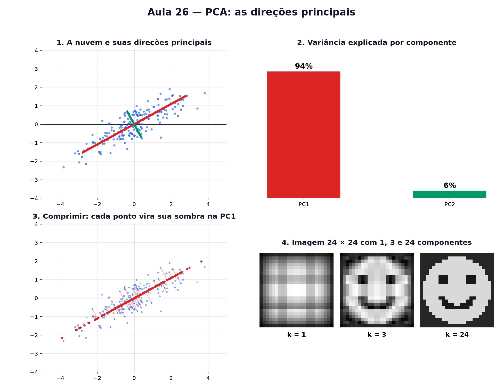

# Aula 26 — PCA: as direções principais

> Estas são as notas em texto da aula. A versão interativa, com os laboratórios e os exercícios
> que se corrigem sozinhos, está em [`index.html`](index.html).

*Uma nuvem de pontos tem uma direção mais comprida. Achá-la resume dados de muitas colunas em poucas
— e é o mesmo truque que comprime imagens.*

**Você já sabe:** média e desvio (Aula 5), correlação como ângulo entre listas (Aula 22), projetar é
jogar sombra (Aula 23) e autovetores são as direções que a matriz só estica (Aula 25). O PCA junta
as quatro coisas.

Uma planilha com 50 colunas por pessoa (altura, peso, idade, renda...) não cabe em nenhum gráfico.
Mas muitas colunas andam juntas (Aula 22): altura e peso, renda e escolaridade. A **Análise de
Componentes Principais** (PCA, em inglês) procura as poucas direções que explicam quase toda a
variação — e joga o resto fora com pouca perda.

> **🧠 Poder do cérebro**
>
> Uma nuvem de pontos tem o formato de um charuto inclinado. Se você só pudesse guardar **um
> número** por ponto, qual número escolheria para perder o mínimo de informação?
>
> **Resposta:** A posição do ponto **ao longo do charuto** — a sombra dele na reta do comprimento
> (Aula 23). A largura do charuto é pequena, então esquecê-la perde pouco. Essa reta é a primeira
> componente principal.

---

## A nuvem e sua direção mais comprida

Quando duas colunas andam juntas, a nuvem de pontos fica esticada numa direção. Essa direção de
**maior espalhamento** (maior variância, Aula 5) é a **primeira componente principal**, PC1. A
segunda, PC2, é a perpendicular a ela.

> 🔧 **Laboratório — a nuvem e sua direção.** Mude o quanto as duas colunas andam juntas e veja as
> componentes principais acompanharem a nuvem. *(interativo, na versão em HTML)*

---

## Procurando a melhor reta: sombras que se espalham

Escolha uma reta pelo centro da nuvem e projete cada ponto nela (a sombra da Aula 23). As sombras se
espalham mais ou menos, dependendo da reta. A PC1 é a reta em que **as sombras ficam mais
espalhadas** — e, ao mesmo tempo, em que os pontos ficam **mais perto** da reta. É o mesmo problema
visto dos dois lados.

> 🔧 **Laboratório — gire a reta de projeção.** Gire a reta e acompanhe a variância das sombras
> (quanto elas se espalham). *(interativo, na versão em HTML)*

---

## Quanto cada direção explica

A variância total da nuvem se divide entre as componentes. Se a PC1 carrega 95% dela, guardar só a
PC1 perde apenas 5%. Esse percentual é a **variância explicada**, e é o número que diz quantas
componentes vale a pena guardar.

> 🔧 **Laboratório — a variância explicada.** Engorde ou afine o charuto e veja como a variância se
> divide entre PC1 e PC2. *(interativo, na versão em HTML)*

> 🧘 **O Guru:** Uma planilha com cem colunas parece caos. Mas quase sempre os dados moram perto de
> poucas direções. Achar essas direções é pedir à covariância os seus autovetores — e de repente cem
> colunas viram duas ou três que contam quase a história toda.

---

## De onde vêm as componentes: autovetores

Como achar a PC1 sem girar retas no escuro? Monte a **matriz de covariância** da nuvem centralizada:
na diagonal, a variância de cada coluna; fora dela, o quanto as duas andam juntas.

`C = [[var(x), cov(x, y)], [cov(x, y), var(y)]]`

Os **autovetores** de C (Aula 25) são as componentes principais, e os **autovalores** são as
variâncias ao longo delas. É uma matriz simétrica, então o círculo vira uma elipse com eixos nos
autovetores — a forma da nuvem.

> 🔧 **Laboratório — os autovetores da covariância.** A matriz de covariância é calculada da nuvem ao
> vivo. Compare os eixos da elipse com a nuvem. *(interativo, na versão em HTML)*

> **⚠️ Cuidado — centralize e ponha as colunas na mesma escala**
>
> PCA mede variância em volta da **média**: sem centralizar (Aula 5), a "direção mais comprida" vira
> a direção até o centro da nuvem, o que não diz nada. E se uma coluna está em metros e outra em
> milímetros, a de milímetros domina só por ter números maiores. Por isso, antes do PCA, costuma-se
> padronizar cada coluna (o z da Aula 21).

---

## De 2 dimensões para 1

Agora o prêmio: guardar só a coordenada de cada ponto na PC1 (um número em vez de dois) e
reconstruir a nuvem a partir disso. Os pontos caem todos na reta da PC1; o erro é a distância que
eles andaram, e ele é o **menor possível** para qualquer reta.

> 🔧 **Laboratório — de 2 dimensões para 1.** Comprima a nuvem na PC1 e compare com a original.
> *(interativo, na versão em HTML)*

---

## A imagem comprimida

Uma imagem em tons de cinza é uma tabela de números. Trate cada linha da imagem como um ponto de
muitas colunas e faça o PCA: poucas componentes já reconstroem a imagem quase inteira. Guardar k
componentes em vez de todos os pixels é **compressão**.

> 🔧 **Laboratório — a imagem comprimida.** Escolha quantas componentes guardar. A carinha de 24 × 24
> pixels é reconstruída com elas. *(interativo, na versão em HTML)*

### Não existe pergunta idiota

**P:** As componentes principais têm significado?

**R:** Às vezes. Em medidas do corpo, a PC1 costuma ser "tamanho geral" (tudo cresce junto) e a PC2
"forma" (comprido e fino × curto e largo). Mas o PCA só acha direções de variância; dar nome a elas
é trabalho de quem conhece os dados — e às vezes elas não significam nada de concreto.

**P:** Isso é inteligência artificial?

**R:** É uma das ferramentas mais antigas dela (1901!). Reconhecimento de rostos, compressão de
dados e visualização de milhares de variáveis começam, muitas vezes, com um PCA.

---

## Pontos importantes

- **PC1**: a direção de maior variância da nuvem; **PC2**: a perpendicular.
- A PC1 é a reta em que as sombras mais se espalham e os pontos ficam mais perto.
- As componentes são os **autovetores** da matriz de covariância; os autovalores são as variâncias.
- **Variância explicada**: fração da variância total em cada componente.
- Centralize e padronize antes. Guardar poucas componentes = comprimir.

---

## ✏️ Afie o lápis

1. O que é a primeira componente principal de uma nuvem de pontos? → **A direção em que os pontos
   mais se espalham.**
2. Os autovalores da covariância são 9 e 1. Quantos por cento da variância a PC1 explica? →
   **90**
3. Qual é a sombra (projeção) do ponto `(3, 4)` na reta do eixo x, na direção `(1, 0)`? → **3**
4. Por que se centraliza os dados (tira a média) antes do PCA? → **Porque a variância é medida em
   volta da média; sem isso a PC1 só aponta para o centro da nuvem.**
5. *(o desafio)* Três colunas têm componentes com variâncias 6, 3 e 1. Quantas componentes, no
   mínimo, explicam pelo menos 90% da variância? → **2**
6. *(quem faz o quê?)* Ligue cada peça do PCA ao seu papel. → **PC1 → a direção de maior
   variância; autovalor da covariância → a variância ao longo de uma componente; projetar → jogar a
   sombra de um ponto numa reta; comprimir → guardar só as primeiras componentes**
