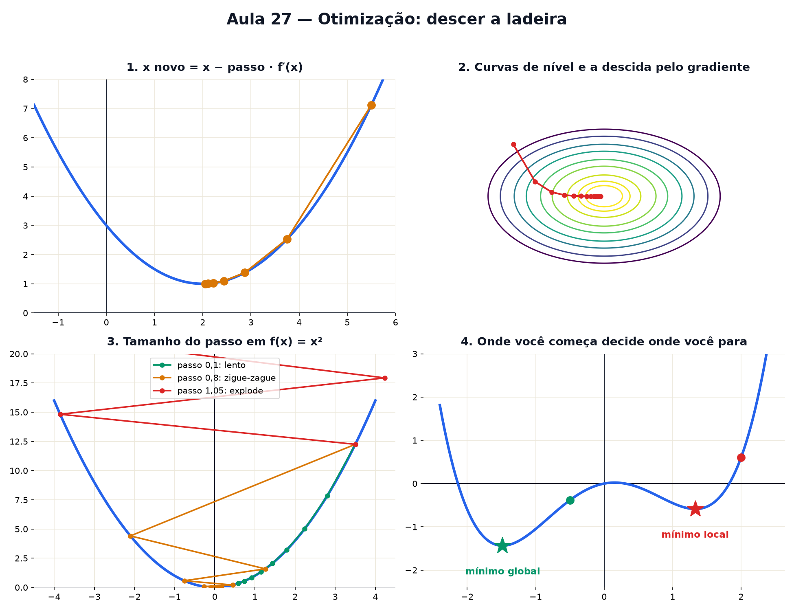

# Aula 27 — Otimização: descer a ladeira

> Estas são as notas em texto da aula. A versão interativa, com os laboratórios e os exercícios
> que se corrigem sozinhos, está em [`index.html`](index.html).

*Achar o melhor valor com muitas variáveis parece impossível à mão. O truque é o de quem desce um
morro no nevoeiro: olhe para onde o chão desce e dê um passo.*

**Você já sabe:** a derivada é a inclinação e diz onde a curva sobe ou desce (Aula 19), setas somam
e têm produto escalar (Aula 17) e a melhor reta minimiza a soma dos erros ao quadrado (Aula 23).
Hoje as três viram um método só.

Quase todo problema de "o melhor" — a reta que melhor se ajusta, a rota mais curta, a rede neural
que menos erra — é achar o ponto mais baixo de uma função de erro. Com uma variável, a Aula 19
resolveu: derivada igual a zero. Com milhares de variáveis, ninguém resolve a equação; em vez disso,
**desce-se a ladeira**, um passo de cada vez.

> **🧠 Poder do cérebro**
>
> Você está no alto de um morro, num nevoeiro tão denso que só enxerga o chão em volta dos pés. Quer
> chegar ao fundo do vale. Qual é a sua estratégia? E o que pode dar errado?
>
> **Resposta:** Sentir com o pé para onde o chão desce mais e dar um passo nessa direção; repetir.
> Pode dar errado de dois jeitos: com passos enormes você pula por cima do vale; e você pode parar
> num buraco pequeno que não é o fundo do vale — sem enxergar, não há como saber. É exatamente o
> método desta aula, com os seus dois problemas.

---

## A bolinha na curva

Com uma variável, a derivada `f′(x)` é a inclinação. Se ela é positiva, a curva sobe para a direita
— então para descer, ande para a **esquerda**. Se é negativa, ande para a direita. A regra cabe numa
linha:

`x novo = x − passo · f′(x)`

O sinal de menos faz o trabalho de "ir contra a subida". E quanto mais inclinado, maior o passo;
perto do fundo, onde a curva é quase plana, os passos encolhem sozinhos.

> 🔧 **Laboratório — a bolinha na curva.** Coloque a bolinha em algum lugar e deixe ela descer um
> passo de cada vez. A reta laranja é a tangente. *(interativo, na versão em HTML)*

---

## Duas variáveis: o mapa de curvas de nível

Com duas variáveis, `f(x, y)` é um **relevo**: para cada ponto do chão, uma altura. Para desenhar
isso no papel, faz-se como nos mapas de trilha: ligam-se os pontos de **mesma altura**. Essas são as
**curvas de nível**. Curvas apertadas = morro íngreme; curvas espaçadas = terreno quase plano.

> 🔧 **Laboratório — o mapa de curvas de nível.** O relevo é `f(x, y) = x² + 3y²`, uma tigela
> alongada. Arraste o ponto preto e leia a altura. *(interativo, na versão em HTML)*

---

## A seta do gradiente

Para saber a inclinação num relevo, calcula-se uma derivada em cada direção dos eixos, fingindo que
a outra variável é constante. Para `f = x² + 3y²`: a derivada em x é `2x` e a derivada em y é `6y`.
Juntas, formam uma seta, o **gradiente**:

`∇f = (2x, 6y)`

O gradiente aponta para a **subida mais íngreme**, e o seu tamanho é o quanto ela é íngreme. Para
descer, ande contra ele: `ponto novo = ponto − passo · ∇f`. Isso é a **descida pelo gradiente**.

> 🔧 **Laboratório — a seta do gradiente.** Arraste o ponto. Vermelho: o gradiente (subida). Verde: o
> caminho de descida. Depois desça passo a passo. *(interativo, na versão em HTML)*

**✅ Por que é verdade? O gradiente é perpendicular à curva de nível**

1. Num passo pequeno `d = (dx, dy)`, a altura muda aproximadamente `2x · dx + 6y · dy`: cada
   derivada vezes o quanto se andou naquela direção. Isso é o produto escalar `∇f · d` (Aula 17).
2. Andando **ao longo** da curva de nível, a altura não muda: `∇f · d = 0`. Produto escalar zero
   quer dizer ângulo reto. Então o gradiente é perpendicular à curva de nível.
3. Entre todos os passos de mesmo tamanho, `∇f · d = |∇f| · |d| · cos(ângulo)` é máximo quando o
   ângulo é 0: andar na direção do gradiente é a subida mais íngreme. E andar contra ele, a descida
   mais íngreme.

> 🧘 **O Guru:** Ninguém enxerga o relevo inteiro de um problema com um milhão de variáveis. Mas todo
> mundo consegue sentir para onde o chão desce debaixo do pé. Um passo humilde, repetido mil vezes,
> chega onde nenhuma fórmula chega — só não esqueça de desconfiar do vale onde parou.

---

## O tamanho do passo

O número "passo" (em aprendizado de máquina, a **taxa de aprendizado**) é a decisão mais delicada.
Pequeno demais: você chega, mas depois de uma eternidade. Grande demais: você passa do fundo, cai do
outro lado mais alto que antes, e cada pulo piora o anterior.

> 🔧 **Laboratório — o tamanho do passo.** Descendo `f(x) = x²` a partir de `x = 3,5`, com 12 passos.
> Mude o tamanho do passo. *(interativo, na versão em HTML)*

---

## Presos num vale local

A descida só enxerga o chão em volta. Se o relevo tem vários vales, ela para no **primeiro fundo**
que encontrar, chamado **mínimo local**, que pode não ser o mais fundo de todos (o **mínimo
global**). Onde você começa decide onde você termina.

> 🔧 **Laboratório — presos num vale local.** A curva `f(x) = x⁴/4 − x² + 0,3x` tem dois vales.
> Escolha o ponto de partida e veja onde a descida para. *(interativo, na versão em HTML)*

> **⚠️ Cuidado — "parou" não quer dizer "achou o melhor"**
>
> A descida para onde o gradiente é zero: pode ser o fundo do vale certo, um vale local, ou até um
> ponto de sela (desce para um lado e sobe para outro). Na prática, recomeça-se de vários pontos e
> fica-se com o melhor. Só em funções em forma de tigela (as **convexas**, como o erro dos mínimos
> quadrados) existe um único vale, e aí a descida sempre acha o mínimo global.

---

## A reta da Aula 23, achada descendo

Na Aula 23 a melhor reta `y = a · x + b` saiu de uma projeção. Agora, outro caminho: o erro médio
`E(a, b) = média de (a · x + b − y)²` é um relevo no plano dos parâmetros `(a, b)`. Desça por ele. O
fundo da tigela é a mesma reta, e é assim que se ajustam modelos com milhões de parâmetros, onde
nenhuma fórmula fechada dá conta.

> 🔧 **Laboratório — ajuste a reta descendo.** À esquerda, os dados e a reta atual. À direita, o
> relevo do erro no plano `(a, b)` e o caminho percorrido. *(interativo, na versão em HTML)*

### Não existe pergunta idiota

**P:** É assim que as inteligências artificiais "aprendem"?

**R:** É. Uma rede neural é uma função com bilhões de parâmetros, e o treino é descer pelo gradiente
do erro — com variações (passos adaptativos, pedaços aleatórios dos dados de cada vez), mas a ideia
é esta aula.

**P:** Por que não achar o mínimo direto, com derivada igual a zero?

**R:** Porque com muitas variáveis isso vira um sistema enorme de equações, quase sempre sem
fórmula. Dar passos só exige calcular o gradiente, o que um computador faz rápido mesmo com milhões
de variáveis.

---

## Pontos importantes

- Descer: `x novo = x − passo · f′(x)`; com várias variáveis, troque `f′` pelo gradiente.
- **Curvas de nível** ligam pontos de mesma altura; o **gradiente** é perpendicular a elas e aponta
  a subida mais íngreme.
- Passo pequeno: lento. Passo grande: oscila ou explode.
- A descida pode parar num **mínimo local**; em funções convexas, o mínimo é único.
- Ajustar modelos (mínimos quadrados, redes neurais) é descer o relevo do erro.

---

## ✏️ Afie o lápis

1. Em `x = 5`, a derivada de uma função vale `3`. Para descer, para onde andar? → **Diminuir x.**
2. Descendo `f(x) = x²` com passo `0,1`, a partir de `x = 3`. Onde você está depois de um passo?
   → **2,4**
3. Para `f(x, y) = x² + y²`, o gradiente é `(2x, 2y)`. Qual é o tamanho da seta do gradiente no
   ponto `(3, 4)`? → **10**
4. A descida fica pulando de um lado para o outro do vale, cada vez mais alto. O que fazer? →
   **Diminuir o passo.**
5. *(o desafio)* Descendo `f(x) = x²`: qual tamanho de passo leva **qualquer** ponto de partida
   direto ao mínimo `x = 0` em um passo só? (Dica: `x − passo · 2x = 0`.) → **0,5**
6. *(quem faz o quê?)* Ligue cada peça da otimização ao seu papel. → **gradiente → a direção de
   subida mais íngreme; curva de nível → os pontos de mesma altura; tamanho do passo → o quanto se
   anda de cada vez; mínimo local → um vale que não é o mais fundo**
