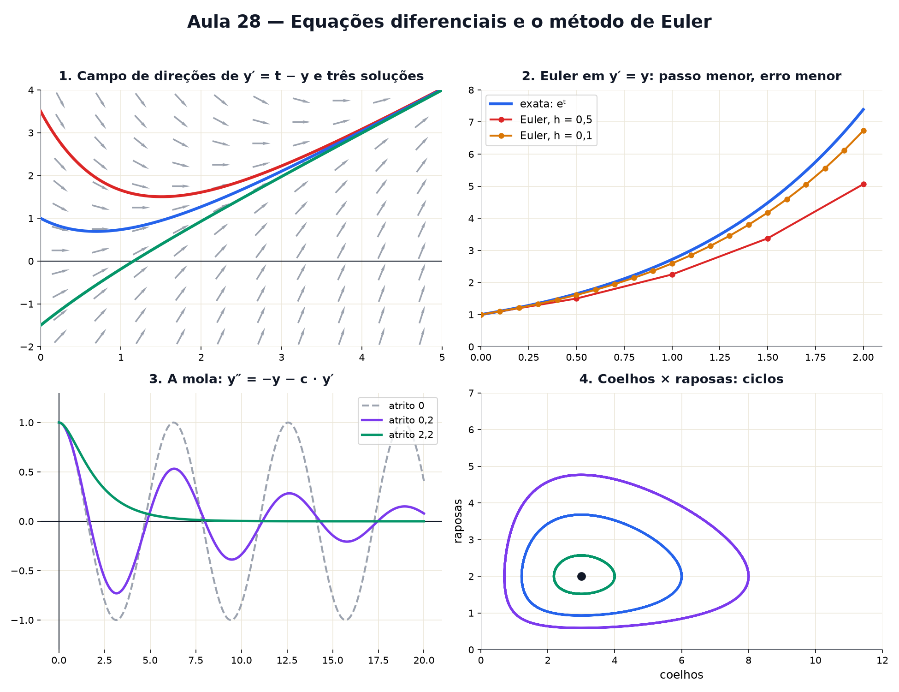

# Aula 28 — Equações diferenciais e o método de Euler

> Estas são as notas em texto da aula. A versão interativa, com os laboratórios e os exercícios
> que se corrigem sozinhos, está em [`index.html`](index.html).

*Às vezes a natureza não diz onde uma coisa está, só a que velocidade ela muda. Equações em que a
incógnita é uma função inteira parecem outro planeta — mas resolvê-las é seguir setinhas.*

**Você já sabe:** a derivada é a velocidade da mudança (Aula 19), a integral soma pedacinhos (Aula
20), o número e nasce do crescimento contínuo (Aula 14) e seno e cosseno descrevem ondas (Aula 16).
Hoje tudo isso se encontra.

Uma população cresce mais rápido quando é maior. Um café esfria mais rápido quando está mais quente.
Uma mola puxa mais forte quando está mais esticada. Em todos esses casos, a regra que se conhece
fala da **taxa de mudança**: é uma equação com uma derivada dentro, uma **equação diferencial**. A
resposta não é um número, é uma curva inteira.

> **🧠 Poder do cérebro**
>
> Um tanque vaza mais rápido quando está mais cheio: a cada minuto, perde 10% da água que tem. Agora
> ele tem 100 litros. Sem nenhuma fórmula, como você estimaria quanto ele terá daqui a 3 minutos?
>
> **Resposta:** Passo a passo: no 1º minuto perde 10 (fica 90); no 2º perde 9 (fica 81); no 3º perde
> 8,1 (fica 72,9). Você usou a regra da taxa para andar um passo, recalculou a taxa e andou de novo.
> Isso é o método de Euler — e com passos menores a estimativa fica cada vez melhor.

---

## Quando a regra fala da inclinação

Uma equação como `y′ = 0,5 · y` diz: "em cada ponto, a inclinação da curva é metade da altura". Não
diz a curva, diz a **inclinação em cada lugar**. Dá para desenhar isso: em cada ponto do plano, uma
setinha com aquela inclinação. É o **campo de direções**. Uma solução é uma curva que, em todo
ponto, anda na direção da setinha.

> 🔧 **Laboratório — o campo de setinhas.** Escolha a regra. Depois **clique** em qualquer lugar do
> plano para soltar uma curva a partir dali. *(interativo, na versão em HTML)*

---

## Siga as setas: o método de Euler

Para achar a curva sem fórmula, faça como o tanque: esteja num ponto, olhe a setinha, ande um
pedacinho `h` nela, e repita.

`y novo = y + h · (inclinação ali)`

É a ideia da integral (Aula 20) ao contrário: lá se somavam retângulos de área; aqui se somam
pedacinhos de subida. Leonhard Euler inventou isso em 1768, e é, até hoje, o esqueleto de toda
simulação de computador.

> 🔧 **Laboratório — siga as setas.** A regra é `y′ = t − y`, começando em `y(0) = 2`, com passo `h =
> 0,5`. A curva cinza é a resposta exata. *(interativo, na versão em HTML)*

---

## Crescimento e decaimento

A equação diferencial mais importante de todas é `y′ = k · y`: a taxa é proporcional ao tamanho. A
solução é a exponencial da Aula 14, `y = y₀ · eᵏᵗ`. Com `k > 0`: juros contínuos, bactérias, vírus
no começo de uma epidemia. Com `k < 0`: radioatividade, remédio saindo do sangue, café esfriando.

> 🔧 **Laboratório — crescimento e decaimento.** Mude a taxa k. Repare no tempo de dobrar (ou de cair
> pela metade): ele não depende de onde você começa. *(interativo, na versão em HTML)*

> 🧘 **O Guru:** A natureza raramente conta onde as coisas vão estar; ela só sussurra a que
> velocidade elas mudam agora. Quem sabe ouvir a taxa e dar um passo de cada vez consegue prever
> órbitas, epidemias e o balanço de uma ponte. É a derivada trabalhando ao contrário.

---

## A mola: seno e cosseno de novo

Uma mola puxa de volta com força proporcional ao quanto está esticada. Como força muda a
**velocidade**, e a velocidade muda a posição, a regra fala da derivada da derivada: `y″ = −y`.
Quais funções, derivadas duas vezes, viram o próprio negativo? Seno e cosseno! As ondas da Aula 16
são a solução. Com atrito, `y″ = −y − c · y′`, e a onda vai morrendo.

> 🔧 **Laboratório — a mola que oscila.** A mola começa esticada em 1 e parada. Mude o atrito e
> compare com `cos(t)` (cinza). *(interativo, na versão em HTML)*

---

## Passo grande engana

Euler troca a curva por segmentos retos. Em cada passo ele erra um pouco, e os erros se acumulam.
Passo menor, erro menor, mas mais contas. Na equação `y′ = y` com `y(0) = 1`, a resposta exata em `t
= 2` é `e² ≈ 7,389`. Veja o que Euler acha.

> 🔧 **Laboratório — passo grande × passo pequeno.** Mude o passo h e compare Euler (laranja) com a
> exponencial exata (azul). *(interativo, na versão em HTML)*

**✅ Por que é verdade? Euler redescobre o número e**

1. Em `y′ = y`, cada passo faz `y novo = y + h · y = y · (1 + h)`.
2. Para ir de 0 a 1 com n passos, `h = 1/n`, e o resultado é `(1 + 1/n)ⁿ`.
3. É exatamente a conta dos juros compostos cada vez mais picados da Aula 14. Quando n cresce, ela
   chega a `e ≈ 2,718`.
4. Ou seja: a solução exata `eᵗ` é o limite dos passos de Euler quando o passo vai a zero — a mesma
   ideia de limite da derivada (Aula 19).

> **⚠️ Cuidado — simulação não é a realidade**
>
> Com passo grande, Euler pode inventar comportamentos: na mola sem atrito, o Euler simples faz a
> oscilação **crescer** para sempre, como se a mola ganhasse energia do nada. Antes de acreditar
> numa simulação, diminua o passo pela metade: se a resposta muda muito, o passo ainda estava grande
> demais.

---

## Duas equações que conversam: predador e presa

Coelhos se multiplicam; raposas comem coelhos; sem coelhos, raposas morrem de fome. Cada população
tem a sua regra, e as regras dependem uma da outra (um **sistema**, como na Aula 10, mas de taxas):

`coelhos′ = 1 · C − 0,5 · C · R · raposas′ = −0,75 · R + 0,25 · C · R`

Ninguém escreve a solução com fórmula. Mas seguir as setas mostra ciclos: muitos coelhos → as
raposas crescem → os coelhos caem → as raposas caem → os coelhos voltam.

> 🔧 **Laboratório — o predador e a presa.** Escolha quantos coelhos há no começo (as raposas começam
> em 2). À esquerda, as populações no tempo; à direita, uma contra a outra. *(interativo, na versão
> em HTML)*

### Não existe pergunta idiota

**P:** Os computadores usam mesmo o método de Euler?

**R:** Usam os seus netos. O método de Runge-Kutta, por exemplo, olha a seta em vários pontos do
passo e tira uma média esperta — erra muito menos com o mesmo passo. Mas a ideia é a de Euler: andar
pelas setas. Previsão do tempo, órbitas de satélites e jogos de videogame funcionam assim.

**P:** Toda equação diferencial tem fórmula para a solução?

**R:** Não, e a maioria não tem. Por isso a simulação é tão importante: ela funciona mesmo quando
nenhuma fórmula existe.

---

## Pontos importantes

- Uma **equação diferencial** dá a taxa de mudança; a resposta é uma função.
- O **campo de direções** desenha a inclinação em cada ponto; soluções seguem as setas.
- **Euler**: `y novo = y + h · inclinação`. Passo menor, erro menor.
- `y′ = k · y` dá exponenciais; `y″ = −y` dá seno e cosseno.
- Sistemas (predador e presa) podem ter ciclos — e quase nunca têm fórmula.

---

## ✏️ Afie o lápis

1. O que a equação `y′ = 2 · y` diz, em palavras? → **Que y cresce a uma taxa igual ao dobro do
   seu tamanho.**
2. Euler em `y′ = y`, com `y(0) = 1` e passo `h = 0,5`. Quanto vale a estimativa de `y(1)` depois
   de dois passos? → **2,25**
3. Um remédio sai do sangue segundo `y′ = −0,5 · y`. No instante inicial há `y = 10` mg. Qual é a
   inclinação (a taxa) nesse instante? → **−5**
4. Qual destas funções resolve `y″ = −y`? → **y = cos(t)**
5. *(o desafio)* Decaimento `y′ = −y`, com `y(0) = 1`, mas com um passo grande demais: `h = 2`.
   Qual é a estimativa de Euler depois de 3 passos? (A resposta verdadeira, `e⁻⁶`, é quase zero.) →
   **−1**
6. *(quem faz o quê?)* Ligue cada peça ao seu papel. → **campo de direções → setinhas com a
   inclinação em cada ponto; método de Euler → andar pequenos passos seguindo a seta; y′ = k · y →
   crescimento ou decaimento exponencial; y″ = −y → oscilação: seno e cosseno**
