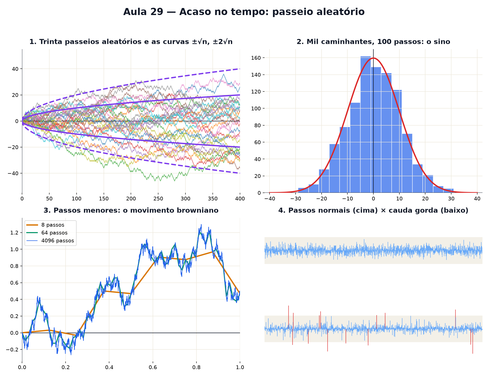

# Aula 29 — Acaso no tempo: passeio aleatório

> Estas são as notas em texto da aula. A versão interativa, com os laboratórios e os exercícios
> que se corrigem sozinhos, está em [`index.html`](index.html).

*"Cálculo estocástico" soa inalcançável. Começa com uma moeda: cara, um passo para cima; coroa, um
passo para baixo. O resto é olhar com cuidado para onde isso leva.*

**Você já sabe:** moedas e chances (Aula 6), desvio padrão (Aula 5), a curva normal e as caudas
gordas (Aula 21) e o método de Euler (Aula 28). Hoje eles andam juntos.

Uma molécula de perfume batida por bilhões de outras. Um bêbado saindo do bar. O preço de uma ação
ao longo do dia. Nenhum desses caminhos dá para prever passo a passo — mas o **conjunto** deles
segue leis tão precisas quanto as de Newton. Essa é a matemática do acaso no tempo.

> **🧠 Poder do cérebro**
>
> Você joga uma moeda 100 vezes: cara, anda um passo para a frente; coroa, um para trás. Onde você
> espera estar no fim? E quão longe do ponto de partida você acha que costuma terminar: perto de 0,
> perto de 10, perto de 50?
>
> **Resposta:** Em média, no ponto de partida (0): as caras e coroas se compensam. Mas quase nunca
> exatamente em 0 — tipicamente a uns **10 passos** dele, para um lado ou para o outro. Não 50, nem
> 1: 10, que é √100. Esse √ é a estrela da aula.

---

## A moeda que anda

Um **passeio aleatório** é uma soma de passos ao acaso. Aqui, cada passo é +1 ou −1 com chance 1/2,
independente dos anteriores. A posição depois de n passos é a soma deles.

> 🔧 **Laboratório — a moeda que anda.** Jogue a moeda e acompanhe a posição ao longo do tempo.
> *(interativo, na versão em HTML)*

---

## Mil caminhantes

Um caminho só é imprevisível. Mas solte **mil** caminhantes ao mesmo tempo e faça o histograma de
onde cada um terminou. A forma que aparece você já conhece: o sino da Aula 21. A posição final é uma
soma de muitas moedas, e somas de muitas moedas viram normal.

> 🔧 **Laboratório — mil caminhantes.** Escolha quantos passos cada um dá. Barras: onde os mil
> terminaram. Curva: a normal com desvio √n. *(interativo, na versão em HTML)*

---

## O √n do espalhamento

O espalhamento dos caminhantes não cresce como o número de passos, e sim como a sua **raiz
quadrada**: depois de n passos, o desvio padrão da posição é `√n`. Para ir duas vezes mais longe, é
preciso quatro vezes mais passos. É por isso que o perfume demora tanto para atravessar uma sala
parada.

> 🔧 **Laboratório — o leque de caminhos.** Trinta caminhos de 400 passos. As curvas roxas são `±√n`
> e `±2√n`. *(interativo, na versão em HTML)*

**✅ Por que é verdade? O espalhamento cresce como √n**

1. A posição é a soma dos passos: `S = p₁ + p₂ + ... + pₙ`, cada `p` vale +1 ou −1.
2. Eleve ao quadrado: `S²` tem os termos `p₁², p₂², ...` (cada um vale 1, somam n) e os termos
   cruzados `2 · p₁ · p₂, ...`
3. Como os passos são independentes, cada produto cruzado é +1 ou −1 com chance igual: na média dá
   0.
4. Então a média de `S²` é `n`. Como a média de S é 0, essa é a variância (Aula 5), e o desvio
   padrão é `√n`.

> 🧘 **O Guru:** Um passo ao acaso não diz nada. Mil passos ao acaso dizem muito: que você vai longe
> só como a raiz do tempo, que a soma vira sino, que a tendência sempre ganha no fim. O acaso
> individual é caos; o acaso coletivo é lei. Só nunca esqueça que o mundo real às vezes dá passos
> que a sua moeda não daria.

---

## Do passeio ao movimento browniano

Agora encolha os passos e acelere as jogadas: N jogadas por unidade de tempo, cada passo de tamanho
`1/√N` (para que no tempo 1 o desvio continue 1). Com N enorme, o caminho vira uma curva contínua,
mas tão tremida que não tem inclinação em lugar nenhum — um monstro que a Aula 19 não consegue
derivar. É o **movimento browniano**, que Einstein usou em 1905 para provar que os átomos existem.

> 🔧 **Laboratório — do passeio ao browniano.** Aumente o número de jogadas por unidade de tempo.
> *(interativo, na versão em HTML)*

### 🔥 Conversa ao pé da lareira

Esta noite: **Determinístico** e **Aleatório** discutem quem descreve melhor o mundo.

**Determinístico:** Me dê a regra e o ponto de partida, e eu te digo onde o planeta estará daqui a
mil anos. Euler e eu somos assim: nada de sorte.

**Aleatório:** Bonito para planetas. Agora me diga onde estará aquela molécula de perfume daqui a um
segundo. Ela bate em outras um bilhão de vezes no caminho.

**Determinístico:** Em princípio, eu conseguiria: cada batida segue as leis de Newton.

**Aleatório:** Em princípio. Na prática, ninguém consegue medir um bilhão de batidas. Eu desisto de
prever a molécula e prevejo a nuvem: quanto ela se espalha, √t, com precisão.

**Determinístico:** Então a gente não briga: você descreve o que eu não consigo acompanhar.

**Aleatório:** E os melhores modelos usam nós dois: uma tendência sua, mais um ruído meu. Vire a
página.

---

## Tendência + ruído

Muita coisa real tem um rumo e um tremor: uma população que cresce com anos bons e ruins, um preço
que sobe em média mas oscila todo dia. Junte Euler (Aula 28) com a moeda: a cada passinho `dt`,

`dy = tendência · dt + ruído · (passo aleatório)`

A tendência empurra como `t`; o ruído espalha como `√t`. No curto prazo, o ruído manda. No longo
prazo, a tendência vence — porque `t` acaba passando `√t`.

> 🔧 **Laboratório — tendência + ruído.** Vinte caminhos com a mesma regra. A reta tracejada é só a
> tendência. *(interativo, na versão em HTML)*

---

## Caudas gordas de novo

O modelo da moeda supõe passos comportados: nenhum passo é muito maior que os outros. Na Aula 21
você viu que dados reais (como retornos de preços) têm **caudas gordas**: passos enormes acontecem
bem mais do que a normal promete. Compare dois passeios com o **mesmo desvio padrão** por passo.

> 🔧 **Laboratório — caudas gordas de novo.** Cada risco é um passo (2000 passos). Em cima, passos
> normais; embaixo, passos de cauda gorda. Faixa cinza: ±4 desvios. *(interativo, na versão em
> HTML)*

> **⚠️ Cuidado — a moeda não tem memória, e o mundo não é uma moeda**
>
> Depois de cinco caras seguidas, a próxima jogada continua 50% cara: o passeio não "deve" voltar
> (essa é a falácia do jogador). E os modelos de passeio com passos normais, muito usados para
> preços, **subestimam os extremos**: um passo de 5 desvios deveria acontecer uma vez a cada milhões
> de passos, e nos mercados acontece a cada poucos anos. Use o modelo sabendo o que ele esconde.

### Não existe pergunta idiota

**P:** Se o passeio é justo, por que o caminhante passa tanto tempo de um lado só?

**R:** É uma das surpresas do acaso: num passeio justo longo, o mais provável é passar quase todo o
tempo de um mesmo lado do zero, e não metade de cada lado. O acaso produz sequências longas bem mais
do que a intuição espera.

**P:** Isso é "cálculo estocástico"?

**R:** É a porta de entrada. O cálculo estocástico faz com o browniano o que as Aulas 19 e 20
fizeram com curvas lisas: derivar e integrar — com regras novas, porque o browniano não tem
inclinação. É a matemática por trás da física de partículas, da biologia de populações e das
finanças.

---

## Pontos importantes

- **Passeio aleatório**: a soma de passos ao acaso e independentes.
- A posição média fica em 0, mas o espalhamento cresce como `√n`.
- Muitos passos somados: a posição final é normal (Aula 21).
- Passos cada vez menores e mais rápidos: **movimento browniano**.
- Tendência cresce como t, ruído como √t: no longo prazo a tendência domina.
- Caudas gordas: os modelos normais subestimam os extremos.

---

## ✏️ Afie o lápis

1. Depois de 2 passos (+1 ou −1 cada, chance igual), qual é a posição mais provável? → **0**
2. Qual é o desvio padrão da posição depois de 100 passos de ±1? → **10**
3. Para **dobrar** o espalhamento típico de um passeio aleatório, por quanto é preciso
   multiplicar o número de passos? → **4**
4. Um caminhante já andou 5 passos para cima seguidos. Qual é a chance de o próximo passo ser
   para baixo? → **Exatamente 50%: a moeda não tem memória.**
5. *(o desafio)* Um preço tem tendência de `+0,5` por dia e ruído com desvio `1` por dia (então,
   depois de t dias, o desvio acumulado é `√t`). Depois de quantos dias a tendência acumulada fica
   igual a **2 desvios** do ruído? (Resolva `0,5 · t = 2 · √t`.) → **16**
6. *(quem faz o quê?)* Ligue cada ideia ao que ela quer dizer. → **passeio aleatório → soma de
   passos ao acaso; √n → como o espalhamento cresce com os passos; movimento browniano → passeio com
   passos infinitamente pequenos; cauda gorda → extremos mais frequentes que na normal**
