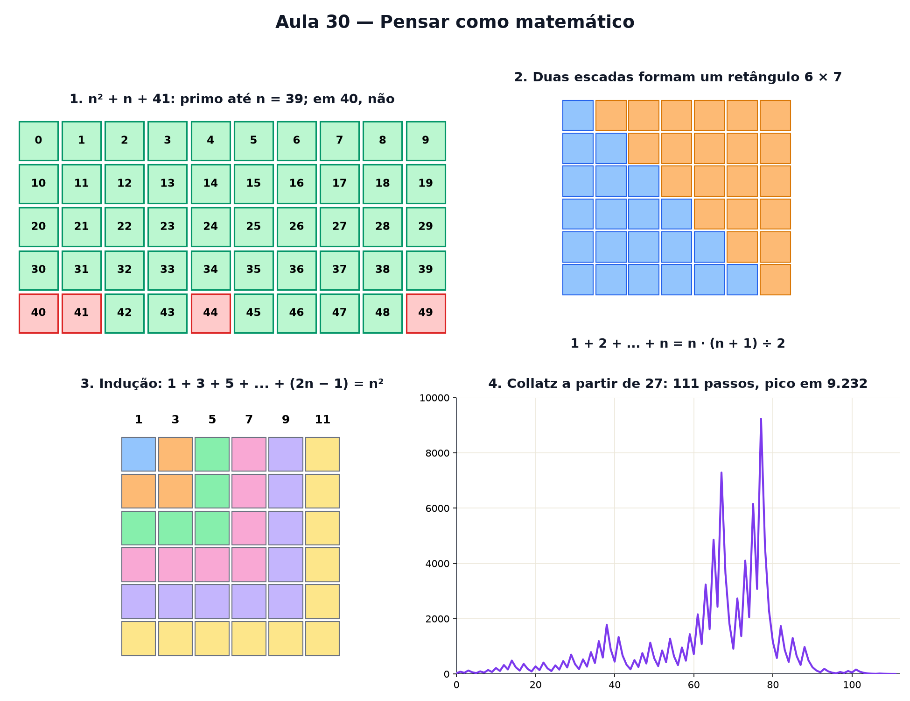

# Aula 30 — Pensar como matemático

> Estas são as notas em texto da aula. A versão interativa, com os laboratórios e os exercícios
> que se corrigem sozinhos, está em [`index.html`](index.html).

*Ver uma regra dar certo em mil exemplos não prova nada — e quase ninguém ensina o que prova. Esta
última aula é sobre o coração da matemática: ter certeza.*

**Você já sabe:** primos (Aula 1), frações (Aula 2), raízes (Aula 4), a soma de Gauss (Aula 14) e o
patamar de `x³`, onde a inclinação zero enganava (Aula 19). Hoje eles viram exemplos de como se
prova — e de como se engana.

Em física, uma teoria vale enquanto os experimentos concordarem. Em matemática, não: uma afirmação
só vira **teorema** quando alguém mostra que ela **não pode** falhar, em nenhum dos infinitos casos.
Isso se faz com poucas ferramentas — o contraexemplo, a demonstração direta, o absurdo e a indução —
e com elas se constrói tudo o que você viu nas 29 aulas anteriores.

> **🧠 Poder do cérebro**
>
> A fórmula `n² + n + 41` dá um número primo para n = 0, 1, 2, 3, ... e continua dando, caso após
> caso, até n = 39. São 40 acertos seguidos. Você apostaria que ela **sempre** dá primo?
>
> **Resposta:** Não aposte: em n = 40, dá `1.681 = 41 · 41`. Quarenta exemplos não provaram nada.
> (Dava até para desconfiar antes: em n = 41, todos os três termos são múltiplos de 41.) Um único
> contraexemplo derruba qualquer regra geral.

---

## Verdadeiro, falso ou depende?

Uma **afirmação** é uma frase que é verdadeira ou falsa. As peças que as juntam são poucas: **e**
(as duas valem), **ou** (pelo menos uma vale), **não**, e a mais traiçoeira, **se... então**. "Se
chove, a rua molha" não diz que toda rua molhada teve chuva: inverter o "se... então" (a
**recíproca**) é o erro de lógica mais comum que existe.

> 🔧 **Laboratório — verdadeiro, falso ou depende?** Julgue cada afirmação. "Depende" quer dizer:
> vale para alguns casos e não para outros — então, como regra geral, é falsa. *(interativo, na
> versão em HTML)*

---

## Caça ao contraexemplo

Para provar que uma regra geral é **falsa**, basta um caso em que ela falhe: um **contraexemplo**.
Para provar que é **verdadeira**, nenhuma quantidade de exemplos basta. Essa assimetria é o primeiro
mandamento do matemático.

> 🔧 **Laboratório — caça ao contraexemplo.** A fórmula é `n² + n + 41`. Verde: deu primo. Vermelho:
> não deu. Ande com n e procure o primeiro vermelho. *(interativo, na versão em HTML)*

---

## Demonstração direta: a soma de Gauss

Uma **demonstração direta** parte do que se sabe e chega ao que se quer, sem pular nenhum passo. A
soma de Gauss (Aula 14) tem uma demonstração que cabe num desenho: empilhe `1 + 2 + ... + n` como
uma escada, faça uma cópia de cabeça para baixo e encaixe as duas. Sai um retângulo `n × (n + 1)`,
que vale **para todo n**, não só para os que você desenhou — porque o encaixe não depende de qual é
o n.

> 🔧 **Laboratório — a soma de Gauss.** Escolha n. A escada azul é `1 + 2 + ... + n`; a laranja, a
> mesma escada girada. *(interativo, na versão em HTML)*

> 🧘 **O Guru:** Você começou contando pulos na reta e chegou até aqui. Agora sabe o segredo que
> junta tudo: em matemática, ninguém acredita — demonstra. Desconfie dos padrões bonitos, cace
> contraexemplos, e quando um padrão resistir, prove. É isso que se faz no resto da vida de um
> matemático. Bem-vindo.

---

## Indução: o dominó que derruba todos

Como provar algo para **infinitos** números naturais com um número finito de frases? Com dominós. Se
(1) o primeiro cai e (2) sempre que um cai, ele derruba o próximo, então **todos** caem. Isso é a
**indução**.

Exemplo: `1 + 3 + 5 + ... + (2n − 1) = n²`. (1) Para n = 1: 1 = 1². (2) Se a soma dos n primeiros
ímpares é n², somar o próximo ímpar `2n + 1` dá `n² + 2n + 1 = (n + 1)²`. O desenho mostra o mesmo:
cada ímpar é um "L" que aumenta o quadrado em uma casa.

> 🔧 **Laboratório — o dominó da indução.** Empurre o primeiro dominó. Cada um que cai acrescenta um
> "L" (o próximo ímpar) e o quadrado cresce. *(interativo, na versão em HTML)*

---

## Por absurdo: √2 não é fração

A **demonstração por absurdo** supõe o contrário do que se quer provar e segue as consequências até
dar uma contradição. Se o contrário leva a um absurdo, ele é falso — e o que se queria é verdadeiro.
O exemplo mais famoso tem 2.500 anos: a diagonal de um quadrado de lado 1, `√2` (Aulas 4 e 12), não
é fração nenhuma.

> 🔧 **Laboratório — tente escrever √2 como fração.** Escolha o denominador q. O laboratório acha o
> melhor numerador p. Se `p/q = √2`, então `p² = 2 · q²`. Tente fazer os dois lados ficarem iguais.
> *(interativo, na versão em HTML)*

**✅ Por que é verdade? √2 não é fração**

1. Suponha o contrário: `√2 = p/q`, com a fração já simplificada ao máximo (p e q sem fator comum).
2. Elevando ao quadrado: `p² = 2 · q²`. Então p² é par, e p também é par (o quadrado de um ímpar é
   ímpar). Escreva `p = 2k`.
3. Substituindo: `4k² = 2 · q²`, ou seja, `q² = 2k²`. Então q também é par.
4. p e q pares têm o fator 2 em comum — mas a fração estava simplificada ao máximo. **Absurdo.**
   Logo, √2 não é fração.

**✅ Por que é verdade? Os primos nunca acabam (Euclides, 300 a.C.)**

1. Suponha o contrário: existe uma lista com todos os primos, `2, 3, 5, ..., P`.
2. Multiplique todos e some 1: `N = 2 · 3 · 5 · ... · P + 1`.
3. Dividir N por qualquer primo da lista deixa resto 1. Então nenhum deles divide N.
4. Mas todo número maior que 1 tem algum fator primo (a árvore da Aula 1). Esse primo não está na
   lista. **Absurdo**: a lista não tinha todos. Logo, há infinitos primos.

> **⚠️ Cuidado — exemplos convencem, mas não provam**
>
> "Testei até um milhão e funcionou" é um ótimo motivo para **tentar** provar, e nenhum motivo para
> acreditar. Há afirmações que valem para todos os números até valores astronômicos e depois falham.
> E cuidado com a recíproca: "todo múltiplo de 4 é par" é verdade; "todo par é múltiplo de 4" é
> falso (6).

---

## Conjecturas: o que ninguém sabe

Uma **conjectura** é uma afirmação que parece verdadeira, que ninguém conseguiu provar e ninguém
conseguiu derrubar. A de **Collatz** cabe numa linha: comece com qualquer número; se for par, divida
por 2; se for ímpar, multiplique por 3 e some 1. Repita. A conjectura diz que você **sempre** chega
a 1. Computadores testaram todos os números até mais de 10²⁰. Ninguém sabe provar.

> 🔧 **Laboratório — a sequência de Collatz.** Escolha o número de partida e veja a sequência subir e
> descer até (talvez?) chegar a 1. *(interativo, na versão em HTML)*

### Não existe pergunta idiota

**P:** Se o computador já testou bilhões de bilhões de casos, para que provar?

**R:** Porque há infinitos casos depois deles, e a matemática já foi surpreendida muitas vezes por
padrões que falham tarde. Além disso, uma demonstração explica **por que** algo é verdade — e o
porquê costuma abrir portas para outros teoremas.

**P:** E o que um pesquisador de matemática faz, afinal?

**R:** Exatamente esta aula: olha exemplos, desconfia de um padrão, tenta derrubá-lo com
contraexemplos, e quando ele resiste, procura uma demonstração. Às vezes leva uma tarde; às vezes,
séculos (o Último Teorema de Fermat esperou 358 anos). Os primos gêmeos e Collatz continuam
esperando alguém — talvez você.

---

## Pontos importantes

- Um **contraexemplo** derruba uma regra; exemplos, por mais que sejam, não provam.
- "Se A, então B" não é o mesmo que "se B, então A" (a recíproca).
- **Direta**: do que se sabe ao que se quer (Gauss).
- **Por absurdo**: supor o contrário e chegar a uma contradição (√2, primos infinitos).
- **Indução**: vale para o primeiro, e se vale para um vale para o próximo.
- **Conjectura**: nem provada nem derrubada — é onde mora a pesquisa.

---

## ✏️ Afie o lápis

1. Alguém afirma: "todo número ímpar maior que 1 é primo". Qual é o jeito mais rápido de mostrar
   que isso é falso? → **Mostrar um único contraexemplo, como 9 = 3 · 3.**
2. Usando a demonstração da escada, quanto vale `1 + 2 + 3 + ... + 100`? → **5050**
3. Quanto vale a soma dos 10 primeiros ímpares, `1 + 3 + 5 + ... + 19`? (Use o que a indução
   provou.) → **100**
4. Na prova de que √2 não é fração, chega-se a "p e q são ambos pares". Por que isso é um
   absurdo? → **Porque a fração tinha sido escolhida já simplificada, sem fator comum.**
5. *(o desafio)* Collatz começando em 6: quantos passos até chegar a 1? (Cada troca de número
   conta um passo.) → **8**
6. *(quem faz o quê?)* Ligue cada ferramenta do matemático ao que ela faz. → **contraexemplo → um
   caso que derruba uma regra geral; demonstração por absurdo → supor o contrário e chegar a uma
   contradição; indução → vale para o primeiro, e cada caso puxa o próximo; conjectura → afirmação
   que ninguém provou nem derrubou**
