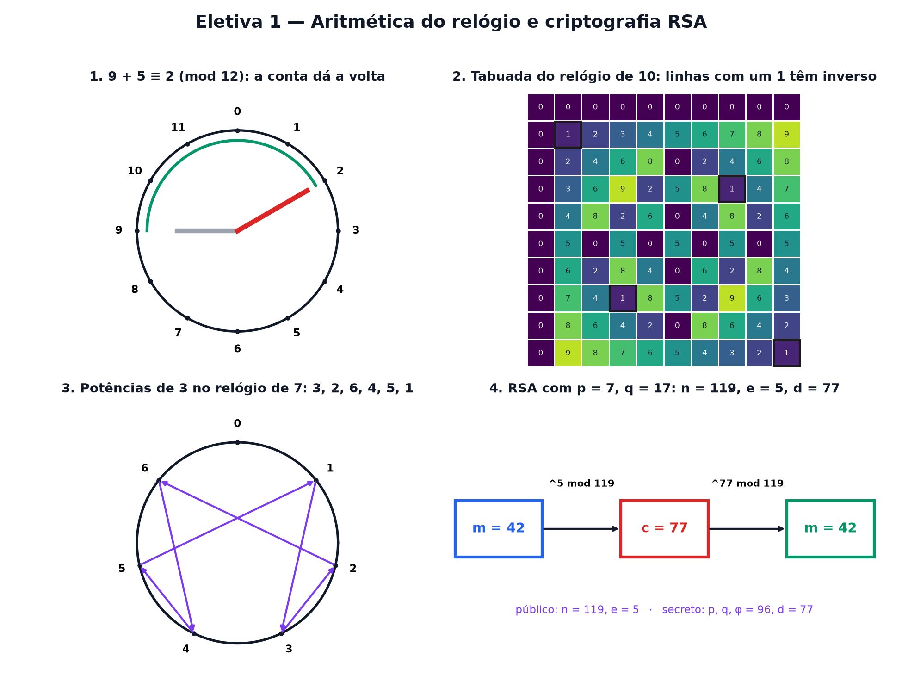

# Eletiva 1 — Aritmética do relógio e criptografia RSA

> Estas são as notas em texto da aula. A versão interativa, com os laboratórios e os exercícios
> que se corrigem sozinhos, está em [`index.html`](index.html).

*Toda vez que aparece o cadeadinho no navegador, uma conta de relógio está protegendo você. Hoje
você monta o cadeado com as próprias mãos.*

**Você já sabe:** primos, divisores e MDC (Aula 1), potências (Aula 4), o crescimento explosivo das
potências (Aula 14) e o que é uma demonstração (Aula 30). A criptografia moderna é só isso, colocado
num relógio.

Você manda o número do cartão para uma loja pela internet. No caminho, a mensagem passa por dezenas
de computadores estranhos. Como ninguém no meio consegue ler — se você e a loja nunca combinaram
senha nenhuma? A resposta, de 1977, se chama **RSA**, e é feita de três ideias: contas que dão a
volta, potências e primos enormes.

> **🧠 Poder do cérebro**
>
> Invente um cadeado com esta propriedade estranha: **qualquer pessoa** consegue fechá-lo, mas **só
> você** consegue abrir. Existe isso no mundo físico? E com números?
>
> **Resposta:** No mundo físico existe: um cadeado aberto que você distribui para todo mundo.
> Qualquer um fecha a caixa com ele (basta apertar), mas só você tem a chave. Com números, a ideia é
> a mesma: uma conta fácil de fazer para frente e quase impossível de desfazer — a menos que você
> saiba um segredo. Multiplicar dois primos é fácil; descobrir quais primos foram multiplicados é o
> cadeado.

---

## Contas que dão a volta

São 9 horas; daqui a 5 horas serão... 2 horas, não 14. O relógio **dá a volta** em 12. Essa é a
**aritmética do relógio** (ou aritmética modular): faça a conta normalmente e fique só com o
**resto** da divisão pelo tamanho do relógio.

`9 + 5 = 14 = 1 · 12 + 2 → 9 + 5 ≡ 2 (mod 12)`

O símbolo `≡` lê-se "dá o mesmo resto que", e "mod 12" diz o tamanho do relógio. Dias da semana são
um relógio de 7; ângulos, um relógio de 360 (Aula 11).

> 🔧 **Laboratório — o relógio de n horas.** Escolha o tamanho do relógio, o ponto de partida e
> quantas horas andar. *(interativo, na versão em HTML)*

---

## A tabuada do relógio e quem tem inverso

Multiplicar também funciona: `4 · 5 = 20 ≡ 8 (mod 12)`. Mas dividir é traiçoeiro. Dividir por 3 é
multiplicar por um número que faça `3 · ? ≡ 1` — o **inverso** de 3. No relógio de 10, `3 · 7 = 21 ≡
1`: o inverso de 3 é 7. Já o 5 não tem inverso no relógio de 10: `5 · qualquer coisa` termina em 0
ou 5, nunca em 1.

> 🔧 **Laboratório — a tabuada do relógio.** Cada linha é "a vezes tudo". Os quadrados com contorno
> grosso valem 1: aquela linha tem inverso. Compare com o MDC da Aula 1. *(interativo, na versão em
> HTML)*

---

## Potências no relógio andam em ciclos

Calcule `3, 3², 3³, ...` no relógio de 7: `3, 2, 6, 4, 5, 1, 3, 2, ...` — depois do 1, tudo se
repete. Fora do relógio as potências explodem (Aula 14); dentro dele, **andam em círculos**. E
quando o relógio tem tamanho primo p, o ciclo sempre fecha no 1 depois de, no máximo, `p − 1`
passos. É o **pequeno teorema de Fermat**:

`se p é primo e p não divide a: ap − 1 ≡ 1 (mod p)`

> 🔧 **Laboratório — o passeio das potências.** As potências de a, uma a uma, ligadas no relógio.
> Procure quando o passeio volta ao 1. *(interativo, na versão em HTML)*

**✅ Por que é verdade? O pequeno teorema de Fermat**

1. No relógio primo p, pegue os números `1, 2, ..., p − 1` e multiplique todos por a. Como a tem
   inverso (p é primo e não divide a), dois resultados diferentes nunca caem no mesmo lugar: a linha
   de a na tabuada é só uma **reordenação** dos mesmos números (veja no laboratório 2 com um relógio
   primo).
2. Então o produto de todos é o mesmo nas duas listas: `(a · 1)(a · 2)···(a · (p − 1)) ≡ 1 · 2 ···
   (p − 1)`.
3. Do lado esquerdo, o a aparece `p − 1` vezes: `ap − 1 · (p − 1)! ≡ (p − 1)!`
4. O número `(p − 1)!` tem inverso (é produto de números com inverso). Multiplicando os dois lados
   por ele: `ap − 1 ≡ 1`. ∎

> 🧘 **O Guru:** Os números primos pareciam a parte mais inútil da matemática: curiosidade de gente
> que gosta de contar. Hoje eles guardam cada compra, cada mensagem e cada senha do planeta. Nunca
> pergunte para que serve uma ideia bonita. Pergunte quando.

---

## A cifra de César e por que ela cai

Júlio César trocava cada letra pela que vem k posições depois no alfabeto (dando a volta: é um
relógio de 26!). Com `k = 3`, "ATAQUE" vira "DWDTXH". Parece seguro, mas há só 25 chaves possíveis —
e nem é preciso testar todas: em português a letra mais comum é o A. Conte a letra mais frequente do
texto cifrado e você acha o k.

> 🔧 **Laboratório — cifre e quebre a cifra de César.** Escolha a chave. As barras mostram a
> frequência de cada letra no texto cifrado; a mais alta (vermelha) entrega a chave. *(interativo,
> na versão em HTML)*

---

## RSA: o cadeado de potências

Em 1977, Rivest, Shamir e Adleman juntaram tudo num cadeado público:

1. Escolha dois primos p e q (secretos) e multiplique: `n = p · q` (público).
2. Calcule `φ = (p − 1) · (q − 1)` (secreto).
3. Escolha `e` sem fator comum com φ (público) e ache o inverso dele no relógio de φ: `e · d ≡ 1
   (mod φ)`. O `d` é a chave privada.
4. **Trancar** a mensagem m: `c = me mod n`. **Abrir**: `m = cd mod n`.

Funciona pelo mesmo motivo do teorema de Fermat (na versão de Euler, para o relógio n = p · q):
elevar a `e · d` dá uma volta completa e devolve m.

> 🔧 **Laboratório — monte o seu RSA.** Escolha os dois primos e a mensagem (um número menor que n).
> Acompanhe cada passo. *(interativo, na versão em HTML)*

---

## Por que ninguém abre: multiplicar é fácil, fatorar é difícil

Todo mundo vê n e e. Para achar d, o espião precisa de φ, e para φ precisa de p e q: tem de
**fatorar n**. Multiplicar dois primos de 300 dígitos é instantâneo. Desfazer a multiplicação, pelo
que se sabe hoje, levaria mais tempo que a idade do universo. A segurança não é um teorema — é a
aposta de que ninguém achou um atalho.

> 🔧 **Laboratório — multiplicar × fatorar.** Escolha o tamanho dos primos. O laboratório multiplica
> (1 conta) e depois fatora testando divisores um a um. *(interativo, na versão em HTML)*

> **⚠️ Cuidado — RSA de brinquedo não protege nada**
>
> Com primos de 2 dígitos, qualquer pessoa fatora n de cabeça. O RSA de verdade usa n com 2048 bits
> ou mais, primos sorteados com cuidado e um "enchimento" aleatório na mensagem (sem ele, a mesma
> mensagem sempre vira o mesmo c e dá para adivinhar). A regra dos profissionais: **nunca**
> implemente criptografia própria para uso real; use bibliotecas auditadas — e nunca deixe chaves
> privadas escritas no código.

### Não existe pergunta idiota

**P:** Se todo mundo conhece n e e, por que não dá para calcular d?

**R:** Porque d é o inverso de e no relógio de φ, e φ = (p − 1)(q − 1) exige conhecer p e q. Sem
fatorar n, ninguém conhece φ.

**P:** E os computadores quânticos?

**R:** Um computador quântico grande o bastante rodaria o algoritmo de Shor, que fatora depressa — e
o RSA cairia. Por isso já existem padrões de criptografia "pós-quântica", baseados em outros
problemas difíceis.

---

## Pontos importantes

- **Aritmética do relógio**: fique só com o resto. `a ≡ b (mod n)` = mesmo resto.
- a tem **inverso** mod n exatamente quando mdc(a, n) = 1.
- Potências no relógio andam em ciclos; com p primo, `ap − 1 ≡ 1` (Fermat).
- César cai por contagem de frequências; RSA usa `c = me` e `m = cd` mod n.
- A segurança do RSA vem de ser fácil multiplicar e difícil fatorar.

---

## ✏️ Afie o lápis

1. No relógio de 12 horas, quanto dá `9 + 5`? → **2**
2. Quanto é `34 mod 5`? (Calcule 34 e fique com o resto da divisão por 5.) → **1**
3. No relógio de 10, qual destes números tem inverso? → **3**
4. O que torna o RSA seguro? → **Multiplicar dois primos grandes é fácil, mas descobrir os primos
   a partir do produto é difícil.**
5. *(o desafio)* RSA com `p = 3`, `q = 11` e `e = 3`. Então `φ = 2 · 10 = 20`. Qual é a chave
   privada d, o número entre 1 e 20 com `3 · d ≡ 1 (mod 20)`? → **7**
6. *(quem faz o quê?)* Ligue cada peça do RSA ao seu papel. → **módulo n → o tamanho do relógio;
   chave pública (n, e) → qualquer um usa para trancar; chave privada d → só o dono usa para abrir;
   fatorar n → o que um espião precisaria fazer**
