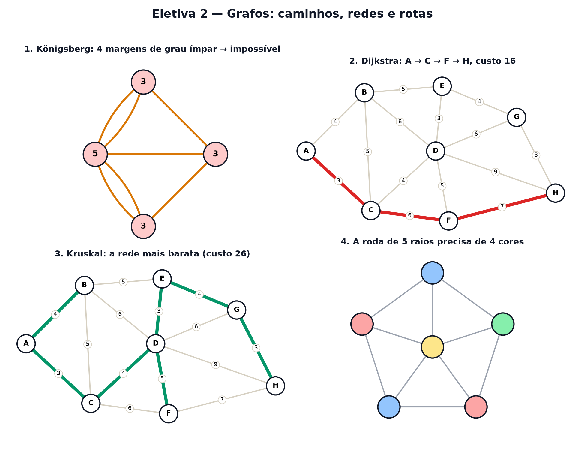

# Eletiva 2 — Grafos: caminhos, redes e rotas

> Estas são as notas em texto da aula. A versão interativa, com os laboratórios e os exercícios
> que se corrigem sozinhos, está em [`index.html`](index.html).

*Pontos e ligações — só isso. Com eles se descrevem mapas, redes sociais, a internet e a rota do seu
aplicativo de entregas.*

**Você já sabe:** contar possibilidades (Aula 6), matrizes e como multiplicá-las (Aula 17), otimizar
escolhendo o melhor passo (Aula 27) e demonstrar (Aula 30). Hoje eles viram a matemática das redes.

Um **grafo** é um conjunto de pontos (os **vértices**) e de ligações entre eles (as **arestas**).
Não importa onde os pontos estão desenhados nem se as linhas são tortas: importa só **quem está
ligado a quem**. Cidades e estradas, pessoas e amizades, páginas e links — tudo vira grafo.

> **🧠 Poder do cérebro**
>
> Numa festa, cada pessoa conta quantas mãos apertou. Somando os números de todo mundo, o total pode
> dar ímpar?
>
> **Resposta:** Nunca. Cada aperto de mão envolve duas pessoas, então é contado duas vezes na soma.
> O total é sempre o dobro do número de apertos: par. Em linguagem de grafos: a soma dos **graus**
> (quantas arestas chegam em cada vértice) é o dobro do número de arestas. Esse pequeno fato resolve
> o problema mais famoso da área, logo abaixo.

---

## As sete pontes de Königsberg

Em 1736, a cidade de Königsberg tinha duas ilhas... e um passatempo: dar uma volta atravessando
**cada uma das sete pontes exatamente uma vez**. Ninguém conseguia. Euler provou que é impossível —
e, de quebra, inventou os grafos. Cada margem vira um vértice; cada ponte, uma aresta.

> 🔧 **Laboratório — as pontes de Königsberg.** **Clique numa ponte** para derrubá-la (ou
> reconstruí-la). O número em cada margem é o seu grau. *(interativo, na versão em HTML)*

**✅ Por que é verdade? A regra de Euler dos vértices ímpares**

1. Num passeio que usa cada aresta uma vez, toda vez que você **passa** por um vértice gasta duas
   arestas dele: uma para chegar, outra para sair.
2. Então todo vértice do meio do caminho tem grau par. Só o **começo** e o **fim** podem ter grau
   ímpar (sobra uma aresta de saída ou de chegada).
3. Logo, com mais de 2 vértices de grau ímpar, o passeio é impossível. Königsberg tinha 4. ∎
4. (Euler também mostrou a volta: num grafo ligado com 0 ou 2 vértices ímpares, o passeio sempre
   existe.)

---

## Desenhar sem tirar o lápis do papel

A "casinha" é o mesmo problema disfarçado: desenhar a figura sem tirar o lápis e sem passar duas
vezes pela mesma linha. A regra de Euler diz **onde começar**: num vértice de grau ímpar, se houver.

> 🔧 **Laboratório — a casinha sem tirar o lápis.** Clique nos vértices, um depois do outro, para
> desenhar. Só vale andar por linhas ainda não usadas. *(interativo, na versão em HTML)*

---

## O grafo como matriz

Dá para guardar um grafo numa tabela (Aula 17): na linha i, coluna j, escreva 1 se i e j estão
ligados e 0 se não. É a **matriz de adjacência** A. E aqui vem a mágica: a entrada (i, j) de `A²`
conta quantos caminhos de 2 passos levam de i a j; a de `Ak`, os de k passos. Multiplicar matrizes é
contar caminhos.

> 🔧 **Laboratório — potências da matriz contam caminhos.** A matriz mostrada é Ak para a casinha. A
> casa destacada conta os caminhos de k passos do vértice 1 ao 5. *(interativo, na versão em HTML)*

> 🧘 **O Guru:** Euler olhou para um mapa cheio de ruas, rio e casas e jogou quase tudo fora: ficou
> só com quem está ligado a quem. Às vezes o passo mais inteligente não é acrescentar detalhe — é
> descobrir quais detalhes nunca importaram.

---

## O caminho mais curto

Agora as arestas têm **peso**: quilômetros, minutos, reais. Qual o caminho mais barato de A até H?
Testar todos explode (Aula 6). O **algoritmo de Dijkstra** (1956) é guloso e esperto: a cada passo,
**fixa o vértice ainda aberto mais próximo** de A e atualiza os vizinhos dele. Quando H é fixado, a
resposta está pronta.

> 🔧 **Laboratório — Dijkstra passo a passo.** Cada clique fixa o próximo vértice. O número em cima
> de cada vértice é a menor distância conhecida desde A. *(interativo, na versão em HTML)*

---

## A rede mais barata: árvore geradora mínima

Outro problema: ligar **todas** as cidades com cabo de fibra, gastando o mínimo. A resposta nunca
tem ciclo (um ciclo tem sempre um cabo sobrando), então é uma **árvore**: com n vértices, exatamente
`n − 1` arestas. O **algoritmo de Kruskal** é guloso também: pegue a aresta mais barata que ainda
não fecha ciclo, e repita.

> 🔧 **Laboratório — Kruskal liga as cidades.** Cada clique testa a próxima aresta mais barata.
> Verde: entra. Riscada: fecharia um ciclo. *(interativo, na versão em HTML)*

> **⚠️ Cuidado — guloso nem sempre funciona**
>
> Dijkstra e Kruskal são gulosos e dão a resposta ótima — mas isso é um teorema sobre **esses**
> problemas, não uma regra geral. No problema do **caixeiro-viajante** (visitar todas as cidades e
> voltar pelo caminho mais curto), ir sempre para a cidade mais próxima pode dar um caminho bem pior
> que o ótimo, e ninguém conhece um método rápido que sempre acerte. E o Dijkstra falha se houver
> pesos negativos.

---

## Colorir mapas

Colorir um mapa de modo que países vizinhos tenham cores diferentes é colorir os vértices de um
grafo (país = vértice, fronteira = aresta). Quantas cores bastam? Para **qualquer** mapa no plano, 4
— o **teorema das quatro cores**, provado em 1976 com ajuda de computador, o primeiro grande teorema
demonstrado assim.

> 🔧 **Laboratório — pinte a roda.** Clique num vértice para trocar a cor. Arestas vermelhas ligam
> vértices da mesma cor. Tente usar o mínimo de cores. *(interativo, na versão em HTML)*

### Não existe pergunta idiota

**P:** Como o aplicativo de mapas acha a rota em milissegundos, com milhões de ruas?

**R:** Com parentes do Dijkstra que usam uma "bússola" (o algoritmo A* olha também a distância em
linha reta até o destino) e muita preparação prévia do mapa. Mas a ideia é a mesma: fixar primeiro o
que está mais perto.

**P:** Onde mais aparecem grafos?

**R:** No buscador (o PageRank do Google é um passeio aleatório — Aula 29 — num grafo de páginas),
em redes elétricas, em moléculas, em epidemias e em redes neurais.

---

## Pontos importantes

- **Grafo** = vértices + arestas. **Grau** = arestas num vértice; soma dos graus = 2 × arestas.
- Passeio usando cada aresta uma vez só existe com 0 ou 2 vértices de grau ímpar (Euler).
- Matriz de adjacência: Ak conta os caminhos de k passos.
- **Dijkstra**: fixa sempre o mais próximo — caminho mais curto.
- **Kruskal**: a aresta mais barata que não fecha ciclo — rede mais barata (n − 1 arestas).

---

## ✏️ Afie o lápis

1. Um grafo tem 7 arestas. Quanto dá a soma dos graus de todos os vértices? → **14**
2. Por que não dá para atravessar as sete pontes de Königsberg exatamente uma vez cada? →
   **Porque há 4 margens com número ímpar de pontes, e só 2 poderiam ser.**
3. Cinco amigos; cada um aperta a mão de cada outro uma vez. Quantas arestas tem esse grafo
   (quantos apertos de mão)? → **10**
4. Qual é a regra de cada passo do algoritmo de Dijkstra? → **Fixar o vértice ainda aberto com a
   menor distância conhecida até a origem.**
5. *(o desafio)* Uma rede mínima liga 8 cidades, sem nenhum ciclo. Quantos cabos (arestas) ela
   tem? → **7**
6. *(quem faz o quê?)* Ligue cada peça de um grafo ao que ela é. → **vértice → um ponto: cidade,
   pessoa, página; aresta → uma ligação entre dois pontos; grau → quantas arestas chegam num
   vértice; árvore → grafo ligado sem nenhum ciclo**
