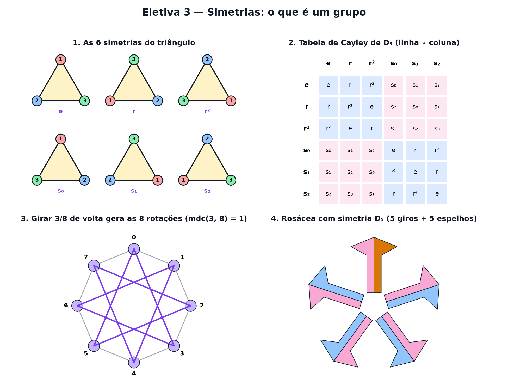

# Eletiva 3 — Simetrias: o que é um grupo

> Estas são as notas em texto da aula. A versão interativa, com os laboratórios e os exercícios
> que se corrigem sozinhos, está em [`index.html`](index.html).

*Girar e espelhar um triângulo parece brincadeira. É a porta de entrada da álgebra abstrata — a
matemática das simetrias, dos cristais às partículas.*

**Você já sabe:** girar e medir ângulos (Aulas 11 e 15), matrizes que giram e espelham (Aula 17) e
números complexos que giram ao multiplicar (Aula 18). Hoje a pergunta muda: não "quanto dá", mas
"que movimentos existem e como eles se combinam".

Uma **simetria** de uma figura é um movimento que a deixa igualzinha: depois dele, ninguém percebe
que você mexeu. O triângulo equilátero tem algumas; o quadrado, mais; o círculo, infinitas. A grande
ideia do século XIX foi estudar não as figuras, mas os **movimentos** — e as regras de como eles se
combinam. O nome dessa estrutura é **grupo**.

> **🧠 Poder do cérebro**
>
> Quantos movimentos diferentes deixam um triângulo equilátero no mesmo lugar (só trocando quais
> cantos ficam onde)? Conte antes de continuar.
>
> **Resposta:** Seis: não mexer, girar 120°, girar 240° e espelhar por cada um dos três eixos (cada
> eixo passa por um canto e pelo meio do lado oposto). Não há mais: cada movimento é uma forma de
> reordenar os 3 cantos, e só existem 3 · 2 · 1 = 6 ordens (Aula 6).

---

## Os movimentos do triângulo

Pinte os cantos do triângulo com números para enxergar o que cada movimento faz. Com só dois
movimentos básicos — girar 120° e espelhar no eixo vertical — dá para chegar em todas as posições.

> 🔧 **Laboratório — gire e espelhe o triângulo.** Combine os dois botões e tente chegar nas 6
> posições diferentes. *(interativo, na versão em HTML)*

**✅ Por que é verdade? O triângulo tem exatamente 6 simetrias**

1. Toda simetria leva cantos em cantos (é o único ponto de onde saem dois lados). Então ela é uma
   forma de reordenar os 3 cantos.
2. Existem 3 · 2 · 1 = 6 reordenações de 3 coisas: no máximo 6 simetrias.
3. E todas as 6 acontecem: as 3 rotações (0°, 120°, 240°) e os 3 espelhos. Logo, são exatamente 6. ∎
   (No quadrado, pelo mesmo raciocínio mais uma conta, são 8 — mas não todas as 24 reordenações dos
   4 cantos: tente cruzar só dois cantos vizinhos.)

---

## Fazer um movimento depois do outro

Dois movimentos seguidos formam um terceiro: a **composição**. Escreva `x ∘ y` para "primeiro y,
depois x". A **tabela de Cayley** reúne todas as composições. E surpresa: a ordem importa. Girar e
depois espelhar não é o mesmo que espelhar e depois girar — como as matrizes da Aula 17, em que AB ≠
BA.

> 🔧 **Laboratório — a tabela de Cayley do triângulo.** e = não mexer · r = girar 120° · r² = girar
> 240° · s₀, s₁, s₂ = espelhos. Escolha os dois movimentos. *(interativo, na versão em HTML)*

---

## As quatro regras de um grupo

Um **grupo** é qualquer conjunto com uma operação que obedece a quatro regras:

1. **Fechamento:** combinar dois elementos dá um elemento do conjunto.
2. **Associatividade:** `(a ∘ b) ∘ c = a ∘ (b ∘ c)`.
3. **Identidade:** existe um e que não muda nada: `e ∘ a = a ∘ e = a`.
4. **Inverso:** todo a tem um a⁻¹ que desfaz: `a ∘ a⁻¹ = e`.

As simetrias do triângulo são um grupo. Os números inteiros com a soma também (identidade 0, inverso
−a). Os números de um relógio com a soma também. O poder da ideia: tudo o que se provar só com as 4
regras vale para **todos** esses exemplos ao mesmo tempo.

> 🔧 **Laboratório — é grupo ou não é?** Escolha um conjunto com uma operação. O laboratório testa as
> quatro regras e mostra um contraexemplo quando uma falha. *(interativo, na versão em HTML)*

> 🧘 **O Guru:** Galois tinha 20 anos quando percebeu que, para entender uma equação, era preciso
> olhar para as simetrias das suas raízes. Morreu num duelo no ano seguinte, e levou décadas para o
> mundo entender o que ele tinha escrito. Não estude os objetos. Estude os movimentos que não os
> mudam.

---

## Grupos cíclicos: um movimento só, repetido

As rotações de um polígono de n lados são um grupo em que tudo vem de **um** movimento: girar `1/n`
de volta, repetido. É um **grupo cíclico** — o mesmo relógio da aritmética modular, disfarçado. Mas
nem todo movimento serve de gerador: girar `k/n` de volta só passa por todos os cantos se k e n não
tiverem fator comum.

> 🔧 **Laboratório — quem gera o grupo?** Gire k passos de cada vez, a partir do canto 0, até voltar.
> A estrela mostra os cantos visitados. *(interativo, na versão em HTML)*

---

## Simetria em números: as raízes da unidade

Na Aula 18, multiplicar por um número complexo de tamanho 1 era girar. Tome `ω = cos(360°/n) + i ·
sen(360°/n)`. Multiplicar por ω gira `1/n` de volta, e depois de n vezes volta ao começo: `ωⁿ = 1`.
Os n números `1, ω, ω², ..., ωⁿ⁻¹` formam o grupo cíclico — agora feito de números, com a
multiplicação.

> 🔧 **Laboratório — as raízes da unidade.** Os pontos são as n raízes de `zⁿ = 1`. Mude a potência m
> e veja ωᵐ dando voltas. *(interativo, na versão em HTML)*

> **⚠️ Cuidado — a ordem importa (quase sempre)**
>
> Na soma de números, `a + b = b + a`, e a gente se acostuma. Mas em muitos grupos a ordem muda o
> resultado: girar e depois espelhar ≠ espelhar e depois girar. Grupos em que a ordem nunca importa
> se chamam **abelianos** (em homenagem a Niels Abel); o do triângulo não é. Na hora de desfazer, a
> ordem também inverte: `(a ∘ b)⁻¹ = b⁻¹ ∘ a⁻¹` — tira-se o sapato antes da meia.

---

## Padrões feitos por grupos

Rosáceas de igrejas, calotas de carro, flocos de neve: pegue um desenho qualquer e aplique **todos**
os movimentos de um grupo. Com só rotações de 1/n de volta, sai um padrão que gira (o grupo cíclico
`Cₙ`, com n elementos). Acrescentando espelhos, sai um padrão que também reflete (o grupo diedral
`Dₙ`, com 2n elementos — o do triângulo é o `D₃`).

> 🔧 **Laboratório — monte uma rosácea.** A bandeirinha laranja é o desenho original. Escolha o grupo
> e veja o padrão que ele cria. *(interativo, na versão em HTML)*

### Não existe pergunta idiota

**P:** Para que serve saber que algo é um grupo?

**R:** Para ganhar teoremas de graça. Provou-se, por exemplo, que num grupo finito o número de
elementos gerados por qualquer movimento divide o total (teorema de Lagrange). Isso vale para
simetrias, relógios, permutações e o cubo mágico, sem refazer a conta em cada caso. É também a
linguagem da física de partículas e da cristalografia.

**P:** O cubo mágico é um grupo?

**R:** É: os movimentos do cubo, com a composição. Ele tem cerca de 43 quintilhões de elementos — e,
usando teoria de grupos, provou-se que qualquer posição se resolve em no máximo 20 movimentos.

---

## Pontos importantes

- Uma **simetria** é um movimento que deixa a figura igual. O triângulo tem 6; o quadrado, 8.
- **Composição** `x ∘ y`: primeiro y, depois x. Nem sempre `x ∘ y = y ∘ x`.
- **Grupo**: fechamento, associatividade, identidade e inverso.
- **Grupo cíclico**: gerado por um movimento; girar k/n gera tudo se mdc(k, n) = 1.
- As raízes n-ésimas da unidade são um grupo cíclico de números; Cₙ e Dₙ desenham rosáceas.

---

## ✏️ Afie o lápis

1. Quantas simetrias tem um quadrado (rotações e espelhos, contando o "não mexer")? → **8**
2. O que dá girar o triângulo 120° três vezes seguidas? → **A identidade: o triângulo volta
   exatamente como estava.**
3. No relógio de 12 com a soma (identidade 0), qual é o inverso de 5? → **7**
4. Qual destes **não** é um grupo? → **Os números inteiros com a subtração.**
5. *(o desafio)* No grupo das rotações do relógio de 12 (girar k/12 de volta), quantos valores de
   k entre 1 e 11 **geram** o grupo inteiro? → **4**
6. *(quem faz o quê?)* Ligue cada ideia ao que ela quer dizer. → **identidade → o movimento de
   não fazer nada; inverso → o movimento que desfaz outro; composição → fazer um movimento depois do
   outro; grupo cíclico → gerado por um único movimento repetido**
