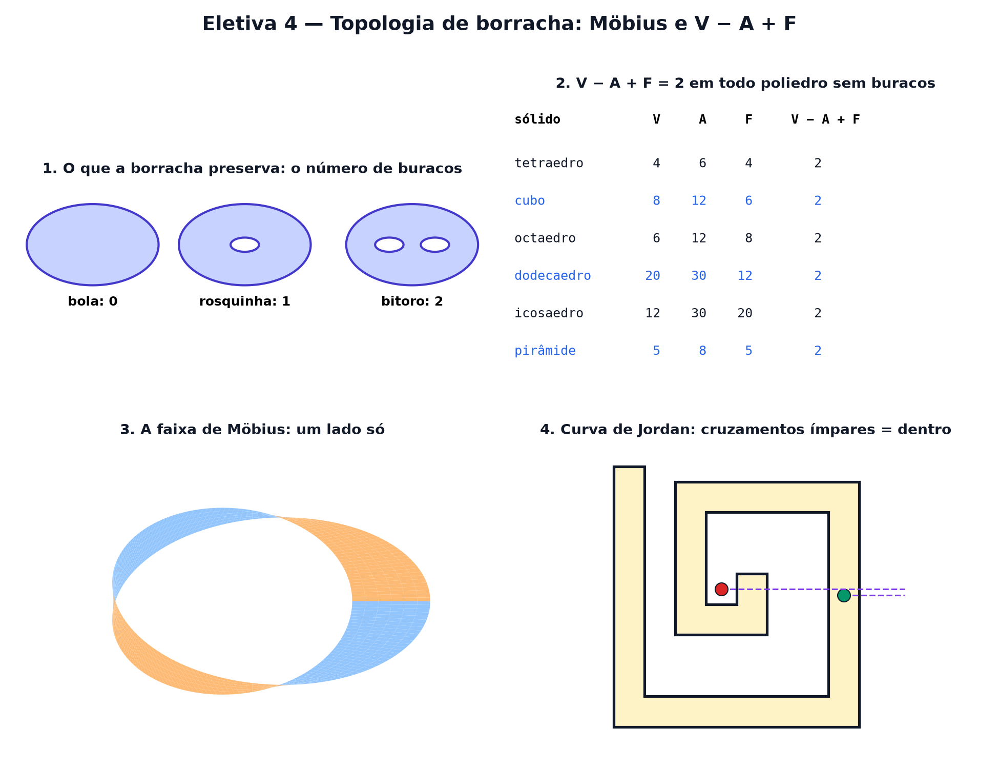

# Eletiva 4 — Topologia de borracha: Möbius e V − A + F

> Estas são as notas em texto da aula. A versão interativa, com os laboratórios e os exercícios
> que se corrigem sozinhos, está em [`index.html`](index.html).

*Esqueça medidas, ângulos e retas. Se tudo fosse de borracha, o que ainda daria para distinguir? A
resposta é a topologia — a geometria dos buracos.*

**Você já sabe:** figuras planas e sólidos (Aula 12), girar e desenhar em três dimensões (Aula 17) e
contar com cuidado (Aula 6). Hoje você vai contar vértices, arestas e faces — e descobrir que o
resultado não depende da forma.

Para um topólogo, uma xícara e uma rosquinha são **a mesma coisa**: amassando a massinha da xícara
sem rasgar nem colar, dá para chegar na rosquinha — o furo da alça vira o furo do meio. Já uma bola
e uma rosquinha são diferentes: para abrir o furo, seria preciso rasgar. A **topologia** estuda o
que sobrevive a qualquer esticada.

> **🧠 Poder do cérebro**
>
> Conte, num cubo, os vértices (V), as arestas (A) e as faces (F). Calcule `V − A + F`. Agora faça o
> mesmo numa pirâmide de base quadrada. Palpite: o que acontece em qualquer poliedro sem buracos?
>
> **Resposta:** Cubo: 8 − 12 + 6 = 2. Pirâmide: 5 − 8 + 5 = 2. Em **todo** poliedro sem buracos dá 2
> — é a fórmula de Euler (1758). O número não liga para tamanho, ângulos nem número de lados: só
> para a forma "de borracha". Numa rosquinha, dá 0.

---

## Iguais para quem é de borracha

Duas formas são **topologicamente iguais** quando uma vira a outra esticando, entortando e amassando
— mas sem rasgar e sem colar pedaços. Comprimento, ângulo e reta deixam de importar. O que sobra são
coisas como o **número de buracos**.

> 🔧 **Laboratório — o alfabeto de borracha.** Clique numa letra: acendem todas as que a borracha
> consegue transformar nela (contando os buracos). *(interativo, na versão em HTML)*

---

## A fórmula de Euler: V − A + F = 2

Em qualquer poliedro "sem buraco" (que dá para inflar até virar uma bola), vértices menos arestas
mais faces dá sempre 2. A razão é topológica: amassar o poliedro não muda a conta, e toda bola dá 2.

> 🔧 **Laboratório — conte V, A e F.** Escolha o sólido e gire para ver os vértices e as arestas
> escondidos. *(interativo, na versão em HTML)*

---

## A rosquinha achatada

Pegue um quadrado e cole a borda de cima na de baixo: vira um cano. Cole agora a boca esquerda do
cano na direita: vira uma **rosquinha** (o **toro**). Dá para estudar o toro sem sair do papel: é o
quadrado com a regra "sair por um lado é entrar pelo oposto" — como no Pac-Man. Quadricule e conte V
− A + F.

> 🔧 **Laboratório — V − A + F no toro.** As setas iguais indicam as bordas coladas. Mude o
> quadriculado e compare com o mesmo quadriculado sem colar. *(interativo, na versão em HTML)*

> 🧘 **O Guru:** Quando você não pode medir nada, sobra o essencial. A topologia joga fora
> comprimentos, ângulos e retas — e descobre que um buraco é mais teimoso que qualquer medida.
> Pergunte-se sempre: o que continua verdade se tudo for de borracha?

---

## A faixa de Möbius: um lado só

Pegue uma tira de papel, dê **meia volta** numa ponta e cole. Parece uma pulseira comum, mas não é:
uma formiga andando pelo meio volta ao início **do outro lado** do papel, sem nunca cruzar a borda.
A faixa de Möbius tem um lado só e uma borda só.

> 🔧 **Laboratório — a formiga na faixa.** Escolha quantas meias-voltas a tira leva e faça a formiga
> andar. Azul e laranja são as duas faces que você está vendo. *(interativo, na versão em HTML)*

---

## Dentro ou fora?

Toda curva fechada que não se cruza divide o plano em **dentro** e **fora** (o **teorema da curva de
Jordan**: óbvio de enunciar, difícil de provar). E há um truque topológico para saber de que lado um
ponto está: puxe uma semirreta dele até longe e conte quantas vezes ela cruza a curva. Ímpar:
dentro. Par: fora. Cada cruzamento troca o lado.

> 🔧 **Laboratório — o labirinto de Jordan.** Arraste o ponto preto pelo labirinto. A semirreta vai
> até a borda direita; os cruzamentos são contados. *(interativo, na versão em HTML)*

**✅ Por que é verdade? Três casas e três serviços não se ligam sem cruzar**

1. O desafio clássico: ligar 3 casas a água, luz e gás (9 canos) numa folha, sem cruzar canos.
   Suponha que desse.
2. Teríamos V = 6 e A = 9. A fórmula de Euler para desenhos no plano dá `F = 2 − V + A = 5` regiões.
3. Cada região é cercada por pelo menos 4 canos (um caminho fechado sempre alterna casa, serviço,
   casa, serviço). Somando em volta de todas: pelo menos `4 · 5 = 20` — mas cada cano é contado no
   máximo 2 vezes (um de cada lado): `2 · 9 = 18`.
4. 20 ≤ 18 é absurdo. Logo, é impossível (Aula 30: prova por absurdo). ∎ Num toro, porém, dá — a
   rosquinha tem "espaço" a mais.

---

## Contar buracos com uma fórmula

A conta `χ = V − A + F` se chama **característica de Euler** e só depende de quantos buracos (alças)
a superfície tem, o **gênero** g:

`χ = 2 − 2g`

Bola: 2. Rosquinha: 0. Rosquinha de dois furos: −2. Qualquer malha de triângulos ou quadrados
desenhada na superfície dá o mesmo número — por isso ele "enxerga" os buracos sem precisar ver a
forma.

> 🔧 **Laboratório — o gênero e a característica.** Escolha quantos buracos a superfície tem.
> *(interativo, na versão em HTML)*

> **⚠️ Cuidado — "sem rasgar e sem colar" é a regra inteira**
>
> A topologia deixa esticar à vontade, mas cortar e colar de volta pode mudar tudo: cortando a
> rosquinha, ela vira um cano, e colando de novo com uma meia-volta, vira outra coisa. E a fórmula V
> − A + F = 2 vale para poliedros **sem buracos**: uma moldura de quadro (com furo) dá 0, e quem
> esquece isso "prova" absurdos.

### Não existe pergunta idiota

**P:** Isso tem alguma utilidade?

**R:** Muita. Topologia descreve o DNA que se enrola e desenrola, a forma do universo, o formato de
nuvens de dados (a "análise topológica de dados") e rendeu o Nobel de Física de 2016, sobre
materiais cujas propriedades dependem de invariantes topológicos.

**P:** E se eu cortar a faixa de Möbius ao meio, pelo meio?

**R:** Experimente com papel: em vez de duas faixas, sai uma só, duas vezes mais comprida e com duas
voltas completas. Cortando a um terço da borda, saem duas faixas entrelaçadas. A intuição falha; a
topologia acerta.

---

## Pontos importantes

- Topologia: esticar e entortar vale; **rasgar e colar**, não. Xícara = rosquinha.
- Poliedro sem buracos: **V − A + F = 2** (Euler).
- Toro = quadrado com lados opostos colados; lá, V − A + F = 0.
- Faixa de Möbius: um lado só e uma borda só.
- Curva de Jordan: cruzamentos ímpares = dentro. **χ = 2 − 2g** conta os buracos.

---

## ✏️ Afie o lápis

1. Por que, para a topologia, uma xícara com alça e uma rosquinha são a mesma coisa? → **Porque
   uma vira a outra esticando, sem rasgar nem colar: as duas têm um buraco.**
2. Um poliedro sem buracos tem 12 vértices e 30 arestas. Quantas faces ele tem? → **20**
3. Quantos lados tem uma faixa de Möbius? → **1**
4. Uma semirreta saindo de um ponto cruza uma curva fechada (que não se cruza) 5 vezes. Onde está
   o ponto? → **Dentro da curva.**
5. *(o desafio)* Uma superfície tem 3 buracos (como um pretzel). Quanto vale a sua característica
   de Euler `χ = V − A + F`? → **−4**
6. *(quem faz o quê?)* Ligue cada ideia ao que ela quer dizer. → **deformação topológica →
   esticar sem rasgar nem colar; faixa de Möbius → superfície de um lado só; característica de Euler
   → V − A + F; gênero → número de buracos**
