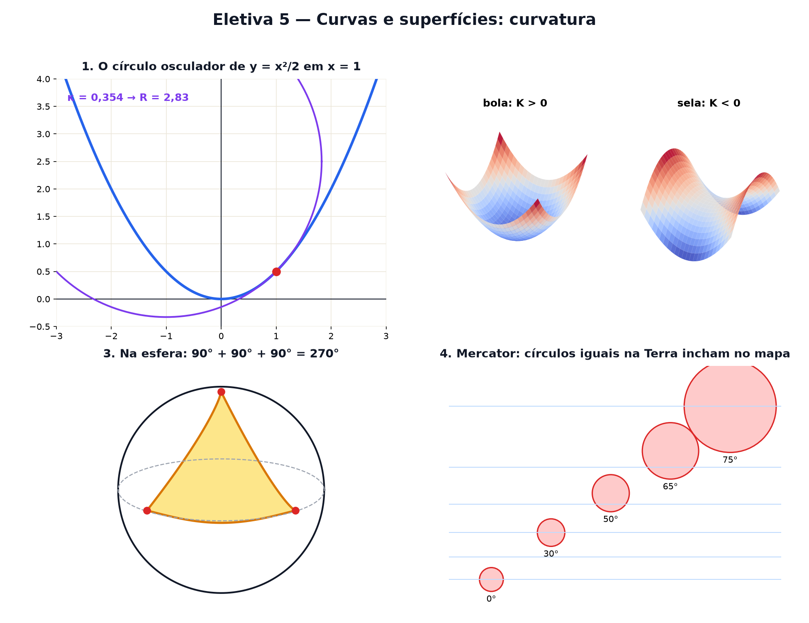

# Eletiva 5 — Curvas e superfícies: curvatura

> Estas são as notas em texto da aula. A versão interativa, com os laboratórios e os exercícios
> que se corrigem sozinhos, está em [`index.html`](index.html).

*Quanto uma estrada entorta? Por que todo mapa-múndi mente? A geometria diferencial mede a curvatura
— e descobre que ela decide o que é possível desenhar no papel.*

**Você já sabe:** o círculo e o π (Aula 11), ângulos em radianos (Aula 15), vetores (Aula 17) e a
derivada, a inclinação em cada ponto (Aula 19). A curvatura é a derivada da direção.

A derivada diz a **direção** de uma curva em cada ponto. A curvatura diz quão depressa essa direção
**muda**: numa reta, nunca; numa curva fechada de estrada, muito. Levando a ideia para superfícies,
Gauss descobriu em 1827 um número que um ser minúsculo, vivendo *dentro* da superfície, consegue
medir sem nunca sair dela — e esse número explica por que uma laranja não vira mapa.

> **🧠 Poder do cérebro**
>
> Você enrola uma folha de papel e faz um cano: dá, sem amassar. Agora tente cobrir uma bola com a
> mesma folha, sem amassar nem rasgar. O que acontece? Qual é a diferença entre o cano e a bola?
>
> **Resposta:** A bola não aceita: o papel sempre enruga. O cano curva só numa direção (em volta) e
> fica reto na outra (ao longo); a bola curva nas duas ao mesmo tempo. A curvatura de Gauss
> multiplica as duas curvaturas: no cano dá zero, igual ao papel; na bola, positiva. Superfícies com
> curvaturas de Gauss diferentes não se transformam uma na outra sem distorcer.

---

## O círculo que abraça a curva

Em cada ponto de uma curva existe um círculo que encosta nela melhor do que qualquer outro: o
**círculo osculador** ("que beija"). Se ele é pequeno, a curva está fazendo uma curva fechada; se é
enorme, está quase reta. A **curvatura** é o inverso do raio:

`κ = 1 / R · para y = f(x): κ = |f″| / (1 + f′²)3/2`

> 🔧 **Laboratório — o círculo que beija a curva.** Escolha a curva e o ponto. O círculo roxo é o
> osculador; o número é a curvatura ali. *(interativo, na versão em HTML)*

---

## O volante do carro

Dirigir numa pista é sentir curvatura: o **volante** é a curvatura. Volante reto, κ = 0; virado para
a esquerda, curvatura positiva; para a direita, negativa (a curvatura com sinal). Uma pista é bem
projetada quando a curvatura muda **aos poucos** — ninguém gira o volante de uma vez.

> 🔧 **Laboratório — o volante na pista.** Leve o carro pela pista. Embaixo, o gráfico da curvatura
> ao longo da volta. *(interativo, na versão em HTML)*

---

## Uma volta inteira gira 360°

Some toda a curvatura (com sinal) ao longo de uma curva fechada — é a integral da Aula 20: `∫ κ ds`.
O resultado é o quanto a direção girou no total. Para **qualquer** curva fechada simples, dá
exatamente 360° (2π): o **teorema da rotação das tangentes**. Um número exato saindo de uma forma
qualquer — é o primeiro sinal de que a curvatura guarda informação topológica (Eletiva 4).

> 🔧 **Laboratório — quanto a direção girou?** Escolha a curva e percorra-a. O contador soma o giro
> da seta. *(interativo, na versão em HTML)*

> 🧘 **O Guru:** Uma formiga que vive na superfície de uma bola nunca vai vê-la de fora. Mesmo assim,
> medindo triângulos com uma trena, ela descobre que o seu mundo é curvo. Gauss ficou tão
> impressionado que chamou isso de 'egrégio'. Às vezes a verdade sobre o seu mundo está nas medidas,
> não na vista.

---

## Superfícies: bola, sela e cano

Numa superfície, em cada ponto há uma direção em que ela curva mais e outra em que curva menos: as
**curvaturas principais** κ₁ e κ₂. O produto delas é a **curvatura de Gauss** `K = κ₁ · κ₂`:

- **K > 0**: as duas curvam para o mesmo lado — bola, tigela.
- **K < 0**: curvam para lados opostos — sela de cavalo, batata Pringles.
- **K = 0**: uma delas é reta — plano, cano, cone.

> 🔧 **Laboratório — monte a superfície.** A superfície é `z = (κ₁ x² + κ₂ y²) / 2`, perto de um
> ponto. Mude as duas curvaturas. *(interativo, na versão em HTML)*

---

## Triângulos na esfera

Na esfera, as "retas" são os **círculos máximos** (como o equador e os meridianos): o caminho mais
curto entre dois pontos — por isso os aviões fazem rotas "curvas" no mapa. E os triângulos feitos
com eles desobedecem à escola: a soma dos ângulos passa de 180°. O excesso é proporcional à área:

`soma dos ângulos − 180° ⟷ área / R² (em radianos)`

> 🔧 **Laboratório — o triângulo polo–equador.** Um vértice no polo norte, dois no equador. Abra o
> ângulo no polo. *(interativo, na versão em HTML)*

**✅ Por que é verdade? Nenhum mapa plano da Terra é perfeito**

1. Um mapa "perfeito" manteria todas as distâncias. Então manteria também os triângulos (três lados
   iguais dão o mesmo triângulo) e os seus ângulos.
2. No papel, todo triângulo soma 180°. Na esfera, o triângulo polo–equador de 90° soma 270°
   (laboratório acima).
3. Um triângulo não pode somar 270° e 180° ao mesmo tempo. Absurdo — logo, o mapa perfeito não
   existe (Aula 30). ∎
4. Gauss provou a versão geral (o "Teorema Egrégio"): a curvatura K se mede só com distâncias
   *dentro* da superfície, e superfícies com K diferentes não se transformam uma na outra sem
   esticar.

---

## O preço de achatar a Terra

Como todo mapa distorce, cada projeção escolhe o que sacrificar. A de **Mercator** (1569) preserva
os ângulos — ótima para navegar com bússola — e paga com as áreas: longe do equador, tudo incha. O
fator de aumento no comprimento é `1 / cos(latitude)`; na área, o quadrado disso.

> 🔧 **Laboratório — o círculo que incha no mapa.** Todos os círculos vermelhos têm, na Terra, o
> mesmo tamanho. Mude a latitude do círculo móvel. *(interativo, na versão em HTML)*

> **⚠️ Cuidado — curvo não quer dizer curvatura de Gauss**
>
> Um cano parece curvo, mas tem K = 0: ele é só um papel enrolado, e um ser que vive nele mede
> triângulos somando 180°, como no plano. O que importa para Gauss não é como a superfície está
> dobrada no espaço, e sim a geometria **de dentro**. Já a curvatura de uma **curva** (κ = 1/R) é
> outra coisa: toda curva desenhada no cano pode ter a sua.

### Não existe pergunta idiota

**P:** Por que pizza se dobra para não cair?

**R:** Pelo Teorema Egrégio. Dobrando a fatia ao comprido, uma das curvaturas principais deixa de
ser zero; como a pizza não estica, K tem de continuar 0, então a outra direção é forçada a ficar
reta — e a ponta não cai.

**P:** E o universo, é curvo?

**R:** A relatividade geral de Einstein diz que a gravidade é curvatura do espaço-tempo, descrita
pela geometria de Riemann, que generaliza exatamente estas ideias para 4 dimensões. O GPS precisa
corrigir essa curvatura para funcionar.

---

## Pontos importantes

- **Curvatura** de uma curva: κ = 1/R do círculo osculador; reta tem κ = 0.
- Somando κ numa curva fechada simples, a direção gira exatamente 360°.
- Superfícies: **K = κ₁ · κ₂**. Bola: K > 0; sela: K < 0; plano e cano: K = 0.
- Na esfera, triângulos somam mais de 180°; o excesso mede a área.
- Superfícies com K diferentes não se achatam uma na outra: todo mapa-múndi distorce.

---

## ✏️ Afie o lápis

1. Qual é a curvatura de um círculo de raio 4? → **0,25**
2. Qual é a curvatura de uma reta? → **Zero: o círculo que a abraça teria raio infinito.**
3. Na esfera, um triângulo tem os três ângulos retos (polo norte e dois pontos do equador a 90°
   um do outro). Quanto dá a soma dos ângulos, em graus? → **270**
4. Por que a curvatura de Gauss de um cano (cilindro) é zero? → **Porque numa direção ele é reto
   (κ = 0) e K é o produto das duas curvaturas; dá para fazê-lo com papel sem amassar.**
5. *(o desafio)* Na parábola `y = x²`, no ponto x = 0 (onde f′ = 0 e f″ = 2), qual é o raio do
   círculo osculador? → **0,5**
6. *(quem faz o quê?)* Ligue cada peça ao que ela quer dizer. → **curvatura de uma curva → 1 /
   raio do círculo que a abraça; esfera → curvatura de Gauss positiva; sela → curvatura de Gauss
   negativa; cilindro → curvatura de Gauss zero**
